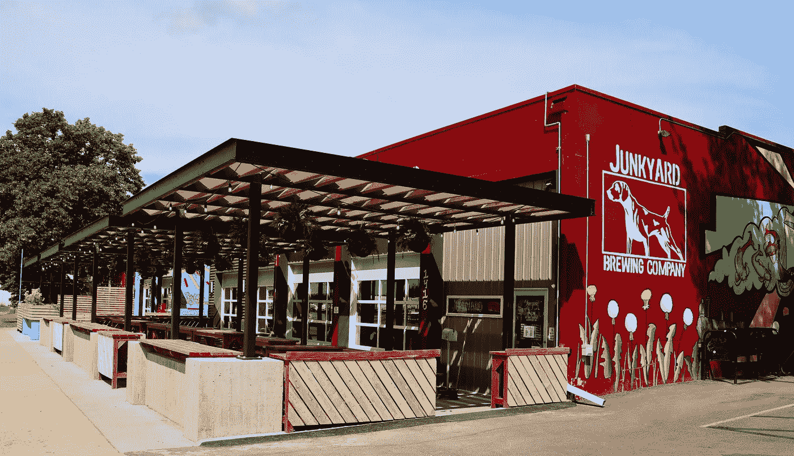
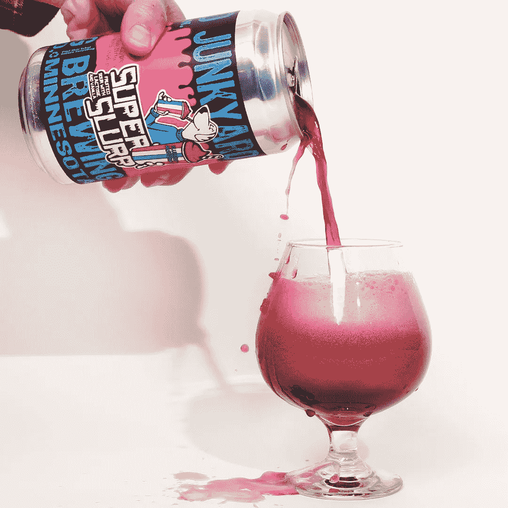
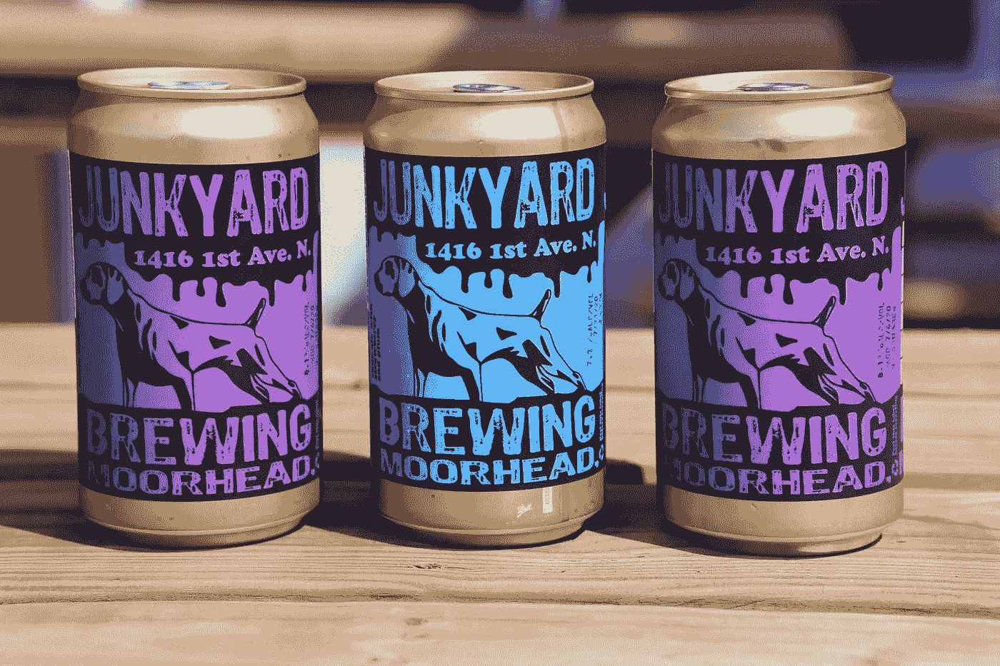

# 你从未听说过的最好的微酿酒厂

> 原文：<https://medium.datadriveninvestor.com/the-best-microbrewery-youve-never-heard-of-44857901b2d2?source=collection_archive---------24----------------------->

## 果汁泡沫 IPAs，奶昔酸奶，和巨大的 750 毫升克罗勒罐。这个酿酒厂真的很棒。

Junkyard Brewing Company — Image Credit: Google Maps/Business.

[垃圾场酿酒公司](https://www.junkyardbeer.com/)，于 2013 年在明尼苏达州的穆尔黑德成立，正在迅速跻身我最喜爱的国家酿酒厂的行列，这是有充分理由的。

> 我们是一家专门从事新的和实验风格的手工酿酒厂。
> 
> 我们也喜欢用自己的方式酿造经典款式。—垃圾场酿酒公司。

通常我会在我文章的最后披露(它会在那里等着你，不要告诉我我没有警告你)，但在我简短的关于啤酒厂的历史课和一张漂亮的图片之后，它值得一提。

**** * *我与垃圾场酿造公司没有任何关系或财务上的股份。这篇文章完全是无偿的。* * ****

我最喜欢的啤酒厂(排名不分先后)有:

Shiner Beer — 不一定是精酿啤酒，但我住在德克萨斯州，所以法律要求我提到它。Shiner 是惊人的，它是我家的主要产品，但它比不上其他三种。

**Pfriem 家族酿酒商**——位于俄勒冈州胡德河畔。Pfriem 大量借鉴许多大师的旧世界酿造技术，创造出具有惊人风味的复杂啤酒。

**垃圾场酿酒公司**——本文的中心。创新和美味的啤酒可以对抗伟大的啤酒，这些家伙真的超越了他们的重量级。

安克雷奇酿酒公司——阿拉斯加啤酒花巫师和强壮的炼金术士赢得了全国的赞誉。安克雷奇酿酒厂的罐子上有一些很厉害的艺术品。如果你想要一瓶很棒的啤酒，想在喝的时候看起来很酷，不要再找了。

## 他们的啤酒好吗？

四年来，我一直是精酿啤酒的忠实消费者。我总是把它放在冰箱里，今年圣诞节，我妻子给我买了一个很棒的迷你冰箱(有非常可爱的 LED 灯和玻璃门显示屏)，只是为了存放我的啤酒。我肯定我的妻子把它看作是对她自己冰箱空间的投资，但它确实是一个很棒的礼物。

我通常最喜欢黑啤酒和 IPAs，但关键是我有机会喝了很多来自世界各地精酿啤酒厂的精酿啤酒。我的观点是垃圾场酿造公司的产品名列前茅。

值得注意的是，我过去并不太喜欢酸味啤酒，但垃圾场的超级咕嘟声改变了这一点——可能是永久性的。超级思乐普是用大量的真正的浆果、甜乳糖和马达加斯加香草酿造的。它扑鼻而甜，超级顺滑——尝起来很怀旧，足以让人回想起小时候在电影院啜饮诱发大脑冻结的冰块。

Blue Raspberry Super Slurp — Image credit Junkyard Brewing Company

到目前为止，我已经尝试了三种不同口味的超级思乐普，以及他们的 IPAs。这一切都不可思议。在我的书中，任何能创造出能与安克雷奇酿酒公司的 IPA 产品相抗衡的 IPA 的酿酒厂都有很大的优势。

垃圾场有一些拉格啤酒、新英格兰淡色啤酒、黑啤酒等等，我迫不及待地想尝试他们提供的所有啤酒类型的产品。每当他们通过我的经销商，我会买下他们。

## 哪里可以买到垃圾场酿造公司的啤酒

如果你不住在明尼苏达州或其他地方，你可以在当地找到垃圾场酿造公司的啤酒，你最好的选择是 Tavour。Tavour 是一家啤酒配送公司，经营来自美国各地的精酿啤酒，让您接触到一些令人惊叹的精酿啤酒和微型啤酒厂，否则您将无法获得这些啤酒。

正如我在文章中提到的，我来自德克萨斯州，所以 Tavour 基本上是我发现的唯一可以买到垃圾场酿造啤酒的地方。值得庆幸的是，新的垃圾场产品经常在 Tavour 上列出，所以我能够在我交付的几乎每箱啤酒中从啤酒厂舀取一些啤酒。

Tavour 有一个很酷的内置排名和评论系统，所以你可以在购买之前看到其他精酿啤酒供应商的评论。我自己也经常使用这个系统，尽管我也正在将我的许多啤酒评论转移到尚未开发的网站上。如果你想了解我喝的最新啤酒，你可以在[这里](https://untappd.com/user/Emperion)加我好友。

[注册 Tavour](http://www.tavour.com/?invitedby=484899) ，我们都将获得 10 美元购买冰啤酒。一旦你尝了你的第一瓶垃圾场酿造公司的啤酒，你会感谢我的。

## “克劳勒”的魔力

750ML (25.36 Oz) Junkyard Brewing Crowlers. Image credit: Junkyard Brewing Company

萌芽中的精酿啤酒行业更神奇的创新之一是“Crowler ”,它是数百年历史的玻璃咆哮瓶和 17 世纪罐装技术的产物。再加上需要一个更好的运输系统来运输来自小型手工酿酒厂的美味啤酒，你就有了 [crowler](https://www.bonappetit.com/drinks/beer/article/what-is-a-crowler-beer) 。

从本质上讲，一个克劳勒是一个超大的啤酒罐，旨在运输和保存精酿啤酒比玻璃咆哮者更好。它也让像我这样来自明尼苏达州许多州的人，能够以最佳状态享受来自该州的啤酒。

我能从 Tavour 的垃圾场买到的啤酒都装在巨大的 750 毫升的容器里。一罐啤酒相当于* **25.36** * **神奇盎司**。大尺寸使其非常适合倒入玻璃杯，也适合与朋友和家人分享。尽管我承认，我更有可能为自己打开第二个垃圾场的垃圾桶，而不是与别人分享第一个垃圾桶。

通常，我会把可乐倒进玻璃杯里，然后就变成****。但是喝易拉罐里的东西并不可耻。啤酒罐就是干这个的，对吧？**

**你尝过垃圾场酿造公司的啤酒吗？在评论里让我知道？**

****** * *本人与垃圾场酿酒公司或本文提及的任何啤酒厂和/或公司没有任何关系或财务利益关系。这篇文章完全是无偿的。********

***披露:上面的* [*Tavour 链接*](http://www.tavour.com/?invitedby=484899) *为联盟链接。如果你通过我的链接注册，我们都会在你买啤酒后得到 10 美元的信用。***