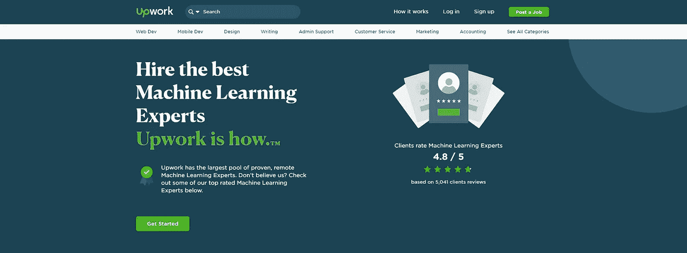
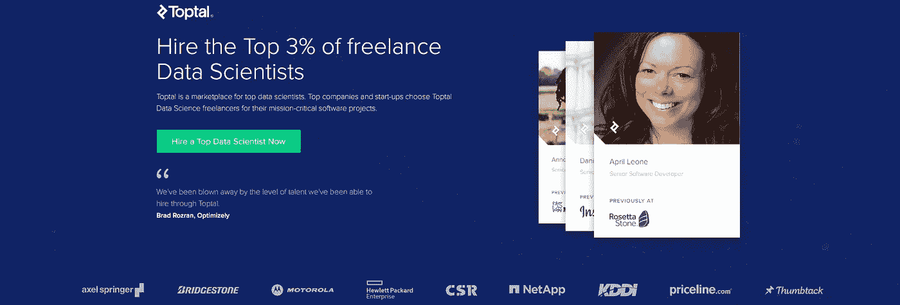
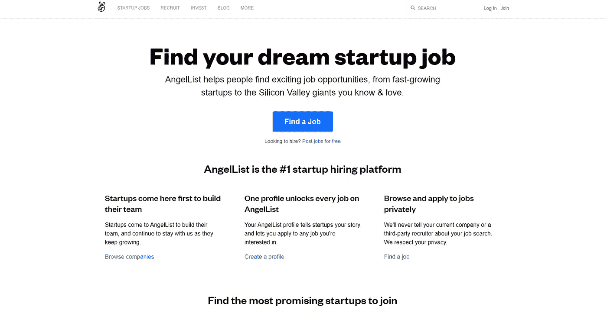
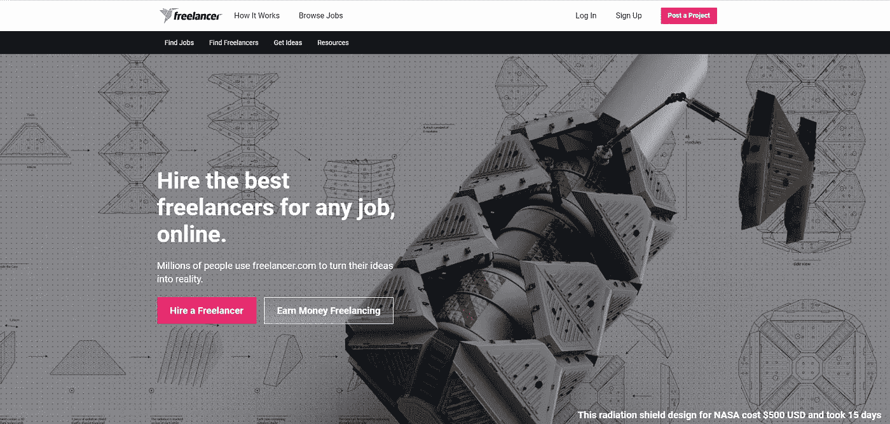

# 获得自由数据科学工作的最佳平台

> 原文：<https://medium.datadriveninvestor.com/the-best-platforms-to-land-freelance-data-science-gigs-c51538d12634?source=collection_archive---------2----------------------->

## 哪里可以找到自由数据科学家

Photo by [Avi Richards](https://unsplash.com/@avirichards?utm_source=medium&utm_medium=referral) on [Unsplash](https://unsplash.com?utm_source=medium&utm_medium=referral)

数据科学的吸引力可能是由对数据科学家能力的巨大宣传推动的，或者可能只是巨额工资。谁知道呢？无论哪种方式，数据科学的工作竞争都非常激烈；我听说过招聘人员在一周**内收到 300 多份对一个职位的申请**！

尽管我主张在该领域的全职公司工作，以获得经验并了解商业运作方式，但我意识到，有时获得一个角色可能需要长达 18 个月以上的时间。我不知道人们在没有工作的情况下如何熬过这么长时间的等待，但对我来说，这不是一个选择。

毫无疑问，公司需要数据科学家，他们准备投入巨资建立数据团队，但有时内部员工无法完成的项目可能会出现专门或特定的任务。因此，公司开始转向自由职业者来满足需求和省钱(尽管作为自由职业者，你仍然能拿到相当高的薪水)。

进一步补充，新冠肺炎疫情可能已经彻底改变了我们的工作方式，因为许多员工在自己舒适的家中使用工作站。这是双向的，因为这意味着更多的就业竞争，因为来自印度的人可以申请英国的职位，但这也意味着你可以申请全球任何地方的职位。

不管你是已经有了一份数据科学的工作，还是希望找到一份，自由职业都是获得更多经验、灵活工作时间和在收入之外赚取额外收入的好方法。

> **注意**:也就是说，这篇文章假设你已经具备了足够的数据科学能力，并且已经准备好进入工作岗位或者成为一名数据科学家。

以下是一些寻找自由数据科学工作的顶级网站:

## 向上工作

根据 Upwork 的[维基百科](https://en.wikipedia.org/wiki/Upwork#:~:text=Upwork%20has%20over%20eighteen%20million,freelancer%20marketplace%20in%20the%20world.)页面，Upwork 上有 500 万注册客户和 1800 万注册自由职业者。从小型初创企业到像微软这样的大公司都有。有大量的日常工作发布供您选择，您可以过滤搜索结果以满足您当前的技能和技能水平(即入门级、中级和高级)。

我个人使用 Upwork 作为我的主要网站，我发现它相当不错。

## 五元

如果你们像我一样，在浏览自由职业者网站后看了很多 youtube 视频，那么你可能从你的 Youtube 广告中听说过 Fiverr。Fiverr 是一个以色列自由职业者服务在线市场，为自由职业者在全球范围内提供服务提供了一个平台。从我收集到的关于 Fiverr 的信息来看，它是用于小得多的项目，而 Upwork 是用于更大更专业的项目。

我在他们的维基百科页面上找不到 Fiverr 的客户和自由职业者的数字，但 2019 年来自 [TechCrunch](https://techcrunch.com/2019/05/16/fiverr-files-to-go-public/) 的一篇帖子称“*它已经促成了 550 万买家和 83 万自由职业者***”**之间超过 5000 万笔交易

## 托普塔尔

要想登上顶峰，你必须接受审查。客户通常知道或理解数据科学人才的价值，所以你不会被蒙在鼓里——希望如此——但是如果你看到财富 500 强品牌和创新的硅谷创业公司在名单上，不要感到惊讶。

## 天使列表

AngelList 与 Upwork 有很大不同，它主要是一个面向初创公司、天使投资人和希望在初创公司工作的求职者的网站。这并不是太糟糕，因为你更有可能在没有设施来维持全职数据科学家的初创公司获得数据科学工作。就目前情况来看，AngelList 网络要比 Upwork 小得多。根据维基百科页面，有 35000 家招聘公司，200 多万候选人和 500 万注册用户——竞争减少会增加你获得工作的机会，也可能不会。

## 自由记者

自由职业者是一个澳大利亚自由职业者市场网站，它允许潜在的雇主发布工作，自由职业者可以投标完成。像其他自由职业者平台一样，你可以对任何感兴趣的项目进行投标，或者过滤更精细的数据科学搜索。就用户数量(2000 万以上)和项目数量(800 万以上)而言，Freelancer.com 是世界上最大的自由职业者和众包平台。

## 包裹

这些绝不是获得自由职业者工作的唯一媒介。事实上，像 Glassdoor 和 LinkedIn 这样的普通求职网站也有很多自由职业的机会。另外，我说我使用 Upwork 并不意味着你也应该这样做。深入挖掘这些自由职业平台，确定它们能提供什么，是否能满足你作为自由职业者的需求，这对你来说是一个公平的世界。

在 [LinkedIn](https://www.linkedin.com/in/kurtispykes/) 和 [Twitter](https://twitter.com/KurtisPykes) 上与我联系。