# 最佳投资组合——抵御冠状病毒黑天鹅

> 原文：<https://medium.datadriveninvestor.com/the-best-portfolio-mix-withstanding-the-covid-19-black-swan-1178911bffc5?source=collection_archive---------4----------------------->

## 对不同投资的比较表明，现在比以往任何时候都更需要一些比特币敞口。包括结果和代码。

我们得出的资产配置:

*   过去 6 年中表现最好的
*   **在**新冠肺炎**危机期间显示**损失有限****
*   ****是否未被管理**(每月仅进行一次简单的重新平衡)**
*   **仅投资于 **S & P 500 指数、比特币、**和**黄金****

****结果:****

**就风险调整回报率而言，6 年前，你应该将你的启动资金(10 万美元)按以下权重分配到上述资产中:**

1.  **S&P 500:12.500-20.000 美元**
2.  ****比特币**:7.000-9.000 美元**
3.  ****黄金**:15.000-20.000 美元**

**加上 53.500-66.500 美元的无风险资产——部分是为了**补偿来自比特币配置的更高风险**。乍一看，这听起来有点傻，但是读下去，你就会明白为什么这行得通！**

> **顺便说一句——有人可能会问，为什么我们选择了过去 6 年的****而不是 10 年或 5 年？原因在于比特币的价格历史。在我们开始的前一年，BTC 取得了最后的辉煌成就，这种情况今后不会再发生了。因此，我们希望至少尽可能多地惩罚加密货币投资。但是没有成功；)******

******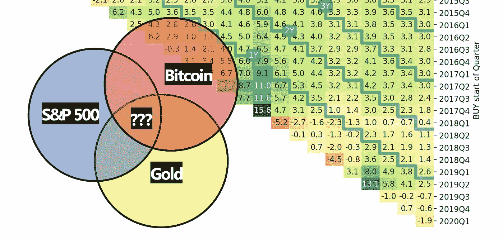******

******如果你有以下情况，请继续阅读:******

*   ******有兴趣了解**更多详情********
*   ****想自己做一些类似**的计算******

****这个故事使用编程语言 **Python** 通过所有必要的步骤得出结果。此外，我们将对我们找到的解决方案给出一些见解。我们经历的步骤是:****

1.  ****导入历史资产价格****
2.  ****做一个基本图表[+什么是杠杆？]****
3.  ****为每月重新平衡的投资组合建立框架****
4.  ****所有资产分配组合的回溯测试****
5.  ****表现最佳的投资组合****

# ****1.导入历史资产价格****

****包 *pandas-datareader* 包括 *DataReader* ，它实现了对几十个不同数据 API 的导入。我们将使用雅虎获得股票指数、加密货币、比特币和 T42 黄金价格。****

****我们还从 [FRED](https://fred.stlouisfed.org/) 处进口了 **3 个月期美国国债**，因为我们需要一项无风险资产来支付未分配的现金。导入助手功能是:****

```
**import pandas as pd
from pandas_datareader.data import DataReaderdef get_close_prices(ticker, name, start, end):
    if(ticker == 'TB3MS'):
        data = DataReader(ticker, 'fred', start, end)
    else:
        data = DataReader(ticker, 'yahoo', \
            start, end)[['Adj Close']]
    data.columns = [name]
    return data**
```

****使用这个简单的函数，我们导入过去 **6 年**的**每日收盘价**。由此产生的四个*数据帧*然后被合并成一个…****

```
**assets = {'SP':'^GSPC', 'BTC':'BTCUSD=X', 'G':'GC=F', 'RF':'TB3MS'}
dfs = [get_close_prices(ticker, name, '2014-03-30', '2020-03-31') \
    for name, ticker in assets.items()]data = reduce(lambda df1, df2: df1.join(df2, how="outer"), dfs)
data = data.sort_index(ascending=True)
data**
```

****到目前为止，数据集仍然包括多个缺失值( *NaN 的)*。为了得到一个干净的数据集，我们只使用最多有一个缺失值的行。****

****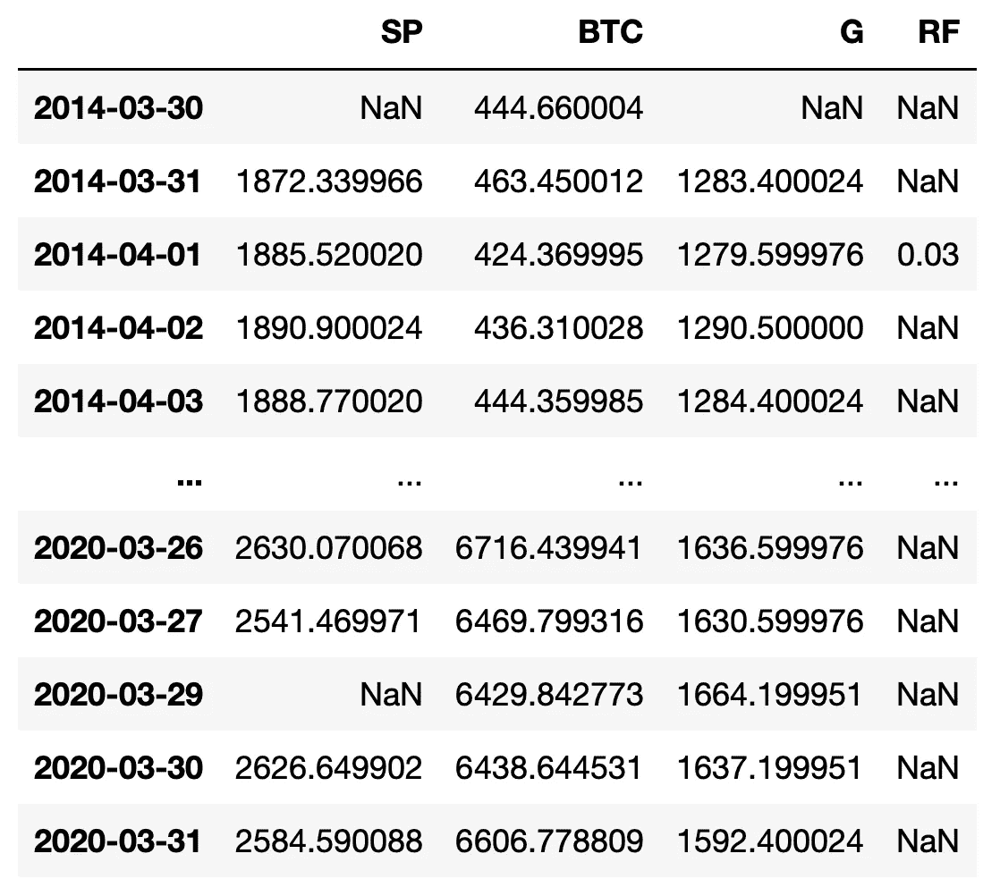****

****The imported DataFrame before any cleaning. The risk-free asset has only 1 value per month.****

****由于我们在任何给定时间都只能以下一个可用价格**进行交易，因此我们会向后**填充缺失价格**('*b 填充*')。******

****对于国库券(RF 栏*和*)，我们只有月度数据。因此我们向前填充它的缺失值(*ffill*’)。这里是这些操作的代码，下面是已清理数据的快照:****

```
**atMostOneNA = data[['SP','BTC','G']].isna().sum(axis=1) <= 1
data = data.loc[atMostOneNA, :]data.loc[:, ('SP','BTC','G')] = \
    data.loc[:, ('SP','BTC','G')].fillna(method='bfill')
data.loc[:,'RF'] = data.loc[:,'RF'].fillna(method='ffill')**
```

****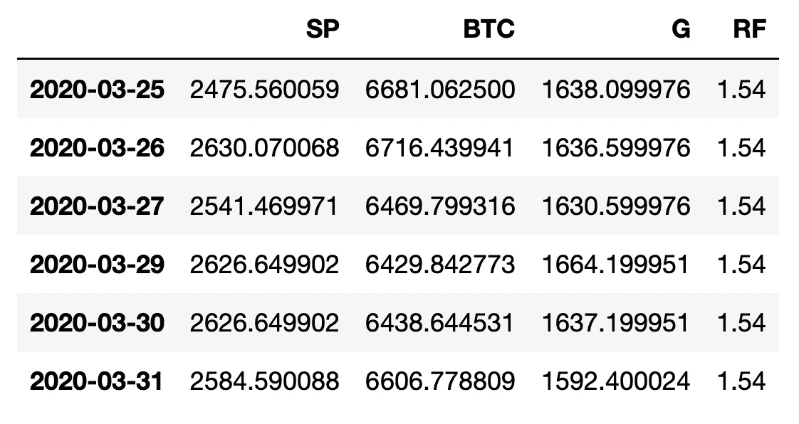****

****Data set after filling NaN values.****

# ****2.做一些基本的图表[+什么是杠杆？]****

****我们使用 [Python 包 *plotly*](https://plotly.com/python/) 创建 S & P 500、比特币和黄金的价格图表:****

****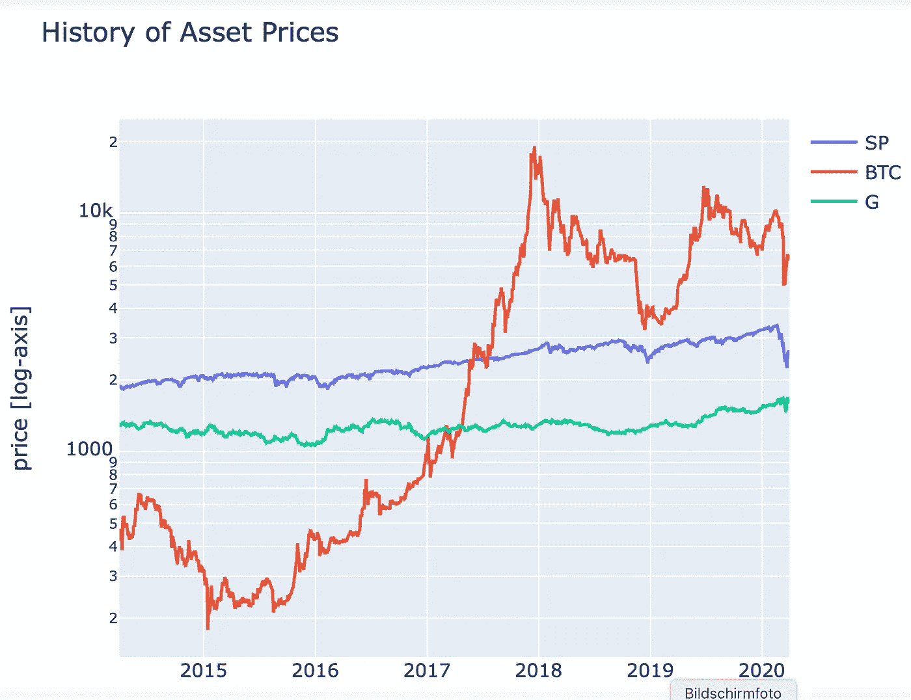****

****Price history of S&P 500, Bitcoin and Gold.****

****显然，这些资产在[波动性](https://en.wikipedia.org/wiki/Volatility_(finance)) (=每日回报的年化标准差)方面存在很大差异。黄金的波动性不到 15%，而比特币的波动性是 74%。****

****现在，让我们比较不同的情景，一个基础投资组合的股票(S & P 500)配置比例为 75 **%** ，无风险资产(如美国国债)配置比例为 25%。也就是我们的**基础杠杆是 0.75** 。****

****现在，为了**使资产具有可比性**，我们计算得到相似波动性所需的杠杆。这产生了:****

```
**volas = prices.apply(Annualized_Vola)
result = pd.DataFrame( \
    { 'volas':volas, 'leverage':0.75 * volas['SP'] / volas })
result[result.index != 'RF']**
```

****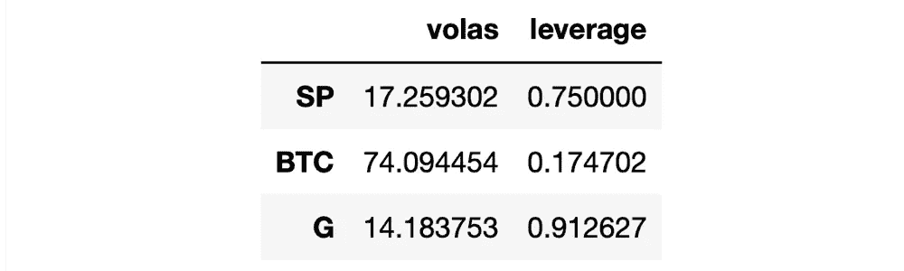****

****Implied leverages to get a volatility comparable to the S&P500.****

****正如我们所见，比特币的杠杆必须比标准普尔 500 的杠杆小 4 倍以上(0.17 比 0.75)。因此，在比特币上投资 10，000 美元会导致与 S&P 指数中 40，000 美元相似的风险敞口。****

****在黄金方面，我们可以分配更多的资金来获得与 S&P 股票指数相同的风险敞口。****

****在进入下一部分之前，我们**将无风险利率转化为指数**。假设利率全年为 1.0%，我们希望指数从 100.0 开始，并在第一年上升到 101.0，而不是使用百分比(即 1.0%)。我们的代码有点花哨，也适用于每日汇率变化:****

```
**def get_index_from_rate(rates, dates, start=100):
    delta_days = np.diff( \
        (dates - datetime.utcfromtimestamp(0)).days)
    delta_days = np.insert(delta_days, 0, 0) 
    index = np.cumprod((1 + rates/100) ** (delta_days / 365.25))
    return np.multiply(start, index)prices = data.copy()
prices['RF'] = get_index_from_rate(prices['RF'], prices.index)**
```

********

****Risk-free rate as a percentage (blue) and implied index (red) starting with 100.****

****该图显示了自 2017 年年中利率上升以来，该指数(红线)如何开始加速上升。****

# ****3.为每月重新平衡的投资组合建立框架****

****酷毙了。下一步，我们要比较三种只做多的投资，每种投资都有相同的目标波动率:****

*   ****75.0% SP 和 25.0%无风险****
*   ******17.5%比特币**82.5%无风险****
*   ******91.3%黄金**8.7%无风险****

****此外，我们希望**每月**重新平衡我们的投资组合，即我们对不断重新平衡的投资组合感兴趣。这是为了在 6 年的时间框架内保持**稳定的敞口**所必需的。然而，它肯定也有助于一年期投资。****

****让我们用一个简单的**例子**来解释一下没有再平衡和有再平衡的情况。假设:****

*   ****启动资金 10.000 美元，投资于资产 A(5.000 美元)和资产 B(5.000 美元)。****
*   ****1 月收益→资产 A: **+20%** ，资产 B: **-20%。******
*   ****2 月收益→资产 A: **-20%** ，资产 B: **+20%。******

1.  ******未再平衡**:
    1 月底分配→ A: 6.000，B:4.000
    2 月底分配→ A: 4.800，B:4.800
    2 个月后资金:$9.600。****
2.  ******带再平衡** :
    一月底分配→ A: 6.000，B:4.000
    10.000 的再分配→ A: 5.000，B: 5.000(又是 50:50)
    二月底分配→ A: 4.000，B:6.000
    2 个月后的资本:＄10.000。****

****现在，我们创建 Python 函数 ***trading()*** 来**计算任意资产分配的权益曲线**，该曲线在特定时期(例如月初)重新平衡。为了简单起见，我们忽略了我们不能投资小数目的资产的事实(例如 7.3 E-Mini 期货或其他)。****

****函数 *trading()* 计算所需资产的每日分配。每月开始时，根据参数 *target_weights* 中的规定，重新分配当前资本。最后，函数**返回**一系列**每日投资组合余额** (' *capital_daily* ')，这些余额将用于绘图和业绩计算。****

```
**def asset_allocation(capital, weights):
    return np.multiply(capital, weights)def trading(returns, start_capital, target_weights, timeframes):
    capital_now = start_capital
    capital_per_asset_daily = pd.DataFrame(columns=returns.columns)
    for index in np.unique(timeframes):
        capital_per_asset_now = asset_allocation(
            capital_now, target_weights)        
        r = returns.iloc[timeframes == index]
        capital_per_asset_new = \
            np.multiply((r + 1).cumprod(), capital_per_asset_now)
        capital_per_asset_daily = 
            capital_per_asset_daily.append(capital_per_asset_new)
        capital_now = sum(capital_per_asset_daily.iloc[-1])
    capital_daily = capital_per_asset_daily.sum(axis=1)
    return (capital_daily, capital_per_asset_daily)**
```

****为了调用这个函数，我们需要每日收益(价格变化百分比)以及一个具有周期(=月份)唯一标识符的数组。后者是提取分配不变的时间帧所必需的。****

****使用 *[1:]* 我们省略了第一个日期，因为该行缺少%变化:****

```
**returns = prices.pct_change()[1:] 
timeframes_monthly = prices.index[1:].strftime('%Y%m')**
```

****现在让我们运行上述 3 项投资的函数:****

```
**start_capital = 100000## S&P 500.
leverage = result['leverage']['SP']
target_weights = [leverage, 0, 0, 1.0 - leverage]
(capital_daily_sp, _, Return, Vola, SR, MaxDD) = trading(returns, \
    start_capital, target_weights, timeframes_monthly)## Return:  4.43     Vola: 12.74     SR: 0.27     MDD: 26.09## Bitcoin.
leverage = result['leverage']['BTC']
target_weights = [0, leverage, 0, 1.0 - leverage]
(capital_daily_btc, _, Return, Vola, SR, MaxDD) = trading(returns, \
    start_capital, target_weights, timeframes_monthly)## Return: 13.89     Vola: 13.34     SR: 0.97     MDD: 23.46## Gold.
leverage = result['leverage']['G']
target_weights = [0, 0, leverage, 1.0 - leverage]
(capital_daily_g, _, Return, Vola, SR, MaxDD) = trading(returns, \
    start_capital, target_weights, timeframes_monthly)## Return:  3.54     Vola: 12.94     SR: 0.20     MDD: 19.73**
```

****您可能已经注意到，我们的函数比上面的代码返回更多的值。如果您需要这些标准指标的计算细节，请随时联系我(回报、Vola、[夏普比率](https://www.investopedia.com/terms/s/sharperatio.asp)、[最大下降](https://www.investopedia.com/terms/m/maximum-drawdown-mdd.asp))。****

****我们现在有了分配的权益曲线。让我们使用 *plotly:* 来绘制它们****

```
**fig = go.Figure()
fig.add_trace(go.Scatter(x=prices.index, y=capital_daily_sp, \
    mode='lines', name='SP'))
## ... same for BTC and G.
fig.update_layout(yaxis_type="log", ...)**
```

****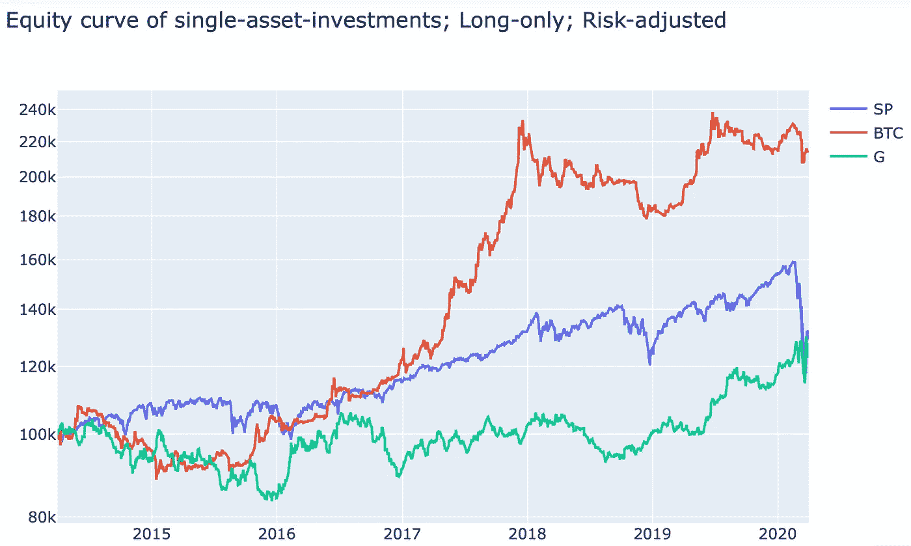****

****Equity curves for Long-only investments. All three curves share nearly the same volatility (!).****

> ****我们看到，在风险调整的基础上，冠状病毒危机期间(2020 年 3 月)标准普尔 500 股指的下降幅度远远大于比特币。****

****这与[媒体告诉](https://en.cryptonomist.ch/2020/04/05/china-coronavirus-bitcoin-failed-crisis/)的有点不同。另一方面，有出版物显示比特币在最大化回报风险比方面的优势(例如，见 [Woobull](https://charts.woobull.com/bitcoin-risk-adjusted-return/) )。****

## ****仅限标准普尔 500 的投资****

****让我们更深入地了解一下**S&P 500-only investment**——杠杆率始终为 75%的细节。三角形图(如下)显示了 2014 年第二季度至 2020 年第一季度之间所有可能子周期的平均回报。这提供了许多细粒度的洞察力。****

******如何看这个图:**在两个红色矩形的交叉点上你看到 3.0。这是从 2017 年第一季度开始(右侧轴上的标签)到 2018 年第三季度结束(顶部轴上的标签)的平均年化回报率(以百分比表示)。****

****此外，从左上角开始的最长对角线上的值是简单的一个月回报，而最后一列**中的值**对应于任何季度的平均回报，截止到今天(2020Q1)，这意味着它们包括冠状病毒危机的时间。****

****顺便说一下，三角形图是通过微调函数 *plt_triangle* 创建的(由 [Scalable Capital GmbH](https://de.scalable.capital/quants-perspective/return-triangles#fig_ret_upper) 开源，MIT 许可)。Thx)。****

****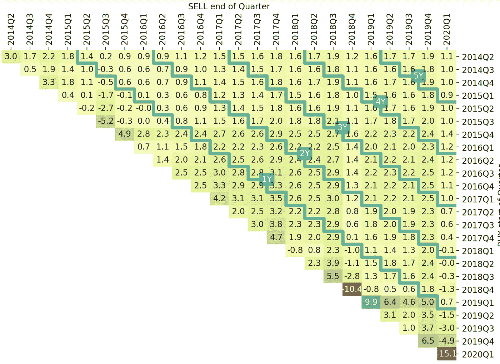****

****Return Triangle for the S&P 500 investment with leverage 0.75 and monthly rebalancing. Cells show Quarters, from 2014-Q4 to 2020-Q1.****

****我们看到的标准普尔 500:有一些大的下降(-10.4%和-15.1%)；此外，期限为 4-5 年的投资从 1.0%到 2.4%不等。****

****看看最后一栏底部的四个值:由于持续的 COVIT-19 危机，在过去 12 个月投资的人的平均回报率为-1.5%至-15.1%。****

## ****纯比特币投资****

****接下来让我们检查比特币投资的相同三角形图，总是具有相同的风险暴露。我们仍然有一个略低于-10%的 1 个月回报，但有很多超过+10%的巨大回报。****

****期限为 4-5 年的投资的年化回报率在 3.0%到 5.4%之间。而且——非常重要:**包括**冠状病毒危机**开始** (2020Q1) **的投资从来没有低于-1.9%** 。****

****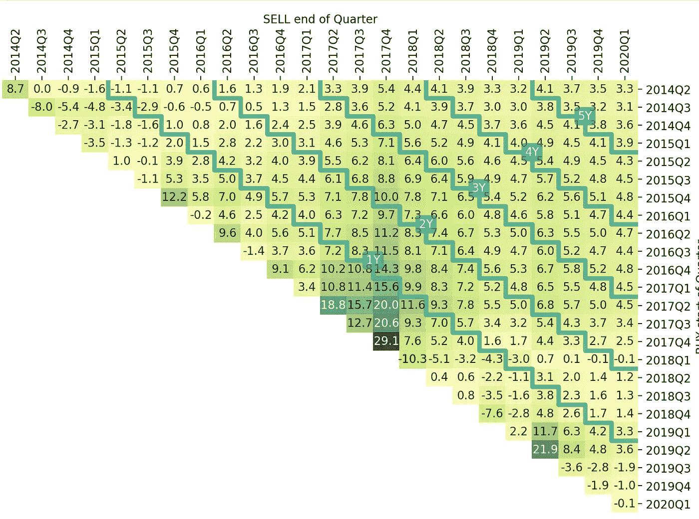****

****Return Triangle for the Bitcoin investment with leverage 0.175 and monthly rebalancing. Cells show Quarters, from 2014-Q4 to 2020-Q1.****

# ****4.组合的计算****

## ****a.风险调整分配****

****首先，我们不是将 75%的资金投资在一项资产上，而是希望将风险平均分摊到三项资产上，即标准普尔 500、BTC 和黄金。这导致了上面使用的杠杆的 1/3:****

*   ****标准普尔 500: 0.750 / 3 = 0.250****
*   ****比特币:0.174 / 3 = 0.058****
*   ****黄金:0.913 / 3 = 0.304****

****我们计算权益曲线，得到以下结果:****

```
**target_weights = result['leverage'] / 3.0
target_weights['RF'] = 1.0 - sum(target_weights[:-1])
(capital_daily_g, _, Return, Vola, SR, MaxDD) = trading(returns, \
     start_capital, target_weights, timeframes_monthly)## Return: 7.67      Vola: 7.52      SR: 0.89      MDD: 13.34**
```

****听起来不错！与单一的 S&P 或黄金投资相比，年回报率约为两倍。此外，多样化导致波动率下降了近 50%。但是让我们经历更多的场景。****

## ****b.计算分配权重网格****

****让我们对此进一步展开。我们通过有意义的权重网格进行搜索，而不是固定的分配。我们允许每项资产的权重在上述权重的[-50%，+50%]的**范围内。在对更漂亮的数字做了一些舍入之后，我们在测试**中总结了包括这些权重**在内的所有组合:******

*   **标准普尔 500:12.5%至 37.5%，增幅为 2.5%**
*   **比特币:3.0%至 9.0%，涨幅为 1.0%**
*   **黄金:15.0%至 45.0%，以 5.0%的幅度递增**

**下面的嵌套循环遍历这些组合，并创建一个*数据框架*，其中包括所有可行资产权重组合的绩效指标:**

```
## Custom function to create an equally-spaced grid of values
## within the specified range; plus some constraints.
def my_linspace(cum_weight, step=0.05, min_weight=0, max_weight=1)
## ... code omitted.performance = []
for wei_sp in \
    my_linspace(0, min_weight=0.125, max_weight=0.375, step=0.025):
    for wei_g in my_linspace(wei_sp, min_weight=0.15, \
        max_weight=0.45, step=0.05):
        for wei_btc in my_linspace(wei_sp + wei_g, \
            min_weight=0.03, max_weight=0.09, step=0.01):
            wei_tb3 = 1.0 - (wei_sp + wei_btc + wei_g)
            target_weights = [wei_sp, wei_btc, wei_g, wei_tb3]
            (_, _, Return, Vola, SR, MaxDD) = trading(returns, \
                start_capital, target_weights, timeframes_monthly)
            performance.append( \
                target_weights + [Return, Vola, SR, MaxDD])performance = pd.DataFrame(performance, columns=\
    returns.columns.tolist() + ['Return', 'Vola', 'SR', 'MaxDD'])performance.sort_values('SR', ascending=False).head(15)
```

**结果如下(**前 15 名**):**

**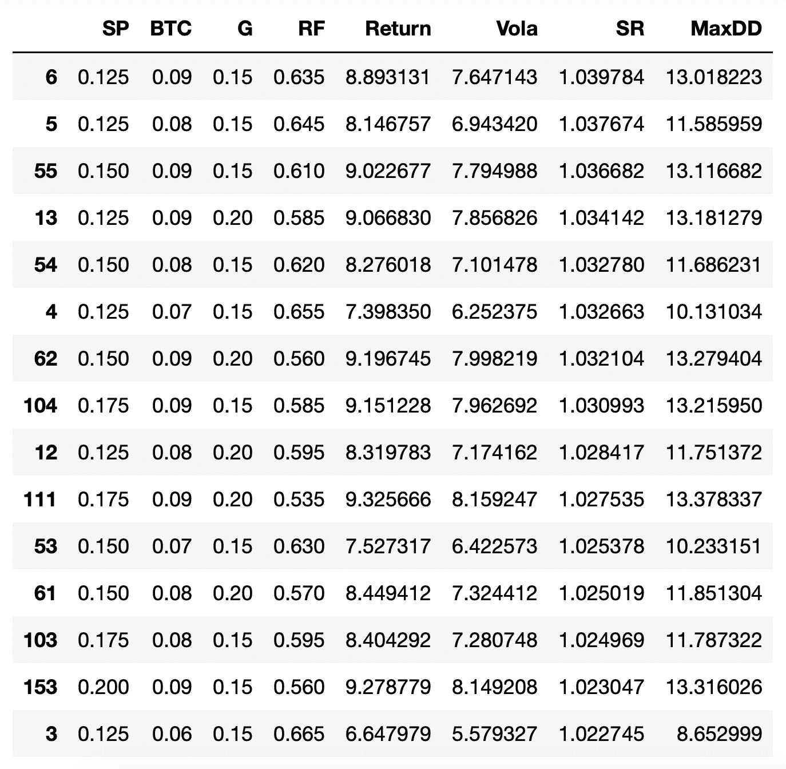**

**Top 15 asset allocations by means of the Sharpe Ratio.**

**非常相似，这 15 个最佳解决方案。标准普尔 500 和黄金大多处于其权重下限，比特币处于其权重上限(0.09)。然而，所有这些解决方案在称为[夏普比率](https://en.wikipedia.org/wiki/Sharpe_ratio)(风险/回报)的风险调整指标方面非常相似。**

**让我们**从这 15 个场景中挑选 2 个场景**——最好的一个，以及拥有更高股票投资份额(占标准普尔 500 指数的 20%)的解决方案:**

*   **场景 1 →权重= [0.125，0.090，0.150，0.635]**
*   **场景 2 →权重= [0.200，0.090，0.150，0.560]**

**下图比较了单一资产投资与两种情景投资组合的表现(顺便说一句，所有 5 种投资每月重新平衡一次):**

**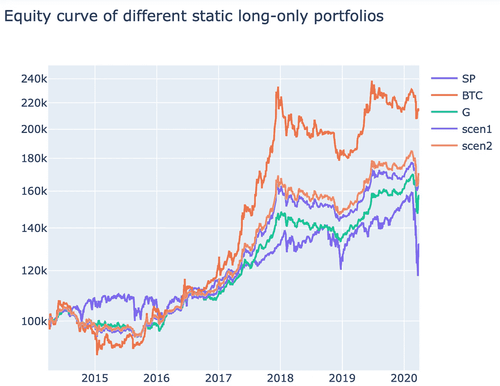**

**虽然这两种情况都有不错的回报，但它们没有标准普尔 500 那样的风险。下降幅度要小得多。**

**我们可以得出这样的结论:一个只有少量股票和黄金投资的均衡投资组合在分析期内表现最佳。**

**为了完成这个故事，我还附上了两个场景的返回三角形。两者在 2020 年都有非常可容忍的下降——Q1:**

****

**Return Triangle for scenario 1.**

**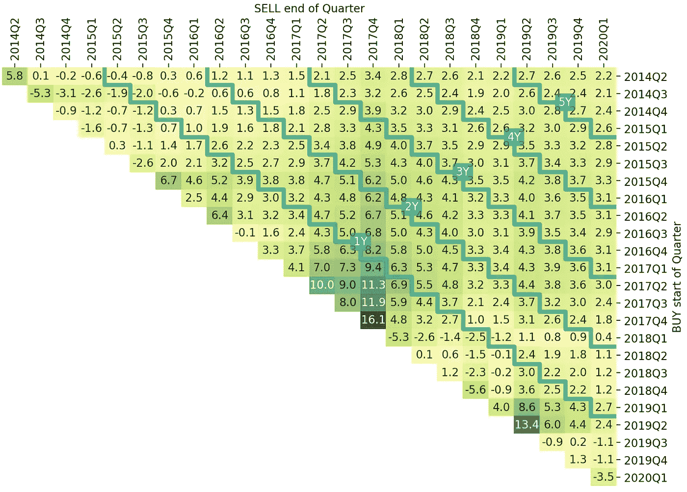**

**Return Triangle for scenario 2.**

# **摘要**

**身处冠状病毒经济危机之中，我们扪心自问，我们的投资组合是否正确。巨大的损失已经过去了吗——或者还会有更多的损失？**

**在这个故事中，我们比较了过去几年中不同的资产配置，包括 2020 年第一季度。结果令人惊讶:拥有大量比特币的投资组合回报率高得多，风险也更小。总是在加密货币投资与大约四倍于相同金额的无风险资产保持良好平衡的条件下[参见:杠杆]。**

**然而，没有人能保证历史会重演。通常不会。既不是股票回报的历史，也不是加密货币回报的过程。**

**只有一点永远是有利的:多元化！所以不要单纯投资股票，要分散风险，限制杠杆:)**