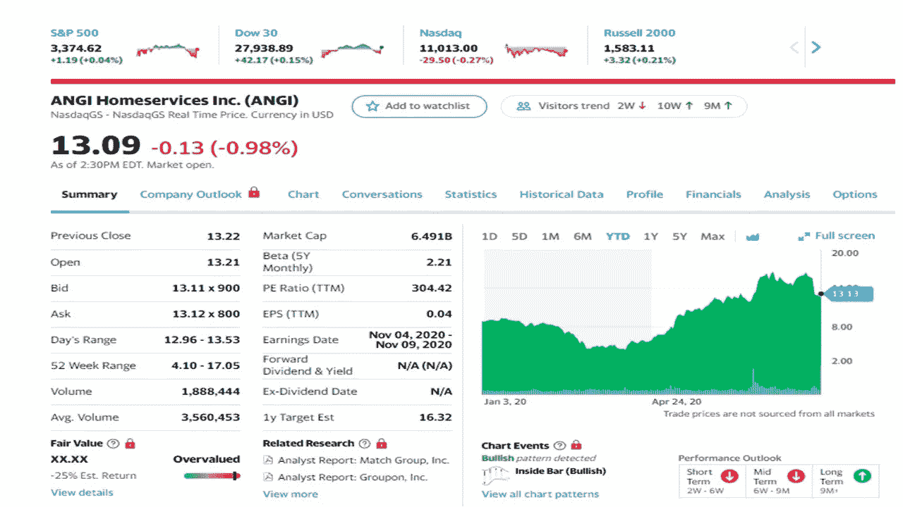
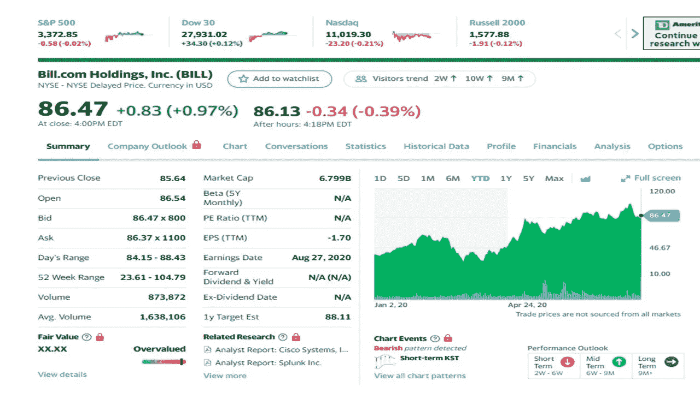
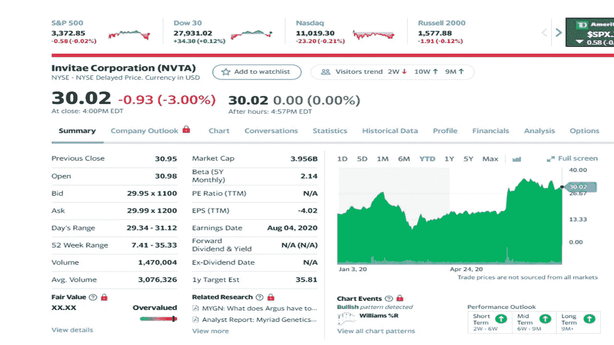
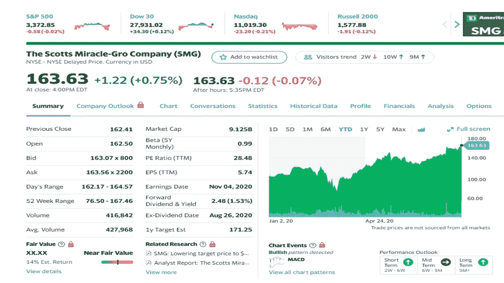
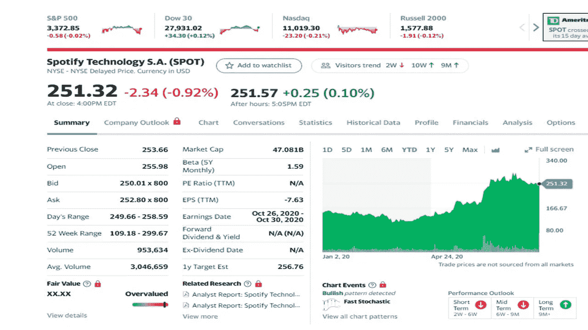

# 8 月份投资的最佳股票

> 原文：<https://medium.datadriveninvestor.com/the-best-stocks-to-invest-in-august-75f08ae4c901?source=collection_archive---------8----------------------->

## 2020 年五只股票跑赢大盘

Photo by [Rohit Farmer](https://unsplash.com/@rohitfarmer?utm_source=unsplash&utm_medium=referral&utm_content=creditCopyText) on [Unsplash](https://unsplash.com/s/photos/person-and-computer?utm_source=unsplash&utm_medium=referral&utm_content=creditCopyText)

随着一些股票脱颖而出，夏季仍然炎热，股市开始降温。这个月我推荐看看这五只股票。这些股票表现非常好，在今年和未来几年都有很强的潜力。

自 3 月 23 日低点和标准普尔 500 下跌 35%以来，股市一直在显著攀升。投资者正在弄清楚哪些好股票可以加入他们的投资组合。下面是五只在华尔街顶级股票中领先的股票。

 [## 低迷时期投资初学者指南|数据驱动型投资者

### 要不要低买高卖？让我告诉你一个秘密。这正是成千上万的交易者…

www.datadriveninvestor.com](https://www.datadriveninvestor.com/2020/05/01/a-beginners-guide-to-investing-in-a-downturn/) 

**所列股票价格为 2020 年 8 月 14 日收盘时的价格。您看到的价格可能与我提供的不同。**

# ANGI 上门服务(ANGI)

Yahoo Finance

这只股票和其他股票一样，在春季受到了冲击，但此后价格迅速反弹。ANGI 通过其数字市场将美国和国际上的消费者与家庭服务专业人员联系起来。该公司将消费者与专业服务人员联系起来，进行改进项目、维护和家庭维修。该公司提供的资源是本地的，经过预先筛选，并由客户进行评级。ANGI 还拥有和经营安吉的名单，你可能听说过。ANGI 最大的股东 IAC 最近发出一封信，称该公司股价在 5 月飙升 27%，在 6 月飙升 34%。由于冠状病毒，该股在 3 月和 4 月分别下跌了 8%和 12%。ANGI 用他们的固定价格平台(没有谈判)度过了这场风暴。该公司改进了其支付选项，预计该公司将因此进一步发展。随着收益报告的公布，股价在本周下跌。 ***该公司业绩良好，但最近 7 月份的收入(7%)是 5 月份(15%)和 6 月份(14%)的一半。*** ***这可能是公司有点冷淡的迹象。最近的收益还不错，股票可能会回调。***

# Bill.com(比尔)

Yahoo Finance

该公司提供基于云的软件，为中小型企业后台运营数字化和自动化财务运营。Bill.com 是一个人工智能金融平台，提供基于云的支付产品，允许用户自动进行应付账款和应收账款交易。该公司将数千家小型企业(2 到 500 名员工)带入现代社会，减少账单、发票和合同的书面记录。Bill.com 的高效平台允许使用与会计和财务系统同步的更现代的工具。小企业的一些在线系统仍有可能被病毒感染。这将允许企业获得更多的在线系统。一小部分美国企业使用 Bill.com。该股在 5 月份创下新高，此后一直上下波动。这只股票是长期持有的好机会。

# 邀请赛(NVTA)

Yahoo Finance

Invitae 是一家医学遗传学公司，为美国、加拿大和国际上的客户和患者处理和分析 DNA 样本。该公司在各种诊所提供遗传性癌症、心脏病、神经病学、代谢状况、神经病学、儿科、代谢状况、罕见疾病和产前基因测试的遗传学测试。许多疾病是遗传性的，基因测试有助于医学领域诊断危险的疾病。Invitae 为病人提供的测试费用很低，从几千美元降到了 250 美元。在过去的六年中，该公司的年增长率为 170%。分析师预计 2021 年的收入增长率将达到 100%。Invitae 最近收购了 ArcherDX，这可能会在未来三到五年内在当前增长率的基础上增加 50%的增长。基因检测市场巨大，预计到 2025 年将从 2017 年的 170 亿美元增长到 170 亿美元。 ***两周前，NVTA 公布了最近的收益下降，股价小幅下跌但又反弹。***

# 美乐高(SMG)

Yahoo Finance

您可能已经在您的草坪上使用了美乐棵，因为该公司生产、营销和销售这种产品。该公司在美国和国际上销售产品。Scotts Miracle-Glo 提供草坪产品，如草籽、肥料、撒布剂和室外清洁剂。除了草坪产品，Scotts 还向美国大麻行业提供产品，隶属于该公司的 Hawthrone section。霍桑公司第二季度销售额增长 72%，至 3.03 亿美元。预计今年剩余时间的收入将增长 55%。公司的其他部门表现良好，因为更多的人呆在家里，斯科特公司提高了预期(今年收益增长 50%)。如果你在 8 月 27 日之前拥有股票，史考特还将他们的股息一次性提高到每股 5 美元。 ***这只股票应该是长期持有的好。如果你决定购买竞彩，我建议等待价格回调。***

# Spotify(SPOT)251.32 美元

Yahoo Finance

Spotify Technology 及其子公司在美国、英国、卢森堡和全球范围内提供音频流服务。该公司分两部分运营，高级和广告支持。该公司为其音乐和播客目录提供无限的在线和离线流媒体服务。截至 2020 年 3 月，该公司在 79 个国家拥有 2.86 亿月活跃用户和 1.3 亿高级用户，在欧洲拥有 13 个新市场。今天的主要驱动力是播客，因为常规播客包括金·卡戴珊、米歇尔·奥巴马、乔·罗根和其他人，以及应该吸引新用户的原创内容。如果你决定购买现货，我会等待价格回落。

这位作者不拥有任何这些股票。

 [## 你需要知道的最新特斯拉股票消息

### 这可能是持有特斯拉股票的最佳时机

medium.com](https://medium.com/datadriveninvestor/the-latest-tesla-stock-news-you-need-to-know-cccf42a87df3)  [## 7 月份投资的最佳股票

### 2020 年五只股票跑赢大盘

medium.com](https://medium.com/datadriveninvestor/the-best-stocks-to-invest-in-july-87bfd16e5b90) 

[**汤姆·汉迪**](https://medium.com/@tomhandy1) 是一位顶尖的写作、金融、投资和比特币作家，也是两个孩子的父亲。他从军队退役，并在几个非营利委员会任职。你可以在推特 [@tomhandy1](http://www.twitter.com/tomhandy1) 上找到他。

本文仅供参考。不应将其视为财务或法律建议。并非所有信息都是准确的。在做出任何重大财务决定之前，请咨询财务专家。

**获取专家观点—** [**订阅 DDI 英特尔**](https://datadriveninvestor.com/ddi-intel)