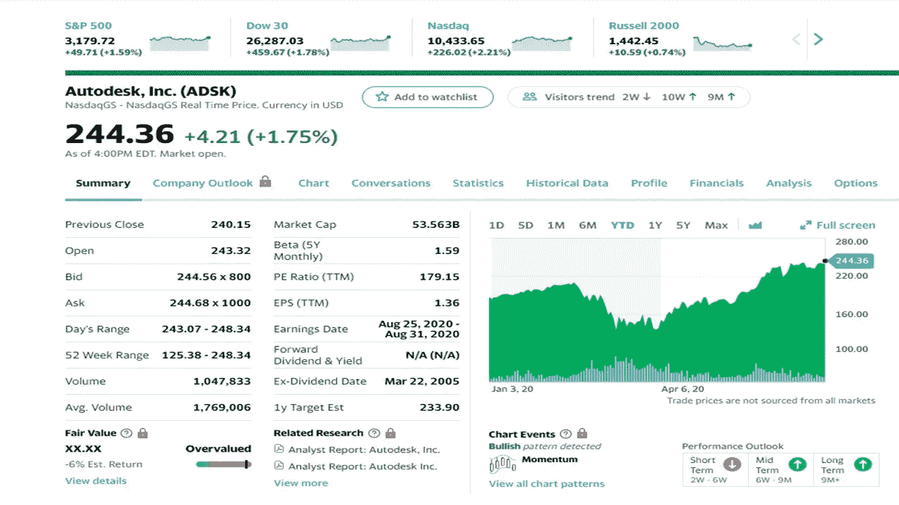
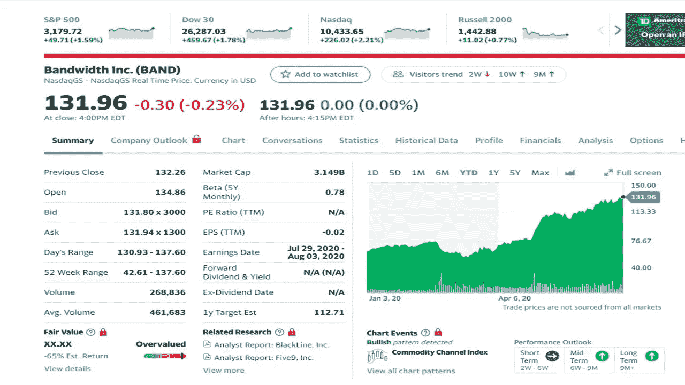
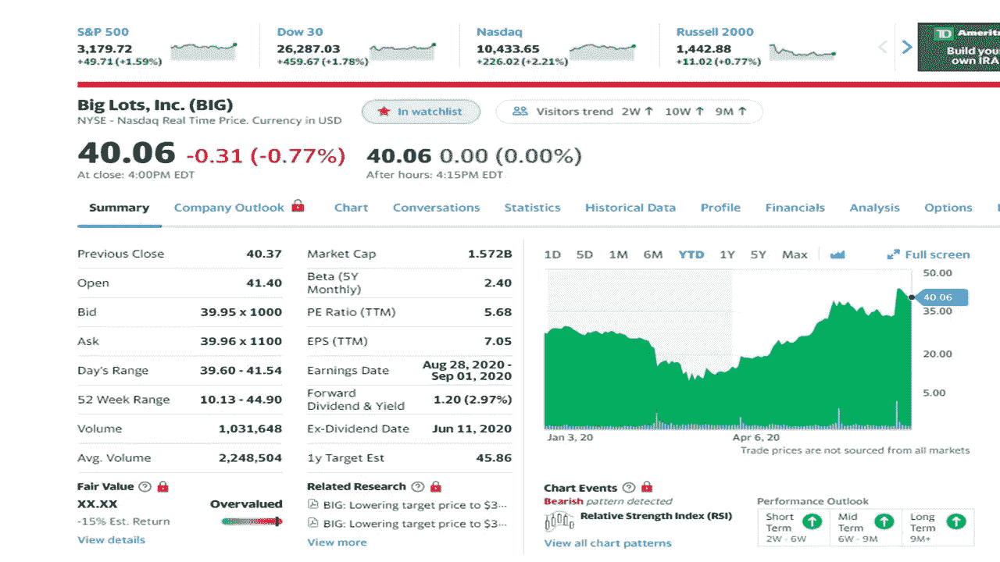
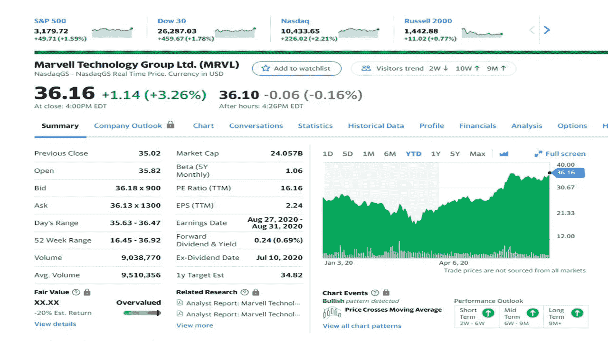
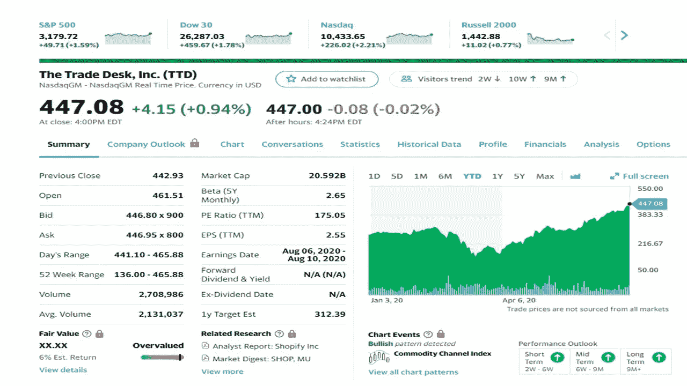

# 7 月份投资的最佳股票

> 原文：<https://medium.datadriveninvestor.com/the-best-stocks-to-invest-in-july-87bfd16e5b90?source=collection_archive---------6----------------------->

## 2020 年五只股票跑赢大盘

Photo by [Brooke Cagle](https://unsplash.com/@brookecagle?utm_source=unsplash&utm_medium=referral&utm_content=creditCopyText) on [Unsplash](https://unsplash.com/s/photos/happy-person-and-stocks?utm_source=unsplash&utm_medium=referral&utm_content=creditCopyText)

随着我们步入 2020 年下半年，五只股票脱颖而出，可能成为你投资组合的一部分。这些不是你几乎每天都听到的热门股票，如 FAANG 股票、脸书、亚马逊、苹果、网飞或谷歌。这些股票在各自的经济领域中崭露头角，表现非常出色。

自 3 月 23 日低点和标准普尔 500 下跌 35%以来，股市一直在显著攀升。投资者也在弄清楚哪些好股票可以加入他们的投资组合。下面是五只在华尔街顶级股票中领先的股票。

反映的股价都是 7 月 6 日收盘时的。你看到的当前价格可能与我提供的不同。

 [## 对于投资者来说，房地产科技远远不止是一个智能家居|数据驱动的投资者

### 乍一听,“房地产技术”这个术语似乎非常适合超豪华的现代主义。我们…

www.datadriveninvestor.com](https://www.datadriveninvestor.com/2020/06/18/for-investors-property-tech-goes-far-beyond-a-smart-home/) 

# 欧特克公司

Yahoo Finance

建筑师、工程师和建筑专业人员使用 AutoCAD 创建精确的 2D 和 3D 图形。Autodesk 是 3D 设计、工程和娱乐软件领域的领导者。这种软件也用于制作电影、视频游戏，并且是这一领域世界上最大的公司之一。Autodesk 运行在苹果和微软的 Windows 电脑和移动系统上。
即使在 corona 病毒期间，随着越来越多的员工转向云服务，这家公司也没有倒下。几年前，Autodesk 开始致力于一项基于订阅的服务，并在他们的数字中显示出来。上个季度，Autodesk 报告收入增长 20%，订阅增长 35%。他们的现金流达到了令人印象深刻的 3.07 亿美元，客户收入保持了两位数的增长，订阅续订也很强劲。第二季度受到了冠状病毒的轻微打击，但该公司预计会迅速复苏。未来看起来非常强劲，因为现金流预计将在 2022 年达到 24 亿美元，强劲的经济复苏可能会使这些数字更高。

# 带宽(波段)

Yahoo Finance

这家公司可能是市场上增长最快的股票之一。该公司是为 Zoom、RingCentral、Microsoft、GoDaddy、Skype 和 Google 等公司提供移动通信支持的平台，这些公司都是在该公司的 Bandwith 平台上构建的。该公司也是唯一一家拥有第 1 层网络的公司，该网络为客户提供了更多控制，并且带宽可以在需要时增加容量。带宽看起来很有吸引力，因为他们按使用量收费，更多的使用意味着更多的收入。所以这家公司随着客户的增长而增长。第一季度对公司没有太大影响，市场可能有利于移动用户。该公司的增长仍在继续，由于冠状病毒的影响，该公司的增长可能会有所延迟。总的来说，该公司将继续成为一家增长型公司，因为未来的数字将非常强劲。

# 大批量(大)

Yahoo Finance

尽管冠状病毒给许多企业带来了问题，但在此期间，许多企业表现良好。疫情期间，大批量商店开门营业，他们报告了较高的可比商店销售额和强劲的在线销售额(+45%)。强劲的数据可能会导致股价上涨。该公司试图给股东带来更多的价值，因为他们在董事会中增加了两名成员。第二，该公司正在努力通过其价值 5.5 亿美元的四个分销设施的销售/回租交易进行转型，以提高导致股票回购的流动性，并维持其 2.5%的股息。管理层在 6 月份有好消息，因为他们提高了第二季度的前景。该公司的运营情况好于预期，预期收益将从每股 84 美分增加到 2.50 美元。管理层暗示，他们的实力在所有商户类别中都可以看到，7.2 亿美元的流动性向股东返还了更多现金(回购)。大批量的持续增长趋势是可以预期的。

# Marvell 技术(MRVL)

Yahoo Finance

公司需要转型以保持相关性。借助 Marvell 技术，他们做到了这一点。他们从芯片制造商转变为数据基础设施供应商，其芯片迎合了各种增长趋势，如数据中心解决方案、企业和运营商网络、高级汽车产品、无线连接和各种存储网络产品。电晕病毒增加了对这家公司的云数据中心和 5G 产品的需求。随着经济的重新开放和高级 RISC 机器(ARM)服务器芯片需求的增加，这一趋势应该会继续下去。5 月份的第一季度报告超出预期(销售额增长 5%，收益增长 13%)。分析师预计，随着云收入在该公司历史上首次达到 10%，还会有更多季度的加速增长。总体网络收入比上一季度增长了 10%以上，预计还会更高。随着 5G 需求的回升，无线基础设施受益，尽管行业出现了一些问题。从 4G 到 5G 的过渡存在一些成长的烦恼。分析师预计 2020 年的收益率为 44%，明年为 48%。漫威的未来一片光明。

# 贸易台(TTD)

Yahoo Finance

随着技术的不断变化，Trade Desk 站在了帮助广告技术公司的最前沿。该公司是为代理商及其广告商提供最佳广告展示技术的领先公司之一。交易台位于流媒体领域，是包括亚马逊和迪士尼在内的主要网络的互联电视(也称为 CTV)广告印象的最大捐助者。最近的关闭加速了向 CTV 的过渡，同时改变了媒体格局，并在这一方向推动了更多的广告。该市场预计将在 2020 年超过传统电视，达到 8000 万美国家庭。多年来，随着广告购买，交易台一直在增长。在第一季度，销售额上升了 33%，每股收益上升了 84%。电晕病毒减少了一些类别的广告支出，如汽车、时尚和旅游，而健身、技术、教育和园艺的销售更强劲。政治广告支出也在上升，因为今年是选举年。与病毒相关的广告购买可能会有所回落，但大投资者认为交易台是今年剩余时间的一个增长故事。这家公司的长期前景是光明的。

看看我过去的股票文章。

 [## 6 月份投资的最佳股票

### 五只股票跑赢市场

medium.com](https://medium.com/datadriveninvestor/the-best-stocks-to-invest-in-june-9eb92961bf6d)  [## 5 月份投资的最佳股票

### 当前市场表现良好的五只股票

medium.com](https://medium.com/datadriveninvestor/the-best-stocks-to-invest-in-may-4ce67f9c71d2)  [## 我是如何在不到 10 年的时间里把 166 美元变成 6 位数的？

### 我达到六位数的大纲

medium.com](https://medium.com/makingofamillionaire/how-did-i-turn-166-into-six-figures-in-less-than-10-years-972d901891d2)  [## 在此股票市场中使用美元平均成本

### 给普通人的简单建议

medium.com](https://medium.com/@tomhandy1/tips-for-the-new-stock-investor-141e0e85a329) 

作者在他的投资组合中拥有 BIG 的股票。

汤姆·汉迪(Tom Handy)是 Medium 的顶级投资和比特币作家，也是两个孩子的父亲。他从军队退役，并在几个非营利委员会任职。汤姆是他所在社区的顶级 Yelper，也是谷歌的顶级向导。他出现在几个社交媒体频道上，你可以在 Twitter [@tomhandy1](http://twitter.com/tomhandy1) 和 Instagram [@tomhandy1](http://twitter.com/tomhandy1) 上找到他。

本文仅供参考。不应将其视为财务或法律建议。并非所有信息都是准确的。在做出任何重大财务决定之前，请咨询财务专家。

**访问专家视图—** [**订阅 DDI 英特尔**](https://datadriveninvestor.com/ddi-intel)