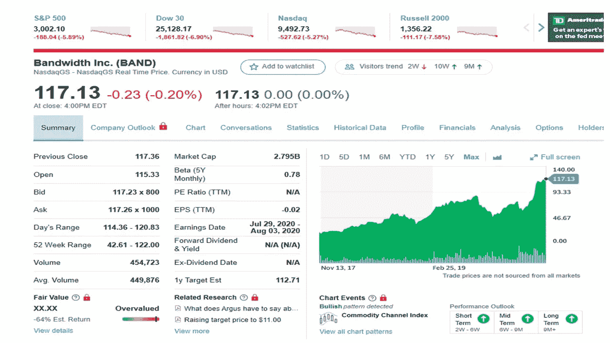
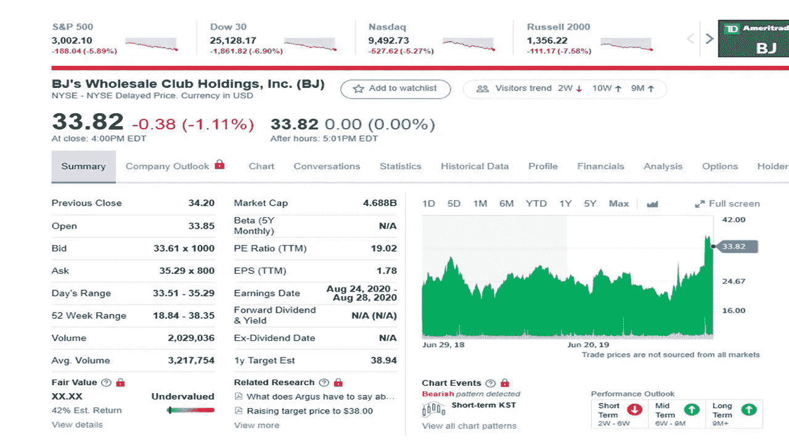
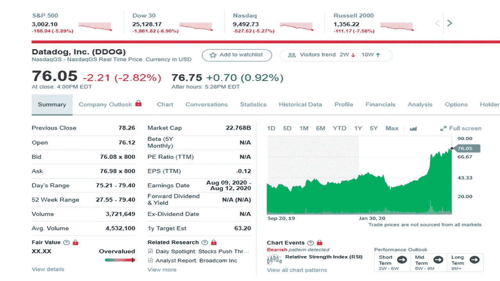
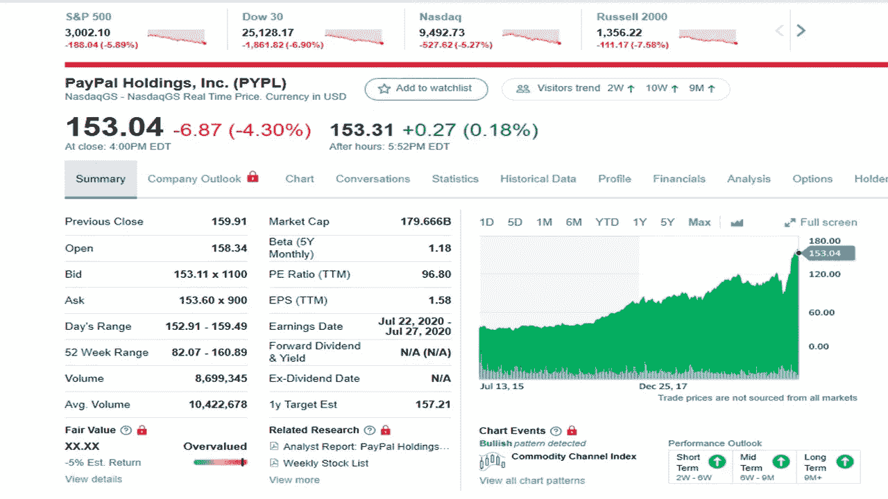
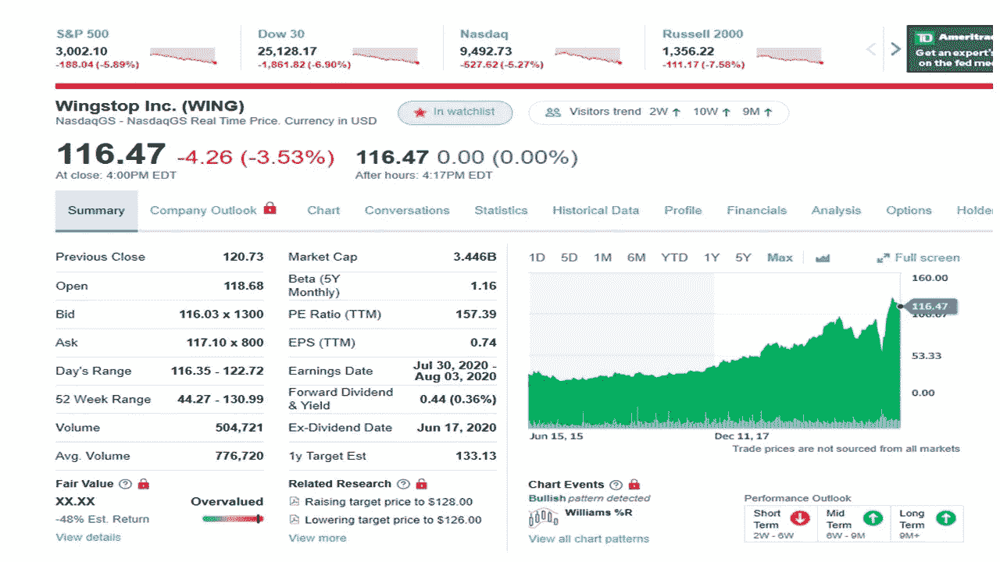

# 6 月份投资的最佳股票

> 原文：<https://medium.datadriveninvestor.com/the-best-stocks-to-invest-in-june-9eb92961bf6d?source=collection_archive---------7----------------------->

## 五只股票跑赢市场

Stock investment photo by [Burak Kebapci](https://www.pexels.com/@weekendplayer?utm_content=attributionCopyText&utm_medium=referral&utm_source=pexels) from [Pexels](https://www.pexels.com/photo/black-blue-and-red-graph-illustration-186461/?utm_content=attributionCopyText&utm_medium=referral&utm_source=pexels)

新的一个月即将到来，股市继续上涨，一些股票表现出色。在 2 月份股市强劲开局后，五周的动荡使股市下跌了 35%，3 月 23 日达到低点。

一些股票濒临破产，而另一些则创下历史新高。

这些高性能股票中有几只值得一看，并可能把它们加入你的投资组合。

如果你没有股票经纪账户，你可以注册 Webull。Webull 目前正在开展一项促销活动，以释放库存。开户可以获得一份免费股票，存款 100 美元可以获得另一份。你可以在这里报名[。我会在这篇文章](http://bit.ly/WebullInvitation)中介绍更多关于[的细节。](https://medium.com/@tomhandy1/how-to-use-the-webull-trading-app-3b9c8b428247)

这些不是你的 FANG 股票、脸书股票、亚马逊股票、网飞股票或谷歌股票。所有这些公司都在各自的领域采取行动。

 [## 投资区块链前要问的三个简单问题(也是一个困难的问题)|数据…

### 现在是了解区块链的最佳时机。不同货币之间的增长率，比如…

www.datadriveninvestor.com](https://www.datadriveninvestor.com/2020/03/12/three-simple-questions-and-one-difficult-one-to-ask-before-investing-in-a-blockchain/) 

所有这些股票在 3 月份的下跌中都有所下跌，但都出现了良好的反弹。这五只股票中，有一只是分红股票。

按字母顺序排列，这五只股票值得你参考。

# 带宽(波段)

2020 年 6 月 11 日收盘时为 117.13 美元

Yahoo Finance

在电晕病毒期间，这家安静的股票公司一直是其他受欢迎公司的背后力量，如 Zoom、微软、Ring Central 等。这家公司可能是其他公司的关键连接器，因为随着人们在家工作和学生使用 Zoom 或微软团队，更多的带宽被使用。增加的用户数量需要增加 30%的使用量和线路。带宽能够应对这一挑战，并将容量增加了一倍。因此，随着收益出现盈余，第一季度收入增长了 29%。3 月份，客户增长了 35%，使用量增长了 66%。该公司的资产负债表令人印象深刻，因为他们有 4.29 亿美元的现金头寸和零债务。预计这家公司将继续保持强劲增长。

# 北京批发俱乐部(BJ)

2020 年 6 月 11 日收盘时为 33.82 美元

Yahoo Finance

BJ 主要在东北部的几个地方，你可以把它们和山姆或者好市多比较。该公司多年来表现良好，但在电晕病毒期间，该公司在第一季度获得了巨大的回报。这种销售增长预计在不久的将来会持续下去。随着利润和现金流的增加，总销售额增长了 21%，在线销售额增长了两倍。与一年前相比，4 月份商店增长了 23%，顾客增加了 40%。管理层预计成员数量将在下一季度继续增长。就会员增长和商品销售而言，这是这项业务的一个强有力的指标。未来几年，这种增长可能会继续，而且有很多机会。该公司每家商店有 25000 名会员，而好市多每家商店有 65000 名会员。如果好市多增加门店数量和会员数量，股票会有很大的上涨空间。该公司预计明年将表现良好，分析师预计其利润将增长 52%。该公司今年表现良好，预计会持续下去。

# **数据狗(DDOG)**

2020 年 6 月 11 日收盘时为 76.05 美元

Yahoo Finance

Datadog 是应用性能管理(APM)和基础设施监控领域的两个新领导者之一(另一个是 Dynatrace ),这两个领域在今年都有大幅增长。DDOG 正从三月的下跌中看到一个不错的复苏。这家公司的需求非常高，因为大企业都依赖于新的基于云的应用程序。监控它们的性能以及维护它们的使用是一项巨大的任务。Datadog 能够为 IT 技术人员解决这个问题。收入增长了 80%以上，客户增长了 30%以上，这是一个压倒性的结果。大约 960 名新客户每年向 Datadog 支付 10 万美元，比 2019 年增长了 89%。由于病毒的原因，进一步的采用可能会放缓，但未来几年需求仍将保持强劲。DDOG 表现出色，由于股票交易员获利，5 月份略有下跌。在不久的将来，该股可能会继续走高。

# 贝宝支付

2020 年 6 月 11 日收盘时为 153.04 美元

Yahoo Finance

PayPal 是一个领先的数字支付系统，帮助数百万客户和商家轻松、安全地在线购买和销售，并通过其广受欢迎的应用程序 Venmo 在线转账。截至 3 月底，PayPal 拥有超过 3.25 亿个活跃账户，在第一季度，它们进行了 33 亿笔交易(增长 15%)，价值 1910 亿英镑(增长 18%)。由于企业最初在病毒期间被关闭，随着 PayPal 新用户的出现，该股正在复苏。4 月份，该公司每天新增 250，000 个账户(是一年前的两倍)，因为收入增加了 20%，商品总量大幅增加了 22%。5 月 1 日，PayPal 实现了有史以来最大的单日交易，超过了去年的黑色星期五或网络星期一。PayPal 预计今年将继续增长 12%，明年增长 23%，而较大的同行万事达卡(下降 16%)和维萨卡(下降 7%)将出现下滑。有一些风险，一些在线用户将回到实体商店，但新的贝宝用户仍将使用这一数字支付系统。PayPal 是一家长期稳定增长的公司。该股票正处于新的上升趋势

# 翼子板止动块(翼子板)

2020 年 6 月 11 日收盘时为 116.47 美元

Yahoo Finance

Wingstop 在病毒期间生意兴隆，因为这家千篇一律的餐厅看到越来越多的人订购他们的翅膀。该公司多年来一直在增长，并扩大了门店数量(截至 3 月份，共有 1413 家门店，比一年前增长了 11%)。除了 160 家商店和特许经营店，大多数都位于美国。商店的销售额也有类似的增长(美国为 12.2%)。从长远来看，该公司认为他们可以在全球拥有 6000 家商店(3000 家在美国，3000 家在海外)。该病毒几乎没有影响该公司，因为第一季度增长了 19%，美国商店销售额增长了 9.9%。在第二季度的前四周，销售额继续保持在 33%，主要是因为他们的平均交付和外卖订单从 80%增加到 100%，数字销售额增长了 25%。可比的同店销售将无法跟上，但 Wingstop 有着长期增长的故事，并且表现良好。随着时间的推移，公司越来越大，股票也会越来越多。

我鼓励你阅读这些其他的文章。

 [## 5 月份投资的最佳股票

### 当前市场表现良好的五只股票

medium.com](https://medium.com/datadriveninvestor/the-best-stocks-to-invest-in-may-4ce67f9c71d2)  [## 我是如何在不到 10 年的时间里把 166 美元变成 6 位数的？

### 我达到六位数的大纲

medium.com](https://medium.com/makingofamillionaire/how-did-i-turn-166-into-six-figures-in-less-than-10-years-972d901891d2)  [## 成为百万富翁的五个步骤

### 遵循这些步骤，让你的梦想成为现实

medium.com](https://medium.com/makingofamillionaire/five-steps-to-become-a-millionaire-19478338e333) 

本文作者并不拥有这些股票，但他是自己孩子账户的托管人，他在该账户上购买了永安的股票。

[**汤姆·汉迪**](https://medium.com/@tomhandy1) 是 Medium 上顶尖的投资和比特币作家，也是两个孩子的父亲。他从军队退役，并在几个非营利委员会任职。汤姆是他所在社区的顶级 Yelper，也是谷歌的顶级向导。他出现在几个社交媒体频道上，你可以在 Twitter[*@ tomhandy 1*](http://www.twitter.com/tomhandy1)*和 Instagram [@tomhandy1](http://www.instagram.com/tomhandy1) 上找到他。*

**本文仅供参考。不应将其视为财务或法律建议。并非所有信息都是准确的。在做出任何重大财务决定之前，请咨询财务专家。**