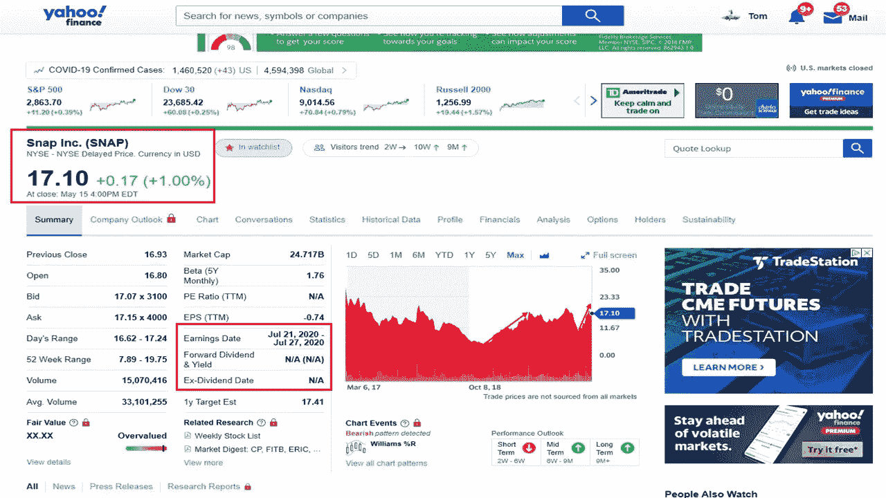

# 5 月份投资的最佳股票

> 原文：<https://medium.datadriveninvestor.com/the-best-stocks-to-invest-in-may-4ce67f9c71d2?source=collection_archive---------14----------------------->

当前市场表现良好的五只股票

Photo by [Chris Liverani](https://unsplash.com/@chrisliverani?utm_source=unsplash&utm_medium=referral&utm_content=creditCopyText) on [Unsplash](https://unsplash.com/s/photos/stock?utm_source=unsplash&utm_medium=referral&utm_content=creditCopyText)

由于冠状病毒和中东石油危机，股票市场在 2020 年大幅下跌，但一些股票却逆势而上。

所以不要认为股票会跌到零。大多数股票不会，但有些可能会。这时你需要做功课，分析这只股票是否能挺过当前的市场崩盘，几年后还能活着赚钱。

我没有水晶球，也不能给你应该买这只股票还是那只股票的理财建议。

不过，我会给你一些确凿的事实，然后由你来决定。

有许多股票表现良好，但我只会挑选五只股票。由于冠状病毒和在公共场所购物的限制，许多人甚至做得更好。这些公司更容易提高他们的网上形象。

# **2020 年跑赢大盘的五只股票**

# 耐嚼的

这家公司成立于 2010 年，除了 Chewy 专注于 per 市场之外，它可以与亚马逊相提并论。在 5 月 15 日收盘时，朱威以 42.11 美元的价格交易。该公司提供宠物食品、零食、玩具、用品、药物和保健品。Chewy 为各种宠物提供服务，包括狗、猫、鱼、鸟、马、爬行动物和小宠物。他们的服务可以在他们的网站【www.chewy.com 上找到。他们提供来自 2000 家合作伙伴的 60，000 多种产品。耐嚼是抗衰退的。从 2008 年到 2009 年，他们的销售额稳步增长。Chewy 正在努力增加在线销售，因为他们的在线销售额占 25%，高于 2017 年的 14%。随着在家订单和检疫，更多的人比以前在网上购物。该公司还有一个自动发货项目，该项目占其第一季度 1，300 万买家销售额的 70%。他们的收入出现赤字，但冠状病毒增加了公司的销售额。分析师预计今年收入将增长 34%，2021 年增长 24%。

Photo by Kim Hester at Pixaby

# 新港矿业公司(NEM)

贵金属通常在经济不景气时表现良好。有一家公司脱颖而出，那就是新港矿业公司。自从他们在 2019 年收购 Goldcorp 以来，这家公司是世界上最大的黄金生产商。5 月 15 日收盘时，新港矿业的交易价格为 67.90 美元。该公司还支付股息。这家公司从事多种金属的生产和勘探，包括金、银、铜、锌和铅。该公司在美国、加拿大、墨西哥、澳大利亚、多米尼加共和国、秘鲁、阿根廷、苏里南和加纳开展业务。该公司成立于 1916 年。该公司认为，其成本削减和债务减少将有助于他们应对黄金和其他金属价格上涨的巨大可能性。纽波特矿业被视为投资黄金的首选。

# 奥克塔(奥克塔)

随着金融公司和投资者获得回报，Okta，Inc .在疫情期间创下历史新高。5 月 15 日收盘时的股价为 181.60 美元，这家网络安全公司才刚刚起步。安全公司支持企业，因为员工可以安全地访问他们的计算机系统。他们的多因素身份认证允许用户访问云、移动和公司应用程序。Okta 有助于防止黑客入侵，提供最先进的计算机安全。该公司收支平衡，但他们的现金流很健康(2019 年为 6%)。过去五个季度，销售额增长了 45%至 50%。预计未来三年的平均增长率为 30%至 35%。Okta 成立于 2009 年。

# 捕捉(捕捉)

随着脸书和 Instagram 将 stories 功能添加到其武库中，SNAP 一度失去了关注。随着全球范围的增长将用户吸引到这个社交媒体平台，SNAP 仍然保持着自己的粉丝群。该网站仍然吸引着青少年和成年人，因为他们在第一季度有令人印象深刻的数字。5 月 15 日收盘时，SNAP 的股价为 17.10 美元。SNAP 的数字比一年前增长了 20%，达到 2.99 亿，第四季度创建了 40 亿个“快照”。因此，第一季度收入增长 44%，北美增长 40%，欧洲增长 61%，世界其他地区增长 49%。SNAP 还实现了第一季度的正运营现金流。在电晕病毒期间，从 1 月到 3 月，该平台有 30%的跃升。SNAP 的增长始于 2019 年底。SNAP 成立于 2010 年。

# Veeva 系统公司(VEEV)

最后一只股票是我开始写这篇文章之前从未听说过的公司。VEEV 是一家云软件公司，由于冠状病毒，主要是在医疗行业，该公司的业务正在激增。VEEV 帮助制药公司管理生命科学领域的临床试验数据。该公司在冠状病毒期间向制药销售代表免费提供其软件，以实现与医生的远程联系。5 月 15 日，VEEV 的股价收于 200.43 美元。这些公司的收入持续增长，预计未来几年至少会持续到 2024 年。2019 年客户数量增长 20%，上一季度收入增长 34%。股价从 2016 年开始稳步上涨。VEEV 成立于 2007 年。

作者目前拥有 Chewy 和 SNAP 的股份，并不直接隶属于这些公司。

[**汤姆·汉迪**](https://medium.com/@tomhandy1) 是 Medium 上顶尖的投资和比特币作家，也是两个孩子的父亲。他从军队退役，并在几个非营利委员会任职。汤姆是他所在社区的顶级 Yelper，也是谷歌的顶级向导。他出现在几个社交媒体频道上，你可以在 Twitter[*@ tomhandy 1*](http://www.twitter.com/tomhandy1)*和 Instagram [@tomhandy1](http://www.instagram.com/tomhandy1) 上找到他。*