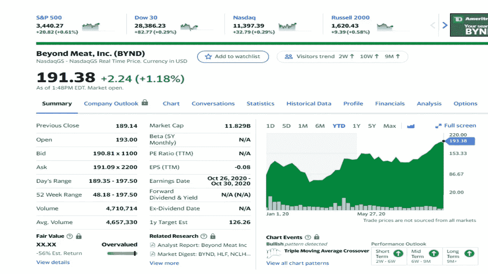
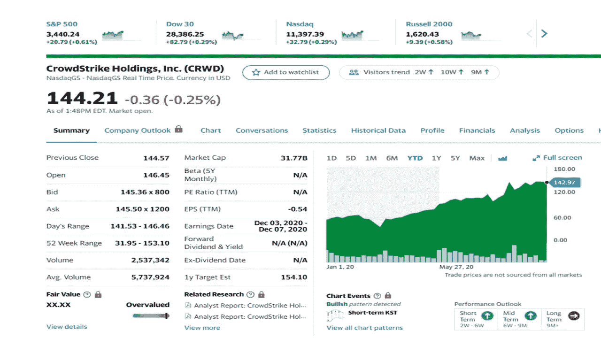
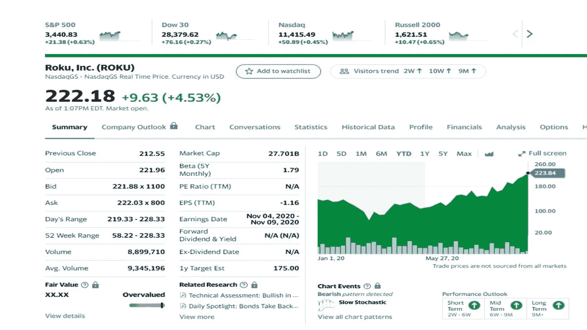
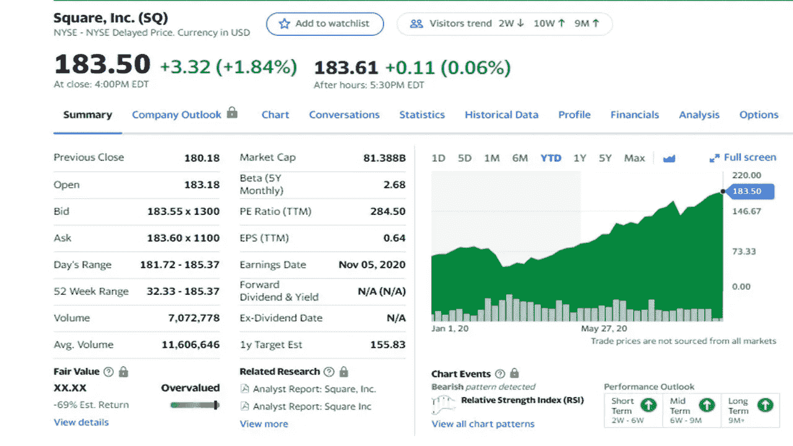
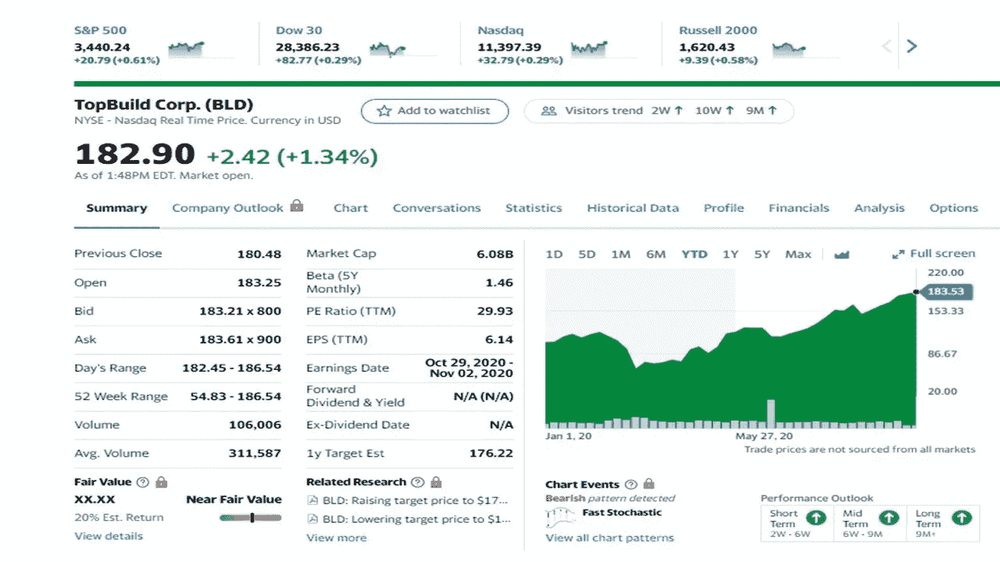

# 10 月份投资的最佳股票

> 原文：<https://medium.datadriveninvestor.com/the-best-stocks-to-invest-in-october-227f26bbabed?source=collection_archive---------22----------------------->

## 十月的阵雨带来五月的鲜花。这些股票也是如此吗？

Photo by Andrea Piacquadio from Pexels4

从最近的回报来看，这些股票在 10 月份及以后都会有不错的表现。随着市场在过去一个月出现小幅回调，这五只股票已经从 3 月份的低点上涨了一倍多，并继续走高。这些股票是在市场的不同部门，他们可能是你想保持关注的股票，并可能添加到你的投资组合。

除了每个月买东西，付账单，投资需要成为每月习惯的一部分。投资不一定要有钱。如今，任何人都可以每月只花几美元进行投资。各种投资平台提供零佣金，如 Webull、查尔斯·施瓦布、Etrade 等。

经历了股市动荡的一年，你可能听说过这些表现非常好的股票。这五只股票是:

*   **超越肉(BYND)**
*   **人群罢工(CRWD)**
*   **罗库(ROKU)**
*   **正方形**
*   **顶部构建(构建)**

股票价格记录在 2020 年 10 月 8 日收盘时。

# 超越肉类(BYND)

Yahoo Finance

这家公司在股票发行和股价最初起飞之前获得了很多关注。价格下跌后，股价接近一年前的高点。Beyond Meat 出售许多餐馆、杂货店和便利店都有的植物性肉制品。该公司预计将继续增长，因为他们计划在本月某个时候提供肉丸，向中国扩张，并在市场上增加一个电子商务网站。

**分析。与其他公司一样，随着冠状病毒开始在美国传播，Beyond Meat 在 Q2 的股价也下跌了。由于零售和直接面向消费者的销售增长(190%)，预计该公司第三季度的收入将会有所增长。在不久的将来，随着越来越多的商店提供肉类以外的商品和销售的继续，预计库存将会增加。**

# 人群罢工(CRWD)

Yahoo finance

这家美国公司在全球范围内提供基于云的服务，因为他们在美国、澳大利亚、德国、印度、罗马尼亚和英国提供服务。随着越来越多的人在家工作，网络安全比以往任何时候都更有必要。CrowdStrike 最近收购了 Preempt Security，这将加强其在个人身份安全方面的作用。

**分析**。该公司在向现有客户销售新产品的同时也在发展壮大。使用四个或更多模块的客户增加了 57%(比三年前增加了 17%)，使用五个或更多模块的客户增加到 39%。由于订阅量增加了 89%，收入增加了 1.04 亿美元。留存率非常可观，达到 98%。该公司正在成为推荐的选择，因为 100 家财富 100 强公司中有 49 家是它的客户。分析师预计第三季度增长 71%。

# 罗库

Yahoo Finance

Roku 是许多流媒体服务的网关，也是智能电视的主要操作系统。由于病毒和电影院关闭，越来越多的人在家，流媒体在 2020 年呈上升趋势。许多流媒体服务希望与 Roku 合作，这是这家公司的一大优势。

**分析**。该公司在 Q2 取得了巨大进步，新增了 320 万个账户，本季度末活跃账户达到 4300 万个(增长 41%)。Roku 部门的销量有所增长(增长 28%)。管理层表示，Roku 在第三季度继续保持强劲增长。股价正逼近其历史最高水平。

# 平方英尺

Yahoo Finance

如果你没听说过 Square，这家公司提供销售点解决方案和[支付](https://www.datadriveninvestor.com/glossary/payment/)系统。Square 系统包括各种产品，如便携式支付设备和支付解决方案。Square 加现金 App，一个[点对点借贷](https://www.datadriveninvestor.com/glossary/peer-to-peer-lending/)系统。客户可以向任何人发送和接收资金。这个平台允许你发送或接收工资支票和退税。一个额外的功能允许你投资你的钱在股票或比特币上。

**分析**。与一年前相比，Square 的收入增长了 361%，达到 12 亿美元。毛利增长了 167%。很大一部分增长是由比特币推动的，比特币的价格波动很大。随着业务的持续增长，支付额应该会继续增长并保持稳定。随着公司现金流的增加，收入将增长 30%以上。

# 顶层建筑

Yahoo Finance

这家美国公司为建筑行业安装和分销绝缘和建筑产品。房地产市场保持强劲，7 月份房屋销售达到 25%，同时对房屋建筑市场充满信心。该公司提供绝缘产品和服务。重点是单户和多户住宅建筑商、单户客户建筑商和承包商。

**分析**。分析师预计，增长将继续，结果将好于预期。到第三季度，今年的收益预计将继续增长 20%。该股在 5 月份反弹至新高，并继续呈上升趋势。这只股票是房地产市场的主要参与者。

**免责声明**:作者并不拥有这些股票中的任何一只，但作者的儿子自 Roku 首次公开募股(IPO)以来一直持有该公司股票。

 [## 你需要知道的五个九月投资的好方法

### 2020 年五只股票跑赢大盘

medium.com](https://medium.com/datadriveninvestor/5-great-ways-to-invest-in-september-you-need-to-know-4e56ac35131c)  [## 我是如何在不到 10 年的时间里把 166 美元变成 6 位数的？

### 我达到六位数的大纲

medium.com](https://medium.com/makingofamillionaire/how-did-i-turn-166-into-six-figures-in-less-than-10-years-972d901891d2) 

# 参考资料:

[卡伯特财富网](https://cabotwealth.com/)

[雅虎财经](https://finance.yahoo.com/)

[**汤姆·汉迪**](https://medium.com/@tomhandy1) 是 Medium 上的顶级作家，前 Quora 作家，也是两个孩子的父亲。他从军队退役，并在几个非营利委员会任职。你可以在推特 [@tomhandy1](https://www.twitter.com/tomhandy1) 上找到他。

本文仅供参考。不应将其视为财务或法律建议。并非所有信息都是准确的。在做出任何重大财务决定之前，请咨询财务专家。

