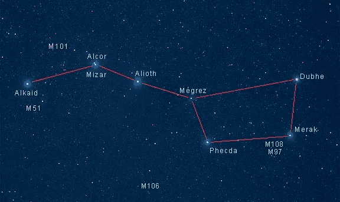
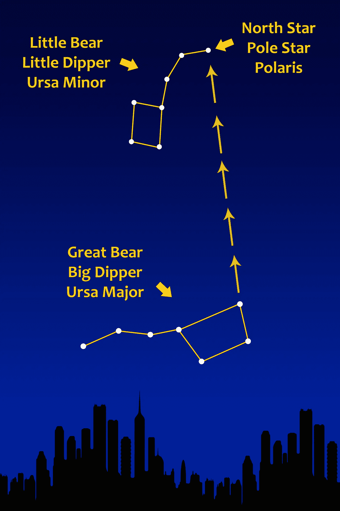

# 最佳教学技巧——从已知到未知

> 原文：<https://medium.datadriveninvestor.com/the-best-teaching-technique-from-known-to-unknown-2778cfd021a1?source=collection_archive---------7----------------------->

## 无论你是领导者、管理者还是专家，你都需要了解并运用这一技巧

Photo by [Robson Hatsukami Morgan](https://unsplash.com/@robsonhmorgan?utm_source=unsplash&utm_medium=referral&utm_content=creditCopyText) on [Unsplash](https://unsplash.com/s/photos/point?utm_source=unsplash&utm_medium=referral&utm_content=creditCopyText)

我过去常常从我在印度的许多朋友和亲戚那里得到这个问题，“我知道你搬到了美国，但是你到底住在哪里？”

这是很多年前的事了，那时谷歌地图的时代还没有到来。

兴奋之余，我曾经告诉他们我当时生活的城市的名字，“哦，我住在弗里蒙特。”

通常的反应是，“嗯，好吧，那在哪里？”

很快我意识到这不是告诉他们我住在哪里的正确方式。

然后我开始告诉他们，“你知道好莱坞和硅谷，对吧？我生活在好莱坞所在的同一个州。”

每个人都知道好莱坞。

然后他们会问，“哦，哇。你真的住在好莱坞吗？”

我希望我知道。

然后我会告诉他们，“不，好莱坞在洛杉矶。我住在旧金山附近。”

他们中的一些人熟悉技术世界，知道硅谷和旧金山。所以他们会问，“哇。你住在旧金山的什么地方？”

“不，不在旧金山。我住的地方离那里大约 40 英里，也就是 64 公里，大约相当于从浦那到洛纳瓦拉的距离。”

浦那是大多数这些朋友会去的地方，那是印度孟买附近的一个城市，而洛纳瓦拉是浦那和孟买之间的一个小山站。请注意，印度早已从以英里为单位测量距离转向以公里为单位测量距离。所以我会告诉他们距离是多少公里。

 [## 领导力。赢得|数据驱动型投资者需要更广阔的视角

### 不管他们愿不愿意，领导者都是快速运转的机器中的齿轮，这就要求他们夹住自己的爪子…

www.datadriveninvestor.com](https://www.datadriveninvestor.com/2020/02/07/leadership-it-takes-a-wider-perspective-to-win/) 

他们会回答，“好吧，现在我知道你住在哪里了。”

我从来没有告诉他们弗里蒙特的城市名称，但他们仍然会得到足够的关于我住在哪里的信息。

没有人知道弗里蒙特，但每个人都知道好莱坞，有些人还知道硅谷，他们知道印度著名的洛纳瓦拉山站。

当理解水平存在差异时，我们需要使用这种技术将某人从“已知”带到“未知”。

我们也称之为理解上的一致。

> 从已知走向未知的推理技术在梵语中被称为“Arundhati Darshana Nyaya”或简称为“Arundhati Nyaya”。

当你是一名经理、领导者或专家，你试图指导你的团队、新员工或实习生，或者向不熟悉你工作中术语的人解释时，首先去了解他们的水平是至关重要的，以便与他们进行正确的沟通。

无论谁处于更高的层次，都有责任降低到另一个人的层次来实现这一点。

之后，你需要一步一步的帮助他们，让他们明白你想要他们在哪里。

这种技巧在梵语中被称为 Arundhati Nyaya，并被遵循了几千年来教授印度教的吠陀经和奥义书。

## 阿伦达蒂·尼亚亚技术

在印度教的结婚仪式中，有一个叫做“萨普塔帕迪”的仪式，新婚夫妇绕着圣火走七圈，宣誓爱、责任、尊重、忠诚和富有成效的结合。

接下来是另一个仪式，新郎向新娘展示瓦希斯塔和阿伦达蒂的双星作为理想的一对，象征着婚姻的圆满和忠诚。这些是北方天空中由七颗星组成的著名北斗七星(大熊星座)的米萨星和阿尔科星对。米萨(在印度被称为瓦西塔之星)是北斗七星的一部分，而阿尔科尔(在印度被称为阿伦达蒂之星)是靠近米萨的一颗小星星。

**Image Credit: Jerry Lodriguss**

阿鲁迪哈蒂星非常微弱可见，如果你直接指向它，别人很难找到它。因此，这颗星是逐步显示的，首先显示北斗七星方向的树枝，然后是北斗七星中更亮的星星，然后缩小到北斗七星中的 Vasistha (Mizar)星，最后，相对于此，Arundhati (Alcor)星被指出。

正是基于这种仪式，从已知走向未知的推理技术在梵语中被称为“Arundhati Darshana Nyaya”或简称为“Arundhati Nyaya”。

达夏那的意思是看，在这个特别的参考文献中，尼亚亚的意思是一种方法。

## 寻找天空中的北极星——使用 Arundhati Nyaya

在我的童年，我总是对如何看到一颗名为 Dhruva star 的星星感兴趣，这是北极星的印度名字。

自从我发现如何定位它，我可以在几秒钟内做到这一点。

北极星位于小熊星座。我们从中衍生出一只熊的七颗星星也被称为小北斗七星。北极星位于北斗七星手柄的末端，北斗七星的星星相当暗淡。它的四颗最暗的星星可以被很少的月光或街灯遮住。

Image Credit: [https://kidspressmagazine.com/science-for-kids/misc/misc/locating-north-star-polaris.html](https://kidspressmagazine.com/science-for-kids/misc/misc/locating-north-star-polaris.html)

找到北极星的最佳方法是使用北斗七星、天鹰座和杜布星中所谓的“指针”星。只要在这两颗星之间画一条线，并把它延伸到双子星以外大约 5 倍，你最终会到达北极星附近。

这里，同样的 Arundhati Nyaya 可以帮助定位北极星，首先定位北斗七星，然后缩小到北斗七星外端的两颗星，最后指向北极星。

## 使用 Arundhati Nyaya 技术时要遵循的步骤

1.  承认是你有责任下台，去达到你在某件事情上指导的那个人的水平
2.  从他人的理解层面开始
3.  一次带他们走一步，确保他们理解每一步
4.  把他们引向终点，当他们有“啊哈”的时刻时微笑。

**进入专家视角—** [**订阅 DDI 英特尔**](https://datadriveninvestor.com/ddi-intel)