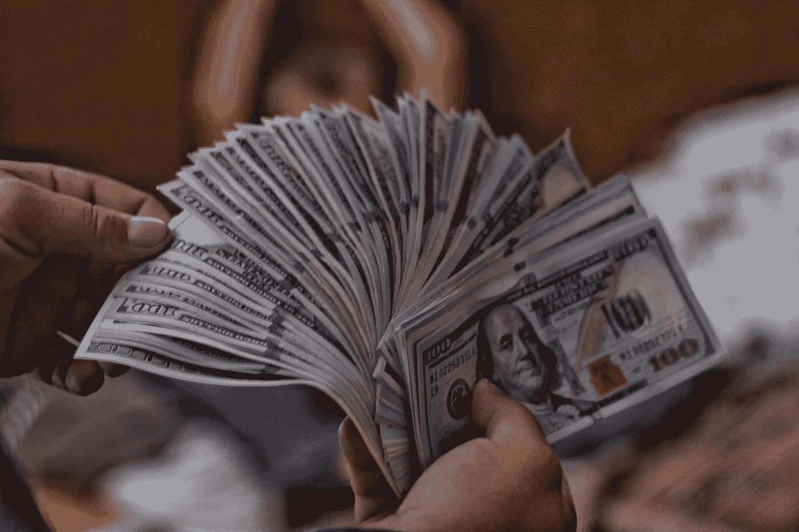
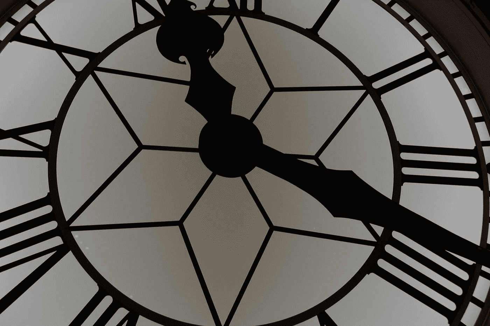

# 现在用你的钱做的最好的事情

> 原文：<https://medium.datadriveninvestor.com/the-best-thing-to-do-with-your-money-right-now-88ff449a4855?source=collection_archive---------30----------------------->

Photo by [Viacheslav Bublyk](https://unsplash.com/@s1winner?utm_source=medium&utm_medium=referral) on [Unsplash](https://unsplash.com?utm_source=medium&utm_medium=referral)

> 傻瓜们冲进天使们不敢涉足的地方
> 
> **——亚历山大教皇**

*现在经济中到底发生了什么*，我看到许多投资者犯的一个巨大错误是什么？

市场自 3 月份以来一直在复苏。在接下来的 12 个月、18 个月甚至 24 个月里，我将要告诉你的事情将会非常重要。

# 不要冲进去

作为一名财富策略师，我认识很多房地产和股市投资者。我每天都和他们说话。许多人急于参与进来并得到好的交易，但是朋友们，你必须聪明地对待这件事。现在看起来很划算的交易在六个月后可能会变得很糟糕。

如果你对你的行业里里外外都不了解，坐拥现金。我怎么强调都不为过。

# 似曾相识

2008 年，大多数人花了大约 6 个月的时间才意识到到底发生了什么。银行停止了贷款，但即使是正在获得贷款的人也花了很长时间才明白这一点。银行让人们等了几个月，说了一些诸如“我们只是需要多一点信息”之类的话。

想想吧。一家大银行，雷曼兄弟，倒闭了。这不是一朝一夕的事。在他们深陷其中无法自拔之前，这种情况可能已经持续了一年。

如果现在有一些很棒的交易出现在你面前，我的忠告是:**不要基于股权购买**——“哦，这栋房子以前值 40 万美元，我可以用 25 万美元买下来。”6 个月后，它可能值 175，000 美元。你只是不知道。

股票市场也是如此。它崩溃了，现在又反弹了，我们只是不知道接下来会发生什么。现在的机会是，如果你买了一支股票，它可能会下跌。

# 时机就是一切

Photo by [Jeanne Rouillard](https://unsplash.com/@quillofspirit?utm_source=medium&utm_medium=referral) on [Unsplash](https://unsplash.com?utm_source=medium&utm_medium=referral)

我们从未经历过这样的疫情。我们从未经历过世界市场和国家的关闭。我宁愿你现在错过一个机会(因为我向你保证，如果你抓紧你的现金，在未来的几个月和几年里会有一些真正的大机会),而不是在我们刚刚开始做这件事的时候分散自己的注意力。

# 在你等待全垒打的时候，让别人三振出局

现在外面是蛮荒的西部。很多甚至没有意义的事情都有可能发生，因为人会变得不理智。现在仍然有机会，但前提是你对你所在的领域非常了解。如果你不是，等待明显的本垒打，因为我向你保证他们会来。

如果你看不到在最糟糕的情况下事情会如何发展，那么[抓紧你的现金](https://medium.com/@biglifefinancial/the-1-thing-that-guarantees-financial-success-f40dc579587d)。**如果你会输，那就不要做。未来会有一个属于它的地方。**

现在，大量的傻瓜正在涌入。你已经花了很多时间来建立你所拥有的。不要因为“别人都在做”就丢掉它。在这个不确定的时代，未来属于那些深吸一口气，静观其变的人。

# 准备好学习终极金融“黑客”了吗？

从今天开始，学会“破解”财务确定性。遵循它的教导，你的生活将会发生巨大的变化。

[看看这里…](https://derickf9771b.clickfunnels.com/wwrd-book-offer5l0eez5m)

喜欢你正在阅读的东西吗？我也有一个 YouTube 频道，你可以 [***点击这里***](https://www.youtube.com/channel/UCizOCPJqijbE1y2o2ANSCag?sub_confirmation=1) *了解更多精彩内容！*