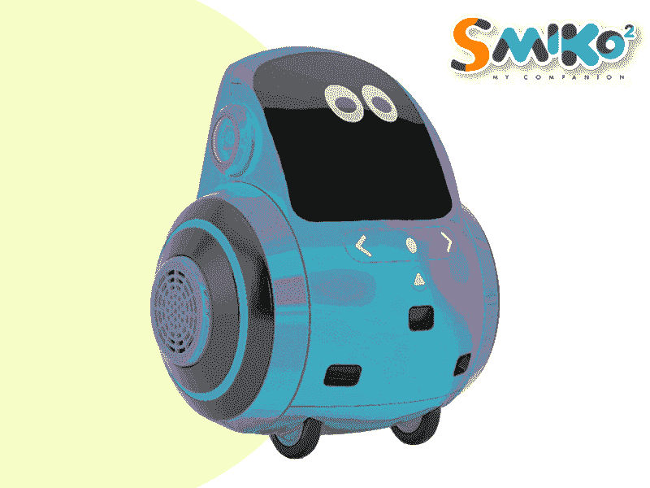
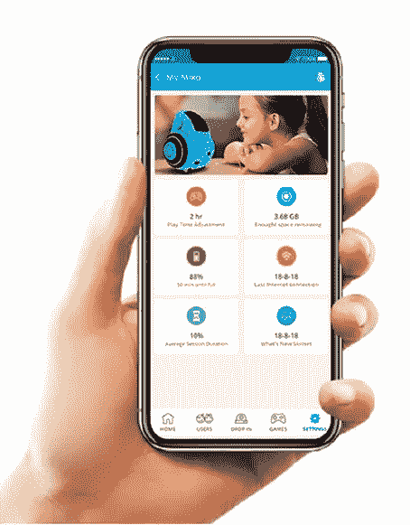
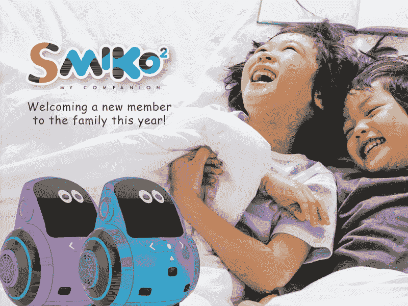

# 圣经是这样告诉我的…

> 原文：<https://medium.datadriveninvestor.com/the-bible-tells-me-so-44cb15012422?source=collection_archive---------9----------------------->

[*“温柔的人必承受地土，在丰盛的平安中喜乐……*](https://www.crosswalk.com/faith/bible-study/why-will-the-meek-inherit-the-earth.html)*”*

[**“蒙古宝宝？我仍然记得我妹妹在怀孕六个月时收到医生的判决时的震惊，接下来的几十年里，她参加了一系列特殊的课程，并为她患有“唐氏综合征”的孩子寻找合适的学习辅助工具而感到非常痛苦。**](https://www.reference.com/world-view/mongoloid-baby-e08cc2269c0946f7)


Pic Credit: Olesia Bilkei

在现代文化中,“温顺”这个词可能会让人联想到一个确实处于弱势的民族。然而，随着一个新的世界秩序从 2020 年的废墟中浮现，许多人可以将 AI 视为下一个救世主。

从智能辅导系统到视觉辅助器，再到教师和人工智能协作，AIML 的技术在教育领域掀起了风暴。虽然在这一领域不断进行广泛的研究，但其子类特殊教育还没有达到同样的高级发展阶段。

人工智能对需要特殊教育的儿童尤其有影响。这些孩子大多有一种学习障碍，因此他们在语言和交流等社交技能方面有一些障碍，或者他们在阅读、写作和数学方面有困难。

*通信设计师* ***埃坎莎·拉尔瓦尼&阿丽莎·卡纳尼****-*[*ISDI·帕森斯*](https://www.isdi.in/communication-design/)****【AIML |一个全新的世界】*** 在他们的研究过程中推测，并注意到教育部门正在开发的大多数 AIML 技术没有为教育/身体残疾者提供各种选择*

> *灵感:总部位于孟买的创业公司 Emotix 开发了一款小狗大小的儿童陪伴机器人 **Miko 2** ，它使用人工智能和语音识别技术来看、听、感觉、表达和说话。识别面孔。*

*应用同样的技术 ***埃坎莎·拉尔瓦尼&阿丽莎·卡纳尼*** *-* [*ISDI 帕森斯*](https://www.isdi.in/communication-design/)****(AIML |一个全新的世界)，推测出一个新的同伴‘斯米克’。*****

> ***关于互动机器人****Miko 2’****和它的创始公司 Emotix 的研究，沿着这些路线设计一个解决方案并创造一个类似于 Miko 的机器人是更合适和实用的，但具有专门为患有自闭症谱系障碍的儿童设计和瞄准的功能。***

****

*****Ekansha Lalwani & Aalisha Kanani*** — **SMIKO’** An Interactive Robot for Children with special needs.**

**SMIKO 是一个基于科学方法设计和制造的表情机器人，用于帮助患有自闭症和有特殊教育需求的儿童学习新技能。它是专为自闭症儿童设计的引人入胜且易于理解的工具。“SMIKO”可以显示面部表情、手势和肢体语言，还可以与儿童交谈。它不仅可以帮助孩子学习，还可以唱歌跳舞来娱乐孩子，还可以玩游戏和讲故事。它配备了摄像头、麦克风和扬声器，可以与人类互动。它还有一个 8 英寸的液晶显示屏作为面部，可以显示面部表情和情感。**

****SMIKO 可根据孩子的需求和行为进行个性化设置。**斯米克’**能说上 ***七种印度语言；英语、印地语、马拉地语、孟加拉语、泰卢固语、泰米尔语和古吉拉特语。*******

> **智能辅导系统已被证明在帮助教授某些学科方面是有效的，如代数或语法，但创建这些计算机化的系统是困难和费力的。现在，卡内基梅隆大学的研究人员已经表明，他们可以通过实际上教会计算机教学来快速构建它们。**

****

****工作方法:****SMIKO’采用互动教育方法，如游戏、角色扮演和社交叙事等，以有趣和吸引人的方式教授和练习新技能。****

******输出:**它用简单的口头语言与孩子交流。它还将谈话与在平板电脑上显示视觉刺激和图像结合起来，以确保儿童能够完全理解课程内容。****

****吸引力和激励:对于患有自闭症的儿童来说，注意力集中和参与涉及共同注意力的活动通常是具有挑战性的。**斯米克有一种吸引人的性格，能有效地吸引他们的注意力，并让他们保持参与。******

******持续和可预测:**通过展示持续的积极和耐心的态度，**SMIKO’**减少孩子的焦虑，让他们感到更加放松。机器人的可预测性给了孩子们安慰，防止他们分心。****

******家长控制:**它增强了家长/教师控制，他们可以更好地控制 **SMIKO 与您孩子的**互动。****

******儿童和数据安全:** Smiko 对儿童完全安全！您孩子的数据经过加密，受到全面保护。数据的所有权在你这个家长/老师手里。****

******Tele Connect:****SMIKO’**在您外出工作时，帮助您跟踪孩子的进步。人们可以通过视频通话，在工作时远程控制你的 SMIKO 与你的孩子通话。****

******数据收集:**由于 **SMIKO'** 是您孩子的伙伴， **SMIKO'** 可以记录和归档您孩子的数据，并提供关于进度和健康细节的个性化报告，这些报告可以与医生、专家和教师共享。数据将保存在 Smiko 应用程序上，并可以通过云共享。****

> ****一些技术和设计相关的变化，以确保机器人更适合患有自闭症和类似残疾的儿童。****

********

****Pic Credit: cristina-gottardi-zGlDzmQkL0Y-unsplash****

> ****了解到印度每 60 名儿童中就有 1 名被诊断患有自闭症谱系障碍(ASD)，我们的目标是找到一种解决方案，在日常生活中帮助他们，使他们更加独立，并帮助他们提高社交和沟通技能。至关重要的是，我们要牢记诸如可负担性、材料坚固性和可获得性等方面。****

********

*******Ekansha Lalwani & Aalisha Kanani*** — **SMIKO’** An Interactive Robot for Children with special needs.****

****[**老师和 AI 协作**](https://bernardmarr.com/default.asp?contentID=1541)****

****人工智能已经应用于教育，主要是一些帮助开发技能和测试系统的工具。随着人工智能教育解决方案的不断成熟，人们希望人工智能能够帮助填补学习和教学中的需求缺口，并允许学校和教师比以往任何时候都更好地帮助有特殊需求的儿童。****

****一个辅导系统需要学习每一种解决问题的方法。它需要学习如何解决问题，而不仅仅是如何解决问题。****

> ****基于人工智能的解决方案渗透到我们生活和做生意的方式中，关于道德、隐私和安全的问题也将出现。学生们进行了各种猜测和预测。 ***免责声明:*** *所有创意均为假设课堂项目。* ***版权所有— I S D I 2 0 20*******

*****创意导师:* [***乌特卡莎·马尔卡尔教授***](https://www.linkedin.com/in/utkarsha20/)****

*******ISDI 校区*** *印度设计学院&创新
ISDI 大厦，One Indiabulls Centre，
Senapati Bapat Marg，Lower Parel，
孟买 400013。一般查询:* [*查询@isdi.in*](mailto:enquiries@isdi.in) *投放&行业连接:* [*投放@isdi.in*](mailto:placements@isdi.in)****

```
******UTKARSHA M. |** Author | Design Thinker | Creator  - A desire to understand the world and to improve it always remains at the core. Design is a managed process and my quest for knowledge is subject to an inquiry of the apparent, the imagined and the recalled. As I speculate and design, my liberty of self-expression is in direct correlation to my existence and knowledge.
[**https://www.utkarshaofficial.com/**](https://www.utkarshaofficial.com/)****
```