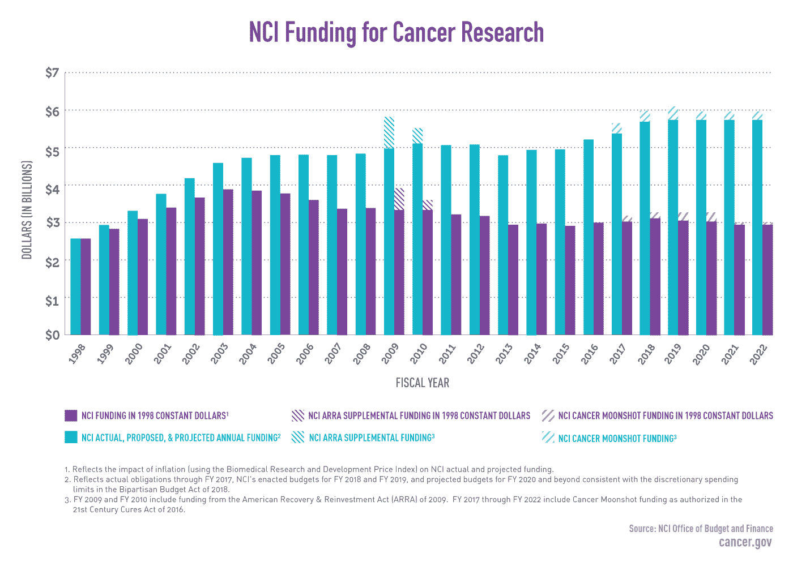
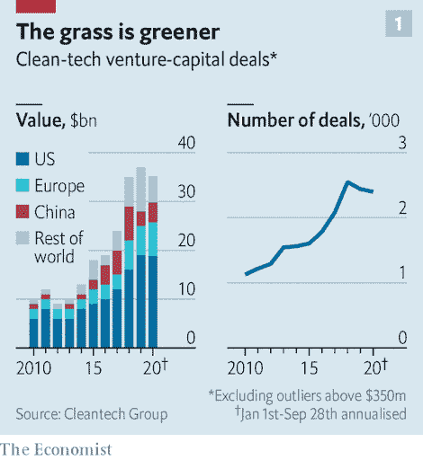
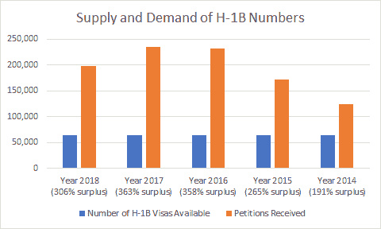
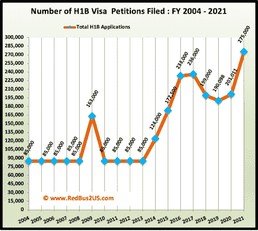
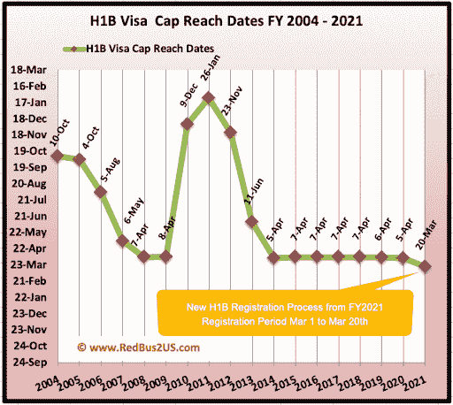
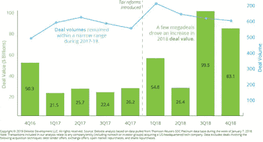

# 拜登任期——创业公司的 5 个关键变化

> 原文：<https://medium.datadriveninvestor.com/the-biden-presidency-5-key-changes-we-can-expect-for-startups-78ba488b0853?source=collection_archive---------18----------------------->

这不是一篇讨论政治的文章，任何不恰当的评论都将被删除。相反，这是一个关于美国当选总统乔·拜登的五项关键政策的数据驱动背景，以及它将如何影响初创公司。这些都是复杂的话题，一篇简短的文章无法做到公正，但希望它可以成为那些希望更深入探索的人的起点。

 [## 拜登任期-创业公司的 5 个关键变化|数据驱动的投资者

### 这不是一篇讨论政治的文章，任何不恰当的评论都将被删除。相反，这是一个数据驱动的…

www.datadriveninvestor.com](https://www.datadriveninvestor.com/2020/11/15/the-biden-presidency-5-key-changes-we-can-expect-for-startups/) 

癌症——拜登竞选时主张增加科学投资，并多次呼吁进行“癌症登月”随着美国的 covid 病例超过 1000 万，当选总统还承诺重建冠状病毒应对工作组。所有这些对于数字健康和生物技术企业家来说应该是一个巨大的推动，这并不奇怪。下面是国家癌症研究所过去 20 年的预算:

**2)大科技**——科技政策在这次选举周期中一直是一个较小的问题，未来几年最大的问题可能是反垄断法的改革。拜登的竞选纲领中，极左派呼吁拆分大型科技公司，转而支持监管。这可能意味着初创公司独立成功的空间更小，但也意味着它们合作和被收购的空间更大。不可否认的是，大型科技公司非常强大，而且在我们的经济中越来越强大，占据了 2020 年十大股票的大部分:

**3)气候变化**——拜登预计将大幅改变美国在气候变化方面的政策，包括重新加入巴黎协定。企业家对更多政府支持的前景感到兴奋，随着[风险投资在气候技术](https://www.economist.com/business/2020/10/29/climate-conscious-venture-capitalists-are-back)领域的回归，他们应该会做得很好，以保持以下图表的前瞻性:

从美国的角度来看，下图的数据来自欧盟全球大气研究排放数据库:

移民——拜登政府很可能会推动 H1Bs(临时工作签证)和绿卡(永久居留权)的发展，这意味着创业公司可以获得更多的技术人才。我们将通过关注 H1B 来说明这些趋势，H1B 是指有多少外国公民获得了在美国工作的授权。对于那些不熟悉这个过程的人来说，在很高的级别上，你的雇主必须担保你的申请，并且申请的数量历来远远超过每年的上限:

历史趋势是请愿数量稳步增加:

与此同时，达到 H1B 签证上限的时间越来越短:

**5)税收**——拜登承诺取消部分减税措施，有效地将公司税率从[目前的 21%降至之前的 28%](https://taxfoundation.org/joe-biden-tax-plan-2020/) 。利润更少的公司意味着创业成功的机会更多。这是否也意味着更少的并购，即更少的退出机会？德勤(Deloitte)的一项研究至少表明，减税并没有导致更多的科技并购。下图显示，2018 年的并购数量比 2017 年增长了 7%，如果不是因为 2018 年的一些大型交易，它将与 2017 年保持一致。

*原载于* [*数据驱动投资人*](https://www.datadriveninvestor.com/2020/11/15/the-biden-presidency-5-key-changes-we-can-expect-for-startups/) *，“我很乐意在其他平台上辛迪加。我是*[*Tau Ventures*](https://www.linkedin.com/pulse/announcing-tau-ventures-amit-garg/)*的管理合伙人和联合创始人，在硅谷工作了 20 年，涉足企业、创业公司和风险投资基金。这些都是专注于实践见解的有目的的短文(我称之为 GL；dr —良好的长度；确实读过)。我的许多文章都在*[*https://www . LinkedIn . com/in/am garg/detail/recent-activity/posts*](https://www.linkedin.com/in/amgarg/detail/recent-activity/posts/)*上，如果它们能让人们对某个话题产生足够的兴趣，从而进行更深入的探讨，我会感到非常兴奋。如果这篇文章有对你有用的见解，请在 Tau Ventures 的 LinkedIn 页面* *上对这篇文章和* [*给予评论和/或赞，感谢你对我们工作的支持。这里表达的所有观点都是我的 o*](https://www.linkedin.com/company/tauventures)

## 访问专家视图— [订阅 DDI 英特尔](https://datadriveninvestor.com/ddi-intel)