# 阿里巴巴电子商务系统背后的大数据平台

> 原文：<https://medium.datadriveninvestor.com/the-big-data-platform-behind-alibabas-e-commerce-systems-2c8a4d6cfe0d?source=collection_archive---------5----------------------->

*作者管涛。*

去年[双 11](https://www.alibabacloud.com/blog/double-11-is-the-proof-nothings-impossible_595589) 的商品总额(GMV)达到 2684 亿人民币，再创双 11 纪录。这篇文章揭示了先进的技术，这些技术让来自世界各地的用户可以通过阿里巴巴购物。具体来说，我们将讨论支撑阿里巴巴电子商务平台的大数据平台的发展。

 [## 大数据颠覆了我们所知的信贷应用|数据驱动的投资者

### 融合是金融领域的最新流行词，由于支付和贷款之间的关系，我们现在…

www.datadriveninvestor.com](https://www.datadriveninvestor.com/2020/03/19/big-data-disrupts-credit-applications-as-we-know-them/) 

在一场独家的大数据会议上，阿里云智能计算平台部门的研究员管涛谈到了阿里巴巴经济体大数据平台背后的建设和考虑因素。

# 我们对阿里巴巴大促的视角:双 11

关于双 11，你首先需要知道的是，这是阿里巴巴最大的一次线上促销。对于消费者来说，双 11 是一件只在一天内发生的事情，但它是一项长期的工程，需要一年的付出和策划，它影响着数百万平台商家的生活。从阿里巴巴的角度来看，关于相关业务和技术的大量思考和准备需要进入双 11。

我们从消费者、商品和地理位置的角度来看待双 11。首先，谈到消费者，在双 11 期间，我们需要了解哪些类型的消费者将在阿里巴巴的电子商务平台上浏览，他们有兴趣购买哪些类型的商品，并将看到哪些商品。在商品方面，商家需要知道双 11 活动期间什么商品会受欢迎，因为他们需要提前很久备货。地理位置的考虑在物流中最为突出，例如，货物需要预先存放的具体地理位置，以实现最佳的物流效率。有两件大事与我们上面提到的三个方面有着很深的联系。这两件事也是阿里巴巴电商平台竞争力的关键。首先是供应链。如果我们的供应链能够提前很长时间布局，并且具备必要的灵活性和精细化，那么对于平台上的品牌和商品的推广以及运行成本的降低都会起到重要的作用。第二件事是物流。几年前，每次双 11 都会让我们的仓库系统陷入崩溃状态。近年来，虽然采购量稳步上升，但零物流故障发生。阿里巴巴通过与商家合作，将消费者可能购买的产品部署在消费者附近的当地仓库，从而解决了这个问题。这是一个把几千万的产品和几十亿的消费者匹配起来的过程。

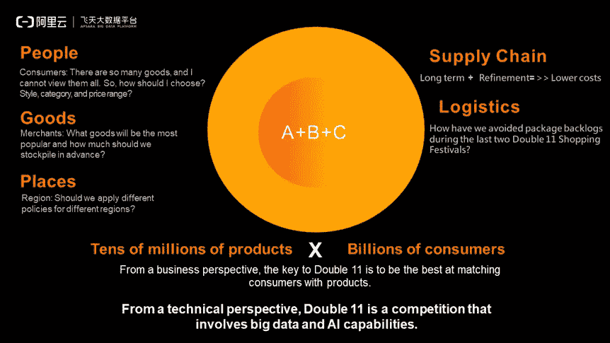

从技术上来说，这其实是一场涉及大数据和 AI 能力的竞争。为了在双 11 中取得成功，企业必须拥有预测不同类型的消费者将购买的产品的风格、类别和价格范围所需的数据、计算能力和算法。商家必须事先确定哪些商品可能畅销，以及应该储备多少这样的商品。与此同时，供应链必须确定实现最佳性价比所需的布局，然后将货物部署到当地仓库，让它们更靠近客户。这就是阿里巴巴的 A+B+C 的理念，这里 A 指算法，B 指大数据，C 指计算。在这个概念中，成功的关键是确保您拥有必要的数据量、算法质量和低成本的计算能力。所以，从技术层面和对参与企业来说，双 11 市场的竞争是参与企业大数据和 AI 能力的竞争。

下图是双 11 期间每天处理的数据量。2015-2019 年，双 11 日均数据处理量年均增长 70%左右。但是，这些数据量不仅仅需要在双 11 当天处理。事实上，从 9 月下旬到双 11，我们每天都需要处理大量的数据。运营人员、分析师、商家对这些数据运行细粒度的算法，实现数据挖掘和信息处理。这些准备让我们在双 11 实际当天达到最佳匹配性能。

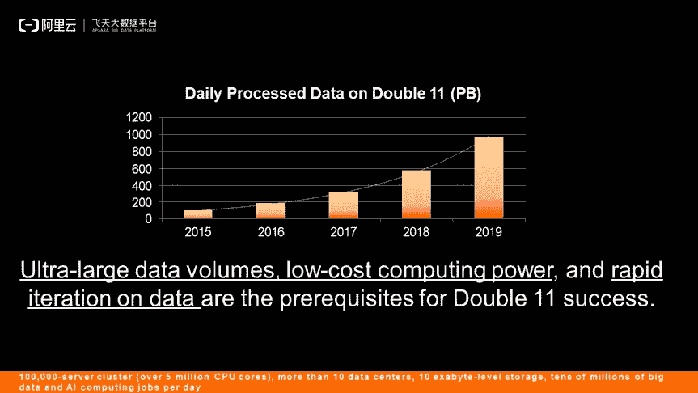

就涉及的具体技术而言，双 11 成功的必要条件有三个:海量的数据量、低成本的计算能力、快速的数据迭代。其中，最后一个条件值得特别关注。也就是我们要找到一种方法，让成千上万的算法工程师和数据工程师利用数据快速迭代。这和我们上面提到的数据量和计算能力一样关键。对海量数据卷进行快速迭代的能力，本质上是数据中端和数据开发平台的能力。

# Apsara 大数据平台的架构

下图是 Apsara 大数据平台的整体布局。如左侧所示，阿里巴巴的主要数据仓库位于 [MaxCompute](https://www.alibabacloud.com/product/maxcompute) 上。目前，该产品在全球 10 个数据中心拥有超过 10 万台服务器。阿里巴巴几乎所有的数据都存储在这里。MaxCompute 支持一组专有的 SQL 引擎和开源计算功能，如 [Spark](https://spark.apache.org/) 。除了主要的数据仓库和大数据计算，阿里巴巴还有一个基于 Flink 的流计算系统。为云服务提供完整的基于 Hadoop 的 [E-MapReduce](https://www.alibabacloud.com/products/emapreduce) (EMR)解决方案。下图中，左边的三个部分称为基本引擎。右边的引擎包括用于 AI 的[机器学习平台。左边的发动机与右边的分开是因为它们不在同一水平面上。PAI 作业可以在 MaxCompute、Flink 和 EMR 上运行。除了 PAI，阿里巴巴的大数据平台还包括 ho roles、Graph Compute 和 Elasticsearch。中间贯穿着一个集成的大数据开发平台 DataWorks。这将大数据开发和数据管道的建立整合到一个系统中。](https://www.alibabacloud.com/product/machine-learning)

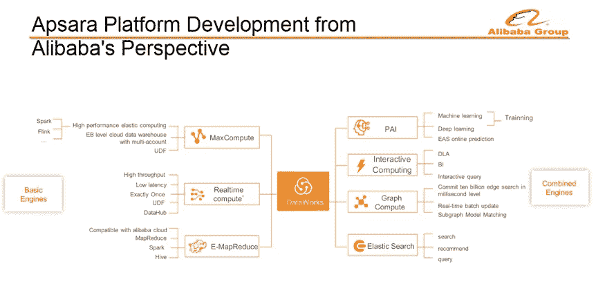

下面以 MaxCompute 为例，描述阿里巴巴经济体大数据平台的建设和考虑事项。

# 阿普萨拉平台的历史

从 2002 年开始，阿里巴巴的所有数据都存储在甲骨文数据库中。由于电子商务业务最初被归类为会计业务，因此它们的所有数据都存储在 Oracle 数据库中。当时，阿里巴巴拥有亚洲最大的甲骨文机架。在发现 Oracle 无法支持更高的计算能力后，阿里巴巴迁移到了 Greenplum。Greenplum 采用可扩展至 Pb 级的分布式体系结构。然而，不到一年，Greenplum 显然无法满足阿里巴巴业务运营的发展需求。因此，2008 年，阿里巴巴推出了 Hadoop 集群，这标志着阿里巴巴首次涉足大数据。阿里云成立于 2009 年，建立了 Apsara 品牌。当时在考虑要不要自己建一个 Apsara 系统的同时，一起启动了大数据引擎项目，分布式存储项目，分布式调度项目。2010 年，阿里巴巴发布了面向存储和计算的 MaxCompute 1.0。底层的数据基础叫做 Apsara 分布式文件系统，中间使用作业调度器来支持蚂蚁金服的小额贷款业务。2013 年，阿里巴巴开始在规模和可扩展性上达到一定水平，大概有 5000 台服务器。在这个关键时刻，阿里巴巴启动了一个名为“登月”的关键内部项目。这个项目要求所有阿里巴巴的数据都集中在一个系统中。所以我们讨论是用 Hadoop 还是我们内部的 Apsara 分布式文件系统+ MaxCompute 系统，最后决定用后者。2013 年到 2015 年，实现了一次完整的登月。2015 年，阿里巴巴用 MaxCompute 完全替代 Hadoop，基于 MaxCompute 和 DataWorks 构建了完整的阿里巴巴数据中端。2017 年，阿里巴巴认为是时候更新引擎了，于是我们发布了 MaxCompute 2.0，全面重构核心引擎。当时，单个集群可以扩展到数万台服务器，我们在全球有 10 多个数据中心。最近，阿里巴巴在 MaxCompute 上的工作包括性能改进和自动中端的发展，或者我们可以称之为自动数据仓库。

用几句话来总结 Apsara 平台的发展:回顾阿里巴巴过去十年的发展，我们看到对更大数据规模和更低计算成本的持续追求。接下来，我们还可以看到阿里巴巴从开源到内部解决方案的转变，现在又从内部回到开源解决方案，正如 Flink 最近的发展所示。我们也已经从数据库转移到数据仓库，或者转移到数据中端，现在又转移到自动数据仓库。最后，对于我们的数据湖，我们最初选择了 Hadoop 系统，但现在需要考虑如何将数据湖与数据仓库集成。

# 企业级计算平台面临的核心问题

企业级计算平台必须解决许多问题。第一个问题是我们需要可靠的数据交换点，这是一个相对简单但也非常普遍的问题。在这里，可靠性需要基本达到 100%，并且需要保证数据一旦存储在数据中心就绝不丢失。其次，我们必须在高性能和低成本之间取得平衡。除了发动机性能优化，还需要考虑存储。第三个问题是如何确保良好的数据管理、共享和安全。第四个问题是企业级的能力，比如如何实现企业级的自动化 O&M，第五，我们必须支持广泛的统一计算能力，包括批处理、流处理、机器学习、图计算和交互计算。第六个问题是如何拥抱和整合各种生态系统，包括自治系统和生态系统的整合以及数据湖和数据仓库的整合。第七个问题比较简单，就是开发语言和效率。弹性和可伸缩性是第八个问题。最后一个问题是如何提高大数据系统对 AI 能力的支持，以及我们是否可以利用 AI 能力来优化大数据系统。

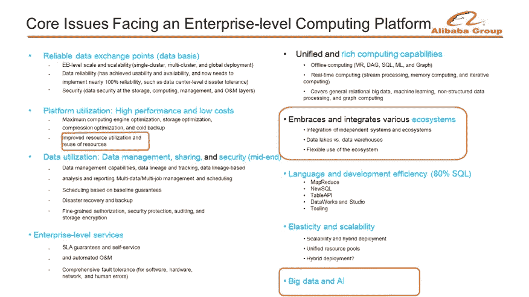

# 性能和效率优化

**阿里巴巴面临与业绩和效率相关的四大挑战:**

1.  当服务器数量超过 10，000 时，成本将继续增加。因此，云中大规模客户的成本要求至关重要。
2.  阿里巴巴的数据和计算能力增长非常快。看双 11，数据处理的年增长率在 70%左右，但我们每年增加 70%的硬件投入是不可能的。因此，有必要打破数据和计算能力增长之间的线性关系。
3.  目前，技术发展已经进入开放源码软件没有覆盖的领域。一般开源软件无法满足超大规模应用的要求，需要我们自己解决这个问题。
4.  我们发现了大量的小型集群，但无法在它们之间实现负载平衡。所以我们需要解决使用很多集群时利用率低的问题。

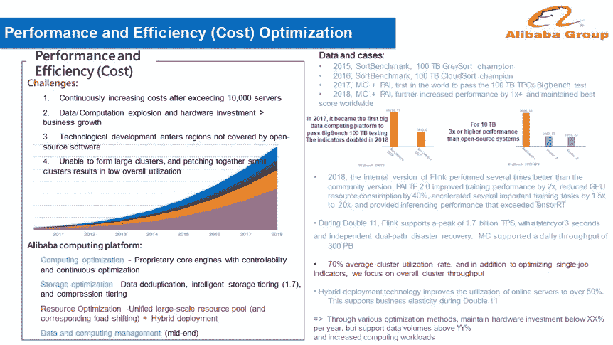

为了应对这些问题和挑战，我们可以优化计算、存储和资源。这里我们重点关注资源优化，也就是混合部署。需要注意的是，阿里巴巴在考虑资源优化时，并不是考虑单个作业的成本和效率，而是注重提高整个集群的利用率。阿里巴巴设定了将集群利用率提高到 60%以上的强制目标。

双 11 当天，流量一开始就出现秒杀。这个峰值可能一年只出现一次。到凌晨 02:00 左右，客流量降至较低水平，因为在第一波购物后，所有人都已上床睡觉。然后，早上大家睡醒后流量又上升了。考虑到所有这些，阿里巴巴需要准备多少服务器来满足我们的要求？如果我们只考虑峰值，我们一半的服务器几乎总是空闲的。如果用平均值做计划，高峰时段用户请求可能会失败，导致双 11 期间用户体验不佳。

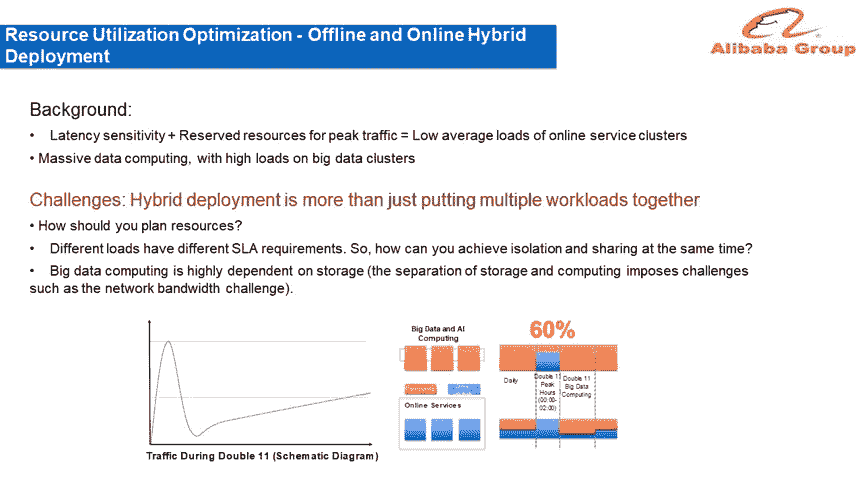

针对目前双 11 的情况，阿里巴巴实施了两种混合部署体系。第一个系统叫离线和在线混合部署，第二个叫在线和离线混合部署。大数据和 AI 对线上和线下计算有不同的要求。电商服务白天可能是空闲的，而大数据服务总是很忙。所以白天的时候可以把一些大数据计算任务交给电商集群，使用一些电商 CPU 资源。双 11 期间，大数据服务需要快速回滚。这种回滚发生在成千上万的服务器上，释放它们的资源来支持电子商务流量高峰。大数据和 AI 计算每天都使用电商资源混合部署，而电商每年只在双 11 和双 12 使用大数据资源，但这在这些日期提供的灵活性为阿里巴巴节省了数十亿元人民币的成本。混合部署绝不是简单把一些工作负载放在一起就能解决的问题。所以总要面对一定的问题，比如如何规划资源。这不仅涉及到线上集群的资源规划，也涉及到整个阿里巴巴经济体的资源规划。不同的负载有不同的 SLA 要求，那么如何才能在保证隔离的同时允许资源共享呢？此外，大数据计算高度依赖存储。我们必须使用分离存储和计算的架构。然而，要实现存储和计算的分离，我们还必须应对极高的网络带宽。

# 资源利用优化:离线和在线混合部署

下图显示了资源调度模拟图。适马是一个在线集装箱调度。所有在线系统都实施集装箱化，所有集装箱系统都使用适马进行调度。作业调度器是大数据和 AI 的调度器，调度主要计算能力。两个调度器都可以看到一组资源视图，相当于看到哪些资源是空闲的，可以调入调出。底层有两组代理，它们在获得资源后向下申请和管理资源。未来，适马可能会扩展到 Kubernetes 平台，但目前是通过使用 Docker 实现的。这里，我们并不试图产生一个中央调度器来实现所有的调度任务。相反，我们分别在线和离线安排任务。从半动态资源调度策略开始，对两端的调度系统的改变保持最小，以实现快速升级、降级和迭代。

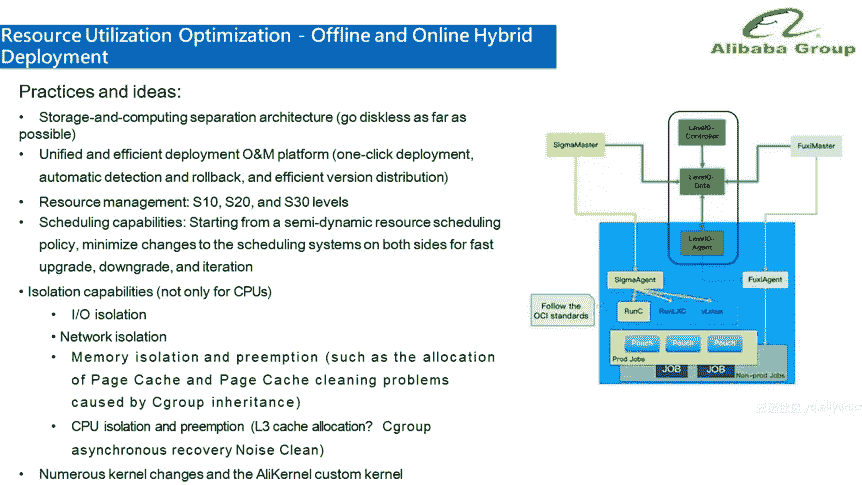

从概念上来说，这涉及到几个关键点，其中之一就是存储和计算的分离。你需要把存储和计算分开。如果想利用大规模的电商资源实现弹性，更是如此。因此，阿里巴巴推出了一个名为“无盘世界”的项目，旨在将所有计算与存储分离，使计算不再依赖本地存储。由于调度涉及成千上万的服务器，我们需要一个集中、高效的部署和 O&M 平台，以及一键部署、自动检测和回滚以及高效的版本分发。在资源管理层，资源被分为 S10、S20 和 S30 级别，因为不同的应用具有不同的 SLA 要求。隔离能力不仅指 CPU 隔离，还包括 I/O、网络、内存隔离。面对大量的变化，阿里巴巴实现了一个名为 AliKernal 的自定义内核，包含了所有这些变化。在解决了这些关键点之后，我们差不多完成了一个完整的电子商务混合部署。

# 数据仓库和数据湖

其实 Hadoop 本身就是一个数据湖系统，有统一的存储架构，上面运行着多个引擎。Hadoop 或多或少符合数据湖的所有定义。例如，存储在 HDFS 的数据不需要完全建模，您甚至可以完全放弃建模。它支持读取模式，并且在读取模式时可以动态解析模式。因为开放的架构，所有引擎都可以在 Hadoop 上运行。但是，由于存储是开放的，因此很难执行全面的存储优化。就成本而言，创建数据湖相对容易。难点在于维护成本高。在数据使用方面，往往很难做到高质量和可维护性。从另一个角度看，包括阿里巴巴在内的很多企业都在做数据仓库。这是因为数据以完全建模的方式存储在数据仓库中，因此表和数据是预先定义的。由于完全建模的方式，数据仓库通常只存储结构化和非结构化数据，这导致了数据存储灵活性的问题。另一方面，数据仓库是集成的，所以并不是所有的引擎都适合这种架构。但是集成架构更容易优化，更容易为上层计算优化存储。这里的缺点是可能很难建立一个数据仓库，因为它对数据的写入和维护有很高的要求。然而，一旦构建了数据仓库，就更容易实现完全管理的数据。在数据使用方面，大多数情况下也可以实现高数据质量和可用性。

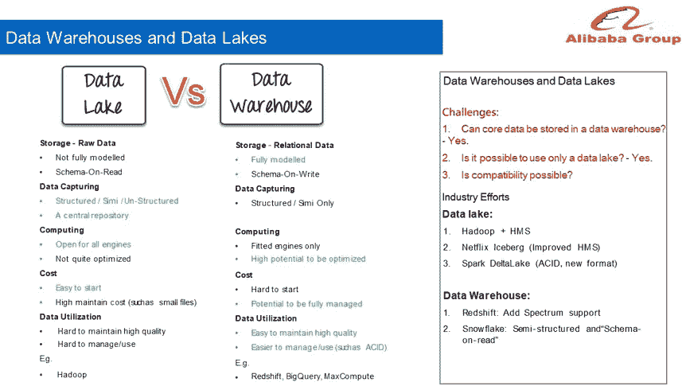

因此，将所有核心数据放在数据仓库中是可行的。很多企业都是如此，包括阿里巴巴。如果只使用数据湖，这也是可行的。其实这是很多公司采用的解决方案。那么，我们想知道是否可以将数据仓库和数据湖结合起来？这也可行。这个行业已经在两个方向上尝试了很多次。那些使用数据湖体系结构的人可以发现数据仓库的优势。因此，它们正在向数据仓库发展。这种努力的例子包括 Hadoop + HMS、网飞冰山(我们可以将其视为 HMS 的增强版本)和 Spark DeltaLake。数据仓库系统的用户同样可以发现数据湖的灵活性，并且正在朝着这个方向发展，比如红移和雪花。因此，这种演变是在两端发生的。

# 数据仓库和数据湖:阿里巴巴大数据平台的演变

从 2013 年到 2015 年，阿里巴巴在 Hadoop 系统的可扩展性、性能、安全性、稳定性和代码可控性方面遇到了一些问题。因此，阿里巴巴将其数据从 Hadoop 迁移到 MaxCompute，这相当于一个数据湖场景的主数据仓库。当时，我们开始构建阿里巴巴数据中端，并构建数据建模、数据谱系、数据治理和标签系统。

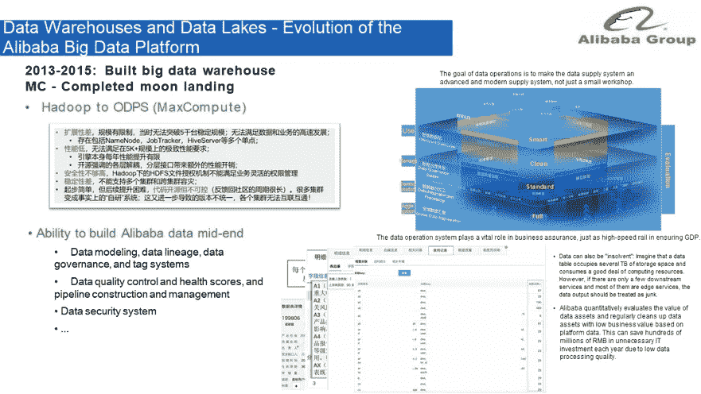

在阿里巴巴建立其数据中端之后，从 2016 年到 2018 年，我们在我们的主要数据仓库平台中进行了两个项目，一个联合计算平台和一个逻辑数据湖。联合计算平台使数据能够支持多个引擎。丘比特封装在 MaxCompute 平台上，数据资源层封装在 Yarn 和 Kubernetes 平台上。数据存储层被抽象为一组 I/O 接口，元数据系统被抽象为一组系统，允许连接 Spark、Flink 等开源引擎。丘比特平台允许 Spark 和 Flink 在不修改代码的情况下，通过使用 MaxCompute 上的资源运行数据。系统只替换部分 JAR 包。这相当于在数据仓库的基础上扩大了支持引擎的范围。这种方法还提供了外部表功能。“逻辑数据湖”连接到其他存储系统，而不是聚合数据。这是因为计算下推比数据上移更高效。

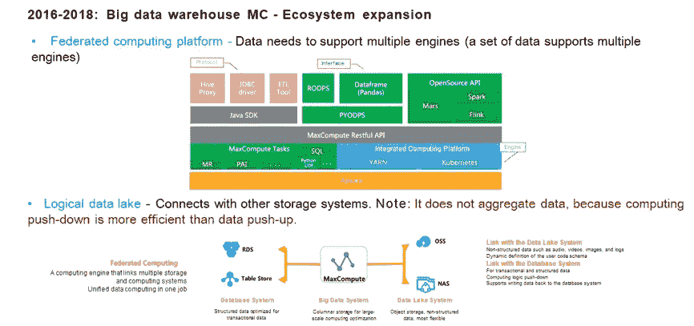

2019 年，阿里巴巴看到了实施逻辑数据湖的潜在问题，这将给用户带来很大困难，特别是在处理大量数据时。此外，云客户反映，他们已经拥有 200 台服务器的 Hadoop 系统，并希望使用阿里巴巴的数据仓库架构和中端架构来提高业务能力。也就是说，他们希望实现两方面的和谐发展。因此，阿里巴巴正致力于通过融合数据仓库和数据湖来实现“湖库一体化”。除了数据湖和数据仓库的网络连接，阿里巴巴还实现了元数据互联。这意味着，当您想要对两边的数据执行连接计算时，您不需要创建外部表。目前，这种架构正在试用中。

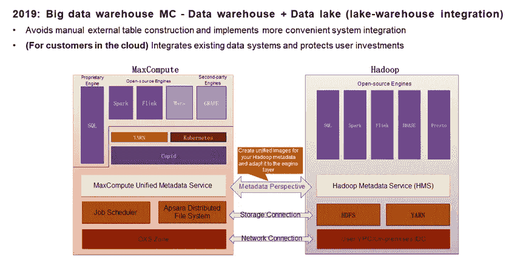

# 原始来源:

 [## 阿里巴巴电子商务系统背后的大数据平台

### 阿里云 MaxCompute 2020 年 3 月 3 日 853 去年双 11 的商品总额(GMV)达到人民币…

www.alibabacloud.com](https://www.alibabacloud.com/blog/the-big-data-platform-behind-alibabas-e-commerce-systems_595931)