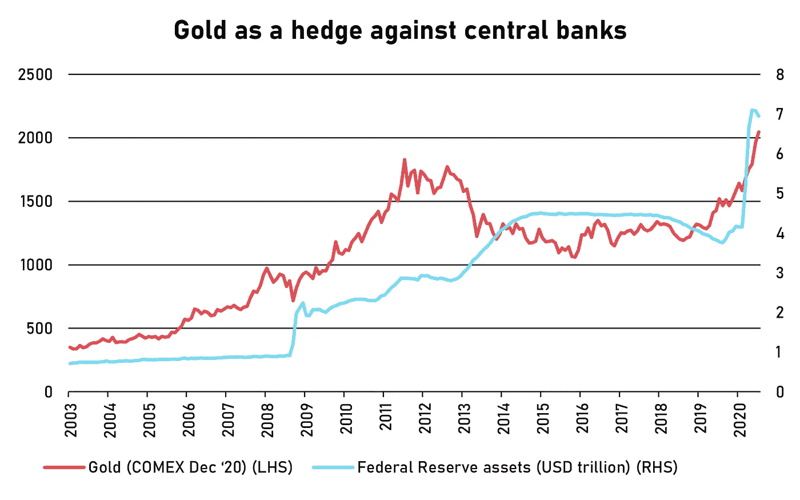

# 推动黄金的巨大恐惧

> 原文：<https://medium.datadriveninvestor.com/the-big-fear-driving-gold-bd028668d6b?source=collection_archive---------6----------------------->

## 贵金属真的能上万美元吗？

Photo by [Aaron Munoz](https://unsplash.com/@munz0?utm_source=medium&utm_medium=referral) on [Unsplash](https://unsplash.com?utm_source=medium&utm_medium=referral)

在疫情遭受重创之前，许多分析师公开表示[黄金可能会上涨](https://www.forbes.com/sites/simonconstable/2019/12/16/gold-headed-to-approach-1700-by-the-end-february-analysts-say/#2a1000831417)。但最近几个月的反弹幅度和速度让所有人都感到意外。在过去的三个月里，每盎司的美元价格上涨了 23 %,从 1686 美元涨到了 2069 美元。由于[如此迅速地突破 2000 美元关口](https://www.news.com.au/finance/markets/australian-markets/economic-uncertainty-drives-gold-price-to-record-levels/news-story/1f544ec31e41cd1c2c98e530f1b68d72)，并且没有显示出放缓的迹象，黄金已经回报了谨慎的投资者和寻求风险的投机者。它也有些有点慌乱。

黄金被认为是灾难的货币。在地缘政治不确定性、军事冲突和恐怖主义行为的爆发期间，这一比例往往会上升。每当世界似乎处于灾难的边缘，就期待黄金会有好的表现。黄金也是一种典型的通胀对冲工具:它是一种可靠的价值储存手段，尤其是在央行开始开动印钞机的时候。

回到 2011 年，当黄金飞速上涨时，一个重要的主题是[政府发行的大量债务](https://money.cnn.com/2011/08/22/markets/gold_prices/index.htm)。许多投资者看不出像美国这样的国家如何在不贬值货币和保持利率接近零的情况下，让其债务有一个更可持续的基础。一旦美国美联储开始放缓，然后逆转其资产负债表的增长，投资者注意到天空仍然高高在上，空气开始从黄金中流出。

 [## 如何在不牺牲孩子或财务的情况下安全理智地离婚|数据驱动…

### 在美国，七月是以孩子为中心的离婚月。作为 cdfaⓡ的专业人士，我可以向你保证，从长远来看…

www.datadriveninvestor.com](https://www.datadriveninvestor.com/2020/07/28/how-to-divorce-safely-and-sanely-without-sacrificing-your-children-or-your-finances/) 

我们现在在疫情经历的情况接近黄金的理想环境。我们面临一场全球性的灾难，这场灾难让所有经济体陷入瘫痪，政府和央行陷入恐慌，未来充满不确定性。除了这个混乱的培养皿，地缘政治紧张局势的回归、摧毁城市的蘑菇状爆炸以及街头的内乱，你就拥有了黄金强劲反弹的完美条件。

# **通胀在哪里？**

经济和金融危机往往与通货紧缩联系在一起，即消费价格的普遍下跌。人们花得更少，存得更多。他们推迟大额购买，抑制一些常规消费习惯，学会量入为出。这也不是普通的经济危机。由于封锁和旅游禁令，我们中的许多人无法在遥远的异国他乡度假，即使我们想去。

取决于我们住在哪里，我们不能去餐馆吃饭，带我们的孩子去看电影，或者去看我们的球队现场比赛。我们被迫减少开支。对于那些幸运地仍有全职工作的人来说，事情当然更容易，但对于那些不那么幸运的人来说，可支配收入会很快枯竭。需求的突然减少意味着大多数商品和服务的价格下降。

如果没有人担心通货膨胀，那么我们如何解释金价飙升？通货膨胀是目前投资者最不关心的事情，但是对疫情的货币反应的规模正在加剧投资者的失眠。目前，价格除了下跌之外不会有任何变化，那么黄金——一种经典的通胀对冲工具——有什么用处呢？答案主要归结于央行的行动，更重要的是，投资者对它们处理疫情危机后局势的信心。

Source: Yahoo! Finance, Federal Reserve Bank of St Louis

各国央行正在向金融体系注入前所未有的流动性。这可能是防止一系列极具破坏性的破产和企业间丑陋的去杠杆化的完全必要的回应。然而，一旦危机过去，这也会给金融体系留下大量现金。当一切恢复正常时，央行如何吸收这些现金还远未可知。

# 贪婪、恐惧和暴躁

多年来，末日预言家一直在“预测”金价上涨。在 2008 年至 2009 年金融危机期间，随着银行和保险公司纷纷倒下，对金融内爆的担忧推动了黄金价格。甚至在接下来的几年里，还有人拿他们的职业生涯和脱口秀节目的常规节目打赌，一场前所未见的通货膨胀即将到来。从来没有发生过。

事实证明，央行完成了让资产负债表正常化的任务，但这需要很长时间。就像让泰坦尼克号转向一样，央行的资产负债表不可能很快恢复——除非给市场造成严重破坏。2013 年，美联储开始缩减其债券购买规模，市场开始抛售股票。2018 年，它已经开始大幅缩减资产负债表，这让市场非常失望。2019 年，[市场再次反叛](https://www.cnbc.com/2019/09/18/fed-loses-control-of-its-own-interest-rate-on-day-of-big-decision-this-just-doesnt-look-good.html)，美联储被迫再次开始购买。然后病毒来袭。

我们现在会看到悲观主义获胜吗？占卜师开始看起来更像卡珊德拉了。除了所有的经济大屠杀，现在市场上并没有太多的悲观情绪。如果说有什么不同的话，那就是过度兴奋了。黄金不是唯一上涨的资产。股票、房地产和其他商品都在上涨。由于政府需要通过发行债券为巨额预算赤字融资，债券是唯一面临压力的资产类别。

我们发现自己现在的处境与之前的危机不同。有更多的希望。随着制药公司和学术实验室竞相开发疫苗，投资者至少可以看到危机的结束。然而，这仍然是一个高风险的游戏。如果一种疫苗很快被证明是可行的，并得到广泛传播，我们可能会看到经济痛苦的结束。在公共卫生当局的正确监督下，企业可以重新开业，我们可以回到艾滋病前的生活——在阳光下眨眼睛。央行政策将被证明是正确的，债务期限结构可以重新谈判，流动性将安全地从体系中移除。

但是，这可能是太多的希望。主要的担忧是系统中大量的流动性。投资者不确定一旦危机结束，央行是否能够吸收这些额外的现金。金价已达到创纪录高位，对许多投资者来说，这是一个令人不安的水平，比以往的危机还要严重。然而考虑到通货膨胀，[今天的黄金并不比 20 世纪 80 年代初贵多少。即使与 2011 年的快速上涨相比，目前的反弹也没有那么剧烈。](https://www.marketwatch.com/story/gold-is-a-foolish-place-to-put-your-money-right-now-if-you-check-the-facts-2020-08-07)

# 我们在吹自己的黄金泡沫吗？

我们可能会过度扩张，但肯定不是泡沫。价格上涨在很大程度上是由流向交易所交易基金(ETF)的巨额资金推动的，而不是由在期货市场交易的投机者推动的。押注金价上涨的期货交易员正在削减头寸。在 ETF 资金流入的背后，不仅仅是散户投资者，还有寻求对冲和分散投资组合的机构基金。尽管有很多父母投资者渴望参与从大宗商品、境况不佳的公司到魅力非凡的创始人的一切投资——尤其是在赛马和体育赛事暂停的时候——但他们不是推动这个市场的人。

黄金不太适合投机。因为希望获得一些短期收益而购买黄金会让你在大部分时间里焦头烂额。然而，购买一些黄金作为对灾难、央行管理不善、通货膨胀和货币贬值的对冲，并不是一个可怕的想法。

金价在 2000 美元时是否仍有吸引力，在很大程度上取决于你认为事态将如何发展。专家不会过分关注武断的里程碑。然而，当市场开始接二连三地打击他们时，他们确实会注意到。即使情况进一步恶化，黄金能否持续进一步上涨仍是个问题。不过，有一件事是清楚的:如果[黄金达到 10，000 美元](https://www.kitco.com/news/2020-06-24/-3-000-gold-price-no-longer-target-it-s-now-10-000-if-Fed-assets-collapse.html)，我们将面临比通货膨胀更大的问题。如果这是你预测的那种世界末日，那么祝你好运兑现 10，000 美元。如果现金还在使用的话。

**访问专家视图—** [**订阅 DDI 英特尔**](https://datadriveninvestor.com/ddi-intel)