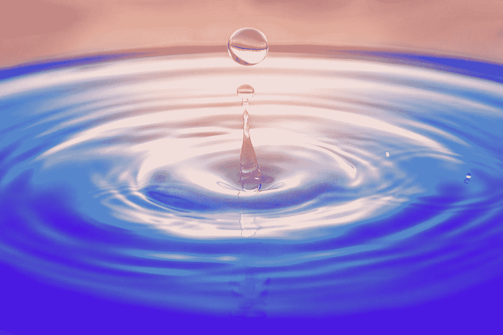

# 小决定的巨大影响

> 原文：<https://medium.datadriveninvestor.com/the-big-impact-of-small-decisions-b10160047f1d?source=collection_archive---------2----------------------->

## 我们的生活已经被定义，正在被定义，将来也会被定义，都是由我们一路上所做的小决定决定的。

Photo by [zhang kaiyv](https://unsplash.com/@zhangkaiyv?utm_source=medium&utm_medium=referral) on [Unsplash](https://unsplash.com?utm_source=medium&utm_medium=referral)

我们在生活中做出的每一个行动、运动和决定，无论多么微小，都会影响随后事件的发展。而且就是这有很多常识，逻辑甚至物理都用牛顿定律(作用-反作用)给我们指明了。

在科学部分，物理学也触及了平行宇宙的问题，这表明对于宇宙中任何情况下的每个可能结果，都会产生一个发生这种事件的宇宙……但这已经是另一个网站的主题了。

自然容易理解的是，我们做的每一个小决定，都会带来一个或多个后果，不管是好是坏。毫无疑问，对比起源是一个决定还是另一个决定，我们发现自己未来的生活方式将会有巨大的不同。

为了更好地理解做小决定的重大影响，让我们来看看蝴蝶效应是怎么回事。

# 蝴蝶效应

蝴蝶效应说，一只蝴蝶在美国扇动翅膀，就能在亚洲引发一场飓风。

就此而言，他并不是说蝴蝶与地球的气候条件有关，而是隐喻性的，它表明了如此简单的东西所能产生的影响。

电影《蝴蝶效应》(顺便说一句，强烈推荐)展示了主角在当下做出决定后如何前往未来。

当最初的变化极其细微时，结果却完全不同。每一个行动都会引发另一个行动，从而引发滚雪球效应，最终只会让变革变得意义深远。

但是……除了电影中的隐喻和故事，让我们分析一下蝴蝶效应是如何帮助我们理解为什么**小决定会产生巨大影响的。**

最经典的例子是天花板上的球。

假设我们在一所房子的屋顶上。我们在屋顶的中间，如果我们向左转，我们会看到街道，右边是房子的院子。

如果我们将球滚过中间的瓷砖，在某一点上，它将选择两条路径中的一条，最终到达两个可能的边中的一个，显著地改变它的“目的地”或最终位置。

一个更接近现实的例子，我最近在我的房间里经历过。

由于我大部分时间都坐在电脑所在的桌子前，而且电脑长时间开着，一天晚上，我闻到一股轻微的烧焦味。

当时我正在测试他们借给我的一款新游戏。

在这种情况下，他可以做出两种可能的决定。

-继续玩(也许烧焦的味道是从外面传来的)。

-回顾正在发生的事情(可能是我的电脑快要爆炸了)。

我立即感觉到不对劲，我迅速决定从插座上拔掉我的机器。令我惊讶的是，平衡塔电压源温度的风扇停止了，因此，一切都逐渐过热，到了某个点，一些部件可能会烧坏。

然后我换了一个喷泉风扇(我存了一个新的),并打开了我的设备……效果很好。

这和蝴蝶效应有什么关系？

如果我决定不去核实正在发生的事情，我就会耗尽我最有价值的工作工具。

面对一个有两条可能路径的决定，很容易看出其中一条并不那么糟糕(我后来可以玩了)，但另一条可能需要我付出很大努力才能回到初始状态(拥有一台新电脑)。

所有的一切，都是基于我在几秒钟内做了一个小小的决定。

这就是生活中的一切，每天，每天，我们都会发现一些小的决定，这些决定无疑决定了我们的命运。

# 如何利用小决定？

正如温斯顿·丘吉尔所说:

> “在做决定之前，要有耐心，收集所有可能的因素……但一定要接受”。

每天，我们都有数十次改变生活的机会。有些决定会带来比其他决定更大的变化，但是**我们做的所有决定都会以某种方式影响我们的生活**。

因此，重要的是，不要让我们的生活自动发展，相反，我们日复一日地控制我们所做的事情，知道(以某种方式)根据可能的结果做出决定。

利用小的决定，这是没有必要的，比用冷静的头脑思考，他们可能给我们带来的好处或损害。

但永远，下定决心，勇往直前，一路坚定。