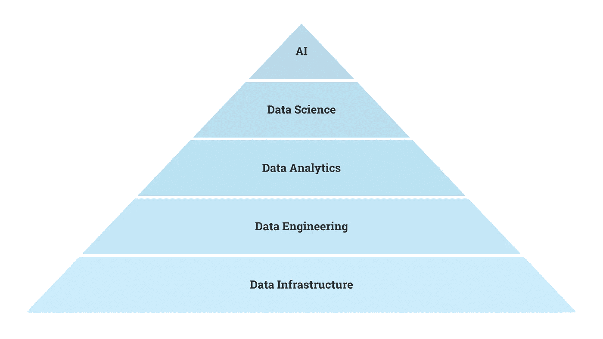

# 数据科学的大谎言

> 原文：<https://medium.datadriveninvestor.com/the-big-lies-of-data-science-28123c0ac7ee?source=collection_archive---------1----------------------->

## #1:找工作容易。

Photo by [Jametlene Reskp](https://unsplash.com/@reskp?utm_source=medium&utm_medium=referral) on [Unsplash](https://unsplash.com?utm_source=medium&utm_medium=referral)

# 1.找工作很容易。

优步[关闭了它的人工智能实验室](https://www.cnbc.com/2020/05/18/uber-reportedly-to-cut-3000-more-jobs.html)，谷歌[冻结了对 ML 工程师的招聘](https://www.cnbc.com/id/27539152)，而[的数据科学家正在被解雇](https://analyticsindiamag.com/what-may-be-the-factors-behind-data-science-layoffs/)。甚至大的研究公司也在解雇与新冠肺炎无关的数据科学家像 Splunk、Mixpanel、Domo、DataRobot [和许多其他](http://layoffs.fyi/tracker/)的数据公司解雇了员工。

与此同时，LinkedIn 上每一个公开的“机器学习工程师”职位都有大约 2300 名 kaggler(比例为 500 万比 2100)。

By author.

人才供应充足，但需求却在减少。这是激烈竞争的秘诀。因此，许多学习数据科学的人最终从事了分析工作，甚至是完全不同的领域。

例如，一个名为 Metis 的数据科学训练营，突出展示了校友们担任[安全运营经理](https://www.thisismetis.com/blog/bootcamp-grad-returns-to-online-security-field-making-impact-with-new-skills)、[软件工程师](https://www.thisismetis.com/blog/how-the-data-science-for-social-good-model-guided-this-grads-career-path)、[计算新闻](https://www.thisismetis.com/blog/bootcamp-grad-finds-home-intersection-data-journalism)、[后端开发](https://www.thisismetis.com/blog/professional-musician-turns-backend-developer)和[商业智能](https://www.thisismetis.com/blog/demystifying-data-science-making-an-impact-at-amazon)等角色的故事。

不要误解我，这些都是很棒的角色，我相信 Metis 是一个很棒的训练营。话虽如此，想要得到梦寐以求的“数据科学家”工作可不容易。

 [## 一瞬间学会数据科学！？数据驱动的投资者

### 在我之前的职业生涯中，我是一名训练有素的古典钢琴家。还记得那些声称你可以…

www.datadriveninvestor.com](https://www.datadriveninvestor.com/2020/07/23/learn-data-science-in-a-flash/) 

# 2.工作报酬很高。

如果你在硅谷，作为一名数据科学家为 FAANG 或一家被炒作的初创公司工作，你当然会挣大钱。但那是非典型情况。

我们需要从全球和跨*相关角色*的角度来看待形势*，以获得更准确的图景。*

## 全球薪资

在英国，数据科学家的平均收入为[4.5 万英镑](https://dataconomy.com/2020/02/guide-to-your-future-data-scientist-salary/#:~:text=For%20the%20year%202020%2C%20Glassdoor,job%20satisfaction%20rate%20of%204.0.)。在法国，€是 48500 人，而在意大利，€只有 34000 人。虽然在美国，一个经常被引用的衡量标准是数据科学家的“六位数”薪酬，但入门级职位的薪酬从 5 万到 9 万美元不等。

## 相关角色

请记住，大多数寻求数据科学职位的人最终会从事其他分析工作，因此，考虑这些薪水也是公平的。在美国，数据分析师的平均收入为 6 万美元，而这些职位大多在大(且昂贵)城市。

假设其中的四分之一用于纳税，你就剩下 45000 美元了。如果你面对的是平均 35，000 美元的学生贷款利息，这突然看起来不是很多。此外，美国消费者平均每年花费超过 61，000 美元——美国可能很贵！

虽然这些薪水不值得嘲笑，但许多有抱负的数据科学家可能会惊讶地发现，他们正在与成千上万的人竞争同样的工作，而这些工作不一定会高薪。

# 3.你需要一个证明。

证书可能是一个有用的工具。特别是，你要瞄准那些大牌的、难以获得的证书，这些证书具有很高的信号价值和很高的准入门槛，这样就不会有数百万其他人拥有同样的证书。

 [## 为什么你应该获得谷歌新的机器学习证书

### 不要错过去⛵️的船

towardsdatascience.com](https://towardsdatascience.com/why-you-should-get-googles-new-machine-learning-certificate-56af4204744f) 

即便如此，你也不需要一张证书就能在这个领域找到工作，而且大部分证书都没用。例如，吴恩达是一位著名的人工智能研究员，在 Coursera 上开设了许多关于这个主题的课程。他有超过 400 万的学习者。如果你和其他数百万人拥有相同的证书，并且你在竞争一个非常有限的职位，你需要一个与众不同的人。

By author.

# 4.是关于复杂建模的。

逻辑回归是 T2 最受数据科学家青睐的方法，而像卷积神经网络这样的复杂模型则不太常见。

## 可解释性

高度复杂模型的一个问题是缺乏可解释性。想象一下，你正在建立一个深度学习模型，给出投资建议，但你无法解释*为什么*它会给出建议。不是很有帮助，是吗？或者想象一下，你正在医疗保健领域建立一个深度学习模型，但你无法解释它的任何预测。有人会相信吗？

## 易于建造

除了缺乏可解释性，复杂的模型需要一段时间来构建、训练、测试和维护。所有这些都要花钱。

一天结束时，如果一家公司在昂贵、耗时的黑盒模型和简单、可解释的决策树之间进行选择，他们通常会选择后者。

## 先决条件

进一步说，人工智能和花式建模并不是“第一步”。在公司能够有意义地实施人工智能之前，它们需要能够可靠地收集、清理、转换、标记和分析数据。

By author.

# 5.这是一项纯技术性的工作。

将数据科学称为纯粹的技术工作具有误导性。它很大程度上是关于非技术性的任务，比如使用数据来讲述一个故事，说服他人，以及报告度量标准。

特别是，数据科学家需要知道如何有效地与非技术受众分享技术见解。西蒙·西内克的 Ted 演讲“[从为什么](https://www.ted.com/talks/simon_sinek_how_great_leaders_inspire_action?language=en)开始”是有效沟通的绝佳入门。

Visualization by author, inspired by Simon Sinek’s “golden circle.”

此外，数据科学家可能会遇到缺乏高质量数据、缺乏数据工程基础设施等问题。能够清楚地解释这些问题并让利益相关者相信正确的解决方案是一名优秀数据科学家的标志。

# 结论

世界上的数据量正在爆炸，人工智能变得越来越强大，公司希望利用这一点——通常是通过简单、可解释的模型。伴随这一趋势的是数百万有抱负的数据科学家竞争数量有限的令人垂涎的工作。面对这些不利因素，要取得胜利需要做大量的工作。

**访问专家视图—** [**订阅 DDI 英特尔**](https://datadriveninvestor.com/ddi-intel)