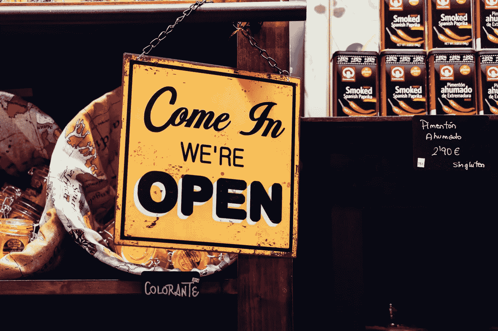
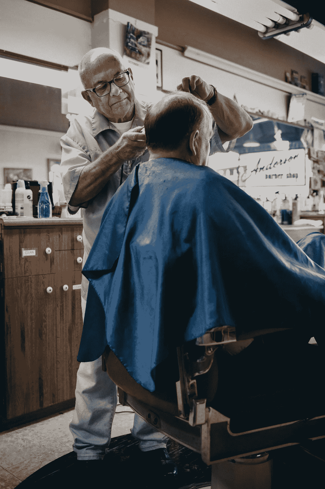

# 盛大的重新开业

> 原文：<https://medium.datadriveninvestor.com/the-big-reopening-81bf7fda49e0?source=collection_archive---------21----------------------->

## 变异的病毒和对诉讼的恐惧让企业主紧张不安

**Alvaro Serrano/Unsplash**

随着员工重返工作岗位，消费者寻找商品和服务，关于员工和客户安全的问题比比皆是。我们都对新冠肺炎的破坏、威胁和不祥的寿命感到焦虑。

如果一名员工在返回工作岗位后感染了新冠肺炎病毒，他们可以起诉他们的雇主吗？顾客外出就餐或在商店购物后感染冠状病毒怎么办？他们能对那家企业采取法律行动吗？

企业主担心一连串的诉讼会让他们彻底破产。倡导者认为，法律行动的威胁将确保员工和消费者有一个更安全的环境。

 [## 数据驱动始于数据素养|数据驱动的投资者

### 光是听到“数据”这个词就令人生畏。老实说，只有 21%的全球员工对自己的工作充满信心

www.datadriveninvestor.com](https://www.datadriveninvestor.com/2020/03/22/data-driven-starts-with-data-literacy/) 

如果同一个顾客也去了购物中心，参加了大型团体旅行，也许还乘坐了公共交通工具，那么谁能证明他是商业疏忽呢？

那些通过公共汽车、火车或拼车上下班的员工呢？有证据证明他们是在公司生病的吗？他们的习惯，圈子，工作时间以外的联系呢？

我们都渴望朝更大的目标前进。某种程度上正常和安全的安全回归。治愈剂和疫苗的保证。

任何停业的企业都有破产的风险。如果那家商店决定开业，他们有可能被起诉的危险吗？开放的障碍将无数公司置于进退两难的境地。

与此同时，疾病依然存在。它的传播伴随着它已经变异的信念。所有这一切都伴随着对后续浪潮的恐惧和可能性。

如果是，是否会有一个全面的保护？如果一个机构每天都证明它在遵循政府的指导方针，如果有人在他们的工作场所感染了病毒，他们会承担责任吗？

他们当然可以用每日体温检查和其他任务来监督自己的员工。他们如何执行各种安全措施和顾客的个人卫生？

被感染的人如何证明他们在这些特定的场所感染了病毒？有什么可以证明感染者已经携带了新冠肺炎病毒并把它带了进来？如果是这样的话，他们就是在把一个商店变成热点的同时感染了其他人的人。仅此一项就可能是任何企业的丧钟。

这些是全世界企业家面临的问题和担忧。保持关闭还是重新开放的决定有着重大的影响。任何一种都可能带来经济和个人的毁灭。

我们都想要安全——为了我们自己、我们的同事和我们的顾客。消费者信心仍然是所有经济体的动力。无论是扩张、衰退还是动荡，每个经济体都取决于其消费者的财政健康和购买力。

企业采取的安全措施会对其顾客产生影响。在我们的重新开放阶段，并进一步进入我们的后大流行文化，比以往任何时候都更是如此。

如果没有诉讼的威胁，公司会放弃适当的保护措施，从而危及工人、顾客和广大公众吗？

如果病毒进一步变异，危及治疗药物和疫苗，会怎么样？如果有第二次爆发呢？我们会被迫再次封锁吗？否则，很可能会实施数量和容量限制。所有这些都会导致更多的挫折、伤害和心痛。

**Tim Mossholder/Unsplash**

任何给人留下负面印象的企业，除了法律诉讼之外，还可能遭遇其他麻烦。社交媒体上的诽谤活动本身就可能被证明是灾难性的。

无论是他们的员工还是客户，企业都不能承受谣言和怀疑，他们正在监督一个不安全的环境。无论是在客户众目睽睽之下，还是关起门来只对员工可见。

照片和视频可以在瞬间拍摄并上传。他们经常在几分钟内传播尖刻的评论和负面的宣传。它们传播的可能性会造成不可逾越的伤害。

许多保险公司建议公司执行更严格的安全措施。错开工作时间的分散工作站。这对于办公室环境和其他企业对企业的实体来说可能是好的。

食品、服务和零售呢？在传统营业时间营业的机构和其他公司？

除了共享和开放的范围之外，这些区域会是无菌的和隔离的吗？各行各业不能再牺牲更多的占地面积了。他们的管理费用已经够贵了。在有限的桌子、车站和顾客的情况下，回报可能无法维持运营。

随着各州开始重新设置，立法者正在制定安全措施、社会协议和分阶段重新开放。尽管在封锁期间表现出了谨慎，但忽视一个活的和活跃的病毒的法律后果似乎是草率的。

现在可能是侵权改革和诉讼标准的时候了。这个过程总是停滞不前，现在急需监管和解决。

当我们冒险外出时，我们所有人都将面临感染的风险。这是必然的。这对每个人来说都是未知的新时代。

在健康的经济中，大多数企业每天都面临着挣扎、挑战和不确定性。当我们呼气并离开弯道时，许多人将开始他们最陡的攀爬。

## 访问专家视图— [订阅 DDI 英特尔](https://datadriveninvestor.com/ddi-intel)