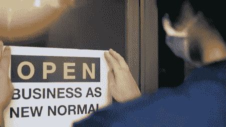
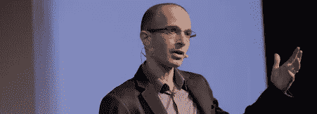
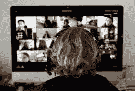

# 最聪明的人讨论新冠肺炎之后的生活会是什么样子

> 原文：<https://medium.datadriveninvestor.com/the-biggest-brains-discuss-what-life-after-covid-19-looks-like-d043723a90e7?source=collection_archive---------22----------------------->

由于新冠肺炎疫情，越来越多的国家受到限制，每个人都在猜测未来会发生什么——大多数人都认为，电晕后的世界不太可能与我们习惯的世界完全一样。除了再次学会洗手之外，严肃的文化、经济和政治变革也在意料之中。

# 哈拉里:不需要独裁

历史学家兼哲学家尤瓦尔·诺亚·哈拉里[说](https://www.ft.com/content/19d90308-6858-11ea-a3c9-1fe6fedcca75)这种流行病会消失，大多数会存活下来。但是像这样的危机情况，就其本质而言，会加速历史进程并推动创新。这一代人从未经历过类似当前的危机，世界各地都在尝试解决方案。根据研究结果，各国将采纳或拒绝这些新做法。这位哲学家认为，在危机情况下必须遵循许多新的规则，但国家如何以及用什么工具实现这一点，从根本上决定了社会的未来。

哈拉里认为，当前的危机管理在两个基本层面上决定了社会的未来。1)决定是通过极权主义还是民主手段来应对危机，2)各国是选择民族主义孤立还是全球团结。在中国，政府以前所未有的监控手段控制了疫情。哈拉里认为，紧急状态期间引入的措施，即放弃隐私，可能会将社会引向危险的方向。在疫情发生时，国家知道被观察人的体温当然是有用的。但这也让观察者比以往任何时候都更准确地了解这个人。

# **全面观察只在短期内有用**

这种临时措施往往比紧急情况本身需要更长的时间。这很容易导致独裁政权的出现，比如公民的情绪通过电话被监控。作为一个例子，哈拉里提到，随着这种监控系统的推广，朝鲜的某个人可能会因为在敬爱的领袖讲话时感到愤怒而被自己的电话举报，而那个人第二天就会被关进古拉格集中营。

因此，哈拉里认为解决办法在于 1)自下而上的公民倡议 2)新闻自由和 3)深入的信息共享。虽然中国通过严厉的惩罚和监控取得了惊人的成果，但韩国或新加坡等国却能够通过上述 3 种方法来抗击艾滋病。关键是信任和清晰的交流，包括传播洗手的科学。尽管全世界对媒体和科学的信任发生了动摇，但现在每个人都需要相信可信的信息，并接受可以用来遏制疫情的建议。

根据 Harari 的说法，另一个大问题是与孤立和全球合作相关的决策。人们能够在全球范围内相互分享信息，从其他国家的错误中吸取教训，并与疫情后期到达的人分享他们的经验。全球合作还必须涵盖经济。哈拉里说，克服困难的民族主义解决方案不如全球解决方案有效。这意味着各国不能将自己封闭数月。例如，他们需要合作开发旅游的未来。

据哈拉里说，很多事情都处于危险之中，受病毒影响的国家没有一个表现正常。如果他们选择分裂而不是合作，这可能会导致更多的灾难，而全球合作可以使世界在未来免遭类似的灾难。

# **乔姆斯基:事实证明社会不起作用**

美国语言学家传奇人物诺姆·乔姆斯基[也就此事发表了](https://www.rollingstone.com/politics/politics-news/noam-chomsky-covid-19-useful-idiots-podcast-970047/)讲话。他说，美国政府没有妥善处理疫情，这显示了美国社会整体的恶化。正如乔姆斯基所说，一个正常运转的社会应该能够处理类似的紧急情况。与韩国不同，美国对这种情况完全没有准备。这是因为在过去的四十年里，人们关注的焦点是让富人更富，而政府忽略了其他一切。

# 对未来的憧憬

政治[问](https://www.politico.com/news/magazine/2020/03/19/coronavirus-effect-economy-life-society-analysis-covid-135579) 34 位来自不同学科的大思想家、经济学家、语言学家、科学家和政治学家，问危机过去后，人们期待什么样的世界。乔治城大学的语言学家黛博拉·坦南认为，我们的习惯首先会改变。根据隔离的时间长短(自愿或非自愿)，我们会更多地考虑我们接触了什么，我们与谁建立了更密切的联系。这不像 2008 年的经济危机。即使在疫情爆发后，也很难摆脱这样的条件反射，即在网上做事情似乎比亲自做更有吸引力。

# 我们看待技术的方式不同

纽约大学社会学教授埃里克·克兰伯格预计，经济复苏将带来社会主义的转变。这种变化是基于这样一种认识，即所有社会成员的命运是交织在一起的。麻省理工学院科学社会学家 Sherry Turkle 说，强制关闭将改变人们对数字生活的态度，使之对自己有利。免费的在线音乐会，电影，报纸，供品会让人们在机器前花更多的时间，他们不会希望疫情结束后就结束。

其他人预计，在疫情之后，工作和社区文化会发生变化。一些人希望看到宗教也发生变化——它的重要性是否会增加，还有待讨论——但无论如何，很可能没有人愿意在一段时间内与他人走得太近。

# **恐惧可能依然存在**

由于数百万人退休后在家办公，许多人认为网上工作也会简化。但是有人说，一旦疫情结束，很明显人们会希望网上投票。在当今这个发达的世界，为什么要让这么多人聚集在一起完成这么简单的任务呢？耶鲁大学的美食学家保罗·弗里德曼[说](https://www.politico.com/news/magazine/2020/03/19/coronavirus-effect-economy-life-society-analysis-covid-135579)人们甚至有可能会回归家庭烹饪。餐馆当然会受到影响，尽管弗里德曼毫不怀疑送货上门会比过去更受欢迎。

无论疫情过后会发生什么，中国现在已经进入了这个时期。这个国家已经成功战胜了疫情，但很明显，冠状病毒过后，恢复到旧的正常状态并不容易。该国仍在加强检查。餐馆是空的，商店门口的温度测量是恒定的，从国外来的都被检查，以防止疫情再次爆发。

如果对后冠状病毒时代有什么共识，那就是它将不再像以前的世界。习惯将会改变，恐惧将会存在，当然我们是否能彻底摆脱病毒还不得而知。此外，目前的限制将在法案中保留多长时间，或者至少在未来的议程中保留多长时间，还不得而知。如果他们停留的时间足够长，哈拉里可能是对的:当涉及到社会的未来时，前所未有的突然转向在线学习、家庭办公和限制真实社会联系可能是至关重要的——但只有当我们设法从中学习时。