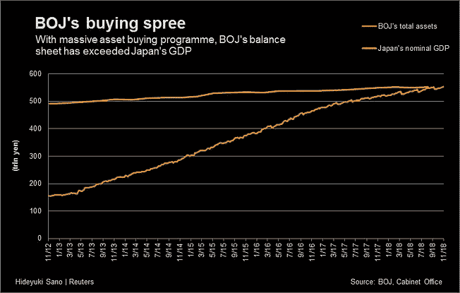

# 历史上最大的泡沫

> 原文：<https://medium.datadriveninvestor.com/the-biggest-bubble-yet-c5d7dde517e6?source=collection_archive---------9----------------------->

## 债券如何变成历史上最大的泡沫

世界各地的政府正在制造历史上最大的泡沫，他们不是让它慢慢缩小，或者让它破裂，而是让它变得比以往任何时候都大。在这篇文章中，我将讨论为什么会这样，并展示它的一些影响和后果。

## 我们是怎么到这里的？

2007 年至 2009 年的金融危机及其后果将通胀降低到了不理想的低水平，并将失业率推高到了非常高的水平。在短期利率处于或接近于零的情况下，传统货币政策是有限的，因此央行寻找新的方式来刺激经济。其中一项措施是央行大量购买长期债券，以降低长期收益率。央行资产是对这些长期债券购买的粗略衡量。

让我们来看看日本市场。每当日本央行开始购买长期债券时，债券收益率就开始下降到历史上从未有过的水平。收益率和债券价格成反比。

Figure 1.1: BOJ balance sheet on the left. Figure 1.2: Japanese long-term yields on the right. Figure 1–3: [BOJ assets vs Japan’s nominal GDP](https://www.reuters.com/article/us-japan-economy-boj/bank-of-japans-balance-sheet-now-larger-than-countrys-gdp-idUSKCN1NI07Z)

与此同时，日本央行(BOJ)将其资产增加到前所未有的水平，以购买所有这些资产。为了以这种方式控制收益率，日本央行在 2017 年购买了几乎两倍的日本政府债券净发行量，现在拥有 43%的未偿债券。

通过购买大量债券的流量和存量，日本央行有效地控制了长期收益率。图 1.1 中的日本央行资产反映了日本债券的积累。它的资产已经超过了日本的 GDP。然而，这些措施并没有成功地使日本的通货膨胀率回到 2%的目标。许多观察人士将这一结果归咎于长期以来根深蒂固的静态价格预期。问题可能是，通货膨胀只衡量一定数量的有限资产，而通货膨胀正在发生，却没有得到充分的衡量。

 [## 另一场精心策划的全球经济危机正在逼近？如果我们的数据经济可以帮助它|数据…

### 我们的 DApp 的开发，称为 DECENTR，目前正与我们的 R&D 同步进行，作为我们即将到来的…

www.datadriveninvestor.com](https://www.datadriveninvestor.com/2019/03/06/another-engineered-global-economic-crisis-looming-not-if-our-data-economy-can-help-it/) 

欧洲央行(ECB)和美联储一直在遵循同样的策略。他们购买长期债券来刺激经济。这种策略的问题是，每当市场上只有一个买家时，价格往往是错误的。这正是正在发生的事情。由于中央银行可以印钞票，只购买资产，他们以任何价格(或收益率)购买这些债券。这在经济的不同领域产生了连锁反应。

图 2.1 显示了中央银行持有的资产总量。图 2.2 显示了负收益债券的总量，图 2.3 显示了日本长期债券的所有权分布。如果这不是信贷泡沫，还有什么可以解释大约 17T 美元的负收益债券呢？

Figure 2\. 1: [Major Central Banks’ total assets](http://www.usfunds.com/investor-library/frank-talk/christmas-comes-early-for-this-precious-metals-streaming-company/#.XjDVnRNKjOQ). Figure 2.2 — Global supply of negative yield bonds. Figure 2.3: Percentage distribution of Japaneseand [wealth distribution](https://www.edgepointwealth.com/en/Insights/Commentary/2019-Q3-Fixed-income-commentary)

这完全改变了政府和企业的动机。例如，政府可以维持尽可能多的债务，并以非常低的收益率借钱。国债收益率不是由市场驱动的，而是由政府本身决定的。政府没有盈余的动机，因为它们可以控制自己的收益率，以及从“市场”借钱的价格。

Figure 3.1: FED’s balance sheet over time. Figure 3.2: China total debt to GDP over time.

消费者在日常用品中看不到通货膨胀，但这并不意味着它没有发生。通货膨胀正在其他资产中发生，包括股票和债券价格。

Figure 3.1 — Price of 100 year [Austrian Bonds](https://twitter.com/schuldensuehner/status/1158845514235961345)

Figure 4.1: [Total market cap over GDP](https://corporatefinanceinstitute.com/resources/knowledge/valuation/market-cap-to-gdp-buffett-indicator/). Figure 4.2: non-financial corporate debt over time

因此，将消费者价格通胀作为货币政策的唯一变量，就忽略了货币创造对不平等的大部分影响。此外，正如预期的那样，资产价格和收入不平等之间的相关性非常强。

从 2007 年到 2020 年，股票市场的价格与 GDP 的比率从 65.6%增长到 140.4%。美国的 GDP 大约是 19.9 吨，这意味着股票市场的市值在过去的 8 年里上涨了大约 15 吨。全球债务占 GDP 的比例达到了 322%的历史最高水平:根据一项指标，自金融危机以来，投资级债券的数量已经翻了一番，达到了 52 万亿 T2。

如果股票市场的总市值实际上代表了公司的基本面，我们将看到市盈率在所有情况下保持不变。但事实绝对不是这样。查看巴菲特指标(图 4.1)，我们可以看到，这些年来，市值相对于 GDP 的比例大幅上升。

尽管巴菲特指标显示，相对于股票市场的定价，我们正处于最高点之一，[沃伦·巴菲特](https://www.youtube.com/watch?v=JvEas_zZ4fM#t=1h49m)表示，股票很便宜。问题总是被比作什么。他把债券比作。也就是说，债券市场定价过高。如果股票市场与收益相比处于历史高点，而债券市场价格过高，这意味着历史上债券价格极度过高。

沃伦·巴菲特和伯克希尔·哈撒韦公司表现差于市场的原因和工人工资停滞不前的原因是一样的。伯克希尔·哈撒韦公司持有现金作为经济下滑的对冲。实际上，沃伦持有大约 1280 亿美元的现金。伯克希尔·哈撒韦公司的市值约为 5480 亿美元。每当政府印钞票，推高债券和股票等资产的价格时，谁持有现金，谁就是输家。但这不会持续太久。市场力量是不可阻挡的，价格在某个时候会反映现实。