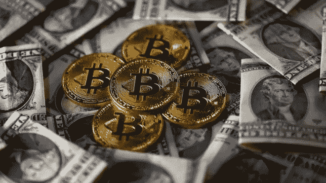

# 比特币交易要避免的最大风险:终极初学者指南[2020]

> 原文：<https://medium.datadriveninvestor.com/the-biggest-risks-of-bitcoin-trading-to-avoid-the-ultimate-beginners-guide-2020-6b9d0a64d3d8?source=collection_archive---------13----------------------->

过去 10 年，比特币交易理所当然地赢得了声誉，成为网上最赚钱的方式之一，如果不是对许多人来说最赚钱的话。

过去十年，比特币和加密货币的使用以前所未有的速度增长，这在很大程度上是因为比特币交易者和投资者每月产生数千甚至数万美元的故事。

然而，虽然比特币交易的盈利能力是不可否认的，但购买和出售世界头号加密货币所涉及的风险也是许多交易者，特别是对加密货币市场相对较新的交易者感到担忧的事情。

 [## 加密货币行业是死是活？数据驱动的投资者

### 九月初，我们在 X-Order 内部就代币市场的未来进行了一场辩论。有趣的是，我们的观点是…

www.datadriveninvestor.com](https://www.datadriveninvestor.com/2019/12/12/will-the-cryptocurrency-industry-be-dead-or-alive/) 

正是因为这一点，也因为在交易比特币时犯错可能对交易者的财务产生的影响，人们对加密货币市场中存在的风险、如何识别这些风险以及如何减轻这些风险存在如此大的担忧。

虽然许多交易者逐渐花了数年时间通过第一手经验了解加密货币市场中存在的一系列风险，但在此过程中往往以重大财务损失为代价，许多其他比特币交易者寻求捷径和信息，以了解存在的风险，而不需要为了了解这些风险而赔钱。

正因为如此，我们创建了这个指南，它分解了比特币交易者在 2020 年要避免的最大风险，首先看看比特币是什么，它是如何工作的，然后再看看比特币交易的机制，比特币投资，以及一些最好的比特币交易平台和策略，最后列出了比特币交易者在 2020 年要避免的最大风险。

# 比特币是什么，为什么它很重要？

## 比特币是什么？

[比特币](https://bitcoin.org)是一种金融奇迹——2008 年由一个叫中本聪的难以捉摸的个人或团体创造的技术，这很可能是一个化名，与中本聪尝试之前的许多数字货币交易不同，比特币不仅幸存下来，而且从那以后蓬勃发展。

比特币是一种数字货币，它也可以被视为一种数字黄金，实际上它是货币的融合，是一种可以用作价值储存的资源，是一种新形式的计算和算法技术，其中融入了密码学。

过去十年来，人们一直在使用比特币做许多事情，这些事情主要集中在存储财富、投资、在世界上任何地方进行支付而无需银行或支付处理器，或者在加密货币市场进行投机。

在所有这些情况下，比特币都提供了以前没有的解决方案和机会，通常这些解决方案为用户提供了重要的价值，这在过去 10 年比特币价格的天文数字增长中得到了清晰的反映。

当比特币最初由中本聪创造时，它实际上一文不值，甚至在比特币[区块链](https://blockchain.com)推出后的好几个月里，用户都在以几乎为零的价格交易成千上万的比特币。

然而，有一个因素决定了过去 10 年人们愿意为一枚比特币支付的价格，那就是比特币与网络效应概念的联系。

基本上，使用比特币并将钱投入其中的人越多，整个比特币网络的总价值就越大，因此单个比特币的价值也就越大。

## 比特币是如何运作的？

中本聪创造了加密货币的概念，并将即将发行的第一种加密货币命名为比特币，但除了这两个新概念，中本聪在 2008 年发布了第三个，或许更有影响力的发明。

这当然是中本聪创造的被称为区块链的新技术，它将被用作分类账系统，允许整个比特币网络在任何时间点决定和了解谁拥有多少比特币，并以真正分散的方式实现这一点。

在比特币诞生之前，美元和欧元等货币都由央行控制，央行决定了比特币的发行量、发行方式以及利率和货币政策等影响其价格的因素。

然而，中本聪设想了一种基于新货币的经济体系，这种经济体系的运作方式将完全去中心化，并完全数字化。

区块链是一个由许多机制组成的系统，这些机制协同工作，以自主决定谁将获得新的比特币和其他加密货币，并将管理比特币网络的每个经济方面，以确保每个人在任何时间点都同意谁拥有比特币。

## 为什么比特币很重要？

出于多种原因，比特币非常重要，加密货币也是如此，原因类似，但有许多警告。

从加密货币的一般概念开始，加密货币是第一次能够创造出足够强大的数字货币，不仅能够抵御世界各国政府和中央银行，还能够抵御各种形式和规模的恶意行为者。

其他数字货币早在 20 世纪 90 年代就推出了，直到比特币推出，它们都因为特定的原因而失败，其中一个原因比其他原因更普遍。

在比特币之前创造的大多数数字货币都被政府和监管机构关闭了，因为它们是集中的，一旦政府发现了运行数字货币的服务器的位置，所需要做的就是拔掉服务器的电源或没收设备，以扼杀这种货币。

比特币是一件大事，因为这是第一次创造出一种无法关闭且没有运行地点的数字货币。

除此之外，比特币也是一个大问题，因为至少在过去 10 年中，它的价格增长了 27，000，000%或更多，在这段时间内迅速超过了所有其他金融资产和资产类别，不仅超过了它们，而且远远超过了它们。

# 比特币交易 101

## 什么是比特币交易？

比特币交易是比特币使用的最受欢迎的方式，是当今世界上排名第一的加密货币在线创收，尽管比特币交易有许多品种和策略，但其基本原理非常简单。

比特币交易是设计策略的过程，涉及通过创建比特币的多头和空头头寸来购买和出售比特币，目的是在交易期间产生利润。

交易者可能是从未接触过加密货币或股票和外汇等传统资产市场交易的单身个人，但他们决定只购买和出售价值数百美元的比特币，看看他们是否能获得一些利润。

相反，交易者可以是大型的、技术熟练的对冲基金和其他机构投资组织，他们全天候运行数百个加密货币交易机器人，并在任何给定的 24 小时内买卖价值数百万美元的比特币和其他加密货币。

比特币交易有可能改变人们的生活，因为它可以为人们提供大量的收入，而且它也有可能导致交易者遭受巨额损失，这些交易者认为这很容易，没有对市场和比特币本身进行足够的研究，在没有准备好和了解风险的情况下就开始交易。

## 比特币交易与比特币投资

比特币交易和比特币投资是两组非常相似且高度关联的活动，但它们都是不同的，适合不同类型的人以及不同类型的投资结构。

虽然比特币交易是定期创建多项交易以便在比特币市场中获利的过程，但比特币投资更接近于识别长期机会以便能够在市场中获利的概念。

例如，比特币交易者可能在一天内创建数千笔交易，有些交易者甚至每分钟创建数百笔交易，而比特币投资者可能在五年内创建一笔交易。

同样，比特币交易者通常更关心使用技术分析，以便理解在比特币市场中发现的模式，以便能够垄断它们，其中比特币投资者明显更关心与基本面分析相关的宏观考虑，即比特币市场以及一般加密货币市场的整体健康状况。

## 最佳比特币交易平台

## PrimeXBT

[PrimeXBT](https://primexbt.com/) 是全球领先的多资产保证金交易平台，在过去两年中呈指数级增长，从 150，000 名交易者的等待名单发展到今天的最大加密货币在线交易平台之一，每天管理价值 20 亿美元的全球交易。

PrimeXBT 主要是一个基于比特币的平台，在持有比特币的账户上运行，但是有多种方法可以使用平台的 Changelly integration 使用 PrimeXBT 为账户提供资金，包括各种不同的加密货币和使用信用卡和借记卡的支付。

PrimeXBT 是一个以[保证金交易为中心的](https://primexbt.com/trade-bitcoin-long-and-short)平台，提供世界级的高级保证金交易服务，其杠杆高达 100 倍，适用于平台上上市的所有加密货币，包括 BTC、瑞士联邦储蓄银行、XRP、长期债券和 EOS，以及各种传统资产，如股票指数、商品和外汇对，其杠杆高达 500 倍。

PrimeXBT 已经将[银行级安全](https://primexbt.com/security)集成到其系统中，因此在其整个生命周期中从未被黑客入侵或破坏，网站上实施了一系列高级安全功能，包括强制比特币地址白名单和采用多重签名技术的数字资产冷存储。

PrimeXBT 还因拥有 2020 年市场上所有主要加密货币交易平台中最低的[费用表](https://primexbt.com/fees)而闻名，PrimeXBT 上的所有交易都适用 0.05%的统一费率，无论交易规模或交易的资产大小。

PrimeXBT 的用户界面也很直观，易于使用，很有吸引力，这使得从初学者到专家的一系列交易者和投资者能够快速轻松地学习如何使用该平台，然后在加密货币和传统资产市场中执行专业水平的策略。

## 币安

[币安](https://binance.com)是另一个主要的加密货币交易平台，在过去几年中推出，并在此期间快速增长。

与列出各种传统资产的 PrimeXBT 不同，币安是一个仅支持加密货币的交易平台，更重要的是，币安不提供美元或欧元等法定货币的交易，而只提供加密对加密的交易。

因此，账户中还没有加密货币的交易者发现使用币安更加困难，尤其是对于新手交易者来说，这有些令人望而却步。

然而，币安列出了非常广泛的加密货币，并且为每种加密资产提供了大量的交易对，为加密货币交易者提供了一系列机会。

虽然 Binace 在 2019 年初被黑客入侵，其用户资金约为 4000 万美元，但自那以来，该平台已经实施了新的安全措施，有望减轻黑客的大部分风险。

## 最佳比特币交易策略

## 保证金交易

保证金交易是从加密货币经纪人处借入资金以创建交易的过程，如果没有这些资金，交易通常是不可能的，并且不像在加密货币市场中产生显著更高盈利水平的方法。

保证金交易的两种主要方式是杠杆和做空，尽管两者之间有相似之处，但它们在价值和执行方式上有明显的差异。

杠杆化是从经纪人处借入资金的过程，目的是创建远远大于交易者可用资本的交易。

做空是从经纪人那里借入资金的过程，以便能够在资产价格下跌时创建交易来产生利润，而不是在资产价格上涨时从交易中赚钱的正常方式。

## 摇摆交易

摇摆交易是一种非常受欢迎的交易策略，在传统市场中更常见，但在 2020 年加密货币市场中也变得越来越受欢迎。

摆动交易的基本思想是，交易者随着价格的自然上下波动而波动，这种波动通常发生在中短期内。

交易通常持续一至几天，摆动交易的目的是试图预测资产将超买的点，然后建立空头头寸，然后等到资产在几天内超卖，然后将该头寸恢复为多头头寸。

## 算法交易

算法交易也被称为机器人交易，顾名思义，算法交易是创建基于软件的机器人，这些机器人使用算法来决定何时自主买卖，并且全天候运行，不受交易者的控制。

算法交易有可能带来巨大的利润，因为不需要为了产生利润而出现在计算机前，一旦交易者能够发现并实施成功的策略，那么他们产生的利润在那之后就是自主的。

算法交易员可以将一系列不同的策略编程到他们的机器人中，如套利、做市、高频交易和其他策略的变体，如摇摆交易。

# 2020 年比特币交易要规避的最大风险是什么？

## 无风险缓解的交易

加密货币交易者在开始时可能犯的最大错误之一是低估了风险缓解交易的重要性。

风险缓解是一系列不同机制的总称，这些机制确保无论加密货币市场发生什么，投资者的资金都不会以高于他们认为可接受的速度损失。

也许最著名的风险缓解形式也是最常用的形式是使用止损，这是一种订单类型，如果资产价格与头寸的盈利方向相反，就会取消未结头寸。

作为止损如何工作的一个例子，我可能会在 9000 美元建立一个比特币多头头寸，但也会在 8900 美元建立一个止损，如果比特币价格下跌超过 100 美元，我会平仓，将我的损失限制在很小的百分比，而不是在出现重大崩盘时吸收大量损失。

## 不使用保证金交易

尽管许多新人将保证金交易与加密货币市场的风险联系在一起，但保证金交易的现实实际上与此截然相反。

专业交易者通常使用保证金交易，因为这是在市场上使用资本最有效的方式，事实上可以在加密货币市场中以多种方式用于降低风险。

保证金交易可以用来降低风险的一种方式是通过同时使用卖空和多头头寸进行对冲的能力。

套期保值是创建完全相反的交易的过程，这种交易对价格的任何变动同时具有损失和收益，但是通过平衡每个头寸的大小并根据预定的计算对其进行调整，尽可能降低两种交易中共同涉及的风险，同时尽可能保留产生利润的潜力。

## 使用有风险的平台

市面上最好的加密货币交易平台和市面上最差的加密货币交易平台有着显著的区别。

也许它们之间最明显的区别是使用高质量平台和使用非常低质量平台的风险。

虽然许多低质量的平台只是制作不佳，而且由于疏忽而不是恶意，交易者可能会因使用它们而损失大量金钱，但市场上也有相当多的加密货币交易平台是彻头彻尾的骗局，会在交易者存款时窃取他们的金钱。

因此，使用不仅外观好看，而且在安全使用和保护用户资金方面拥有广为人知的记录的平台是非常重要的。

最好的方法之一是查看从未被黑客攻击过的平台，这些平台已经存在多年，并且在平台上有很高的交易量。

## 不分散加密投资

在传统的股票和外汇市场中，多元化是一个更常见的概念，然而，在加密货币市场中，多元化同样重要，如果不是更重要的话。

分散投资的基本思想是，不是将全部投资放入单一资产或资产类别，而是通过将投资拆分并放入许多不同的资产或资产类别，任何单一投资价格的负面变动所产生的影响都将比将全部投资放入该资产的影响小得多。

作为多样化的一个例子，如果我有 10，000 美元投资于加密货币，我可以花 10，000 美元购买一个替代硬币，或者我可以将 10，000 美元分成 1000 个，投资于 10 个不同的替代硬币，每个来自不同的部门。

在第一种情况下，如果我投入全部 10，000 美元的资产出现了某种与项目相关的问题，并且该资产的价格大幅下跌，我将损失很多钱，而如果我只投入 10，000 美元中的 1000 美元，并且发生了同样的情况，那么我将只损失第一种情况下损失的 1/10。

## 没有寻找其他创收方式

虽然人们产生与加密货币相关的货币的主要方式是交易和投资，但也有一系列其他产生收入的方式，这些方式很重要，值得考虑，并且事实上能够产生更高的风险。

这方面的一个例子是加密货币挖掘，这是人们多年来在加密货币市场创造收入的另一种主要方式，还有一些其他方法，如加密货币推荐计划，加密货币奖金和空投，以及加密货币赠品和水龙头。

这些方法各有利弊，其中一些方法完全不需要投资，也不需要特定的技术专长或知识，因此进入门槛非常低，任何人都可以轻松进入。

通常，只要有足够的时间投入到这些资源中，用户就可以获得相对可观的收入，而无需将资金投入市场。然而，在大多数情况下，交易和投资将为参与者带来更高的回报。

# 总之:比特币交易要避免的最大风险

虽然众所周知，交易比特币和其他加密货币会带来丰厚的回报，但人们必须记住，降低风险也是等式中的一个关键部分。

然而，尽管在交易比特币时需要了解并降低许多风险，但好消息是，对于每种风险，都有办法防止它们侵蚀加密货币市场可能产生的利润。

虽然对冲、止损和多样化等技术需要研究和实施，并且通常需要一些时间来有效理解，但也有一些简单的事情可以产生巨大的影响，例如选择没有风险的交易平台进行交易。

我们提供了两个[加密货币交易平台](https://primexbt.com/platform)的详细信息，这两个平台以安全和保护这些平台上用户的资金而闻名，对于任何试图在街上了解更多关于加密货币安全平台的交易者来说，只需看看上面提到的平台就行了。

**访问专家视图—** [**订阅 DDI 英特尔**](https://datadriveninvestor.com/ddi-intel)