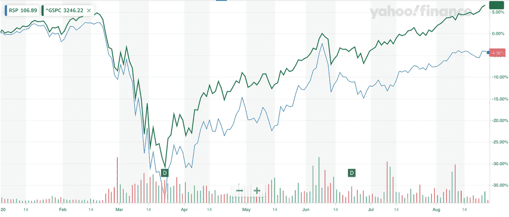
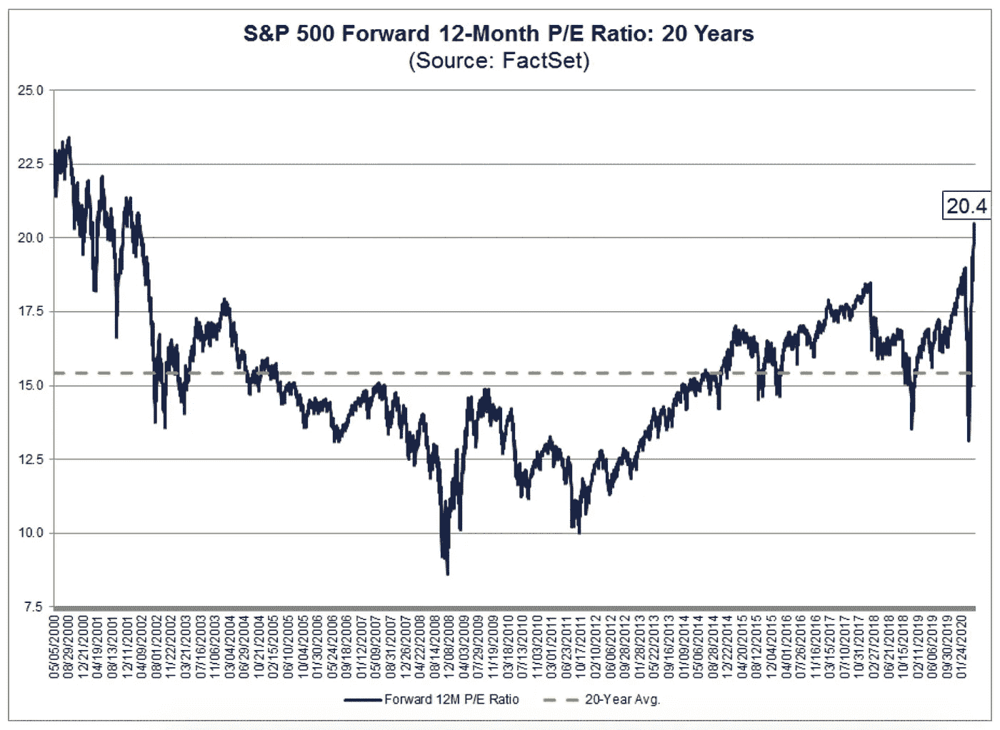
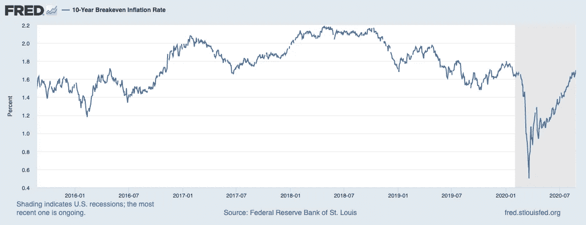

# 股市面临的最大威胁:经济复苏

> 原文：<https://medium.datadriveninvestor.com/the-biggest-threat-to-the-stock-market-economic-recovery-108a1dbc4b62?source=collection_archive---------9----------------------->

## 今天是什么驱动了令人困惑的市场

Photo by [Michelle Tresemer](https://unsplash.com/@mtresemer?utm_source=medium&utm_medium=referral) on [Unsplash](https://unsplash.com?utm_source=medium&utm_medium=referral)

> 满怀希望地旅行比到达目的地更好。

这就是过去几个月美国股市的情况。

对疫苗的承诺、对(更多)刺激的希望以及对经济快速复苏的预期，已将风险情绪从战壕中抽离出来，并使其在主街的悲观情绪之上高高飘起。

像我们这样的旁观者很容易嘲笑市场与经济现实脱节，但脱钩有完全合理的理由。

然而，股票市场的紧张情绪正在重新积聚。**由于估值过高，股票的风险回报开始变得没有吸引力**，如果有合适的催化剂，市场今天享受的**顺风可以立即消失**。

我们将探索:

*   为什么股市的反弹比任何人想象的都要猛烈
*   现在是什么在影响市场，以及
*   为什么我们所期待的经济复苏实际上可能会破坏它。

# 为什么股票与经济脱钩

1.  科技公司受益于疫情
2.  科技公司在市场中占据了巨大且不断增长的份额
3.  温和的美联储政策增加了货币供给和投资需求
4.  低利率和低收益率让股票更有吸引力
5.  低利率使得未来现金流(和高增长公司)更有价值

当我们谈论“市场”时，我们通常指的是标准普尔 500 指数。该指数是以市值加权的。较大的公司在指数中占有较大的份额。

Year-to-date, the equal-weighted S&P (blue) is still in the red while the market-cap-weighted index (green) is at an all-time high — that’s the difference Big Tech made. Source: [Yahoo Finance](https://finance.yahoo.com/quote/RSP/chart?p=RSP#eyJpbnRlcnZhbCI6ImRheSIsInBlcmlvZGljaXR5IjoxLCJ0aW1lVW5pdCI6bnVsbCwiY2FuZGxlV2lkdGgiOjYuODc4Nzg3ODc4Nzg3ODc5LCJ2b2x1bWVVbmRlcmxheSI6dHJ1ZSwiYWRqIjp0cnVlLCJjcm9zc2hhaXIiOnRydWUsImNoYXJ0VHlwZSI6ImxpbmUiLCJleHRlbmRlZCI6ZmFsc2UsIm1hcmtldFNlc3Npb25zIjp7fSwiYWdncmVnYXRpb25UeXBlIjoib2hsYyIsImNoYXJ0U2NhbGUiOiJwZXJjZW50IiwicGFuZWxzIjp7ImNoYXJ0Ijp7InBlcmNlbnQiOjEsImRpc3BsYXkiOiJSU1AiLCJjaGFydE5hbWUiOiJjaGFydCIsImluZGV4IjowLCJ5QXhpcyI6eyJuYW1lIjoiY2hhcnQiLCJwb3NpdGlvbiI6bnVsbH0sInlheGlzTEhTIjpbXSwieWF4aXNSSFMiOlsiY2hhcnQiLCJ2b2wgdW5kciJdfX0sImxpbmVXaWR0aCI6Miwic3RyaXBlZEJhY2tncm91bmQiOnRydWUsImV2ZW50cyI6dHJ1ZSwiY29sb3IiOiIjMDA4MWYyIiwic3RyaXBlZEJhY2tncm91ZCI6dHJ1ZSwicmFuZ2UiOnsiZHRMZWZ0IjoiMjAxOS0xMi0zMVQxNzowNjowNy42MzRaIiwiYmFzZSI6Inl0ZCIsInBlcmlvZGljaXR5Ijp7InBlcmlvZCI6MSwiaW50ZXJ2YWwiOiJkYXkifSwicGFkZGluZyI6MH0sImV2ZW50TWFwIjp7ImNvcnBvcmF0ZSI6eyJkaXZzIjp0cnVlLCJzcGxpdHMiOnRydWV9LCJzaWdEZXYiOnt9fSwiY3VzdG9tUmFuZ2UiOm51bGwsInN5bWJvbHMiOlt7InN5bWJvbCI6IlJTUCIsInN5bWJvbE9iamVjdCI6eyJzeW1ib2wiOiJSU1AiLCJxdW90ZVR5cGUiOiJFVEYiLCJleGNoYW5nZVRpbWVab25lIjoiQW1lcmljYS9OZXdfWW9yayJ9LCJwZXJpb2RpY2l0eSI6MSwiaW50ZXJ2YWwiOiJkYXkiLCJ0aW1lVW5pdCI6bnVsbCwic2V0U3BhbiI6eyJtdWx0aXBsaWVyIjoxLCJiYXNlIjoieXRkIiwicGVyaW9kaWNpdHkiOnsicGVyaW9kIjoxLCJpbnRlcnZhbCI6ImRheSJ9fX0seyJzeW1ib2wiOiJeR1NQQyIsInN5bWJvbE9iamVjdCI6eyJzeW1ib2wiOiJeR1NQQyJ9LCJwZXJpb2RpY2l0eSI6MSwiaW50ZXJ2YWwiOiJkYXkiLCJ0aW1lVW5pdCI6bnVsbCwic2V0U3BhbiI6eyJtdWx0aXBsaWVyIjoxLCJiYXNlIjoieXRkIiwicGVyaW9kaWNpdHkiOnsicGVyaW9kIjoxLCJpbnRlcnZhbCI6ImRheSJ9fSwiaWQiOiJeR1NQQyIsInBhcmFtZXRlcnMiOnsiY29sb3IiOiIjMDA4OTRjIiwid2lkdGgiOjIsImlzQ29tcGFyaXNvbiI6dHJ1ZSwic2hhcmVZQXhpcyI6dHJ1ZSwiY2hhcnROYW1lIjoiY2hhcnQiLCJzeW1ib2xPYmplY3QiOnsic3ltYm9sIjoiXkdTUEMifSwicGFuZWwiOiJjaGFydCIsImZpbGxHYXBzIjpmYWxzZSwiYWN0aW9uIjoiYWRkLXNlcmllcyIsInN5bWJvbCI6Il5HU1BDIiwiZ2FwRGlzcGxheVN0eWxlIjoidHJhbnNwYXJlbnQiLCJuYW1lIjoiXkdTUEMiLCJvdmVyQ2hhcnQiOnRydWUsInVzZUNoYXJ0TGVnZW5kIjp0cnVlLCJoZWlnaHRQZXJjZW50YWdlIjowLjcsIm9wYWNpdHkiOjEsImhpZ2hsaWdodGFibGUiOnRydWUsInR5cGUiOiJsaW5lIiwic3R5bGUiOiJzdHhfbGluZV9jaGFydCIsImhpZ2hsaWdodCI6ZmFsc2V9fV0sInN0dWRpZXMiOnsidm9sIHVuZHIiOnsidHlwZSI6InZvbCB1bmRyIiwiaW5wdXRzIjp7ImlkIjoidm9sIHVuZHIiLCJkaXNwbGF5Ijoidm9sIHVuZHIifSwib3V0cHV0cyI6eyJVcCBWb2x1bWUiOiIjMDBiMDYxIiwiRG93biBWb2x1bWUiOiIjRkYzMzNBIn0sInBhbmVsIjoiY2hhcnQiLCJwYXJhbWV0ZXJzIjp7IndpZHRoRmFjdG9yIjowLjQ1LCJjaGFydE5hbWUiOiJjaGFydCIsInBhbmVsTmFtZSI6ImNoYXJ0In19fSwic2V0U3BhbiI6eyJtdWx0aXBsaWVyIjoxLCJiYXNlIjoieXRkIiwicGVyaW9kaWNpdHkiOnsicGVyaW9kIjoxLCJpbnRlcnZhbCI6ImRheSJ9fX0-)

**该指数的快速反弹主要是由于科技股**，它们要么受疫情的影响最小，要么从中受益。像 Zoom (ZM)这样的公司直接得益于视频会议工具需求的增加，而亚马逊(Amazon)这样的公司间接受益于网络效应和规模，这有助于它们从规模较小的竞争对手那里夺取市场份额。

有赢家和输家是正常的，但由于输家规模较小，赢家规模较大，当按市值合计时，标准普尔 500 指数不成比例地反映了赢家。

**市场反弹的另一个原因是宽松或“稳健”的货币政策**。美联储以令人难以置信的速度向金融系统注入了大量现金，并降低了参考利率——这增加了货币供应。

随着超过储蓄和支出所需的现金闲置，其中一些自然会被投资。货币供应的激增帮助提振了投资需求。此外，参考利率的大幅下降将所有债券的收益率拉低至微不足道的水平——**更高回报的潜力使股票相对更具吸引力**。

最后，利率的降低也降低了折现率，公司未来的现金流就是根据这个折现率来评估的。因此，在遥远的未来，具有高增长和巨额预计现金流的公司立即变得更有价值——这些公司往往也是大中型科技公司，这加剧了它们对标准普尔 500 指数的影响。

 [## 收盘，但没有雪茄-股票市场目标在停滞的 COVID 救济中创新高|数据驱动…

### 专家聊天程序:一个协作市场，在这里人们可以和能够解决他们问题的专家聊天。是……

www.datadriveninvestor.com](https://www.datadriveninvestor.com/2020/08/18/close-but-no-cigar-stock-market-targets-record-highs-amidst-stalled-covid-relief/) 

# 今天的股票市场

1.  低机会成本
2.  高干粉
3.  高估值

投资股票的机会成本仍然很低。发达国家的主权债务收益率非常低，投资级债券收益率也是如此。高收益债券看起来仍有吸引力，但疫情尚未结束，因此资产负债表疲软和违约风险仍是非常现实的问题。

国际市场仍然是一个选择。然而，我们必须区分发达市场和新兴市场——欧洲市场对金融公司的敞口很大，不幸的是，这些公司在低利率环境下遭受了相当严重的损失。日本市场一直受到经济增长停滞的困扰，因此追求收益的投资者可能不会将其列入他们的遗愿清单。像高收益债券市场一样，新兴市场预计将受到疫情的最严重打击，因此投资者继续保持观望。

**干粉依然充足**——仍停留在货币市场基金中等待部署的资金量**仍保持在 5 万亿美元以上**，仅比 5 月份创下的历史高点略有下降。这意味着投资者手中仍有大量现金可以投入股市。

Forward P/E charted up till May 2020 — it has since continued climbing. Source: [FactSet](https://insight.factset.com/sp-500-forward-p/e-ratio-rises-above-20.0-as-eps-estimates-continue-to-fall)

股票的前景一片光明，除了……过高的估值。标准普尔 500 指数现在的市盈率是 35 倍，26 倍，而一年前是 22 倍，17 倍。这将估值推高到了互联网泡沫顶峰时的水平。

没错，远期收益受到了疫情的影响，但从基本面的角度来看，大盘要想保持上升轨迹，就必须**要么继续变得越来越贵**，要么**有理由相信未来几年收益增长将快于预期****(假设估值“正常化”，以抵消市盈率下降)。**

****这并不是说市场“应该修正了”**——总会有修正的鼓吹者，他们的持续存在证明了他们一贯的不准确性。我们能够也应该思考的是投资者肩上的天使和魔鬼之间不断升级的紧张关系:一方面是由兰博美联储提供的健康剂量的 FOMO，另一方面是对支付过高的担忧。**

****一个越来越焦躁不安和不确定的市场要求我们(散户)不要把握市场时机，而是要思考我们在市场中的时间**。对我们来说，试图称市场为顶部实际上是赌博。更有成效的做法是考虑，我们是否愿意坚持足够长的时间，让这种不确定性值得我们去做？**

# **经济可能如何伤害股票市场**

**在这种环境下，很容易想象如果新的病毒病例增加会发生什么，但具有讽刺意味的是，真正的威胁在于经济显示出惊人的强劲复苏迹象。**

****

**Latest 10-year inflation expectations stand at 1.70%. Source: [FRED](https://fred.stlouisfed.org/series/T10YIE)**

**最近几个月，我们已经看到预期通胀(10 年期美国国债收益率和 10 年期美国国债收益率之差)重新扩大——这是对美联储货币政策渗透到实际支出的信心的迹象，可以被视为经济的一个代表。**

**但是，如果经济反弹的力度超出预期，我们将会看到风险情绪爆发。这可能表现在:**

*   **避险资产抛售:美国国债、投资级债券和美元**
*   **风险资产反弹:股票、高收益债券、新兴市场证券**

**听起来就像一个正常的牛市，对不对？**问题在于帮助市场在 3 月份起飞的相同驱动因素:科技主导地位、过高的估值以及美联储对鸽派的承诺。****

**科技正在疫情获胜。但是如果病毒明天就消失了呢？随着投资者纷纷抛售股票，我们可能会看到市场大幅上涨，但在最初的欢欣鼓舞之后，我们会意识到科技股已经失去了优势，这些股票的预期收益和估值将会压缩。**

**更糟糕的是，债券的抛售和收益率的增加将会增加贴现率，使高增长股票的价值降低——大大降低。不幸的是，这些高增长的科技巨头是今天标准普尔 500 指数的基石。如果它们从基座上跌落，我们可能会在市场上看到与 3 月份以来类似的意外反应，但方向相反。**

**美联储已经[承诺至少在 2022 年](https://www.forbes.com/sites/sergeiklebnikov/2020/06/10/federal-reserve-will-keep-interest-rates-near-zero-until-2022/#595b9b3f2f8e)之前将参考利率保持在 0%。鲍威尔已经明确表示**他们愿意放弃一切*和*市场**的厨房水槽，这将支持货币供应和风险情绪，同时资助政府在实体经济中更多地直接支出。根据现代货币理论，主权债务没什么好担心的。**

**直到事情变得太好，市场开始比预期更早的转向鹰派政策。鉴于目前风险情绪对美联储的依赖程度，这种情况将削弱对美国股市的信心，并加剧收益率和贴现率上升的问题。**

**我特别提到美国股票，因为即使没有经济复苏，国际市场看起来也比以往任何时候都更有吸引力。再加上美国乏善可陈的病毒应对措施和选举，如果全球复苏超出预期，其他国家成为引导风险情绪的更好地方，人们希望减少对美联储每一句话的暴露。**美国潜在的资本外流可能会扫清市场。****

**当然，其他尾部风险依然存在——病毒可能变异，疫苗试验可能全部失败，美联储可能无缘无故地突然转向鹰派。然而，与令人惊讶的良好经济复苏相比，这些都是不可能的情景，这就是为什么我认为这是今天股票市场稳定的最大威胁。**

# **现在怎么办？**

**当我们仍在等待疫苗、选举和财政刺激的时候，关注我们自己的优先事项比以往任何时候都更重要。未来几个月唯一确定的事情是市场噪音，预期和焦虑只会放大这种噪音。**

**我不会提供投资建议，但我建议您回答以下问题，以便在管理投资组合时做出明智的决定，如果您拥有或想要广泛的市场敞口:**

*   **股票的潜在回报(或回答 FOMO)足够让你在不确定中坚持下去吗？**
*   **你关心接下来几个月会发生什么，还是你真的只对未来 5-10 年感兴趣？**
*   **有比股市更好的风险回报策略来表达你的市场观点吗？**
*   **分散投资于其他资产类别和国际市场是否符合你的偏好和风险状况？**

**如果你喜欢这篇文章，并且想了解更多关于我是如何投资和交易的，请随意看看我写的这篇文章。**

** [## 一个新手如何在市场崩溃时赚了 25%

### 诚实地看待我尝试的 6 种交易策略，以及我是如何在第一年把严重亏损变成 25%的利润的

medium.com](https://medium.com/datadriveninvestor/1st-year-trader-makes-25-percent-f4ff2a5c01dd) 

否则，所有最好的投资和交易。

*注:本文写于 2020 年 8 月下旬。*** 

**提供的所有信息仅用于教育目的，不得被解释为法律、税务、投资或财务建议。**

****访问专家视图—** [**订阅 DDI 英特尔**](https://datadriveninvestor.com/ddi-intel)**