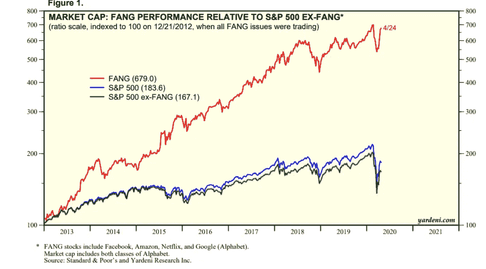

# 几十年来最大的财富转移

> 原文：<https://medium.datadriveninvestor.com/the-biggest-wealth-transfer-in-decades-6f5442a6a458?source=collection_archive---------7----------------------->

《追踪资本》揭示了在新冠肺炎危机期间，财富如何在不同类型的企业和个人之间转移，并放大了经济不平等。

Photo by [Sahand Hoseini](https://unsplash.com/@sahandh?utm_source=medium&utm_medium=referral) on [Unsplash](https://unsplash.com?utm_source=medium&utm_medium=referral)

回顾所有的全球危机和战争，钱不会简单地从世界上消失。它只是在这个前所未有的时代以惊人的速度运动。总有人利用危机作为杠杆从中赚钱，而另一些人则因为耗尽毕生积蓄而变得更穷。

新冠肺炎与以往的危机没有什么不同。某些少数人的财富增加了一大笔，而失业人数达到了顶峰，一些人付不起房租。

这些财富转移遵循一定的方向，我收集了三个最重要的方向，让你稍微睁开眼睛。

# 1.传统行业股到科技股

股票市场是衡量公司业绩和估值的重要指标。看看标准普尔 500 或道琼斯等指数，人们很容易认为整个市场表现良好，每个人都在购买股票，以保护他们的现金免受经济重新开放后可能出现的高通胀时期的影响。然而，新冠肺炎时期的市值变化显示，指数上涨主要依赖于某些少数股票。

Figure from the [Yardeni FANG Report](https://www.yardeni.com/pub/yardenifangoverview.pdf)

方；脸书、亚马逊、网飞和谷歌是标准普尔 500 股市上涨背后的最大参与者。如果没有这些股票，标准普尔 500 股市的反弹就没有那么显著。

所以，最初的财富转移是从传统行业巨头到科技公司。上图显示，这种转变实际上在 2015 年左右就开始了，但目前这种差距达到了顶峰。

这种转变的另一个指标是纳斯达克综合指数在 2020 年 6 月 10 日历史上首次收于 10000 美元之上。

当然，只有那些有能力投资这些资产的人才能从科技股推动的反弹中受益。

# 2.成长型初创企业到现金充裕的巨头

在公司的主要驱动力由转变为**增长**超越**盈利能力的重要性之前，**公司被用来储备一些现金以备不时之需。

然而，令人难以置信的增长竞赛推动初创企业通过多轮投资来筹集资金，甚至在盈利之前，并烧掉手中所有的现金来积极增长。最终，当危机袭来，员工的收入来源枯竭时，就没有现金来支付员工了。

> 根据美国破产研究所(美国消费者新闻与商业频道，2020 年)的数据，疫情期间破产申请数量显著增加。

换句话说，财富已经转移，目前正在从手里没有现金、在经济完全复苏之前无法呆在水下的初创企业转移到现金巨头中的富人，他们看透了这场危机。

在后电晕时期，幸存者可能会占据退出游戏者留下的所有市场份额缺口。

# 3.线下到线上业务

财富转移的另一个方向是从线下公司转移，这些公司被困在旧的经营方式中，无法将自己的存在转移到互联网上，而是通过互联网商店继续销售商品和服务。

特别是像亚马逊这样的巨头，他们的销售数字大幅飙升，仅在第一季度就宣布了 750 亿美元的收入。

你家附近的一家普通商店不得不向他们想长期留住的员工支付租金和薪水，却赚不到一分钱，而在线企业则受益于那些在家无聊的人，他们的银行账户里有一些现金，可以用来购买各种商品。

除了这三点，还有可能提到从服务经济到商品经济的转变，从实体服务到在线服务，从零点餐厅到送货上门等等，但有一点是肯定的，那就是另一场危机是大企业吃小企业和富人扩大与穷人差距的机会。经济不平等再次成为明天要解决的问题。

[订阅](http://eepurl.com/g6lZYf)我的时事通讯，在你的邮箱里获得未来的文章！

*免责声明:本文仅用于信息或教育目的，并非任何形式的个性化建议。使用这些信息需要您自担风险。*

# 参考

 [## 在冠状病毒疫情期间，JC Penney 可能会加入越来越多的破产名单

### 疫情冠状病毒已经将许多苦苦挣扎的公司推到了破产的边缘。在家订单…

www.cnbc.com](https://www.cnbc.com/2020/05/15/these-companies-have-filed-for-bankruptcy-since-the-coronavirus-pandemic.html)  [## 亚马逊公布第一季度收入 750 亿美元，但预计将支出 40 亿美元的新冠肺炎成本

### 周四，亚马逊成为冠状病毒疫情的大赢家之一，宣布其收入为 754 亿美元…

www.theguardian.com](https://www.theguardian.com/technology/2020/apr/30/amazon-revenues-jeff-bezos-coronavirus-pandemic)