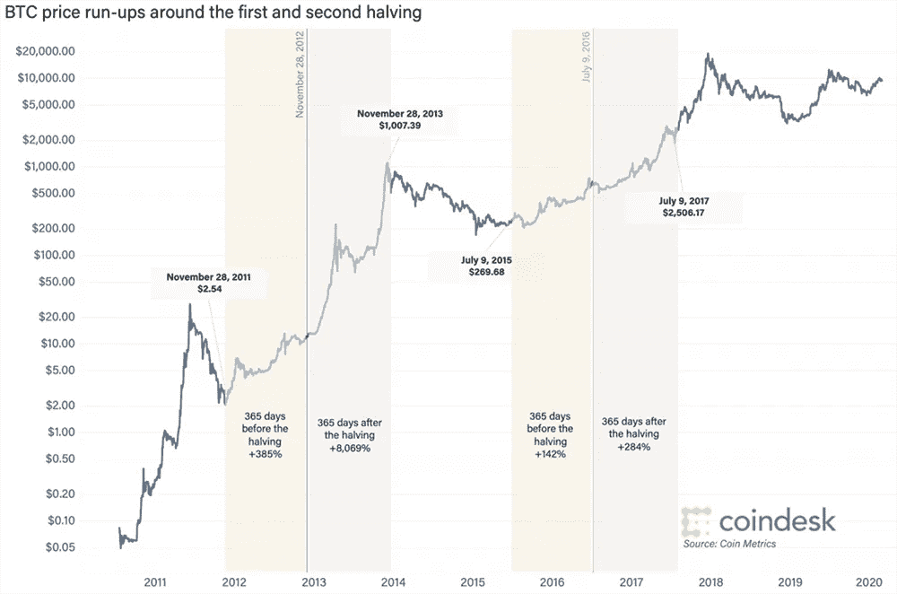

# 比特币减半及其对采矿业的影响

> 原文：<https://medium.datadriveninvestor.com/the-bitcoin-halving-and-how-it-affects-mining-28f0a25a8375?source=collection_archive---------3----------------------->


The upcoming halving and mining.

2020 年 5 月，**比特币(BTC)** 将见证两件重大事件。接下来是 [**比特币披萨日**](https://www.investopedia.com/news/bitcoin-pizza-day-celebrating-20-million-pizza-order/) ，发生在 2010 年 5 月 22 日，当时 BTC 第一次被用于支付披萨的商业订单。更重要的事件叫做 ***减半*** ，是比特币协议激励体系的一部分。预计大约在 2020 年 5 月 11 日至 15 日，减半将会发生。这将导致整体补贴减少，或者更简单地说，矿工获得的比特币奖励减少。当前的区块奖励是矿工每验证一个区块 12.5 BTC，这意味着当减半发生时，区块奖励将减半至 6.25 BTC。这极大地影响了矿工群体，而且这种影响似乎会影响到开采比特币的盈利能力。

## 采矿解释说

减半的目的是通过限制进入流通供应的比特币数量来降低比特币的通胀。这似乎是其创造者中本聪的设计，旨在提供一个重视数字资产稀缺性的通缩模型。这是根据与开采黄金相同的概念。比特币作为一种数字资产，其特征可能与黄金等实物资产相似。和黄金一样，比特币需要一个叫做 ***开采*** 的过程。比特币挖矿是一个完全数字化和电子化的过程，但其理念是必须从 ***矿工*** 的工作中创造出来。就比特币而言，矿工是网络上的节点或电脑。

开采黄金时，他们的矿工消耗资源，需要从地球上提取贵金属。金矿开采作业可以简单到沿着溪流淘金或使用重型机械切割岩石。比特币矿工使用计算机处理能力和消耗电力作为他们的采矿资源。提炼黄金和开采比特币的过程是赋予这些资产价值的部分成本。在比特币中，给予矿工的激励是新硬币，作为对他们贡献计算资源的奖励。

[](https://www.datadriveninvestor.com/2019/12/12/will-the-cryptocurrency-industry-be-dead-or-alive/) [## 加密货币行业是死是活？数据驱动的投资者

### 九月初，我们在 X-Order 内部就代币市场的未来进行了一场辩论。有趣的是，我们的观点是…

www.datadriveninvestor.com](https://www.datadriveninvestor.com/2019/12/12/will-the-cryptocurrency-industry-be-dead-or-alive/) 

比特币区块链对任何想成为矿工的人开放，但他们必须将自己的计算资源贡献给所谓的**中本聪共识**或 ***工作证明(PoW)*** 共识机制。在 BTC 采矿，矿工必须互相竞争，以解决一个密码难题。矿工必须使用在*散列率*中指定的专用采矿设备。这些设备每秒可以计算万亿次哈希(TH/sec)。散列率越高越好。哈希是指使用 SHA256 算法的单向加密哈希函数。

矿工必须首先从节点*内存池*中取出事务，并将它们散列到*块*中。然后，他们必须在块中添加一个随机的十六进制数，并再次对其进行哈希运算。结果或解决方案必须小于或等于称为*难度目标*的值。使用概率共识，第一个发现被称为*随机数*的谜题的解的矿工成为该块的验证者。通过验证的矿工将区块添加到区块链，并收集 BTC 作为他们的奖励。平均而言，比特币区块链上的块传播时间为每 10 分钟一次。当矿商在达成共识期间核实交易时，他们还收取交易费作为另一种形式的激励。

整个过程是 PoW 共识机制的一部分，该机制提供关于区块链上的交易的有效性的协议，并且还保护网络免受攻击。这是因为一旦块被验证，不良行为者或黑客就不能撤销或修改交易，除非他们在网络上拥有大部分散列能力。这可能非常昂贵，以至于开采比攻击好得多。块中的所有事务都是不可变的，因此 consensus 也为区块链提供了安全性。

## 减半的影响

加密货币社区对矿工的整体影响有很多看法。减少激励并不完全是矿商想要的，但这是比特币源代码的一部分。每隔 210，000 个区块，也就是大约每 4 年，比特币区块链就会减半。这在[比特币来源](https://github.com/bitcoin)代码中被标识为:

```
**“Consensus.nSubsidyHalvingInterval = 210,000”**
```

削减对矿商的奖励将会减少激励，因此对盈利能力的影响仍是个问题。已建成的矿池将面临寻找运营成本和采矿回报之间的平衡。

另一个要考虑的是难度目标。如果散列率高(意味着网络上有更多的挖掘者)，这可能会增加；如果散列率低(意味着网络上有更少的挖掘者)，这可能会减少。如果减半导致矿工退出，将会降低难度目标。这可能是新矿工进入网络的机会，因此它有点像一个重置按钮。已建立的矿池可以分成更小的矿池，以实现回报最大化。散列率最高的大型矿业公司可能会重新配置其系统，通过淘汰旧的采矿设备和优先考虑新的资源投资来削减成本。

所有矿工都有固定成本。这主要是采矿设备和电力的成本。如果对每个人都一样，那么公平地说，当利润减半时，所有的利润都会减半。对于散列率较高的矿商来说，情况就不同了，因为他们的运营费用也最高。为了实现更高的哈希速率，需要更多的设备，因此他们不得不淘汰一些设备，以减少运营支出。过去的集体奖励让这些矿商得以抵消运营成本，但随着奖金减半，它们将不得不缩减规模。

这是新矿工进入的机会，因为缩减意味着难度目标的降低。这使得在减半开始时更容易成为矿工，但最终随着更多矿工进入网络，难度目标会增加。对于拥有低效采矿设备的矿商来说，这也是一个开始淘汰旧设备并投资于更先进的 ASIC 设备的时候，这种设备可以提供更高的哈希速率。

削减电费是减半后矿商可能采取的另一项措施，以最大限度地提高盈利能力。矿工们也会考虑他们的电力来源。不仅在电力便宜的地方，而且在一年中大部分时间气候寒冷的地方建立采矿作业已经变得更加理想。像加拿大北部和冰岛这样的地方已经成为理想之地，这是因为较冷的温度有利于控制采矿设备的过热，以及像冰岛的地热能这样的可再生资源带来的廉价电力成本。

## 检查成本

减半后，为了获得相同数量的 BTC 奖励，矿工将不得不运行两倍的计算次数，同时电力成本也将增加。如果拥有太多采矿设备的成本不高于或处于盈亏平衡点，它们将不得不被淘汰。作为一个矿商，它是关于利润最大化和削减成本或保持低成本。就会计而言，一旦投入生产，设备本身很快就会失去价值，即资产折旧。如果你的收入只有以前矿工收入的一半，重新考虑当前的采矿配置就变得很重要。

我要举一个理论矿工操作的例子。我们必须考虑采矿中涉及的 4 个因素，即:

*   哈希速率(TH/秒)
*   比特币价格(以美元计的市值)
*   电能消耗(瓦)
*   电费(千瓦时)

让我们假设矿工使用的是 Antminer S17，其哈希速率为 70 TH/sec，最大功耗为 3，313 W。比特币的价格为每 1 BTC 7，158.00 美元。电费为每千瓦时 0.12 美元。全功率操作采矿机的每日成本为 9.54 美元。在一个月内，即(使用 30 天)286.24 美元，连续不间断运行一年后，为 3，434.92 美元。这对于电费来说是一大笔钱，所以矿商必须能够用 BTC 奖励来抵消这笔钱。为了简单起见，现在我们只从 1 个采矿设备开始。

假设当前的激励是 12.5 BTC，价值为每 BTC 7，158.00 美元，矿工通过验证一个比特币块将获得 89，475.00 美元。理论上来说，如果只有一个矿工而没有任何竞争。我们必须记住，这是一个概率共识，其中有不止一个参与者。

事实是，将有更多的矿工竞争，所以散列率将增加，使第 70/秒散列率不如第 1400/秒 ASIC 矿工。基于一个[在线采矿计算器](https://www.buybitcoinworldwide.com/mining/calculator/)，用上面的规格矿工实际上会无所适从。这意味着你的普通矿工必须有超过 70 秒的速度才能达到收支平衡。根据这个计算器，这将是大约 182 秒/秒(没有电力成本的变化),不会更低。矿商可以利用这些计算来找出他们可以削减的成本。目前比特币网络上的总哈希速率(截至 4/18/20 17:00:00 GMT)为 113.4030 EH/sec(每秒 Exahash)。


Results from the mining calculator.

当减半到来时，可能会有大量矿工退出，他们需要从生产中移除一些采矿设备，以降低成本。这将降低散列率，因此也降低了目标难度。挖掘者可以以较低的哈希速率开始挖掘，直到哈希速率随着更多挖掘者的返回而再次增加。

如果其他矿商不能用一半的回报维持现有系统的成本，他们可能就会投降。该矿商可以在激励措施仍然有利可图的情况下积累 ASIC 采矿设备，以提高其散列率。现在，额外的哈希功能只会增加更多的运营成本，而不是验证数据块，因此有必要淘汰非生产性资源。这只是生意的一部分。优势将是矿工谁拥有最好的和最有效的 ASIC 采矿设备。

## 稀缺与升值

赋予黄金和比特币价值的是它们的 ***稀缺性*** 。你不能凭空生产黄金或 BTC，否则每个人都可以拥有它，并变得不那么值钱。提炼黄金需要劳动力，加工比特币需要劳动。当供给不是无限的，而是有限的时候，比特币就变得更有价值了。总共只有 2100 万 BTC，并且这是在比特币区块链上每 10 分钟分发一次的。减半的目的是控制 BTC 的供应量，以免很快耗尽 BTC 的总供应量。当一项资产的供给稀缺时，它会因需求而变得更有价值。只要对 BTC 有需求，这就是在公开市场上提高价格价值的驱动力。

比特币作为数字资产的 ***升值*** 也是矿商的主要动机。如果价格值高的话，如果比之前多的话，奖励有没有减少当然无所谓。这使得 BTC 成为市场上最强的加密货币，因为它具有储值功能。至少事情是这样的。尽管中本聪的意图是让 BTC 成为 P2P 电子支付系统中的数字交易媒介，但投资者却将其视为数字黄金。你不太可能看到 BTC 被用来购买一杯咖啡，甚至是一个甜甜圈。有人认为它对于微支付来说并不理想，作为一种 GPT(通用技术)来储存价值更有意义。黄金也是如此，因为你不能用一块金块或一点金子在加油站买零食。

## 挖矿会不会更集中化？

另一个讨论点是减半可以集中采矿。这是因为当你有更少的块奖励，矿工可以合并成一个更大的采矿池，以增加哈希功率和利润最大化。不幸的是，对于较小的矿池来说，这些较大的矿池拥有更强的哈希能力，可能会阻止其他矿机验证区块。这种不匹配是意料之中的，因为当你面对 ASIC 设备时，你肯定不能使用台式计算机来验证一个块。你最好的办法是加入一个矿池，贡献你的计算资源份额，如果区块被验证与你的贡献成比例，就可以获得奖励。

最终还可能发生的是一个更加分散的采矿社区。随着奖金减半，而不是立即采取价格行动，矿商可能会从他们的资金池中分离出来，试图实现利润最大化。较大的矿池可能会分裂成较小的矿池，新的矿商进入，而其他矿商退出网络。更大的池也可以去除低效的矿工，并优先考虑那些具有最新 ASIC 设备的矿工。这是有意义的，因为旧的采矿设备根本无法与现有的新产品相匹配。在这一点上，可以公平地说，一些资源池可能会由于效率低下而解体，而其他资源池可能会整合在一起。

更严重的问题是**“51%攻击”**。比特币理论设计的好处在于它有制衡机制。如果您拥有网络上的多数哈希功能(例如，51%的哈希功能)，您可以控制从该点开始的交易，但不能控制整个区块链中的反向交易。区块链越大，攻击就应该越安全，任何人都越难试图逆转所谓的历史街区。它还需要大量的计算资源和散列能力，这使得攻击更加昂贵，并将在经济上毁掉攻击者。因此，它阻止了攻击，因为代价比采矿更大。网络上的节点还可以做另一件事来杜绝这种攻击，那就是激活一个 ***硬叉*** ，这是一个完全不同的区块链。这将分裂区块链，并在矿工转移到单独的网络时留下攻击者。

## 采矿仍在继续

此前比特币价格减半后的市场信号表明价格价值上升。因此，它不太可能导致一些报告所认为的矿工死亡螺旋，因为奖励减少。只要网络上有激励，就会有矿工在区块链验证区块。当最后一次减半发生在 2016 年 7 月 16 日时，价格最初跌至 610 美元，然后又回升。这也可能发生在任何减半事件中。价格价值的变化也会受到矿商行为的影响，而矿商的行为会影响网络的散列率。



BTC price action show that a price increase usually followed from the previous halvings (Source [COINDESK](https://www.coindesk.com/bitcoin-halving-explainer)).

对矿工的整体奖励仍然是比特币区块链的重要组成部分。只要它受到激励，它就应该继续发挥作用。这可以被视为矿工们竞争验证区块时的一场零和游戏*理论。只要有区块要处理，就会有矿工。它实际上是好的，竞争较少，有机会验证更多的区块，并收集更多的奖励。较低散列率的主要问题是较慢的事务处理时间，所以这是一个伸缩问题。由于网络是分散的，它对任何想加入的节点开放，因此散列率可以迅速回升。至于预测 BTC 减半后的价格价值，比特币大师 Andreas Antonopoulos [最好的解释是](https://youtu.be/2TiAPAYY0NA)就像“占星术或阅读茶叶”最终将由市场决定价格。*