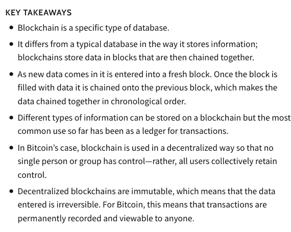
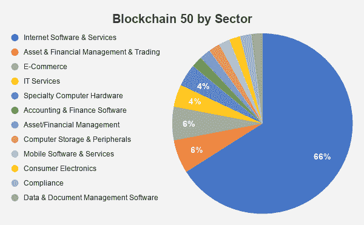
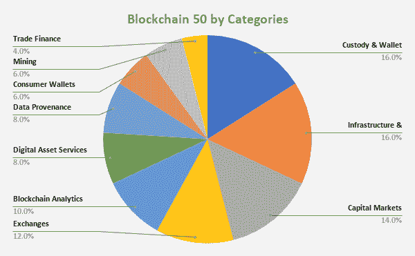

# 区块链 50 强:未来你需要知道的新公司排名

> 原文：<https://medium.datadriveninvestor.com/the-blockchain-50-the-new-company-ranking-you-need-to-know-for-the-future-1391aed3cb05?source=collection_archive---------16----------------------->

## 区块链是一项迅速崛起的技术，正在彻底改变支付、投资、资产管理等领域。以下是当今这个快速发展的全球市场的领导者。

Photo by [Launchpresso](https://unsplash.com/@launchpresso?utm_source=medium&utm_medium=referral) on [Unsplash](https://unsplash.com?utm_source=medium&utm_medium=referral)

# 概观

我们已经对列表上瘾了。想要证物 A 吗？看看你在社交媒体上的新闻吧。天网知道这个。想想你每天看到多少文章是以这样的标题开头的:“10 个最好的……”、“5 个最棒的……”和“25 个最棒的……”等等，答案是很多。为什么？因为我们，作为个人和社会，都对排名很好奇——“谁”或“什么”在列表中，更有趣的是，在许多情况下，谁或什么不在列表中。

但是，在我们开始点击、阅读、分享和讨论我们今天看到的“最佳”动作电影、布朗尼和四分卫的无尽名单之前，商界已经有了自己的名单——公司努力成为其中一员的名单。被列入最负盛名的名单，如[财富 500 强](https://fortune.com/fortune500/)或[公司 100 强](https://www.inc.com/magazine/19830501/8468.html)，长期以来被认为是大大小小公司的理想目标。公司希望在最佳工作场所、客户服务等方面名列前茅。是的，他们防止被列入“淘气名单”，就像那些在员工、客户甚至投资者的看法上与“好”相反的人。

因此，尽管今天列表可能被认为过于重要，但它们在商业环境中是一个现实。正因为如此，它们可以成为经济和技术领域即将发生的重要变化的领先指标。作为一名战略管理教授和顾问，我饶有兴趣地阅读了研究公司 [CB Insights](https://www.cbinsights.com/) 如何产生了第一份“[区块链 50](https://www.cbinsights.com/research/report/blockchain-technology-companies/) ”名单。他们刚刚发布的题为“[区块链 50:使用区块链&加密技术改造行业的创新者](https://www.cbinsights.com/research/report/blockchain-technology-companies/)”的报告表明，区块链——是的，对我们许多人来说，这仍然是一个新的、复杂的陌生概念——在商业世界中的地位越来越重要，并有可能成为未来的关键技术之一。

# 区块链 50

如果你听说过区块链，可能是因为比特币和加密货币。然而，区块链概念的适用性远远超出了这些领域，因为它有可能彻底改变我们存储、保护和使用数据的方式。关于区块链的快速概述，你可以看到 [Investopedia](https://www.investopedia.com/) 对图 1 中的概念的理解(*区块链解释*):

**图 1:区块链讲解**

**Source:** [Investopedia](https://www.investopedia.com/) ([https://www.investopedia.com/terms/b/blockchain.asp](https://www.investopedia.com/terms/b/blockchain.asp))

因此，在查看最近发布的区块链 50 强名单(如下表 1 所示)时，有几个关键要点。这些将在下面的分析部分讨论。

**表 1: CB Insights 区块链 50**

1 — [比特币基地](https://www.coinbase.com/)(美国):5.39 亿美元

互联网软件与服务*(类别:交易所)*

2 — [巴克特](https://www.bakkt.com/)(美国):4.83 亿美元

资产与金融管理与交易软件*(类别:数字资产服务)*

3 — [比特大陆科技](https://www.bitmain.com/)(中国):4.5 亿美元

专业计算机硬件*(类别:矿业)*

比特弗瑞(荷兰):1.7 亿美元

专业计算机硬件*(类别:矿业)*

5 — [连锁分析](https://www.chainalysis.com/)(美国):1.67 亿美元

互联网软件和服务*(类别:区块链分析)*

6 — [BlockFi](https://blockfi.com/) (美国):1.63 亿美元

会计财务软件*(类别:托管&钱包服务)*

7 — [数字资产](https://www.digitalasset.com/)(美国):1.42 亿美元

互联网软件与服务*(类别:基础设施&开发)*

8 — [R3](https://www.r3.com/) (美国):1.12 亿美元

互联网软件与服务*(类别:基础设施&开发)*

SEBA 加密公司:1.04 亿美元

资产/金融管理*(类别:数字资产服务)*

帕克索斯公司(美国):9300 万美元

电子商务*(类别:资本市场)*

11 — [总账](https://www.ledger.com/)(法国):8600 万美元

电脑存储及外设*(类别:保管&钱包服务)*

12 — [比特哥](https://www.bitgo.com/)(美国):8600 万美元

互联网软件与服务*(类别:托管&钱包服务)*

13 — [区块链](https://www.blockchain.com/)(英国):7100 万美元

互联网软件与服务*(类别:托管&钱包服务)*

14 — [安克雷奇](https://anchorage.com/)(美国):5700 万美元

互联网软件与服务*(类别:托管&钱包服务)*

Axoni (美国):5600 万美元

互联网软件和服务*(类别:资本市场)*

比特熊猫(澳大利亚):5200 万美元

电子商务*(类别:交易所)*

17 — [第 1 层 IT 服务](http://www.layer-1.com/)(美国):5200 万美元

IT 服务*(类别:矿业)*

瑞士比特币公司:4900 万美元

互联网软件与服务*(类别:托管&钱包服务)*

19 — [ErisX](https://www.erisx.com/) (美国):4800 万美元

互联网软件与服务*(类别:交易所)*

20 — [耐火砖](https://www.fireblocks.com/)(美国):4600 万美元

互联网软件与服务*(类别:数字资产服务)*

21 — [证券化](https://www.securitize.io/)(美国):3900 万美元

互联网软件和服务*(类别:资本市场)*

比特瓦拉(德国):3800 万美元

互联网软件和服务*(类别:消费者钱包)*

23 — [凯西](https://www.abra.com/)(美国):3600 万美元

移动软件和服务*(类别:消费者钱包)*

24 — [野牛踪迹](https://bisontrails.co/)(美国):3100 万美元

互联网软件与服务*(类别:基础设施&开发)*

25 — [CoolBitX](https://coolbitx.com/) (台湾):3000 万美元

消费电子*(类别:基础设施&开发)*

26 — [Curv](https://www.curv.co/) (美国):3000 万美元

互联网软件与服务*(类别:托管&钱包服务)*

27 — [共生体](https://www.symbiont.io/)(美国):2900 万美元

互联网软件和服务*(类别:资本市场)*

SFOX (美国):2400 万美元

互联网软件与服务*(类别:交易所)*

阿尔法点(美国):2300 万美元

互联网软件和服务*(类别:基础设施&开发)*

尼沃拉(联合王国):2000 万美元

互联网软件和服务*(类别:资本市场)*

31 — [CipherTrace](https://ciphertrace.com/) (美国):1800 万美元

互联网软件和服务*(类别:区块链分析)*

32 — [咨询公司](https://consensys.net/)(美国):1800 万美元

互联网软件与服务*(类别:基础设施&开发)*

梅塔科(瑞士):1700 万美元

资产金融管理与交易软件*(类别:托管&钱包服务)*

34—(爱尔兰):1600 万美元

互联网软件与服务*(类别:贸易融资)*

35 — [数据秋葵](https://www.datagumbo.com/)(美国):1600 万美元

互联网软件与服务*(类别:数据来源)*

炼金术(美国):1500 万美元

互联网软件与服务*(类别:基础设施&开发)*

37 — [Clearmatics](https://www.clearmatics.com/) (英国):1200 万美元

合规*(类别:资本市场)*

以色列:1000 万美元

互联网软件和服务*(类别:数据来源)*

39 — [警卫时间](https://guardtime.com/)(瑞士):800 万美元

数据和文件管理软件*(类别:数据来源)*

40 — [Coin Metrics](https://coinmetrics.io/) (美国):800 万美元

互联网软件和服务*(类别:区块链分析)*

41 — [Tokeny Solutions](https://tokeny.com/) (卢森堡):600 万美元

互联网软件和服务*(类别:资本市场)*

42 — [Prime Trust](https://www.primetrust.com/) (美国):500 万美元

互联网软件与服务*(类别:基础设施&开发)*

43 — [莫内塔戈](https://www.monetago.com/)(美国):500 万美元

IT 服务*(类别:数据来源)*

44 — [货币公司](https://www.coinfirm.com/)(联合王国):500 万美元

互联网软件和服务*(类别:区块链分析)*

新加坡:300 万美元

互联网软件与服务*(类别:贸易融资)*

46 — [森贝](https://www.sentbe.com/)(韩国):200 万美元

互联网软件和服务*(类别:消费者钱包)*

47 — [币安](https://www.binance.com/en)(未披露地点):不适用

电子商务*(类别:交易所)*

48 — [数字货币集团](https://dcg.co/)(美国):不适用

资产与金融管理与交易软件*(类别:数字资产服务)*

49 — [双子座](https://www.gemini.com/)(美国):不适用

互联网软件与服务*(类别:交易所)*

50 — [平局](https://thetie.io/)(美国):不适用

互联网软件与服务*(类别:区块链分析)*

Photo by [Hitesh Choudhary](https://unsplash.com/@hiteshchoudhary?utm_source=medium&utm_medium=referral) on [Unsplash](https://unsplash.com?utm_source=medium&utm_medium=referral)

# 分析

## **资助**

今天，有大量风险资本进入区块链市场，CB Insights 为区块链 50 家公司汇总的融资数据就是证明。总体而言，他们详细列出了支持 50 家公司中 47 家公司的投资公司(3 家不可用)，截至 2020 年 12 月，这些公司总共获得了 34.87 亿美元的风险资本支持。分析区块链 50 的融资的一些重要发现包括:

*   位居榜首的公司是比特币基地，到目前为止已经获得了超过 5 亿美元的资金；
*   融资额最高的两家公司，比特币基地和 [Bakkt](https://www.bakkt.com/) ，都是总部设在美国的企业，总共获得了超过 10 亿美元的私募股权融资；
*   虽然[比特大陆科技](https://www.bitmain.com/)是唯一一家跻身区块链 50 强的中国公司，但就风险投资兴趣而言，它是第三大公司，迄今已获得 4.5 亿美元支持；和
*   迄今为止，共有 9 家公司获得了超过 1 亿美元的私募股权投资。

所有这些公司目前都是私有的，但随着这些公司进入市场，应该会有很大的 IPO 兴趣(后面会有更多)。

Photo by [NASA](https://unsplash.com/@nasa?utm_source=medium&utm_medium=referral) on [Unsplash](https://unsplash.com?utm_source=medium&utm_medium=referral)

## **国籍**

今天区块链市场真正令人惊奇的事情之一是这项新兴技术真正的全球性。在分析区块链 50 时，从下面的表 2 ( *区块链 50 的位置*)中可以看出，今天最大的区块链公司中占主导地位的是美国公司——50 家中有 30 家。然而，其余的公司分散在欧洲和亚洲，到目前为止还没有强大的中国业务。事实上，中国在这个最初的区块链 50 强排名上只有一家公司。

 [## 面向开发者的区块链；API 提供商的重要性|数据驱动的投资者

### 在过去的几年里，区块链突然成为这个领域最热门的新技术。每一个…

www.datadriveninvestor.com](https://www.datadriveninvestor.com/2020/11/25/blockchain-for-developers-the-importance-of-api-providers/) 

**表 2 —区块链 50 的位置**

*   美国:30 人
*   联合王国:4 名
*   瑞士:4 名
*   中国:1
*   荷兰:1 名
*   爱尔兰:1 人
*   法国:1
*   德国:1
*   奥地利:1 名
*   卢森堡:1 名
*   以色列:1
*   新加坡:1
*   韩国:1 名
*   台湾:1
*   未公开的地点:1

是的，你*没看错。不同于财富 500 强或者今天人们可能找到的任何其他商业名单，区块链 50 实际上有一家公司([币安](https://www.binance.com/en))被列为有一个未公开的地点。这就是今天这个仍然神秘的新兴技术市场！*

Photo by [André François McKenzie](https://unsplash.com/@silverhousehd?utm_source=medium&utm_medium=referral) on [Unsplash](https://unsplash.com?utm_source=medium&utm_medium=referral)

## **业务线**

今天区块链市场的广度可以从区块链 50 强名单中包含的公司类型中看出。CB Insights 对这些公司进行了细分，既包括它们从事的一般业务部门，也包括它们在市场中的特定业务领域。从图 2 中可以看出(*区块链 50，按部门划分*)，如今新兴区块链市场中排名前 50 的公司主要被归类为“互联网软件&服务”领域，实际上有三分之二的公司都是如此。其余的被分为不同的部门，包括软件、硬件和服务——包括消费者和企业——与区块链相关。

**图 2:区块链 50 分行业**

**Source Data:** [CB Insights](https://www.cbinsights.com/), [Blockchain 50: The Innovators Using Blockchain & Crypto To Transform Industries](https://www.cbinsights.com/research/report/blockchain-technology-companies/)

在快速崛起的行业中，公司提供的服务的多样性可以在下面的图 3 ( *区块链 50 分类*)中看到，因为在一般的区块链空间中，有一系列公司正在创新和竞争的子空间。在这份最初的区块链 50 强排名中，被归类为托管和钱包服务以及区块链基础设施和发展的公司是最常见的分类，紧随其后的是利用区块链进行资本市场和交易以及提供区块链分析的公司。综上所述，市场上各公司采取的方法的多样性表明，如今世界各地对利用区块链技术进行各种活动的兴趣和实验是多么广泛，从投资到支付到资产管理到分析，再到确保任何东西的来源。

**图 3:区块链 50 分类**

**Source Data:** [CB Insights](https://www.cbinsights.com/), [Blockchain 50: The Innovators Using Blockchain & Crypto To Transform Industries](https://www.cbinsights.com/research/report/blockchain-technology-companies/)

## **未来**

这 50 家创新型区块链公司的未来会如何？当然，就个人而言，这很难说。正如任何新兴技术一样，总会有赢家和输家，那些在技术曲线上猜对的人和那些没有猜对的人。有些人能够很好地管理自己的成长，有些人则不行。大公司会进行收购和吸收，竞争对手会进行整合。然而，有了像这样的创新技术，1、2、3……或更多的公司将会成为区块链各自领域的领导者。对于消费者和企业来说，整个区块链市场的哪个领域将是最关键的，这也将随着时间的推移而显现出来。

Photo by [Terry](https://unsplash.com/@blueskin?utm_source=medium&utm_medium=referral) on [Unsplash](https://unsplash.com?utm_source=medium&utm_medium=referral)

在最初的区块链 50 强排行榜上，这些公司中有区块链的“谷歌”吗？只有时间能证明一切。然而，可以肯定的是，这些公司肯定会在未来几年内受到关注，由于一些公司选择上市，它们的 IPO(首次公开募股)应该会吸引投资者的极大关注，因为它们出现在当今这个新兴的重要技术领域。是的，将这份最初的区块链 50 强名单归档，因为随着这项技术的快速发展，这份名单——以及名单上的创新公司——可能会在不久的将来产生一些真正的赢家，并有助于推动整个区块链市场。简而言之，请保持关注并系好安全带，因为这看起来是一次非常迷人的旅程！

# **和我一起在媒体上写作**

想开始自己的写作之旅吗？想通过发布自己创作的文章来更好地建立个人品牌？考虑今天和我一起在媒体上写作，并使用这个链接:【https://davidwyld.medium.com/membership[。这样做，你将帮助支持我的写作，因为我收到你的媒介会员费的一部分。](https://davidwyld.medium.com/membership)

# 关于大卫·怀尔德

大卫·怀尔德([dwyld@selu.edu](http://dwyld@selu.edu/))是路易斯安那州哈蒙德市[东南路易斯安那大学](https://www.southeastern.edu/)的战略管理教授。他是管理顾问、研究员/作家、出版商、执行教育家和经验丰富的专家证人。

**大卫·怀尔德的社交媒体链接:**

*   上[脸书](https://www.facebook.com/david.wyld)
*   上 [LinkedIn](https://www.linkedin.com/in/david-wyld-4923707/)
*   在[推特上](https://twitter.com/GoodAdvicePub)

## 访问专家视图— [订阅 DDI 英特尔](https://datadriveninvestor.com/ddi-intel)