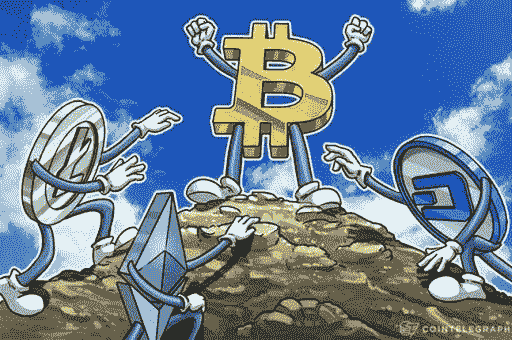
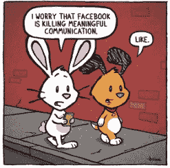
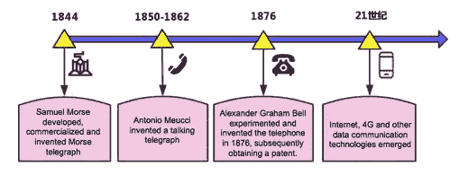
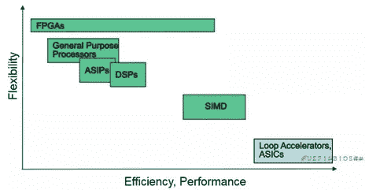

# 区块链行业陷入困境，如何突围目前的局面？第一部分

> 原文：<https://medium.datadriveninvestor.com/the-blockchain-industry-is-in-a-tight-spot-how-to-break-out-of-the-current-situation-part-1-2520fea20136?source=collection_archive---------9----------------------->

## 在第一部分中，我们讨论了困惑的原因，历史上消失的行业，以及投资新兴行业的困难。

投资和研究机构 X-Order 的研究员 Robin Gu 撰文，该机构致力于研究开放金融中的价值捕捉。我们努力成为新金融和与科学和研究相关的跨学科领域之间的桥梁。 *由托尼·陶(Tony Tao)创立，他也是 NGC 风险投资公司的合伙人。*

BTC 从年初的 3k 美元稳步上升到 1 万多美元，2019 年 10 月小幅下降到 8k 美元。当我和其他行业的朋友聊天时，他们都觉得[加密货币](https://www.datadriveninvestor.com/glossary/cryptocurrency/)行业今年的回报还不错。

October 2018–2019 Bitcoin Chart, CoinMarketCap

如果你单看 BTC，情况确实如此。然而，奇怪的是，加密货币行业的情绪变得更加糟糕，这是只有业内人士才能理解的事情。

# 困惑的原因

似乎主流加密货币和其他替代货币并没有随着 BTC 一起崛起。很多山寨币甚至出现了大幅下跌。除了汇率和 IEO 与 BTC 不相上下之外，标准货币开始贬值，这增加了每个人的焦虑。

 [## 5 行业转型区块链应用|数据驱动投资者

### 除非你一直生活在岩石下，否则我相信你现在已经听说过区块链了。而区块链…

www.datadriveninvestor.com](https://www.datadriveninvestor.com/2019/02/13/5-real-world-blockchain-applications/) 

就像价格是经济的一种表现一样，加密货币价格也是行业状态的一种表现。因此，对于所有从业者来说，货币价格的下跌反映出他们更加担心这个行业是否还有未来。我们之前就这个问题有过激烈的争论。感兴趣的读者可以参考[*《X 阶论战:加密货币行业是死是活？”*](https://medium.com/datadriveninvestor/x-order-debates-will-the-cryptocurrency-industry-be-dead-or-alive-290ef110e824?source=your_stories_page---------------------------)

在这里，我想分享一些历史上其他行业的信息，其中包括加密货币行业最初的发展。通过观察哪些行业将经历发展过程，人们能够更好地理解一些绊脚石。

CoinTelegraph.com

# 历史上消失的行业

从宏观上看产业[分类](https://www.datadriveninvestor.com/glossary/classification/)很多产业会永远存在，因为**它们满足的是真正的需求**，有些需求是人类固有的，比如衣、食、住、行。

这些正在进化到更高维度的行业将逐渐导致较低维度形态的退出。因此，我们需要降低维度来讨论在一个行业内进一步分类的一些行业。

我们通常认为一个行业的演进有两个驱动因素:需求的细化和技术的进步。

以通信行业为例:

## 需求细化

通信行业从古代的信件到当代的电报和电话，再到现代的手机、即时聊天工具、电子邮件。我们正在谈论大工业的范式转变。

在古代，除了书信，还有烽火、击鼓通讯等等。然而，与单一的光或声音信号相比，字母在信息的丰富性和完整性方面要优越得多。

如果说击鼓等方式满足了单一信号传递的需要，那么字母则满足了信息整体传递的需要。这其实就是个性化需求的细化。

此外，在早期，字母和单词被用来记录一些交易，主要是金融或债务关系。

大多数时候，信息被记录在固定的位置，比如石头、树桩等物体上。在这种情况下，文字或字母只是记录信息，它们并没有发展出传递信息的功能。

> *由于对信息传递的高需求，现有的技术被激活，从简单的记录发展到信息传递。*

需求的细化导致不能满足需求的历史传播方式逐渐退出，只有在少数情况下(比如资源缺乏)才勉强可以再次使用。

Divyamohanspeaks.blogspot

## 技术进步

技术的进步更明显。

塞缪尔·摩尔斯在 1844 年开发、商业化并发明了摩尔斯电报机，安东尼奥·梅乌奇在 50-60 年代发明了会说话的电报机，而亚历山大·格雷厄姆·贝尔在 1876 年实验并发明了电话，随后获得了专利。

整个 19 世纪，人们的交流方式接二连三地发生变化。开始的时候，还是通过书信。后来，有资本实力的贵族可以用得起电报作为通讯工具。19 世纪末 20 世纪初，电话逐渐取代电报成为一种通讯手段。

在 21 世纪，我们进入了互联网时代——移动通信、电子邮件和其他新技术的发明已经取代了固定电话。

> *技术进步带来的革命更加残酷。*

你能想象现在有多少人还在用书信交流吗？除了一些愿意保留艺术和文学的怀旧情绪的人之外，几乎没有人。这也导致了很多信件相关行业的迅速衰落。电报业的情况甚至更糟。且不说千禧一代没用过电报，大部分甚至没见过。电话仍然随处可见，但那些曾经受欢迎的电话亭，以及一些可以打电话到其他省份或国家的小超市，几乎已经消失了。

**一个产业的终结必然导致其生态系统内产业的消失。**换句话说，**一个行业的更新换代必须由新技术或精细化需求驱动。**

在分析了通信行业的发展历史之后，让我们来看看目前的[区块链](https://www.datadriveninvestor.com/glossary/blockchain/)行业。为了满足分散式价值传递的需求，至少在目前，还没有新的技术可以与现有的相对成熟的方案相匹配(即使有新技术问世，也需要经历一定的成熟期)。也没有新的需求来激励现有需求的改进。这就是为什么我认为区块链还有进一步发展的空间。

> *更高的要求和技术的进步将推动行业的发展。因此，区块链工业有很大的潜力。*

# 投资新兴产业的困难

[比特币](https://www.datadriveninvestor.com/glossary/bitcoin/)的 10 年发展史相信很多加密货币行业的资深人士都很熟悉。在这里，我们想回顾一段有趣的往事，帮助我们更动态地看待行业的发展。

South China Morning Post

早在 2011 年，吴还没有建立的时候，先生就已经和朋友一起投资了 60 多万人民币，建造了一个小小的“雷区”。

称之为“雷区”有点夸张，因为[采矿](https://www.datadriveninvestor.com/glossary/mining/)只是发生在一个租来的集装箱里，里面有一堆电脑，配备了一些简单的设备，如空调。那时候还没有张南庚博士(《南瓜张》)和《炸猫》的 [ASIC](https://www.datadriveninvestor.com/glossary/asic/) 矿工。他们只用纯显卡挖矿，由于效率低下**以失败告终。**

到挖掘实验结束时，他们只成功挖掘了 100 多个比特币，按 2011 年最高市价 32 美元计算，约合 2 万美元。

[“Why are fewer people mining with CPU/GPU? What are the advantages of using ASIC?”](https://zhuanlan.zhihu.com/p/35563341)

显然，投入和产出之间的差距太大了——这是一项彻头彻尾的失败投资。

当时，李笑来以投资者的身份，合理地放弃了采矿业务。自然，他没有关注 2013 年第一个 ASIC 矿机的诞生。

可能 2013 年之前的矿业(暂时认为是一个行业，虽然当时还没有形成)根本不值得投资。

> *然而，2013 年 ASIC 矿机出现的时候，却成了矿业的最佳投资时间段。*

这种感觉是不是很熟悉？是不是感觉特别像二级市场的某个标的投资？当它的价格连续下跌时，几乎所有人都认为它已经失去了投资价值。所以它**在其价值达到拐点时让人措手不及。**

# 下一步是什么？

*在第 2 部分中，我们提出了一种打破现状的方法以及未来可能的实现。*

Robin Gu, Researcher at X-Order

罗宾毕业于复旦大学，主修数学。在加入 X-Order 担任研究员之前，他在四大和私募股权基金拥有超过 10 年的金融建模经验(理论和执行方面)。他于 2017 年加入区块链行业，目前专注于使用复杂性经济学来发现指数级增长机会。

*原载于 2020 年 1 月 1 日 https://www.datadriveninvestor.com***。**

## *在 Linkedin 上与我们联系！*

*翻译:心悦*

****编辑:*** *谭**