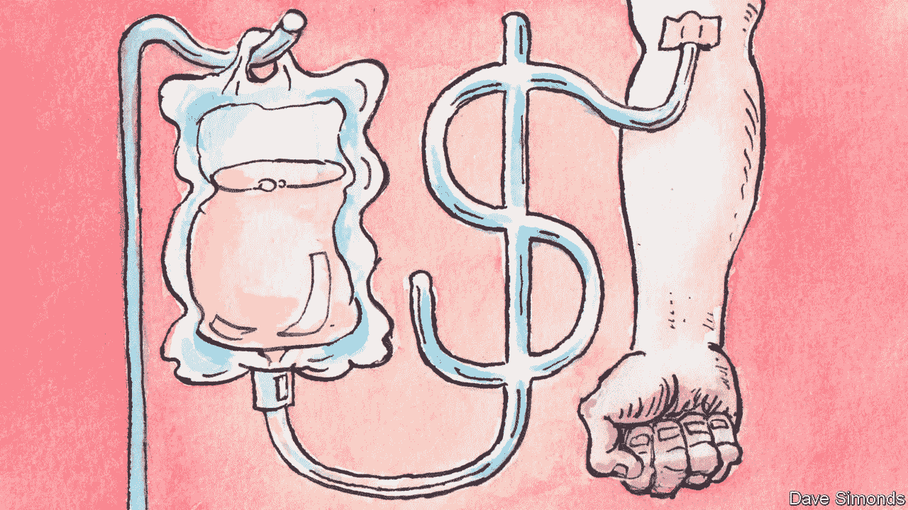
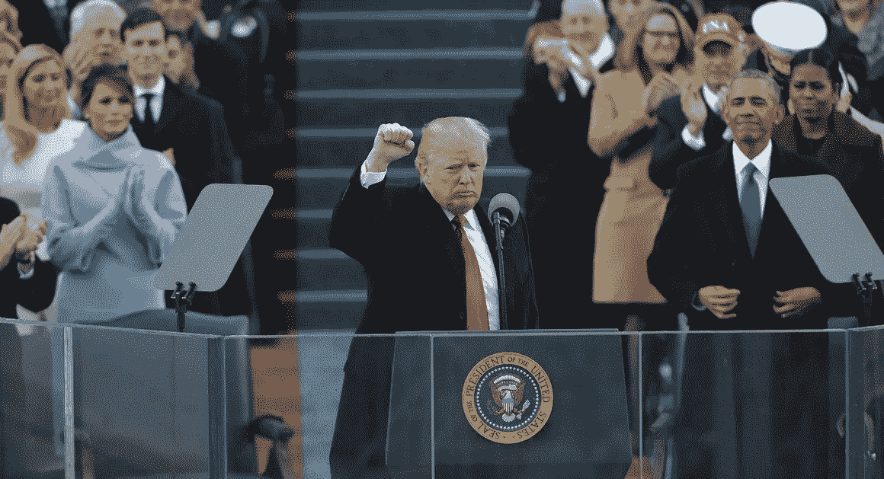

# 2020 年的血液法案

> 原文：<https://medium.datadriveninvestor.com/the-blood-act-of-2020-1aa48075e3f?source=collection_archive---------15----------------------->

特朗普总统如何从中国的生化武器中拯救美国

2021 年 3 月 19 日

2020 年 3 月，纽约血液中心(NYBC)是美国第一个收集新冠肺炎患者血浆用于治疗疾病的采血组织。经过几个月的快速研发，将抗体浓缩到较小剂量血浆中的技术提供了一致的结果。后期治疗使重症患者在 1-3 天内出院，高危医护人员死亡率降至零。

一旦得到证实，信息显示，这种疾病实际上是中国制造的生物武器，事先有一种药物疗法，被中国共产党方便地申请了专利。特朗普总统认识到并抓住了一个机会，对捐赠血浆的扭曲业务进行国有化和改革，以扩大社会安全网，消除对中国药物的需求，并建立一个应对未来传染病生物武器袭击的持久解决方案。《血液法案》于美国东部时间 2020 年 5 月 20 日中午签署成为法律。

 [## 保护主义、政治和经济动荡|数据驱动的投资者

### 美国股市昨日出现 400 多点的大幅反转，为未来的事情发出了警告信号。市场…

www.datadriveninvestor.com](https://www.datadriveninvestor.com/2018/06/28/protectionism-politics-economic-turmoil/) 

生物测试、百特国际、CSL 血浆、耶鲁血浆、Talecris、OctaPharma、Biolife。这些是美国政府根据《血液法案》查封的一些公司实体。早在 2020 年，从美国付费捐赠者那里获得的血浆约占全球收集量的 70%。美国在业内被称为“血浆采集的石油输出国组织”

到 2020 年夏天，美国政府以完全透明的方式投资 5000 亿美元发展先进的社会福利体系，该体系围绕血浆和浓缩抗体血浆血清的费用和道德生产而建立。数百万失业的美国公民在《血液法案》的大规模公共工程项目的建设和运作的许多派别中工作。在 2020 年秋季之前，血液法案为美国一半人口生产了足够的新冠肺炎免疫血清，并开始向世界出口。

在第一波新冠肺炎病毒的早期，各州颁布了隔离令，以防止这种高传染性疾病的传播。政府关门造成了巨大的经济后果，并导致了美国历史上最高的失业率。血液法案公共工程成为许多美国人的生命线，因为每个被雇用的人都获得了良好的报酬和适当的医疗保健，包括获得抗体血清治疗。

罗伯特是三个孩子的丧偶父亲，他的妻子死于艾滋病毒，他回忆说，在公共工程项目之前，他的情况变得多么糟糕，“这太糟糕了，我在想自杀后谁来照顾我的孩子。”当时低收入的有色人种死于这种病毒的可能性是普通人的三倍。

Robert

《血液法案》签署一年后的今天，它被认为是美国新中产阶级形成的催化剂。经济衰退的影响导致大量驱逐，导致数千人无家可归。公共工程项目的经济适用房开发部在振兴受灾最严重的地区方面至关重要。

在新的血液采集中心周围存在着大量的城市垃圾。从 2020 年夏天开始，美国政府通过征用权，在每个收集中心周围收购了一平方英里的土地，并开始承包多用途经济适用房的建设。这些发展与采集中心联系在一起，使人们能够通过道德和健康的血浆采集支付大部分租金。

新的基础设施建设改变了这些地区，并影响了私人投资进入更多项目，包括新的最先进的学校、温室食品生产、可再生发电、智能医院、自主就绪街道等等。随着犯罪率的下降和财产价值的提高，进一步的发展带来了更多的就业机会和全国各地的社区发展。

特朗普总统在他的第二次就职演说中重复了巴拉克·奥巴马的一句话；“如果我们等待其他人，或者等待其他时间，改变就不会到来。我们就是我们一直在等待的人。我们就是我们所寻求的改变。”

特朗普总统，谢谢你，在我们最关键的时刻，面对我们最强大的敌人，你独立思考，勇敢地成为我们急需的总统。

