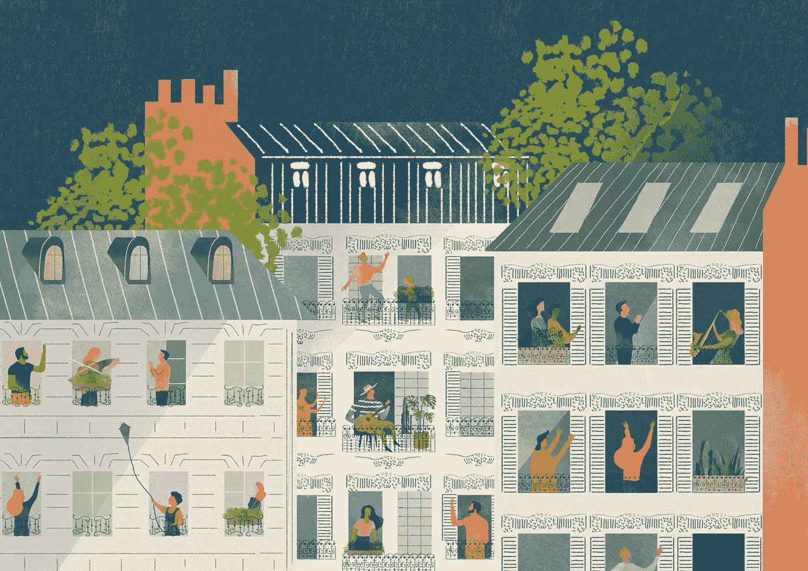
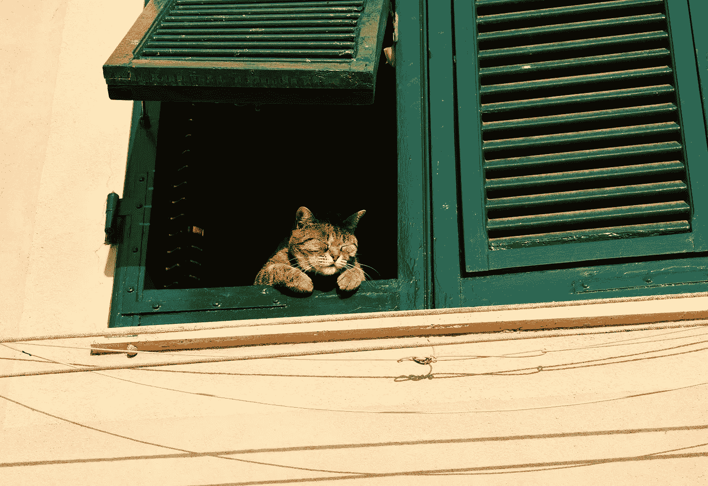

# 2020 年的光明面

> 原文：<https://medium.datadriveninvestor.com/the-bright-side-of-2020-5bbf086add3?source=collection_archive---------48----------------------->

## 它比 Youtube 瑜伽和烤面包更深入

Image by [United Nation Covid-19 Response](https://unsplash.com/@unitednations) on [Unsplash](http://unsplash.com)

现在是星期二早上 9 点，我们的窗户都开着，晨光涌进来。一阵微风吹过，我们小狗的鼻子高高地翘在空中，我们的猫在窗台上充满好奇。我丈夫和我正在喝我们的第一杯咖啡，他在打工作电话，我在写东西。

经过几个月的禁闭之后，在我们的家里有新鲜的空气和阳光是多么好的礼物啊，大火席卷了西海岸，火山灰从天而降，空气呼吸起来更加可怕(好像空气传播的病毒还不够)。

尽管今年很糟糕，但它让我对以前从未注意到的事情有了深深的感激。新鲜空气就在我们的窗外。阳光是我们城市(洛杉矶)的顶峰。我的毛皮宝贝们惊奇地看着外面的世界——它总是那么可爱！今天早上它让我想哭。我忘了当窗户打开时他们有多兴奋。这些“小”东西让各种生物的生活变得如此愉快。

Image by [Chris Barbalis](https://unsplash.com/@cbarbalis) on [Unsplash](http://unsplash.com)

这让我环顾四周，想知道还有什么我没有注意到的。还有什么是厚颜无耻地想当然的？我必须小心地这样看待它，而不是说，“上帝，我们还会失去什么？”相反，*我生活中有什么不变的东西是我还没有注意到的？*空气、光线——这些东西已经显露出来了。也许是水。干净的自来水龙头。在家感觉安全。感觉安全——多么激动人心的话题。

昨晚我做了一个梦，梦见我遇见了最可爱的蹒跚学步的小女孩。我以前是全职保姆，梦里我和另一个保姆在公园聊天，那个小女孩用爱攻击我。当他们道别时，我吻了她的鼻子。为什么我会在梦里亲吻陌生的孩子？也许这应该由我的治疗师来决定。但在我的梦里，那是最甜蜜的时刻。我在恐慌中醒来，想知道我是否刚刚离一个孩子那么近，近到有可能给她致命的病毒或被她感染。我总是迷恋后世界末日的故事，但我从来没有想到爱一个小孩子会是一场噩梦，会让我在冷汗中颤抖。

今天早上很恐怖，但不是真的。我想这是这一代人第一次，白人对没有安全感感到震惊。然而，我认为今年的#blacklivesmatter/BIPOC 运动提醒我们，我们已经抛下了太多的邻居；他们从未感到安全。他们的恐惧是非常非常真实的。呜呜，我们害怕了一次？欢迎来到他们的世界。

**我希望今年能让我们其他人产生深深的共鸣。我希望这口井能点燃我们心中的火，让我们始终保持警惕。**

我希望我们能教育自己，倾听 BIPOC 的声音，用我们的特权积极地以反种族主义的方式生活。我希望我们不仅投票，而且真的花时间研究每一个提议和当地候选人([选民的优势](http://Votersedge.org)对加州人来说是一个巨大的资源)。我希望我们能打电话给我们的销售代表，尽我们所能捐款。我希望我们认真对待我们的公民责任。因为我们的系统必须改变。在此之前，我们没有机会恢复“正常”。

> 我们不能一直把对方抛在身后。如果我们这样做，我们的世界将无法生存。

这个世界如此独特地经历了团结的一年，这一年证明了在我们都安全之前，没有人是安全的。我们生活在一个系统中，我们的身体，我们呼吸的空气，我们居住的空间——不可避免地与他人分享的空气和空间，我们都是相互联系的。如果有一个人被落下，那将是连锁反应。这种病毒不区分。

**我们都将被困在家里，继续与家人一起庆祝节日，直到每个人都获得适当的、负担得起的医疗保健、病假和疫苗/治疗(一旦公开)。**

或者我们可以继续，让死亡人数上升，直到它是我们或我们最亲近的人。这些选项让我害怕。也许这是这个世界唤醒我们去照顾**每个人**的方式。很有趣的是，这个世界是这样的，“好吧，伙计们，你们想把那些生病的，贫穷的，和双性恋的人留在后面吗？这里！除非你照顾好他们，否则你不可能健康或快乐！”

我们愿意相信我们生活在阶级和特权的小泡泡里。我们愿意相信我们的命运是可以分开的。我们尤其愿意相信，我们可以随心所欲，消耗地球资源而不受影响。但是我们都是相互关联的——我们的祖先知道这一点，现在我们也开始明白这一点。今年是世界的警钟。

Image by [United Nation Covid-19 Response](https://unsplash.com/@unitednations) on [Unsplash](http://unsplash.com)

奇怪的是，我很感激这一年。我很感激它让我们注意到那些我们以前认为理所当然的小事——可呼吸的空气、阳光、在餐馆就餐。我很感激我们再也不会把拥抱、去工作或飞回家过圣诞节视为理所当然。

但最重要的是，我很感激今年给如此根深蒂固的不平等——在种族、金融和医疗保健等所有方面——投下了一束严酷但却非常必要的光。

这一年向我们展示了我们有多么需要照顾彼此和我们生活的这个世界。如此高的死亡人数给我们敲响了警钟，这是毁灭性的。但很明显，这是我们唯一会听的方式。我希望我们会倾听。我希望我们不会说，“哇，我今年完了”，并试图回到过去的样子。事情的方式并没有为太多的人工作-现在我们都是其中的一部分。这再清楚不过了。我希望我们吸收这一年，成为更好的人——我认为这是我们生存下去的唯一途径。

> “我现在知道，我们从来没有克服巨大的损失；我们吸收它们，它们把我们塑造成不同的、通常更善良的生物。”
> 
> —盖尔·考德威尔，我们走远路回家吧

这是第 8 天，30 天旅程 30 个提示中的第 8 个提示！提示是:我希望我能多注意一些，当…跟随我的 30 天旅程[到这里](https://medium.com/@ashanoeliyer)！

**访问专家视图—** [**订阅 DDI 英特尔**](https://datadriveninvestor.com/ddi-intel)