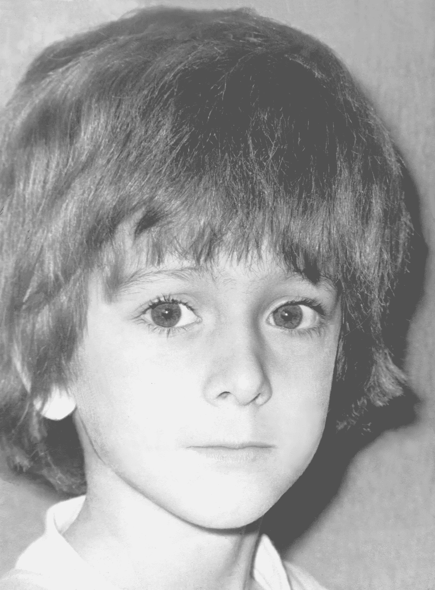
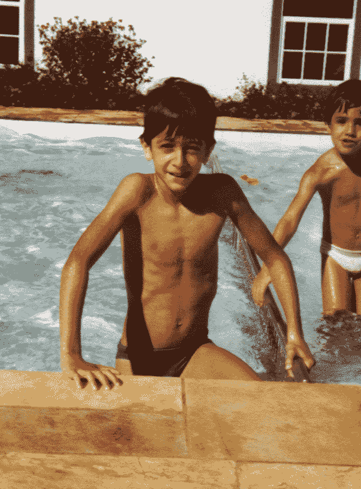

# 三十年后的欺凌和重聚

> 原文：<https://medium.datadriveninvestor.com/the-bullying-and-the-reunion-thirty-years-later-313b1ec1d832?source=collection_archive---------15----------------------->

## 或者“世界是如何变化的…”

1977.

我七岁时意识到女孩很有魅力。

在那之前，这是一场“性别战争”:男孩更好，因为他们想踢足球，打架，扮演佐罗，蝙蝠侠…

女孩和她们的洋娃娃很无聊。

但是由于我无法理解的原因——荷尔蒙——当我七岁的时候，我注意到女孩很无聊……但是很漂亮！而且香！和他们说话时，他们让蝴蝶在我肚子里飞舞！

奇怪的是，在我住的大楼里，我是为数不多的同龄男孩之一，女孩们似乎很喜欢和我聊天。在学校，有竞争的地方…

对其他男生给我起的外号没什么帮助。

“火柴棍。”

我想这和我头发的大小有关…但这只是一个理论:

Me, at the age of seven. Photo by the author

把这个巨大的脑袋和我很瘦的事实放在一起，就是这样。“火柴棍”和“女王卫队”是我得到的许多绰号中的两个。

这使得我的害羞，已经和我的头发一样大，甚至更糟。

这让我远离了我的梦中女孩…

还有，谁让我和班上第二漂亮的女生谈恋爱呢？

当然，在别人看来是第二……对我来说，她是第一，非常第一。但是她是第二美丽的事实对她有利:这样，争夺第一和第二的竞争就留给了我。

当我接近她时，我非常非常紧张。在那个年纪，她已经有了一副甜美沙哑的嗓音，我如痴如醉地在校园里听到一声随意的“嗨 Ju”。当我鼓足勇气去和她说话时，总有一些低能的人过来叫我“火柴棍”，让我安分守己。

持续了几个月。我讨厌那所学校，讨厌早起，讨厌我所谓的“朋友”……但是那个女孩的出现让这一切都变得值得。

直到一个美丽的日子…

课间休息时，我看到我的爱人，班上第二漂亮的女孩，和她最好的朋友，班上最漂亮的女孩在聊天。为了便于叙述，我将分别称他们为“罗伯塔”和“雷吉娜”。出于某种原因，我看着他们两个，被迷住了…我的一个曾经叫我“火柴棍”的同学注意到了。他来找我:

他——它们很漂亮，不是吗？

我——(假装听不懂)谁？(《理解》)啊！那些女孩？我不知道；我都没注意到…

他——说实话……你喜欢罗伯塔！

我——(撒谎)没有，当然没有！你疯了吗？

他——真可惜……因为我听说她喜欢你！

我——真的吗？？？

他——是的！如果我是你，我会和她谈谈！

我绝不会仅仅因为知道她喜欢我就和她说话，这毕竟是个谎言。但是他给我的压力驱使我去了那里。我像个哑巴一样停在两人面前……他们停止了说话，看着我；毕竟，很明显，我有理由去那里。就在这时，我的“朋友”从后面过来推了我一把，尖叫着！

他——干得好，火柴棒！

我掉进了他们的怀里！我的暗恋对象罗伯塔什么也没说……但是班上最漂亮的女孩莉贾娜尖叫起来，声音比推我的那个男孩还要大:

她——把这个瘦骨嶙峋的东西从我身上拿开！！！

我很快起床，感觉糟透了。

尖叫的是莉贾娜，但听起来好像是罗伯塔说的。而且，想想今天，被人说骨瘦如柴也没什么。毕竟，我是这样的:

Those are muscles! Photo courtesy of the author.

所以说我瘦并不完全是一种诅咒；这更像是一个发现…但是她说的方式——我想她喜欢开枪打我的那个男孩，并想证明这一点被其他男孩厌恶——最终让我难过和沮丧了好几年…

最有趣的是这个故事的未来发展。

很多很多年后，我走在这所旧学校附近。因为我很渴，所以我决定去面包店买一杯可口可乐。我这样做了，然后去了收银台。

在我的前面，有一位女士*很胖*。

顺便说一句，一位美丽的女士。

作为一个年轻的女孩，她可能是班上最漂亮的女孩。

不是第二最美，*第一最美*。

我关注了她。收银员认识她；她应该在那里住了很多年，经常光顾面包店。他叫她的名字:

盒子——这是找你的钱，里贾纳太太！

哎呀！“莉贾娜”！的确是她！我向她打招呼:

我——你好吗，莉贾娜？

她看着我，没有认出我。毕竟，“火柴棍”不再使用同样的发型:

photo by Hudson Motta

她——对不起……我们认识吗？

我——是的……胡利亚诺·里盖托！我们一起在附近学习…

她——这个名字很熟悉……但是我不记得了……

我——也许这样，你会记得:“把这个瘦子从我身上拿开！！！把这个骨瘦如柴的东西拿开！！!"

她敬畏地看着我。我笑笑就走了。我甚至不确定她是否还记得我…但意识到我保持苗条的趋势一直持续到今天，而她如此重视身体健康，却在多年后以这句话回来困扰她而告终，这真是太棒了。

这个世界真的变了！