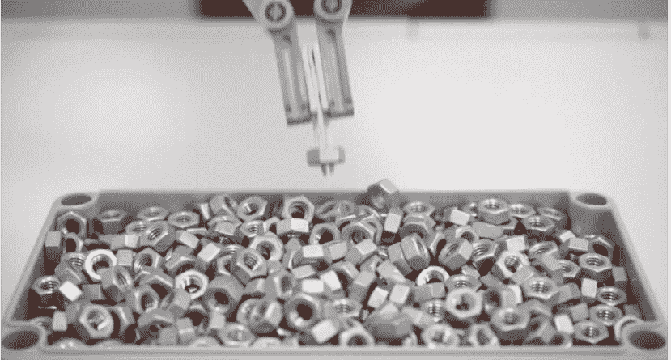
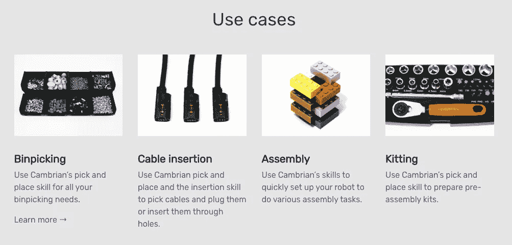

# 寒武纪智能案例研究和新常态——虚拟办公室、学校和制造业

> 原文：<https://medium.datadriveninvestor.com/the-cambrian-intelligence-case-study-and-the-new-normal-virtual-offices-schools-and-6a0c89d47700?source=collection_archive---------19----------------------->

股票市场暴跌，学校和教堂关闭，企业命令员工呆在家里——这一切都是因为微小的飞沫。随着 Corona 有了新的含义，超越了冰冷的含义，全球对该病毒的焦虑使世界在恐惧中团结起来。如果本周有一线希望的话，那就是接受机器人使人类免受感染。远程呈现不再是新鲜事物，它是让人们与工作场所、学校和被隔离的家庭成员保持联系的前沿阵地。《洛杉矶时报》报道称，总部位于美国的网真[双机器人](https://www.doublerobotics.com/)订单激增。Double 的首席执行官大卫·坎(David Cann)感叹道，“我们正在努力赶上订单，我们现在有一个积压订单，我们正在努力尽快建造。”

超越歇斯底里，计算机视觉是智能机器将机械运动转化为动态工作流程的定义元素。意识到人工智能对工业 4.0 的重要性，我的公司 [ff Venture Capital](http://ffvc.com/) 与 NYU 坦登工程学院合作，在 2016 年创建了全国首个人工智能加速器项目。2017 年 4 月，加速器 [NYU/ffVC AI NexusLab](https://techcrunch.com/2017/04/05/ffvc-and-nyu-are-mixing-researchers-with-investors-in-the-name-of-machine-intelligence/) 第一批毕业。其中一个佼佼者是 [Cambrian Intelligence](https://www.caint.io/) ，它现在是 ff VC 投资组合的一部分。今年早些时候，我采访了寒武纪的创始人 Miika Pera，了解他的公司在将人工智能成像平台应用于协作机器人方面的进展。

这位总部位于英国的企业家阐述了他加入 NexusLab 并成立一家应用人工智能公司的动机，“我的愿景是，随着人工智能与机器人技术的深度融合，我们可以逐渐开始让我们周围的所有物质都可以编程，这意味着从制造到采矿，从酒店到医疗和食品的所有供应链。”佩拉先生继续说道，“本质上，我们是在为这个一切都将由机器人制造的世界开发技术。目前，我们周围的一切都是由人手以某种方式建造的，如果我们足够聪明，我们可以实现自动化——但机器人需要智能来代替人手和手臂完成任何重复或非重复的任务。”这位工程师想象了一个未来，任何地方的任何设计师都可以“只需将新产品的 CAD 设计上传到一个充满智能机器人的工厂，产品就可以在没有任何人工干预的情况下制造出来，当然成本很低。”

 [## 模式和机器人:复杂的现实|数据驱动的投资者

### 哈耶克的名著《复杂现象理论》(哈耶克，1964)深入探讨了复杂性的话题，并断言…

www.datadriveninvestor.com](https://www.datadriveninvestor.com/2019/03/04/patterns-and-robotics-a-complex-reality/) 

为了实现通过今天安装的合作机器人实现智能制造的崇高目标，Pera 的团队正在将现成的传感器融入其全栈平台。“我们的人工智能是一个巨大的神经网络，它接收来自摄像机的输入，并输出零件的位置、方向以及如何用当前的手爪类型抓住它们。然后，我们的软件会引导机器人进行采摘，”Cambrian 的首席执行官描述道。Pera 强调，相机模块“只是立体配置中的两个现成的工业 RGB 相机。”这家初创公司的知识产权是其软件，该软件可以将传感器变成虚拟眼睛，以三维方式感知工作环境，而不是市场上现有的二维解决方案。佩拉简单地说明了寒武纪是如何工作的，“想象你是一个制造商，你有一个混乱的箱子里的 A 部分和 B 部分，你想把 A 部分安装到 B 部分，然后在装配线上向前传递。有了 Cambrian 为这类任务设置，只需几分钟，你就可以开始了。”他进一步阐述说，“在真正的机器人上没有学习，经过训练后，它只是开箱即用。”根据创始人的说法，寒武纪的解决方案是他的客户，大型欧洲制造商的游戏规则改变者，因为它适用于所有领先的机器人手臂，包括[库卡](https://www.kuka.com/en-us)、 [ABB](https://new.abb.com/) 和[通用机器人](https://www.universal-robots.com/)。

寒武纪智能是合作机器人生态系统增长的更大故事的一部分，预计到 2030 年每年将超过 240 亿美元。ABI 研究项目的瑞恩·惠顿说:“硬件创新仍然落后，与合作机器人相关的大部分价值并不来自合作。它易于使用，可重新编程，与工业系统相比总成本更低，可重新部署。本质上，其价值在于降低障碍，而不是为机器人构建全新的用例。更重要的是，cobots 在速度、性能和有效载荷方面仍然落后于工业系统，如果继续以这种狂热的速度采用，这种情况必须改变。”惠顿进一步估计，软件系统可能占到合作机器人收入的一半，从目前的 5.58 亿美元攀升至 2030 年的 106 亿美元。占全球市场份额 58%的 Universal Robots 已经扩展了它的网站，包括了一个被认可的供应商的软件市场。

寒武纪是新一类合作机器人软件公司的一部分，这些公司正在利用深度学习来解决特定的任务。正如 Pera 所详述的，“我们目前的客户是电子和汽车行业的制造商。比如汽车厂的车身车间几乎全自动化，但汽车装配根本没有自动化。”他进一步描述了寒武纪的技术如何扩展其任务库，虽然今天它能够自动化 10-15%的手工劳动，但在 5 年内，他们的软件将能够完成 70-80%的制造任务，目前由手工完成。用 Pera 的话说，“增强 cobot 的智能将实现更高的销售增长率，因为它们可以更快地完成新任务，制造商可以使用它们完成更多任务。”

当我写这篇文章时，我看到我的孩子通过 Zoom 和 Google Hangouts 参加他们的课程。本周，福布斯撰稿人格雷格·皮特罗最近写了一篇题为“黑天鹅事件:冠状病毒会最终迫使人们采用下一代技术吗？”正如全球工作场所分析师总裁凯特·李斯特在 [Recode](https://www.vox.com/recode/2020/2/26/21153343/coronavirus-covid-19-work-from-home-remote-pandemic) 中报道的那样:“这些临时用途往往会向公司表明，a)这是可以做到的，b)让人们已经习惯于远程工作会使过渡更加容易。”Recode 进一步评论说，“无论疫情与否，远程工作都将继续存在，但冠状病毒可能会迫使这种转变比预期更快。”等待恐慌平息，回归常态，在后 COVID 世界有一件事是肯定的——计算机视觉将会更加普及。