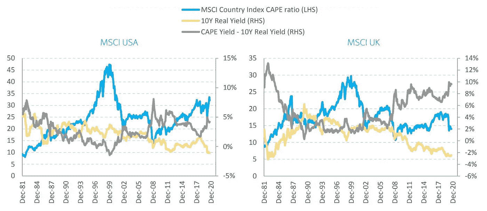

# CAPE 比率表明股票市场是有吸引力的

> 原文：<https://medium.datadriveninvestor.com/the-cape-ratio-suggests-the-stock-market-is-attractive-7eb3fc22816b?source=collection_archive---------4----------------------->

## 金融市场

## 坎贝尔和诺贝尔奖得主席勒发明的这一指标预示着股市的乐观前景

Photo by [Hans Eiskonen](https://unsplash.com/@eiskonen?utm_source=medium&utm_medium=referral) on [Unsplash](https://unsplash.com?utm_source=medium&utm_medium=referral)

许多投资者目前都摸不着头脑。尽管实体经济在 2020 年表现低迷，但受柯维德-疫情法案和全球经济活动停滞的影响，股市仍获得了可观的回报。

那些在 3 月底部附近增加股票敞口的人一直在利用反弹回到历史高点，许多散户投资者的表现优于机构投资者。

> 许多人可能想知道股市是否显示出泡沫倾向。

但有几个因素表明牛市开始了。[投资者持有创纪录数量的现金](https://medium.com/datadriveninvestor/record-amounts-of-cash-on-the-sideline-can-fuel-the-current-bull-market-7a5c76374709)。除了股票之外，他们几乎没有其他选择*(如果你想知道我送了我弟弟哪些股票作为生日礼物，* [*点击这里*](https://medium.com/datadriveninvestor/i-gifted-stocks-to-my-brother-on-his-18th-birthday-heres-why-a8029dddfbb4) *)* 。

一个积极的消息流，随着疫苗在美国和欧洲的推广，以及非常宽松的货币政策(见第三节[此处](https://medium.com/datadriveninvestor/record-amounts-of-cash-on-the-sideline-can-fuel-the-current-bull-market-7a5c76374709))意味着世界经济有望在 2021 年反弹。

那些担心泡沫的人指向高估值。疫情对经济的不同部门产生了不相称的影响。

结果，资金逃离了那些受冲击最大的行业(娱乐、旅游和休闲)，而对那些不受封锁影响甚至从中受益的行业的需求增加了。

后者主要是电商等科技股。这些公司的估值已经被拉长。

然而，一个重要的估值指标 CAPE 比率——表明现在是买入股票的好时机。

## 好望角比率和疫情

CAPE ratio 代表经周期调整的市盈率。它是由经济学家约翰·y·坎贝尔和罗伯特·j·席勒提出的，并在《金融杂志》1988 年的一篇论文中发表。

席勒因其在资产定价方面的工作获得了 2013 年诺贝尔经济学奖。在一本 2015 年出版的书中，他展示了股票相对于债券的超额实际回报如何取决于资本充足率、通胀预期和实际长期利率。

因此，该比率通常用于衡量长期股票市场估值，并用作预测工具。

因此，CAPE 比率不应用作短期衡量标准。就短期波动而言，它没有预测能力。

那么，这个比率对疫情的反应如何呢？

三月，它在 23 年触底。举个例子，过去 20 年的平均值是 25.6。这可能看起来很高，但利率远低于历史平均水平。

目前，该指数为 32，仅相当于 2018 年 1 月的近期高点，以及本世纪初互联网泡沫时期和大萧条前的 20 世纪 20 年代。

 [## 收盘，但没有雪茄-股票市场目标在停滞的 COVID 救济中创新高|数据驱动…

### 专家聊天程序:一个协作市场，在这里人们可以和能够解决他们问题的专家聊天。是……

www.datadriveninvestor.com](https://www.datadriveninvestor.com/2020/08/18/close-but-no-cigar-stock-market-targets-record-highs-amidst-stalled-covid-relief/) 

## 相对于其他资产类别，股票看起来更有吸引力

当这一比率超过 30 时，投资者可能会对席勒本人及其合著者的[近期分析](https://papers.ssrn.com/sol3/papers.cfm?abstract_id=3714737)的结论感到困惑，该结论认为股票在当前估值下具有吸引力。

但历史低位的利率是关键。他们计算出超额 CAPE 收益率，用 CAPE 比率的倒数减去 10 年期实际利率来衡量。

该指标的水平反映出，投资者对持有股票而非债券的超额回报预期很高。

下表显示了美国和英国自 1981 年以来的比率。

CAPEs versus Long-Term Real Interest Rates for the US and UK. Graphs by Schiller et al. (2020). Source: Bloomberg, MSCI, Barclays

席勒和合著者得出结论，美国相对于其他市场看起来昂贵，反映了美国经济的快速反弹和投资者对可观回报的预期。

他们还进行了行业分析，发现高估值是由技术、医疗保健和通信服务推动的。

他们分析的结论很清楚:

> “我们发现，所有地区的超额 CAPE 收益率都接近其最高水平，这表明相对于债券，股票似乎具有很高的吸引力，股票的潜在超额回报可能很高。在大多数地区，由于极低的利率水平，CAPE 的超额收益率甚至高于 2007/2008 年的大金融危机，我们现在看到 CAPE 水平基本上接近长期平均水平。”

虽然指标显示股票的预期回报率很高，但一些公司可能被高估了。对投资者来说，2021 年将是有趣的一年。

目前，前景是乐观的，但随着市场，你永远不会真正知道。

## 访问专家视图— [订阅 DDI 英特尔](https://datadriveninvestor.com/ddi-intel)