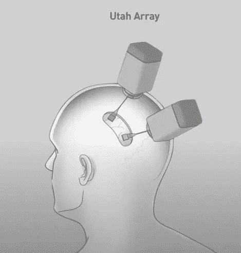
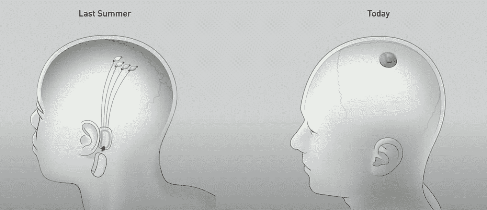
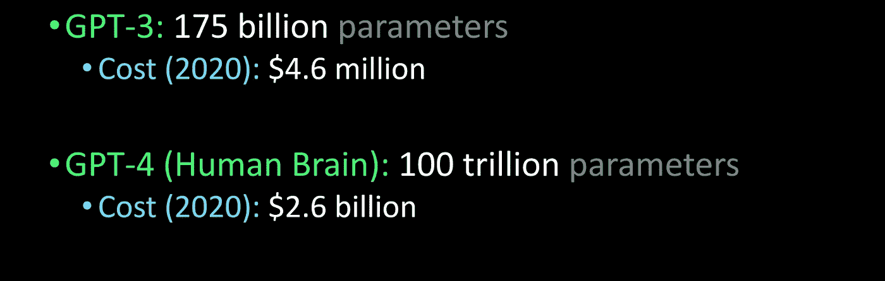

# 2030 年的超级智能

> 原文：<https://medium.datadriveninvestor.com/the-case-for-agi-by-2030-4bd10db8029d?source=collection_archive---------12----------------------->

## 我们会比你想象的更快达到人工智能。

Photo by [Denys Nevozhai](https://unsplash.com/@dnevozhai?utm_source=medium&utm_medium=referral) on [Unsplash](https://unsplash.com?utm_source=medium&utm_medium=referral)

数以千计的世界级研究人员正朝着人工通用智能的方向努力。截至发稿时(根据 LinkedIn 的数据)，这包括 SingularityNET 的约 50 名员工、OpenAI 的 160 名员工、脸书 AI 的 550 名员工和 Deepmind 的近 1000 名员工。

规模较小的项目包括 AGI 创新、Apprente、Kimera 系统、New Sapience、Numenta 等。在[谷歌学术](https://scholar.google.com/scholar?start=0&q=%22artificial+general+intelligence%22&hl=en&as_sdt=0,5)上搜索“人工通用智能”，你会找到超过 1 万篇论文。此外，OpenAI 的 GPT-3 Slack 频道目前有大约 15，000 名成员可以进行测试。

此外，成千上万的企业正在使用像[这样的自动化工具构建成千上万的模型。AI](http://obviously.ai)——只会越来越好。

简而言之，许多有识之士正在解决 AGI 问题，人类在短时间内取得了令人难以置信的进步。

# AGI 的(前)历史

人工智能的历史可以追溯到几千年前，公元前 1000 年的机械机器人。此外，第一台可编程机器是在 1000 多年前制造的。

因此，让我们把注意力集中在 AGI 的努力上:OpenAI。

## GPT 北部

在【2018 年 6 月，OpenAI 发布了 GPT 的第一次迭代，通过将监督学习与无监督预训练配对，在各种语言任务中实现了最先进的性能。GPT 很小，因为它只在几千本书上训练，具有 8 个 GPU 机器的能力。

在 2019 年 2 月中，GPT-2 大幅扩大了规模，参数增加了 10 倍，训练数据增加了 10 倍以上。简而言之，GPT-2 是一个明显更好的合成文本生成器，并获得了相对广泛的好评。

在 2020 年 5 月的中，GPT 3 号用令人难以置信的逼真、创造性、几乎与人类无法区分的*文本生成技术永远改变了人工智能的世界。GPT-3 不仅在人工智能行业迅速传播，而且成为全球轰动。*

在短短两年的时间里，OpenAI 在人工通用智能方面取得了疯狂、令人震惊的进步。

 [## 机器学习和人工智能如何改变电子商务的面貌？|数据驱动…

### 电子商务开发公司，现在，整合先进的客户体验到一个新的水平…

www.datadriveninvestor.com](https://www.datadriveninvestor.com/2020/11/19/how-machine-learning-and-artificial-intelligence-changing-the-face-of-ecommerce/) 

## 神经链接

在类似的时间框架内，Neuralink 在无缝、非侵入性的脑机接口方面取得了令人难以置信的进步，除了将我们与人工智能联系起来之外，它还将最终修复无数精神和身体疾病(如截瘫、极度疼痛、焦虑和抑郁)。

在 2019 年夏天之前，脑机接口的现状是犹他阵列，一种笨重、危险、侵入性的设备，功能中等。然后，Neuralink 的第一个演示震动了神经科学世界。仅仅一年后，Neuralink 发布了另一个惊天动地的更新——一个硬币大小的脑机接口，从外面完全看不见。

Neuralink 的联合创始人 Max Hodak 认为，我们将在 2030 年前到达 AGI。

鉴于我上面概述的进步，AGI 看起来很有可能在 2030 年之前*(除非发生第三次世界大战级别的灾难)。如果 OpenAI 和 Neuralink 继续沿着各自的道路前进，一次又一次地创造数量级的改进，那么 AGI 显然是不可避免的。我们甚至还没有看到脸书、谷歌、百度或其他许多项目和独立研究人员的努力。*

有人可能会说，GPT 4 号将和人脑一样大，我们可以在一年内到达 AGI。

Estimates by [Lex Fridman](https://medium.com/u/119b8eb57f8e?source=post_page-----4bd10db8029d--------------------------------)

然而，连我都承认，这是一个难以置信的场景。我和[麦克斯·霍达克](https://medium.com/u/4ead2d28c888?source=post_page-----4bd10db8029d--------------------------------)——2030 年前的 AGI 站在一起。

## 获得专家观点— [订阅 DDI 英特尔](https://datadriveninvestor.com/ddi-intel)