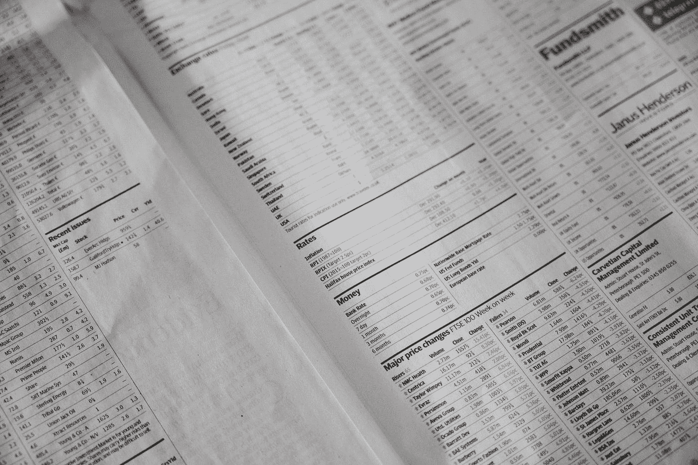

# (在现有经济中)废除股票的理由

> 原文：<https://medium.datadriveninvestor.com/the-case-within-the-existing-economy-for-abolishing-stocks-1365ad48e05e?source=collection_archive---------7----------------------->

分为三部分:一、股票入门；二。股票是财富；三。废除库存

Photo by [Annie Spratt](https://unsplash.com/@anniespratt?utm_source=medium&utm_medium=referral) on [Unsplash](https://unsplash.com?utm_source=medium&utm_medium=referral)

第一部分:股票入门

这本入门书只涉及可供公众购买的股票。有些被称为“少数人持股公司”的企业拥有股票，但公众无法购买。]

每一个公司，无论大小，无论它是为了生产什么而成立的，都需要某种资本来运作。资本有两种:“固定的”和“流动的”。有三种固定资本:土地、厂房(建筑物)和设备。固定资本可以购买或租赁。“流动”资本就是金钱。

发行和出售股票是企业获得自由资金的无风险方式(“融资——流动——资本”):它不欠任何钱，风险转移到股票的买方:如果公司是成功的(或继续是成功的)，它的股票将增值(价格)；如果公司破产，它的股票也会跟着破产。

所以股票是企业所有权的一部分。购买股票的股份就是购买企业的股份，成为企业的部分所有者。

这个头衔只对持有公司很大一部分股份的所有者有意义。即便如此，这种自负也被用来证明在短期内不惜一切代价实现公司股票价格最大化的合理性(在严重的利益冲突中，公司股票通常是公司高管“薪酬包”中最大的一部分)。

然而，从理论上讲，股东应该只是风险的承担者。根据经济理论，这是他们“被付钱”去做的事情:他们希望——据说，只能“希望”——他们所购买的股票未来价格更高。[有些股票确实也以股息的形式支付现金。]

有两种股票可供公众购买。一种是人们通常与“股票”这个词联系在一起的那种，是必须通过交易所购买的股票(例如，在美国，纽约证券交易所(NYSE，其著名的“道琼斯工业平均指数”是其选定的一捆袜子的加权平均价格)、纳斯达克、标准普尔(S&P) 500 指数)。另一种股票是那些可以在柜台上购买的股票

OTC 股票是那些试图通过自举获得“尊重”的公司的股票，即在交易所“上市”(可供买卖)。它们非常便宜。它们每股至多只值几美元。一只 OTC 股票必须在一段合适的时间内达到每股 5 美元的价格，公司才能获准在交易所上市。

更幸运的是得到“风险资本家”支持的新公司。这些投资者拥有如此多的财富，以至于他们可以为他们青睐的公司——尤其是那些制造了足够多“轰动效应”的公司——弥补多年的惊人损失，并最终帮助安排这些公司在交易所上市，而无需经历场外交易的过程(因为他们的股票价格被“预期”——眨眼，眨眼——会高于最低要求——并保持在那里)。这是终极的“局内人”游戏。

某一特定公司的股票不是连续产生的，而是成批产生的，称为“发行”股票。因此，当公司发行新的股票时，股票就产生了。它可能是第一次向公众公开发行股票，称为 IPO(首次公开募股)，也可能是此后任何时候发行的股票。

股票是公司筹集流动资金的一种方式，但他们不必出售他们发行的所有股票。有些可以留在手边。要成为股本，必须进行“清算”，即出售以获得资金。

一个企业手头的股票(它自己的和它可能购买的其他公司的股票)确实算作一个企业的资产。作为资产，它们增加了公司的总价值:如果要出售，它的售价会是多少。这反过来影响(尽管它本身并不决定)其他财务事项，如如果它寻求借款，它作为借款人的地位，这反过来会影响它必须为这笔钱支付的利息额。作为资产，股票并不十分重要，因为它们带有风险。不过，这本身也是持有股票的一个原因。

发行股票(尤其是对已建立的企业而言)在某种意义上是印钞:一旦它们被印出来，它们就值一些钱。重要的是，这些股票是潜在的金钱。它们本身不是钱。要将它们转换成货币，就需要将货币从其他可能的用途上转移开来。

一旦一家公司发行的股票被购买，它们就达到了唯一真正的经济目的:它们允许公司筹集一些流动资本。之后，股票进入“二级市场”，股票所有者通过买卖股票获利。

这是我称之为“非生产性投机”的一种形式，因为它的唯一功能就是购买和出售纸片，除了纸片的购买者和出售者的经济收益之外，别无其他。从这个角度来看，非生产性投机对社会来说是一个巨大的“机会成本”:用于这一目的的资金可以为整个社会带来更大的好处。

一旦一家公司成立，看起来它可能会不管三七二十一就发行股票，但是发行股票是有限制的，即使是对那些成熟的企业。一方面，增加可用股票的数量会增加其供应量；如果对股票的需求没有增加，股票的价格就会下跌。这对运营公司的人来说是不利的。其股东——包括其高管——总是希望每股价格更高，因为这会影响他们的个人财富水平。

一个公司股票的发行也会影响它的 P/E:它的股票价格与它的“每股收益”的比率，它的总净利润除以它的股票数量。公司的评估者(无论是公司股票的潜在购买者、潜在贷款者还是整个企业的潜在购买者)首先关注的是公司的 P/E(尽管，根据我所读到的，它显然不像过去那样是圣杯)。

这个比率越小，股票在潜在买家和贷款人眼中就越有吸引力。等等。发行更多的股票使 E 值变小，从而使这个重要的数字变大。这被称为“稀释”股票价值。

因此，我们有一个关于股票价格的悖论。更高的股价本身是一件好事，因为……嗯，因为这增加了股东(包括管理公司的人)的个人财富。然而，与此同时，其股票的较高价格提高了股票的市盈率，这对于作为一个实体的公司来说不是一件好事(因此，作为公司股票所有者的高级管理人员存在明显的利益冲突)。

因此，经营公司的人的最终目标是拥有高股价，同时“增加”收益。这可以通过销售更多公司生产的产品、以更高的价格销售或降低成本来实现。一个公司需要不断上涨的股票价格和尽可能低的市盈率，这使得公司成为社会中如此有害的实体。

第二部分:股票是财富

同样，股票最初主要有一个经济目的:为新公司(以及现有公司的扩张和增长)筹集(流动)资本，同时在有意愿的投资者中分散风险。这不再是股票的主要目的。

股票已经成为手头有钱的人购买股票的一种方式，以获得更多的无所事事的钱(无论是直接为自己行事，还是间接作为代表其他实体的行为者)。是人们——或者说，越来越多的是执行人们编写的程序的计算机——购买纸片，期望它们能以高于其购买价格的价格出售这些纸片。那是不劳而获的。股票已经成为富人(定义为拥有他们可以承受损失的钱的人)变得越来越富有的主要方式。

至于风险是什么，购买股票赔钱的唯一方法是购买一家完全破产的公司的股票。这种情况几乎从未发生过，尤其是对于那些已经足够成熟、可以在交易所上市的企业而言。具有讽刺意味的是，资本主义作为一种制度的成功，将老牌企业的终极风险扫进了“历史的垃圾箱”(借用托洛茨基的一句话)。除此之外，如果真正的大公司面临倒闭的危险，中央政府会进行“救助”，如果一个国家的经济体系面临倒闭的危险，中央银行甚至会进行更大规模的救助，在当今的资本主义经济中，风险甚至会进一步远离公司。最后，对于一家面临破产的老牌公司，还有“第 11 章”:一种破产公司在“重组”其财务时继续经营的法律机制。风险到此为止；为此，你必须去一个真正的赌场。

 [## 收盘，但没有雪茄-股票市场目标在停滞的 COVID 救济中创新高|数据驱动…

### 专家聊天程序:一个协作市场，在这里人们可以和能够解决他们问题的专家聊天。是……

www.datadriveninvestor.com](https://www.datadriveninvestor.com/2020/08/18/close-but-no-cigar-stock-market-targets-record-highs-amidst-stalled-covid-relief/) 

仅仅因为股票价格下跌就卖出的人是傻瓜。我们现在知道了一个绝对的事实，除非一家公司倒闭，否则每只股票的价格都会随着时间的推移而上涨。此外，如果任何股票的所有股东都拒绝出售，那么任何股票的售价都不可能下跌。[我永远不会忘记，有一次我在美国消费者新闻与商业频道电视网上看到一位“分析师”谈到股票价格的普遍下跌(持有股票的“普通”人感到恐慌，并告诉他们的经纪人卖出，但“内部人士”看到了以更低价格买入的机会)，这是“股票回归其合法所有者”的一个例子]

有“卖空者”:押注股票价格会下跌的人。如果成功了，他们的不劳而获来自较低的股价，而不是较高的股价，但原理是一样的。单个股票的价格确实有涨有跌(很少是因为与公司本身有关的任何实质性变化)，但随着时间的推移，在今天的资本主义经济中，所有继续经营的公司的股票价格都不可避免地上涨。

过去几十年，随着收入流入“投资者阶层”，这一历史事实得到了印证。实现这一目标的方法之一就是 401k。这应该是一个针对员工的退休计划，但实际上这是一个保证资金将由“小人物”持续流入股市的计划——由雇主的相关贡献予以加强——在那里“内部人士”可以染指。

最后，股票创造了臭名昭著的 1%。其中大部分是由成功的大公司完成的，这些大公司将公司股票作为其“高级管理人员”(首席执行官、首席财务官等)薪酬的一大部分。)，尤其是在‘奖金’方面。这些人拿着数千万的薪水，但即使这些薪水也不能让他们成为亿万富翁。如果一个人每年存 2500 万美元现金(不计算利息),这个人需要 40 年——整个工作生涯——才能积累 10 亿美元。(如果“只有”一千万美元/年。被搁置一边，积累第一个十亿需要一百年的时间*。)*

股票以这样或那样的方式创造了亿万富翁。在没有风险的情况下，股票是一种囤积资金的手段。它们是金钱可以投入其中并随后收回的东西——越来越有把握地收回比投入更多的钱。[必须承认，新公司的“正式”员工通过购买公司股票变得非常富有(企业通过员工购买股票来配合)，但关键是，无论谁不劳而获，股票都已经超越了其最初的经济功能。]

具体来说，亿万富翁是由公司可以随意印刷的纸张创造出来的。他们实际上是在印钱——或者至少是“财富”(在纸上)——数十亿美元。

财富的等级可以用拥有的股票数量来最简明地定义。在这一点上，股票已经成为一个庞大的计划，让人们有多余的钱来获得一些东西——在某些情况下，这些“东西”是数十亿美元的财富(至少在纸面上)——而不需要任何东西。

第三部分:废除库存

如果我们废除股票会发生什么？这将取决于如何完成。

做到这一点的一个方法就是简单地颁布一项法律，宣布股票被废除，所有现存股票的价值为零。不客气地说，经济将会崩溃——立即、彻底、永久地——并带走我们所知的文明。

那么，我们如何才能在不造成经济末日的情况下废除股票呢？我们可以通过制定一项法律来实现这一点，该法律规定不能再创造更多的股票，不能买卖现有股票，但现有股票可以随时清算:以某种永久固定的价格将每只股票变现(允许对通货膨胀进行调整，以防止匆忙清算)。在现有经济中，这将不得不以“量化宽松”的形式出现:为此而印钱。

有些人可能不喜欢这种方式，因为它不会惩罚股票所有者。不过，为自己辩护的是，他们只是做了法律允许的事情。它叫做自由:可以自由地做任何不违法的事情。责怪她们与责怪“福利妈妈”没有什么不同，后者认为，鉴于她们的环境和所面临的制度，生孩子是她们获得稳定、充足(如果勉强)收入的最佳选择。这叫理智。

同样真实的是，无论股票的存在带来了什么，它们都是公司做每家公司不时需要做的事情的一种手段:在短时间内获得一笔流动资本。允许现有股票，包括持有现有股票的公司，根据其所有者的判断进行清算，将允许从将股票用于非常真实的经济功能逐步过渡。

毕竟，发行股票并不是满足这一需求的唯一途径。首先，企业可以从银行贷款。显然，如果没有股票，银行就不可能满足所有企业的流动资金需求，更不用说所有企业和个人的借款了。

另一方面，大多数股票由机构持有，如养老基金、对冲基金和保险公司——更不用说共同基金(专门买卖股票的公司)和银行本身了。所有这些都可以在将资金贷给企业的同时清算股票。

此外，公司已经可以通过出售债券来借钱。债券是一种承诺，承诺在某个特定的时间一次性偿还所借的钱加上固定金额的利息(尽管它们几乎总是在特定的时间间隔支付一些利息)。因此，希望投资企业的个人仍可以通过购买债券来实现(当然，这些机构也可以这样做——当然，它们也可以进入政府债券市场)。

与购买股票不同的是，借钱——不管是以何种方式——总是与立即购买某种“真实的”商品和服务联系在一起，甚至对公司来说也是如此。资金可以在股票的二级市场上永远流通，但对于企业来说，借入目前被套牢在股票上的资金将会把这些资金投入到“实体”经济中，即生产真正的商品和服务。(当然，个人和其他股票持有者也可以清算股票，购买商品和服务。)

最后，通过量化宽松清算股票对整体经济还有另一个好处。我们从全球经济中学到的一件事是，它急需资金。以这种方式清算股票可以缓解这个问题。

除了某种形式的“量化宽松”，货币只能通过借贷进入现有经济。因此，在创造作为经济燃料的货币的同时，也产生了拖累经济的债务。

我们已经知道，债务的增长速度总是快于经济的增长速度。这意味着需要更多的债务才能产生同样的经济增长。(这也意味着债务真的就像经济中的可卡因。)允许通过量化宽松来清算股票，将是一种在没有债务的情况下创造所需资金的方式。

这种清算股票的方法将创造一个巨大的潜在资金池。虽然它不会因通货膨胀而贬值，但也不会赚到额外的钱。因此，持有股票的人会有动机去清算股票，借出资金。其结果是，利率会极低，但与此同时，会有足够的放贷动机来防止利率为负。

许多潜在的贷款人寻求贷款机会对所有企业都有好处，包括初创企业——这将鼓励创新——以及不太富裕国家的企业。与此同时，风险将被重新引入流动性资本市场。在一个本应存在的市场经济中，在企业之间去粗取精。

简而言之，通过量化宽松来清算股票将增强整体经济。它将把资金从近几十年来创造的实体间过度繁荣的纸面漩涡中抽离出来，并让资金进入实体经济，即生产和获取真实商品和服务的过程。

**进入专家视角—** [**订阅 DDI 英特尔**](https://datadriveninvestor.com/ddi-intel)