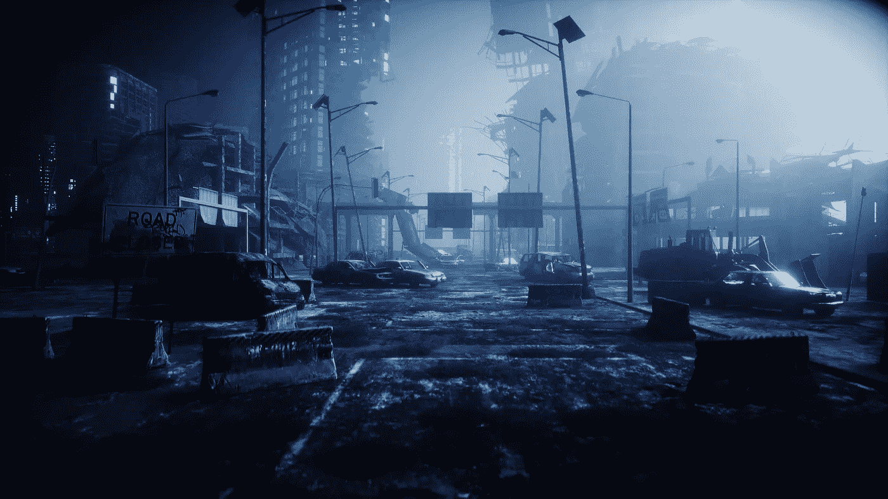
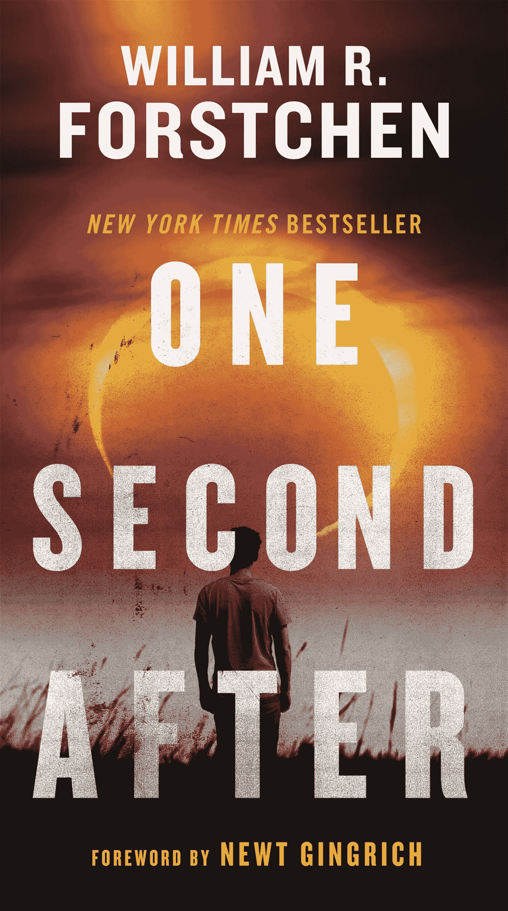

# 核电磁脉冲的灾难性影响

> 原文：<https://medium.datadriveninvestor.com/the-catastrophic-effects-of-a-nuclear-electromagnetic-pulse-n-e-m-p-94f948faaed2?source=collection_archive---------7----------------------->

Photo Source: Adobe Stock

你开着车在高速公路上行驶，现在是高峰时间，立体声系统播放着你的歌曲。你短暂地查看了一下你的智能手表，因为你的手腕收到了一个通知。

然后突然你的车停止工作，你的刹车停止工作，你空转前进。惊慌失措的你安全地靠边停车。当你检查你的手机时，你注意到它突然关机并拒绝开机，你的智能手表拒绝开机。然后，你环顾四周，你注意到每辆车都熄火了，车上的人都下车了，不知道刚刚到底发生了什么。

最坏的情况:你在飞机上。在这种情况下，你会从天空中坠落，因为你的飞行将完全失去飞行甚至滑翔的能力。

 [## 网络安全非营利组织帮助中小企业打击网络犯罪|数据驱动的投资者

### 一个名为全球网络联盟(GCA)的非营利组织发誓要改善…

www.datadriveninvestor.com](https://www.datadriveninvestor.com/2019/02/22/cybersecurity-non-profit-to-help-smes-fight-against-cybercrime/) 

这是每个人都需要知道的鲜为人知的美国国家安全威胁的开始，核电磁脉冲，或回到石器时代的时间机器。让我进一步解释一下。

核电磁脉冲是活生生的噩梦

对于那些想:“什么？！《使命召唤:现代战争 2》里的那个东西是真的？”是的，非常真实。

Photo Source: Amazon.com Books

在出版前几个月，《一秒钟后》已经在美国国会**的大厅里被引用，作为所有美国人都应该阅读的一本书，这本书已经在五角大楼的走廊里被讨论，作为对大规模杀伤性武器及其不可否认的在一秒钟内摧毁整个美国的力量的真正现实的审视。**

作家威廉·r·福斯特森(William R. Forstchen)的三部曲的第一部小说《一秒钟后》(One Second After)描述了伊朗从停泊在美国港口的集装箱船上发射的三枚 1500 万吨级核弹在堪萨斯州上空爆炸后的生活。

任何东西， ***我是说任何东西*** ，里面有电子元件的都会被销毁。一些例子:现代汽车、你的电话、网上银行、智能手表、制药系统、计算机、飞机(甚至是飞行中的飞机)、蓝牙系统、卫星通信系统、数据服务器(除非它们在法拉第笼中)，等等。

我说的毁灭并不是指它们会被炸毁。一个 N.E.M.P .使用伽马射线的能量来烹饪绝对任何电子的东西，所以他们仍然是完整的，他们只是完全不起作用。

**核电磁脉冲的影响**

绝对没有办法取钱，因为银行系统会被烧毁，他们的自动取款机也会被烧毁。如果你依赖药物或胰岛素，绝对没有办法通过合法的货币交易获得它们。如果你唯一的交通工具是一辆汽车，你将无法启动它，仅举几例。

对美利坚合众国的这种攻击实际上是对国家安全的合法威胁。纽特·金里奇(Newt Gingrich)在前言中提到，我们的基础设施实际上配备了可怕的设备来抵御这种攻击，所以没有谈论太多。

**如何准备 N.E.M.P**

事实:除非你已经做好准备，否则你没有时间为 N.E.M.P 做准备，但是，如果 N . e . m . p 发生了，你可以做一些事情来做准备，让我们来详细介绍一下:

1.  **手头有大量香烟盒和一大笔现金(最好是 5000 美元)。**

这将允许你以物易物。尽管现金基本上没什么用，但在系统恢复正常(不太可能)而你需要购买食品杂货时，现金还是有好处的。香烟将被用作物物交换的工具，你可以用包来交换食物和水(是的，我指的是物物交换的交易，因为这就是一个 N.E.M.P .的坏处)。

2 **。时刻准备行动。**

在我看过的多本生存书里，都是这么说的:动者， ***生存*** 。如果你决定蹲下，特别是像美国加州洛杉矶、美国佛罗里达州迈阿密或美国纽约市这样的城市，你会陷入人们抢劫杂货店和抢劫药店的绝望风暴中。更不用说成群结队的个人闯入民宅，抢夺人们的财物。

**3。有东西为自己辩护。**

如果系统在一次攻击后没有恢复正常，人们会变得绝望:他们会想要你的任何好处，并且可能会试图用武力夺取它。绝望的时候需要绝望的措施:准备好保护你的家庭和你从疯子那里得到的东西。

**4。学习生存技巧。**

这些包括:丛林生存，达科他州火洞，在石头上烹饪，用摩擦，陷阱和诱饵点火，建立一个庇护所，知道什么植物是可食用的或危险的，只用线钓鱼，用汽水罐构造一个钩子，用回形针开锁，等等。核电磁脉冲绝对会让一切离线，你将被扔进 21 世纪的石器时代。

这将使你比那些依赖实体店加工食品的人更有优势。

**5。态势感知**

这是你可以每天练习的。如果你在星巴克，学习如何偶尔从你正在阅读的书或你的电脑上抬起头来，扫描房间里的每个人:你以主动-被动的状态关注你的周围，如果有人看起来不合适(在夏天穿夹克，在寒冷的天气穿背心，在室内戴太阳镜，有人带着异常大的包，或者有人表现可疑或紧张)，都是一些例子。

总之，到目前为止，核电磁脉冲是任何国家的电力基础设施可能发生的最糟糕的事情。如果真的发生了，人们会变得绝望，为了生存需要采取不可取的措施。

让我们只希望它永远不会发生。