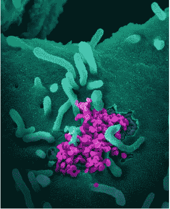
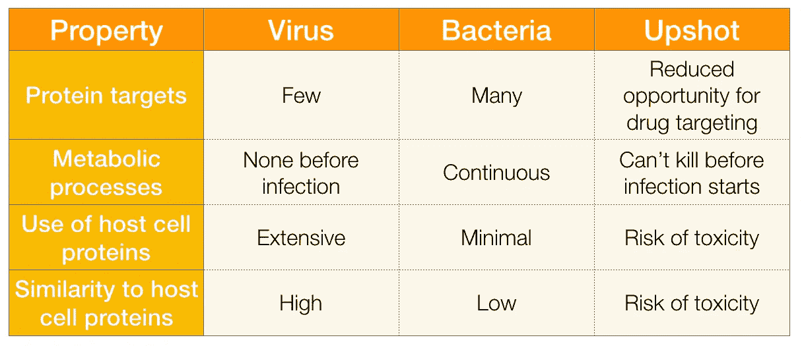
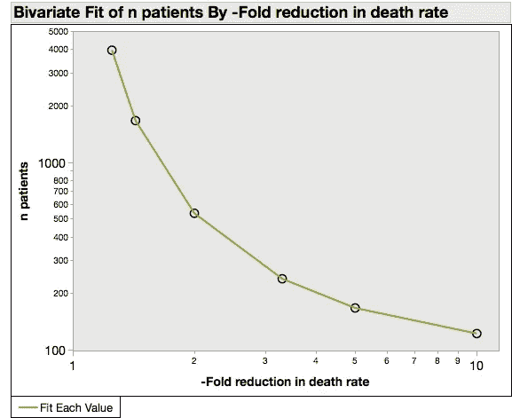

# 快速治愈的机会每天都在减少

> 原文：<https://medium.datadriveninvestor.com/the-chances-for-a-quick-covid-cure-are-slipping-daily-f57ad25d09c0?source=collection_archive---------2----------------------->

没有消息就是坏消息

Novel Coronavirus SARS-CoV-2 This scanning electron microscope image shows SARS-CoV-2 (round magenta objects) emerging from the surface of cells cultured in the lab. SARS-CoV-2, also known as 2019-nCoV, is the virus that causes COVID-19\. The virus shown was isolated from a patient in the U.S. From [NIH clinical trial of remdesivir to treat COVID-19 begins](https://www.nih.gov/news-events/news-releases/nih-clinical-trial-remdesivir-treat-covid-19-begins), public domain

我们都希望能找到治疗新冠肺炎病的有效药物。处于危险中的生命数量是巨大的。不仅仅是感染造成的死亡，还有随之而来的经济混乱。我们在 2008 年的大衰退中了解到，长期失业会导致预期寿命减少 1 到 1.5 年。结束经济停滞确实是一个生死攸关的问题。

但是抗病毒药物的开发是一场艰难的游戏。治疗细菌感染比开发抗生素要困难得多。任何种类的新药开发都需要数年时间。在不久的将来，我们唯一的希望是找到一种现有的药物，它也具有抗冠状病毒的活性。

Why antiviral drug development is so much harder than antibacterial drug development

候选人名单很短，而且越来越短。艾滋病毒/艾滋病药物 [Kaletra](https://en.wikipedia.org/wiki/Lopinavir/ritonavir) 经过测试发现“[没有益处……超出标准治疗](https://www.nejm.org/doi/10.1056/NEJMoa2001282)”

氯喹(一种抗关节炎和抗疟疾的药物)和 remdesivir(一种治疗埃博拉病毒的抗病毒药物)正在进行临床试验。这些审判的计划结束日期是 4 月和 5 月。但是如果药物非常有效——如果它们能够阻止疫情，让我们恢复正常生活——我们会更快知道。

 [## 认知计算——一套被广泛认为是……

### 作为它的用户，我们已经习惯了科技。这些天几乎没有什么是司空见惯的…

www.datadriveninvestor.com](https://www.datadriveninvestor.com/2020/02/19/cognitive-computing-a-skill-set-widely-considered-to-be-the-most-vital-manifestation-of-artificial-intelligence/) 

原因如下。

拒绝已知有效的治疗是不道德的。目前的试验是安慰剂对照的，这意味着一半的患者得到抗病毒候选物，另一半只得到糖丸(氯喹)或盐水(雷地昔韦)。安慰剂对照试验只有在没有已知的有效治疗方法时才是符合伦理的。这就是新冠肺炎目前的情况。

高效药物在试验过程中显露出来。当这种情况发生时，唯一合乎伦理的做法是终止安慰剂组，用药物治疗所有患者。这里有一个来自心脏病试验的例子。

任何精心设计的试验方案中都列出了提前终止的统计标准。这些标准根据研究人员的最佳判断而有所不同。但是，当你得知积极效果越强，需要证明治疗优于安慰剂的患者就越少时，你不会感到惊讶。

下图是一个例子。假设您认为新冠肺炎患者死亡率(或任何临床指征)降低 20%是有意义的。该图显示了要达到 20%阈值的 95%置信度，每组需要的患者数量。

Number of patients in each arm required to acheive alpha=0.05 and beta=0.8 for a ≥20% effect at a placebo-arm death rate of 0.1\. Own work.

这里的确切数字取决于预先选择的阈值。这些是由有经验的临床医生做出的判断。但是原理是清楚的:用很少的病人就能检测出很大的效果。他们将在试验的早期被发现，在最初的几百名患者中。

从长远来看，只有死亡率降低 10 倍，新冠肺炎才不会比季节性流感更致命。检测这种规模的效果只需要治疗组和安慰剂组各 167 名患者。

考虑到新冠肺炎患者的数量，不需要很长时间就能看到这样的效果。相反，检测小的影响将需要成千上万的病人和数周或数月的时间。

NIH remdesivir 试验于 2 月 25 日开始。数据的第一次评估安排在试验的第 15 天，第一批 100 名患者后进行另一次评估。第 15 天来了又去，没有公布结果。这可能意味着要么效果太小，要么病人太少。但是如上图所示，检测大的影响并不需要很多病人。我们现在(3 月 26 日)处于试验的第 30 天，还没有任何消息。

每过一天，出现改变游戏规则的药物的可能性就降低一分。这意味着病死率不会大幅下降，重症监护室停留时间不会缩短，生活不会恢复正常。至少不会很快，也不是因为 remdesivir。

已经宣布了一些可能令人鼓舞的氯喹结果，但是正如[这篇综述指出的](https://www.sciencedirect.com/science/article/pii/S0166354220301145)“…还没有提供数据…结果是在十家不同的医院产生的，可能来自许多不同的临床方案…很难得出任何确定的结论。”大而强的影响没有这种模糊性，或者需要微妙的统计分析来检测。他们打你的头。

也就是说，药物并不一定要成为游戏规则的改变者才是有益的。即使它们对晚期患者(最有可能的结果)几乎没有作用，它们仍然可以用作预防药物。将它们交给医疗工作者将会对保持医院的开放和运营产生巨大的价值[。](https://www.ncbi.nlm.nih.gov/pubmed/29445061)

但是让经济恢复运转呢？药物发挥作用的窗口正在迅速关闭。公共卫生措施是我们最可靠的赌注，我们不应该对药物治疗期望过高。

4 月 6 日更新:仍然没有 remdesivir 试验的消息。它是新冠肺炎任何一种“治愈”的可能性接近于零，尽管它仍然可能被证明有一些临床益处。

由 Didier Raoult 领导的一个法国小组发表了几项研究，显示羟氯喹加阿奇霉素的结果令人鼓舞。第一项研究有一个体面的设计(安慰剂对照随机试验)。但是它有很多缺陷。最大的一个问题是，它从分析中排除了那些接受治疗但随后病情严重的患者，他们在完成试验方案前死亡或进入重症监护室。当你计算这些病人时(你必须这样做)，大部分报道的影响消失了。这项工作和第二项研究还有许多其他问题。你可以在这里详细了解他们。底线是，这些研究并没有显示一些政客声称他们做了什么。关于氯喹，还没有定论。

*披露:*自 1999 年 remdesivir 的制造商吉利德收购我的雇主(NeXstar Pharma)以来，我一直持有该公司的股票。我从未为 Gilead 工作过(他们在组织结构图上画了一条线，解雇了上面的所有人),不认识那里的任何人，也没有内部消息。