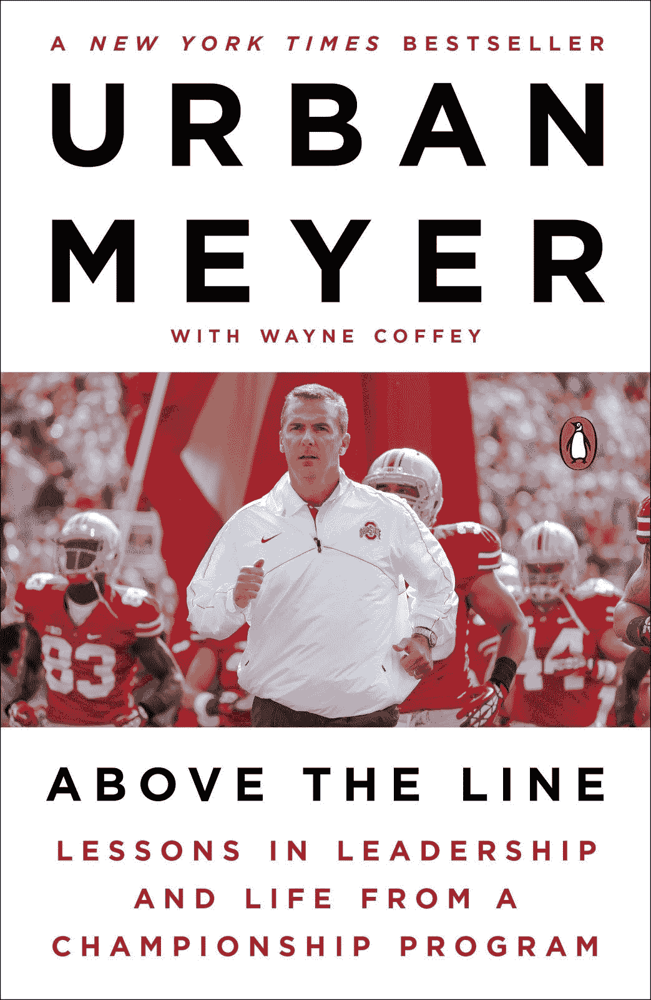
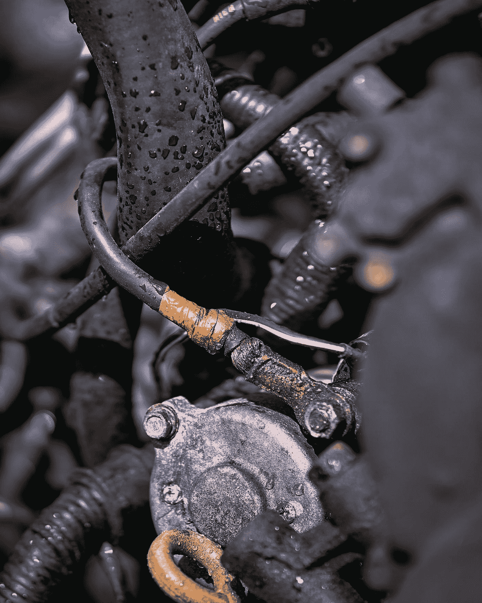

# “引擎盖下的检查”挑战

> 原文：<https://medium.datadriveninvestor.com/the-check-under-the-hood-challenge-35516a4f3613?source=collection_archive---------17----------------------->

## 呼吁领导者透过表面现象解决绩效问题

## 虽然你可能不喜欢你所发现的，但一个伟大的经理或教练必须透过表面现象找到他们组织中正在发生的事情的真正解决方案

Photo by [Chad Kirchoff](https://unsplash.com/@cakirchoff?utm_source=medium&utm_medium=referral) on [Unsplash](https://unsplash.com?utm_source=medium&utm_medium=referral)

所以，作为一名管理学教授和顾问，我的一个“话题”是这样一个事实:每一个赢得超级碗或大学橄榄球冠军的足球教练都会立即写一本书。嗯，更正确的说法是，他们可能会整理出一串他们的演讲或记录 20 小时他们最好的“想法”，然后让一个真正的作家要么以非常小的字体作为他们的合著者，要么作为他们的有偿代笔人。这是一个赌注，如果拉斯维加斯体育博彩公司让你打赌，你每次都会赢！这是因为成功的足球教练总是相信，他们不仅在如何执教足球方面拥有一定程度的管理和领导智慧，而且能够根据他们特定的 3、5、7、10 或 12 条原则、规则、咒语等来领导任何和所有的人群——*和是的公司*。

Coach Ed Orgeron of LSU; **Source:** [LSU Sports](https://lsusports.net/sports/football/roster/coaches/ed-orgeron/2801)

是的，就像太阳升起一样确定的是，埃德·奥雷格隆，路易斯安那州立大学国家冠军队今年早些时候的著名教练(哇，那好像是很久以前的事了，不是吗！)出版了他的书[翻转剧本:通往冠军之路的教训](https://www.amazon.com/gp/product/1400225183/ref=as_li_tl?ie=UTF8&camp=1789&creative=9325&creativeASIN=1400225183&linkCode=as2&tag=ideapublishin-20&linkId=60e6a817051e7bd09c271ff3d4a71262)，讲述了他如何领导老虎队，以及我们应该从他非凡的个人故事中吸取的教训。就像我们今天做的一样，这意味着“蔻驰·欧”——和他的妈妈——到处宣传他的书，就像《60 分钟》一样

蔻驰·奥的书甚至被滑稽地模仿了…

…我们知道当今社会媒体环境的运作方式，这可能会为教练的书带来*甚至*更多的销量！

Cover Image of [Flip the Script](https://www.amazon.com/gp/product/1400225183/ref=as_li_tl?ie=UTF8&camp=1789&creative=9325&creativeASIN=1400225183&linkCode=as2&tag=ideapublishin-20&linkId=60e6a817051e7bd09c271ff3d4a71262), by Ed Oregeron; **Source:** [Amazon](https://amzn.to/35yNSin)

但是，唉，路易斯安那州立大学的 2020 赛季并不顺利，因为该队一直受到 NFL 关键球员的损失，由于新冠肺炎问题取消比赛的困扰，是的，一系列令人沮丧的损失。不用说，在今天“你最近为我做了什么”的环境中，在证券交易委员会会议的大学足球温床中，甚至蔻驰·奥杰伦也受到了批评，距离一个神奇的，不败的全国冠军赛季只有几个月了！

因此，尽管我们这些从事商业教育和咨询服务的专业人士很容易“呸呸”足球教练就如何管理人才给出的建议，但这并不是说，偶尔在他们的建议中就找不到一些非常真实的智慧。这就是上周六早上发生在一场大学橄榄球赛前秀上的事情。这类节目更多的是以其狂欢而非真知灼见而闻名。

然而，在短短两分钟多一点的时间里，前教练 [Urban Meyer](https://twitter.com/CoachUrbanMeyer) ，他[带领](https://ohiostatebuckeyes.com/staff/urban-meyer/)俄亥俄州和佛罗里达州赢得了全国冠军，提供了一个关于良好教练和良好管理的即兴课程，我们都可以从中受益。他还提供了一个“行动号召”，任何组织的所有教练、所有经理、所有领导人都应该明智地注意这个号召，并在事情不顺利时立即采取行动。是的，几年前他也写了《教练之书》。迈耶的书名为[上线:冠军项目的领导力和生活课程](https://www.amazon.com/gp/product/1101980729/ref=as_li_tl?ie=UTF8&camp=1789&creative=9325&creativeASIN=1101980729&linkCode=as2&tag=ideapublishin-20&linkId=b5ae8f5ca0af58800750e2130078eb52)。但是，迈耶在这一天的“收获”可能是今天你在任何地方都能听到的最好的——也是最快的——领导力课程之一。

Cover Image of [Above the Line](https://www.amazon.com/gp/product/1101980729/ref=as_li_tl?ie=UTF8&camp=1789&creative=9325&creativeASIN=1101980729&linkCode=as2&tag=ideapublishin-20&linkId=b5ae8f5ca0af58800750e2130078eb52), by Urban Meyer; **Source:** [Amazon](https://www.amazon.com/gp/product/1101980729/ref=as_li_tl?ie=UTF8&camp=1789&creative=9325&creativeASIN=1101980729&linkCode=as2&tag=ideapublishin-20&linkId=b5ae8f5ca0af58800750e2130078eb52)

那么，蔻驰·迈耶说了什么几乎立刻被称为教练和领导的“大师课”呢？在下面这个片段的前两分钟半(绝对值得一看！)，福克斯体育演播室节目正在寻找在这个奇怪的当前赛季中，美国一些顶级足球项目——包括路易斯安那州立大学——的“错误”。Urban Meyer 接着讲述了他的独白，当足球队的事情不顺利时该怎么做——这一课可以*也应该*应用于任何组织。当他的建议在社交媒体上疯传时，他的建议被放大了，这要归功于他在俄亥俄州最成功的球员之一伊齐基尔·埃利奥特的母亲的帖子

因此，当一个团队表现不佳时，Meyer 的建议归结为关注三件事:

1.  信任问题
2.  功能失调的环境
3.  自私。

关于第一点，迈耶说:“*第一点:有一些信任问题。球员不信任教练，教练也不信任。)信任玩家，或者当玩家之间不信任对方的时候就糟糕了。*”关于第二件事，教练评论道:“第二件事:这被称为功能失调的工作环境，人们对我们的期望很高，但我们并不努力。教练必须对他的球队非常清楚…这将导致沮丧，愤怒，失望，因为我们想赢得冠军，我得到消息，伙计们，我们没有努力工作。所以不要抱有期望。职业道德必须超越或等同于期望。”最后一句话本身在社交媒体上引起了相当多的关注:

关于第三个因素，自私，迈耶说:“*最后一个是显而易见的。你有一个自私的团队，伙计。你的团队有问题。足球是一项无私的运动，这意味着你不得不做卑鄙的事。这意味着如果我是一个跑卫，我必须去保护我的四分卫，你不能总是拿着球。有时你必须以每小时 22 英里的速度开球，然后一头撞上以每小时 15 英里的速度从另一边过来的人。一点都不好玩，你为什么要这么做？因为你爱你的团队，你的队友。所以，当你听到路易斯安那州立大学、宾夕法尼亚州立大学(密歇根)狼獾队苦苦挣扎时，不要再提那些“糟糕的球员”我讨厌听到这些。不是球员，我不认为是教练。但是有问题。掀开引擎盖，一探究竟。这三者之一通常就是原因。”*

Photo by [Erik Mclean](https://unsplash.com/@introspectivedsgn?utm_source=medium&utm_medium=referral) on [Unsplash](https://unsplash.com?utm_source=medium&utm_medium=referral)

# 分析

因此，虽然蔻驰·迈耶是从足球队的角度来说的，但在我 20 多年的咨询、教学、演讲和写作经历中，迈耶的话引起了我的共鸣，这些经历都是关于如何在*任何*环境中成为一名好经理的。无论场景是足球更衣室*还是*休息室——或者实际上是一家公司的高管层——他所说的都是正确的。在后一种情况下，无论我们谈论的是小企业还是财富 500 强公司，Meyer 的处方都同样适用，尽管它在大公司中可能更加重要。

 [## 人工智能、领导力和人才管理|数据驱动的投资者

### 人工智能正在改变人才管理游戏——从招聘到团队建设再到继任…

www.datadriveninvestor.com](https://www.datadriveninvestor.com/2020/11/02/artificial-intelligence-leadership-and-talent-management/) 

蔻驰·迈耶呼吁领导者不要害怕“检查引擎盖下”并试图发现真正的问题可能会影响组织。无论你是体育界的教练还是商界的经理，指责他人远比透过表面现象去观察要容易得多。这更容易，因为这是最快的反应，也是领导者最不费力的反应。这也是一条让领导者能够将绩效不佳的责任推给任何人，甚至所有人，而不为自己承担任何责任的途径。从定义上来说，不去看引擎盖下的东西，你是在处理表面问题，而不愿意——或不能够——处理更复杂、更困难、更难以解决的深层问题，这些问题可能会阻碍你的单位、商店、部门，甚至整个公司或组织的绩效。因此，无论衡量标准是什么，无论是赢得足球比赛还是商业上的胜利，如果领导者不愿意做“艰难的事情”并真正检查引擎盖下，你和你的组织都可能会失败。

Photo by [Johannes W](https://unsplash.com/@johanneswre?utm_source=medium&utm_medium=referral) on [Unsplash](https://unsplash.com?utm_source=medium&utm_medium=referral)

那么，为什么经理们不愿意采取检查引擎盖下的关键步骤呢？通常，这正是因为就像当你的车运行不正常时，你害怕你可能会在下面发现什么。如果你的公司在销售、客户服务、生产力、*等等方面存在问题，当你采取措施深入了解情况时，你很可能会发现你的系统、流程、程序等方面存在问题。这些都是相对容易解决的事情。然而，很多时候，你可能会发现你的结果中的这种问题的根源在于你的组织的内部动态，这意味着准确地解决这种问题——信任、组织文化和自私 Urban Meyer 在足球环境中谈到过，但在今天的工作组织中非常普遍，甚至普遍。无论公司有多大或多小，如果缺乏信任，缺乏共同的目标和与目标一致的职业道德，以及糟糕的工作环境，个人更关心自己的成功而不是组织的成功，那么你就会遇到经常得不到解决的系统性问题。*

Photo by [Mark Boss](https://unsplash.com/@vork?utm_source=medium&utm_medium=referral) on [Unsplash](https://unsplash.com?utm_source=medium&utm_medium=referral)

那么，今天管理层面临的挑战是，卷起袖子，即使这意味着只是虚拟地这么做，并愿意检查你所负责的组织的引擎盖下——越早越好——在为时已晚之前。没有人应该假装这样做很容易。事实上，这是一条“人迹罕至的路”,这是有原因的——因为这条路很难走！检查引擎盖下可以发现组织中的各种问题，但就像你的汽车一样，最终结果——即使账单很贵——意味着它将来会工作得更好。在这个过程中，你可能会发现特定员工甚至特定经理的问题，但你对这些人的行动将是基于过程的，而不是反射性的，甚至是防御性的。

然而，也许最重要的是，检查引擎盖下意味着你——作为经理或高管——也需要愿意检查自己的引擎盖下。你必须愿意审视自己的行为——并思考组织中的其他人如何看待它们——看看它们是否符合你对员工和经理的期望。想想迈耶要求球员做的两件具体事情，这确实应该是教练——在这种情况下是经理和你自己，作为一名领导者——*必须*愿意自己做的事情。首先是你的“职业道德必须超过或等于你的期望”的想法。如果我们向我们的主持人提出这个问题，他们会注意到——*总是*——如果我们自己不这样做的话。第二个是无私的概念——愿意做你要求别人做的工作，甚至是“讨厌的”工作。再说一次，这是那些在你周围工作的人，和你一起工作的人，是的，尤其是在你手下工作的人会一直注意到的。因此，如果你发现努力、强度、承诺等方面存在问题。在你的员工中，甚至在你的经理中，当一个人真正看到引擎盖下面时，问题可能来自于自己。这意味着检查引擎盖下不仅仅是一个“扶正船”的前瞻性处方，这意味着它也是一个内省。

Photo by [Tj Sedisa](https://unsplash.com/@tjsedisa?utm_source=medium&utm_medium=referral) on [Unsplash](https://unsplash.com?utm_source=medium&utm_medium=referral)

因此，对于所有经理和高管来说，无论他们是在小企业的后台办公室工作，还是坐在装饰华丽的高管套房里，Urban Meyer 在那次简短的演讲中提出的挑战是一个你应该接受的挑战——今天*！“检查引擎盖下”可能是困难的，可能是痛苦的，甚至是个人的，但它将使你成为一个更好的经理，并帮助你在过程结束时推动你的组织前进。你还应该鼓励你周围的人也这样做，以提高他们自己*和*组织的长期绩效。不这样做，就像忽略你车里的检查引擎灯一样，意味着以后会有更多的麻烦。在商业中，就像在体育运动中一样，不检查——真正检查——正在发生的事情可能会对你取得成功的愿望产生致命的影响。*

*那么，你准备好“检查引擎盖下吗？”如果没有，为什么没有？*

# ***和我一起在媒体上写作***

*想开始自己的写作之旅吗？想通过发布自己创作的文章来更好地建立个人品牌？考虑今天和我一起在媒体上写作，并使用这个链接:[https://davidwyld.medium.com/membership](https://davidwyld.medium.com/membership)。这样做，你将帮助支持我的写作，因为我收到你的媒介会员费的一部分。*

# *关于大卫·怀尔德*

*大卫·怀尔德([dwyld@selu.edu](http://dwyld@selu.edu/))是路易斯安那州哈蒙德市[东南路易斯安那大学](https://www.southeastern.edu/)的战略管理教授。他是管理顾问、研究员/作家、出版商、执行教育家和经验丰富的专家证人。*

***大卫·怀尔德的社交媒体链接:***

*   *上[脸书](https://www.facebook.com/david.wyld)*
*   *上 [LinkedIn](https://www.linkedin.com/in/david-wyld-4923707/)*
*   *在[推特上](https://twitter.com/GoodAdvicePub)*

## *访问专家视图— [订阅 DDI 英特尔](https://datadriveninvestor.com/ddi-intel)*