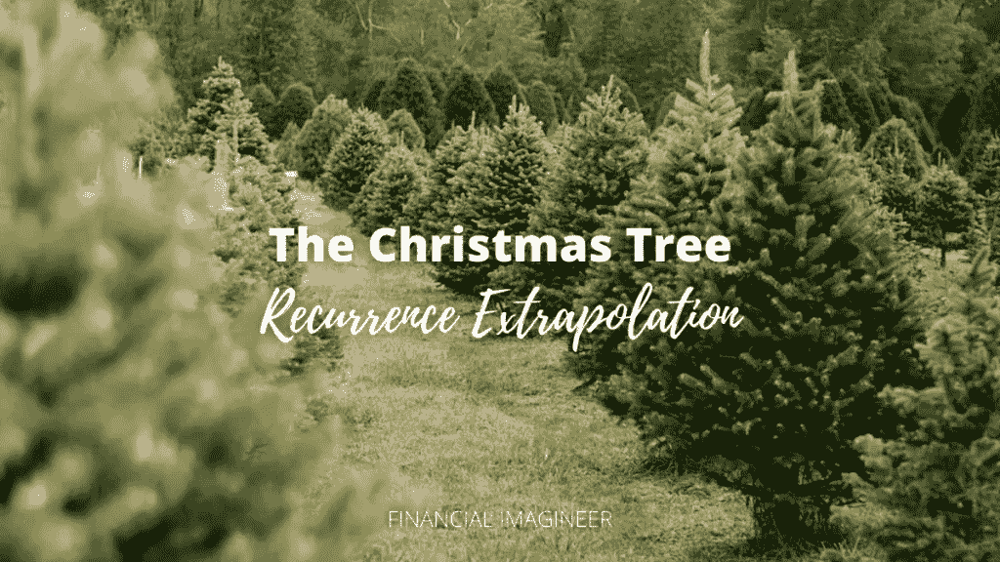
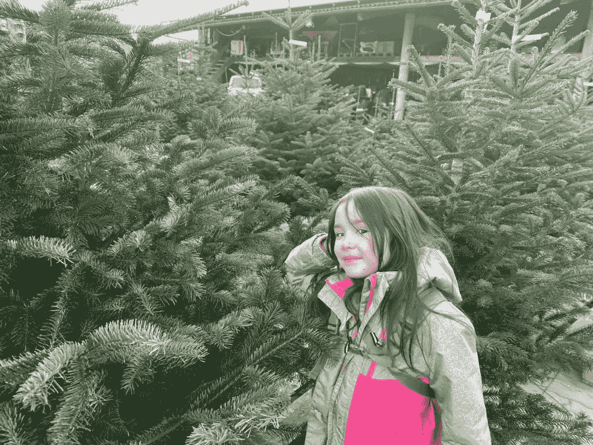
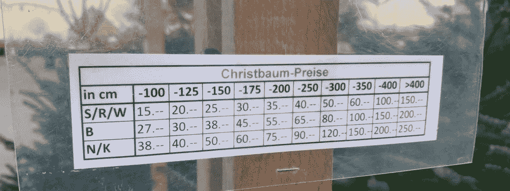
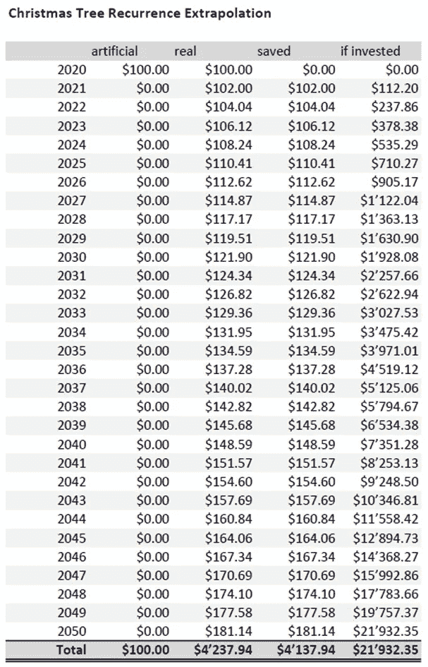

# 圣诞树递归外推

> 原文：<https://medium.datadriveninvestor.com/the-christmas-tree-recurrence-extrapolation-10c3666beca1?source=collection_archive---------21----------------------->

我们住在一个很棒的郊区社区，只需步行 5 分钟就能到达一个很棒的农场。每个季节，附近的农场都会提供不同的项目。他们刚刚清理完最后一个南瓜，现在你可以得到:

圣诞树！

10 亿美元的问题是:买什么样的树？

你知道吗，美国消费者在每个假期都会花超过十亿美元在圣诞树上！？2019 年，美国售出了 2620 万棵真正的圣诞树。根据美国农业部的数据，美国大约有 300，000 英亩用于种植圣诞树。多么常青的经济啊，不是吗？感兴趣的话在这里阅读更多。

哦，圣诞树！

# 圣诞树农场

在我们的农场，你可以得到一些不同种类的树，预先砍好的树，或者你甚至可以自己去砍！想想就觉得很神奇。我喜欢这个农场的创业精神。真正的天才！

这是笔大生意。

假期开始了！

今天我们和喜欢这个地方的孩子们一起去农场散步。当然，他们开始比较和争论哪棵树更适合我们的家。

就在那一刻，我决定把这变成另一次金融旅行！

要进入状态，请点击播放下面这首泰勒·斯威夫特的歌曲“圣诞树农场”,继续阅读:

*你知道泰勒·斯威夫特只用了 24 小时就创作出了这首歌吗？她随后在 4 天内发布了它！？这是我最喜欢的节日歌曲 2020，在我们家的 SONOS 系统上无限循环播放。*

# 我的想法

突然间，每个人都需要一棵新砍的松树来临时装饰他们的客厅。在年底的忙碌中，完成假期的准备工作，并在年底前完成所有事情，你必须再次找到一棵树！

既然我们正处于气候危机之中，并且越来越意识到我们的生态足迹，你有没有想过每年在你的客厅里，为了看着另一棵树分崩离析，“大自然”要花多少钱？让这些树长得更壮，帮助我们吸收更多的二氧化碳不是更好吗？

我们可以从不同的角度来看待这个困境。是的，有可行的替代方案。但并不是所有人都“符合要求”。我明白。

一棵真正的圣诞树是真实的，提供了一种“真正的圣诞节感觉”,并且不会显得廉价，而且，从生态学的角度来看，真正的圣诞树是可持续的，如果出于这种目的种植的话！

另一方面，假圣诞树不仅仅是干净的，它们需要在某个地方的工厂里生产，然后运到更远的地方。然而，一旦你有一个，他们是方便的，他们可以停留更长的时间，非常长，他们总是看起来一样，最终可以节省你很多钱！

一棵真正的树大约有两米高，在被砍伐之前需要大约十年的时间来长到它的尺寸，而另一边的人造树可以持续十年或更长时间。

圣诞树很可能在未来也会变得更贵，因此今天买一棵可持续的人造圣诞树——顺便说一下，它的价格通常与真的差不多——可以保护你免受即将到来的通货膨胀的影响。

# 圣诞树经济学

如上所述，我们和孩子们一起参观了圣诞树农场商店，看了看漂亮的装饰品、漂亮的树，当然还有价格。

看到价格标签，我解释说，5 年多前我们的人造树花了我大约 40 美元——我们实际上是在圣诞节后打折时买的。如今，一棵类似的树大约要花 100 美元，我问过他们多少次，我们可能已经节省了 100 美元。是的，现在大约五次了。团队射击 500 美元。

上次我写了关于[自己理发](https://www.financial-imagineer.com/2020/07/23/the-million-dollar-haircut/)或[自己烤面包](https://www.financial-imagineer.com/2020/08/09/bake-yourself-rich/)如何帮助你变得富有，一些评论者不相信地认为这似乎太容易了，我可以简单地将这种方法应用到生活中的几乎任何事情上。

你猜怎么着

除了不相信它有用之外，他们完全正确:我能，而且我确实能！

根据下面的假设看下面的表格:一棵真实的或人造的树的价格是 100 美元。假设年通货膨胀率为 2%。假设平均投资回报率为 10%。这并没有反映出[节省的时间](https://www.financial-imagineer.com/2020/09/07/time-bandits/)和由于减少[决策复杂性](https://www.financial-imagineer.com/2020/10/08/decision-fatigue/)而增加的脑力。

以下是我简单的圣诞树经济学。

我称之为“圣诞树递归外推”:

嘣！

如果你改变了你的习惯，只要阅读这篇博文就能为你未来的自己节省 20，000 美元！

不客气

圣诞快乐！

# 唤醒圣诞精神

看着农场里所有的树激发了我们心中的圣诞精神。我们很快赶回家，我去找装着我们的人造圣诞树的纸箱，并把它带到了我们的客厅。像每年一样，我们喜欢一起装饰圣诞树。

看看圣诞树市场，决定不买任何东西，然后回家种植我们的圣诞树，这应该给孩子们上了一课，你可以享受不买任何东西也能看到市场的乐趣。

我非常确定我们的人造树将会持续我们很多年。

看起来还是新鲜的。

从这一天起，我们的 Sonos 系统现在无限循环播放[【圣诞树农场】](https://www.youtube.com/watch?v=mN3rDTAdM2o)！

是时候放弃真正的圣诞树了吗？

我不是在这里说是或不是，因为我喜欢这两种方式。从方便、环保、时间优化和金钱的角度出发，我们决定尽可能长时间地坚持我们的人造树。

与此同时，如果你还在寻找礼物点子来传播理财知识，你可能想看看我的其他圣诞帖子[【圣诞老人的超级圣诞清单】](https://www.financial-imagineer.com/2017/11/27/santas-kick-ass-christmas-list-for-financial-imagineers/)或[【圣诞快乐清单】](https://www.financial-imagineer.com/2019/12/14/financial-imagineers-merry-giftmas-list/)来寻找理财礼物点子！

如果可以的话，赠送一些[经济上]有力量的东西。

大家圣诞快乐！！！

马特(男子名ˌ等于 Matthew)

如果你还没有加入我的收件箱团队，请在下面的框中通过电子邮件订阅，如我的脸书页面，在 Twitter 上关注我。

*原载于 2020 年 12 月 13 日 https://www.financial-imagineer.com***。**