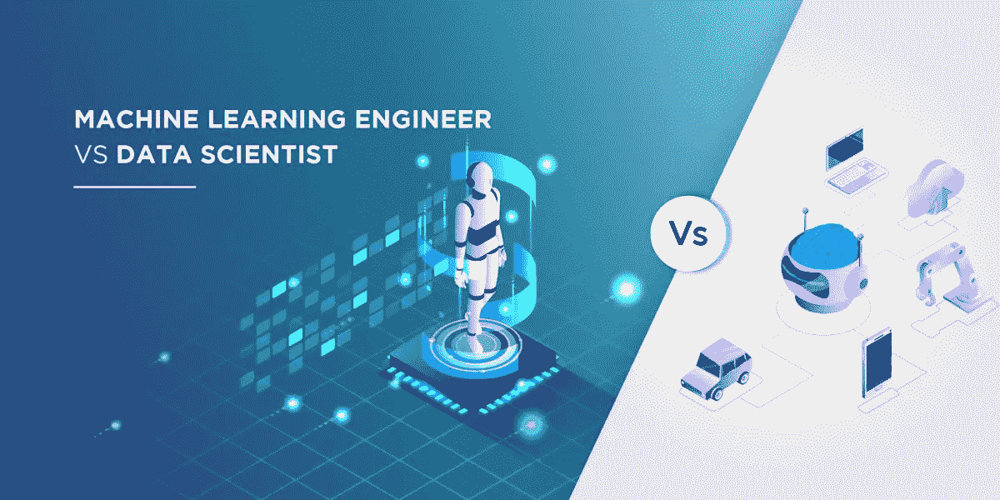
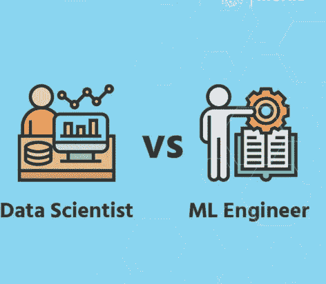

# 数据科学家和机器学习工程师之间的冲突，胜利者是…

> 原文：<https://medium.datadriveninvestor.com/the-clash-between-data-scientists-and-machine-learning-engineer-the-winner-is-2605504c9a8f?source=collection_archive---------12----------------------->

**数据科学家**和**机器学习工程师**实际上都是统称。职位本身通常并不决定个人的工作，这可能因组织而异。

如今，数据科学家的工作已经变得越来越普遍和广泛，在某种程度上，机器学习可能会完全被它所包含。但是，也有数据科学家不分析数据本身的情况。

**数据科学家**和**机器学习工程师**是目前行业内最热门的两个职位。随着每天产生 2.5 万亿字节的数据，一个能够整理这些海量数据并给出商业解决方案的专家肯定会成为传奇！机器学习工程师和数据科学家之间的竞争正在扩大，他们之间的界限正在缩小。

 [## 成为数据科学家所需的 8 项技能|数据驱动型投资者

### 数字吓不倒你？没有什么比一张漂亮的 excel 表更令人满意的了？你会说几种语言…

www.datadriveninvestor.com](https://www.datadriveninvestor.com/2019/02/07/8-skills-you-need-to-become-a-data-scientist/) 

在这篇文章中，我将阐述机器学习工程师和数据科学家之间的区别。在进入主题之前，我们先了解一下机器学习和数据科学之间的对比如何。

# 什么是机器学习和数据科学？

**机器学习**是利用人工智能使计算机无需编程就能学习。使用 ML，计算机通过利用可访问的数据和不同的算法来建立机器学习模型。这些算法使得软件应用程序可以选择预测结果，而无需任何编程。

## [***你的机器学习世界的登机牌***](https://techvidvan.com/tutorials/machine-learning-tutorial/)

**数据科学**是深入研究数据，理解例子、模式和行为。简而言之，数据科学就是从可获得的数据中进行预测和推断。这些重要的知识有助于组织了解客户的行为和兴趣，并做出更明智的商业决策。

例如，网飞区分客户的观看模式，以理解他们喜欢什么，并使用这些数据在他们的网站上发布新的系列。

# 谁是数据科学家和机器学习工程师？

既然我们对机器学习和数据科学有了基本的了解，我们来理解一下谁是机器学习工程师和数据科学家如何

## **数据科学家** —

数据科学家受雇于协会，因为他们帮助组织从数据中提取有价值的见解。数据科学家分析数据并使用编程语言(例如 Java)创建程序，这些程序可以发现数据中的模式。有了这些数据，组织可以熟悉客户行为、参与度，而这仅仅是开始。

## [***因为你想成为一名数据科学家！***](https://techvidvan.com/tutorials/what-is-data-science/)

数据科学家基本上以研究为中心，以决定人工智能方法的类型，为算法建模，然后为测试目的建模。

## **机器学习工程师** —

ML 工程师就像其他从事开发活动的工程师一样，明确地对机器学习感兴趣。他们在由数据科学家表征的数据模型上构建算法。

此外，ML 工程师还拥有创建控制个人电脑的程序的知识。在 ML 工程师创造的算法的帮助下，这些机器可以在没有人指导的情况下理解命令。

# **工作职责**

接下来，我们调查一下机器学习工程师和数据科学家在日常生活中做些什么，怎么样

## **数据科学家-**

1.数据分析师的主要角色是理解客户的业务需求并提出解决方案

2.执行数据挖掘，以检查他们是否能够提取对组织有利的重要数据

3.确定改进组织中产生更好结果的程序的开放途径

4.利用深度学习框架(如 TensorFlow)构建深度学习模型

5.利用各种技术进行数据分析，并利用图表等表示数据

## **机器学习工程师-**

1.ML 工程师完成研究并实现合适的 ML 算法和工具

2.创建有助于理解业务目标的行动计划

3.根据业务先决条件创建机器学习应用程序

4.使用现有的 ML 框架和库进行分析，并在必要时扩展它们

5.确认数据的质量

# **数据科学家所需的技能**

*   统计数字
*   数据挖掘和清理
*   数据可视化
*   非结构化数据管理策略
*   编程语言，例如，R 和 Python
*   理解 SQL 数据库
*   利用 Hadoop、Hive 和 Pig 等大数据工具

# **机器学习工程师需要的技能**

*   软件工程基础
*   统计建模
*   数据评估和监测
*   算法的理解和运用
*   自然语言处理
*   数据架构设计
*   文本表征策略

# **工资**

数据科学家和机器学习工程师的薪酬可能会根据他们的工作角色和所在国家/地区的想法而有所不同。

## **数据科学家**

正如**实际上**的一份概览所示，数据科学家的平均薪酬是**每年**(美国)121，018 美元。 **Glassdoor** 报道数据科学家的正常报酬**每年 11 万美元**。

## **机器学习工程师**

正如**实际上**的概述所示，机器学习工程师的平均薪酬为**每年**140，470 美元(在美国)。

# **包装**

正如你可能已经理解的那样，在这一点上，这两种职业有很多相同的地方。这取决于你的兴趣领域以及你需要如何规划你的职业生涯。

无论是这两者，你都将从事对能力有巨大需求的技术工作，甚至在未来的几年里。通过这种方式，你可以安全地解决在这两个领域选择职业的任何问题。