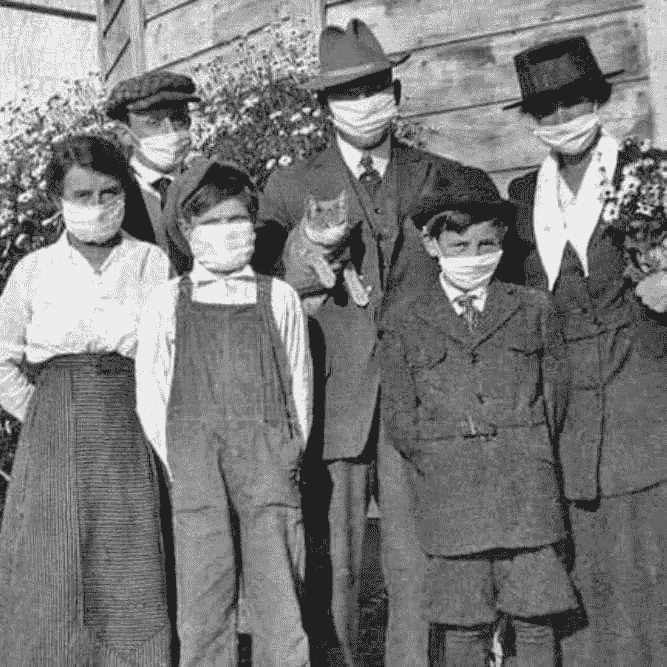

# 即将到来的政府和第二次大萧条

> 原文：<https://medium.datadriveninvestor.com/the-coming-administration-and-the-second-great-depression-11ca665e6a41?source=collection_archive---------11----------------------->

Family for an Outing. circa-1919

疫情效应之一是第二次大萧条。这并不出人意料。当你关闭一个相互联系的全球经济时，这并不奇怪。教科书上的定义还没有出现，但在两个季度内就会出现。目前，至少有四分之一的劳动力处于休假或失业状态。这片土地上有饥饿，需要做一些事情来减轻痛苦。就像需要关闭来减轻病毒一样。

下一届政府将面临历史性的挑战，不，我不认为唐纳德·特朗普会赢得第二个任期。归根结底，你如何在遏制病毒的同时重建经济。这不仅仅是美国，因为全球经济陷入停滞。我们喜欢假装我们是孤独的。但世界各地的政府都面临着类似的问题和决策。这不仅仅是如何关闭经济。这其实很简单。下一个问题是，你如何重新启动你的经济，并将感染率保持在足够低的水平，不至于让医疗系统不堪重负。这很重要，在我们获得疫苗或群体免疫之前，这种舞蹈将不得不继续。

 [## 保护主义、政治和经济动荡|数据驱动的投资者

### 美国股市昨日出现 400 多点的大幅反转，为未来的事情发出了警告信号。市场…

www.datadriveninvestor.com](https://www.datadriveninvestor.com/2018/06/28/protectionism-politics-economic-turmoil/) 

病毒不在乎你是穷人还是富人，白人还是黑人，共和党人还是民主党人，无党派人士。就此而言，它不在乎你是中国人、美国人还是欧洲人。你是宿主，因为它的生物过程，在生命前沿的某个地方，要发生。你的细胞提供了它繁殖所需的材料。把我们自己从彼此身上切割下来会削弱它从一个宿主跳到另一个宿主并继续在整个种群中燃烧的能力。这就是比现代医学还要古老的卫生警戒线的逻辑。

我们在科学医学时代也有一些历史先例。1918 年的疫情也经历了经济放缓，因为城市迫使人们呆在家里。是的，一些关闭的电影院，还有餐馆。它是在一场全球战争结束时出现的，也可能是战争结束的一个原因。我们的军队把它带到了欧洲，在那里它像野火一样在战壕里蔓延。然而，没有一个国家像我们这样阻止了全球经济的发展。那是一种致命的流感，这是一个很好的问题，如果不需要前线的军队就能阻止它。除了军队之外，人们的流动性远不如我们现在。这有助于在疾病蔓延出堪萨斯州后，将疾病控制在城市或地区内。

这就是为什么卫生警戒线大多是在城市一级制定的。这就是为什么州长们大多不做这些决定。这就是为什么我们有关于不同城市如何应对危机以及决策如何影响其公民的详细数据。圣路易斯提供了一个很好的政策例子，当州长们决定重新启动他们的经济时，我们可能会看到。费城也是抢篮板的典范，现在我想到了佐治亚、德克萨斯和佛罗里达。目前，除了一些明显的例外，这些决定是沿着美国政治的蓝红轴心做出的。

这种愚蠢到了保守主义者的地步，他们否认科学是一种精英主义的东西，称之为面具是对国家的钳制。因此，他们选择了一个有助于保护生命的公共卫生措施，作为死亡的起点。这就是我们目前的虚无主义所在。因此，我们需要展望未来，因为本届政府将永远不会做需要做的事情，并在应对方面玩忽职守。说实话，唐纳德·特朗普总统被一种他几乎无法理解的情况所淹没。

当新政府接管时，将会有相当多的并发健康数据来告诉他们什么有效，什么无效。从来自日本和马来西亚的一般流行病学数据来看，我预计佐治亚州和得克萨斯州的疫情将会反弹。这不是是否的问题，而是何时的问题。我们还缺少必要的测试。在这一点上，总统正准备他的基地指责州长。他永远不会承担责任，但也逃不过历史的审判。

这些死亡数据将有助于即将上任的政府制定国家政策。他将受到同样的红色美国州长的抵制，因为民主党人没有任何合法的权利来管理他们。我们已经看到了右翼的愤怒是什么样子。武装人员进入州议会大厦，没有入侵州议会大厦，是它的一部分。极右派害怕一个多元化的国家，认为在社会主义下死了比活着更好。他们知道民主党是他们内部的敌人。几十年来，他们一直被宣传渠道灌输这种思想，并将其内化到至少将武器带入州议会的程度。

具有讽刺意味的是，这个死亡邪教可能会以自由的名义大量死亡。当他们抗议时，他们会把疾病带回家，带给朋友、家人和长辈。但是新政府将不得不面对现实。不仅仅是病毒，还有不承认自己政府合法性的人们的愤怒。有些人是死党，当他们的邪教领袖输掉选举时，他们的愤怒会让他们走上绝路。

然后是医学现实。在我们通过疫苗或疾病传播获得群体免疫之前，我们将继续经历工作世界的重大变化。在一月前拥有疫苗不仅被广泛看好，而且三亿剂疫苗也不会出现。这是生产限制的问题。所以我们需要继续降低传播速度。这意味着人们需要经历这个新的现实。

我们也许可以通过给人们接种肺结核疫苗来降低 COVID 的风险。这种疫苗是古老的、安全的，并且正在大规模生产。它仍然在结核病流行的地方使用，在结核病不流行的地方也有其他令人惊讶的用途。例如，它已经被成功地用于治疗一些癌症。

如果我们决定为医疗提供者接种疫苗，因为它可能具有有限的保护作用，这将改变美国一代人的医疗协议。我知道，我小时候得过这种病，不出所料，后来我在结核病测试中呈阳性。美国公共卫生部门不明白这是为什么。但如果这种疫苗被广泛使用，至少在一代人的时间里，测试医疗提供者的暴露程度将成为过去。疫苗意味着供应商在技术上暴露了。

即将上任的政府可能手头有疫苗，因为现任政府正试图加快疫苗的开发。正如芭芭拉·博克斯医生所说，这在理论上是可能的。世界各地的各种临床试验中有许多候选疫苗。在美国可能多达八个，其中一个来自 Moderna。这是一种冠状病毒，这将使它变得棘手。这是你没有接种普通感冒疫苗的一个原因。这是一种冠状病毒。它们往往变化很大，在这一点上，我们知道至少有两种 COVID 的[菌株](https://www.hopkinsguides.com/hopkins/view/Johns_Hopkins_ABX_Guide/540747/all/Coronavirus_COVID_19__SARS_CoV_2_)。一个比另一个更致命。这可以部分解释，与西海岸相比，欧洲和纽约的死亡率不同。

十八个月内的疫苗也将打破记录。我们做得最快的是 20 世纪 60 年代的腮腺炎，那花了四年时间。

目前，作为一个社会。我们需要继续做我们知道有效的事情。社交距离，尽量待在家里，公共场合戴口罩。这就引出了等式的第二部分。这不仅仅是一场公共健康危机。这是自大萧条以来最严重的经济危机。这造成了很大的社会压力，至少在社会上引起了一些人的愤怒。现在的政府似乎愿意牺牲至少 10 万美国人来开放经济和改善选举前景。顺便说一句，这个数字将远远高于十万，而且有些人已经[隐瞒了](https://www.tampabay.com/news/health/2020/04/29/florida-medical-examiners-were-releasing-coronavirus-death-data-the-state-made-them-stop/?utm_source=twitter&utm_campaign=SocialFlow&utm_medium=social&utm_content=%40TB_Tmes&__twitter_impression=true)实际数据(是的，罗恩·德·森蒂斯峰州长，我正在和你说话。)

假设民主党人控制了众议院、参议院(是的，这是在进行中)和白宫，他们将能够制定经济政策，这些政策将不得不采取凯恩斯主义。过去两代人的涓滴经济学已经结束，即使共和党人将为此战斗到他们最后的意识形态广度。让我们在这里明确，乔拜登是一个中间偏右的民主党人，更符合芝加哥而不是世纪中期的混合经济。不过，那是当时，这是现在。

历史往往会迫使人们改变思维方式。这场危机已经表明民主党人比意识形态更加务实。前几天，发言人南希·佩洛西谈到了 T2 的功能性全民基本收入。

> “其他人建议设立最低收入，为人们提供有保障的收入。那现在值得关注吗？或许如此。因为除了小企业和小企业雇佣的人之外，还有更多人……这可能也需要一些帮助。”

她后来走了回去，以获得支持。但事实是，我们看到的讨论完全是凯恩斯主义的。这些政策甚至在三周前在主流社会都是不可想象的。在民主党的新自由主义追随者中尤其如此。这又让我想起了拜登。环境将迫使许多进步人士真正喜欢的政策出台。这将是一个生存和维持文明社会的问题。这也意味着需要向社会上层征税。是同一批人为了降低他们的税收而给两党捐款。

说白了……新自由主义的时代结束了。这是全球性的。要把我们自己从这个经济黑洞中挖出来，需要像赤字支出这样的战时措施。我们已经看到了一些。一些政府，如西班牙，在基本收入等方面领先于我们。美国将面临重建经济和公民社会的双重负担。它需要恢复对政府的信任。自 20 世纪 80 年代以来，这个政府在不同程度上受到了两党的攻击。

已经发生的事情也提供了机会，包括以一种绿色新政的形式重建经济，进一步实施旧的新政，以及回到在战后时期建立我们经济的混合经济。正如我上面所说，这意味着更多的累进税率，包括至少 70%的边际税率，这是肯尼迪政府的税率。也许，我们应该考虑百分之九十二，这是二战的现实。

有一些战略产业需要回到美国。首先是毒品的生产。令人惊讶的是，我们已经出口了泰诺、生理盐水和医用管材的生产。我们不在美国生产医疗防护设备是愚蠢的。然而，我们也需要就我们的医疗体系进行一次非常公开的对话。我们需要把它带到私营部门之外。我们是唯一没有某种形式公共选择的发达经济体。在正常时期，它会提高工业成本。现在，这场战斗中最薄弱的环节恰恰是那个害怕医疗破产而不愿去看医生的人。我们也有数百万人失去了他们的保险，因为他们列出了他们的工作，这将使获得医疗保健完全可怕。这一新的现实将迫使变革。我们也看到医疗系统由于缺乏非紧急手术和其他治疗而解雇人员。在现代医疗体系中，赚钱的是那些人，而不是一种新型病毒的急诊和重症监护。

当我们试图重新启动一个工人几乎没有得到任何支持的经济时，所有这些对话都会发生。为什么？因为意识形态仍然胜过新的经济现实，至少对两大政党中的一个来说是这样。一个比现实更依赖于工业巨头和奥地利学派的世界。一个也看到机会的国家，除非他们设法保住政治权力。