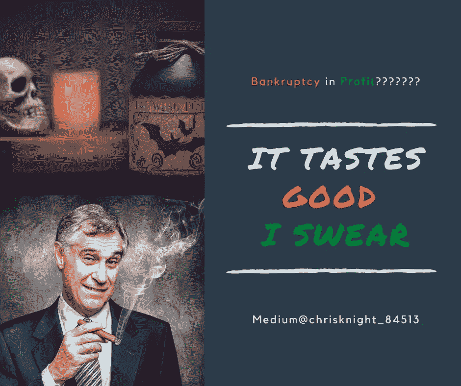

# 你的经纪交易利润中公司破产的引人注目的景象

> 原文：<https://medium.datadriveninvestor.com/the-compelling-sight-of-corporate-bankruptcy-in-your-brokerage-trading-profits-ee1d4c4fd041?source=collection_archive---------19----------------------->

## 中毒的牧师拯救了我，他喜欢我的毒性。我比那些有视力的人跳得更快，但却通过藏起他们的眼镜愚弄了我周围的每个人。

Source: Self Created Image with Canva

我是你的企业浪潮。我是你经纪账户的利润。我是你的股票和债券持有人。

尽管我们的企业市场一落千丈，商业表现惨淡，企业申请破产，一片混乱，我们的股票市场却……飙升？

换句话说，在可预见的未来，企业有恶化的迹象。当企业有一些钱，一些收入，但不能完全支付全部账单时，它会做什么？

他们告诉法庭，他们正在修改法案条款，并让公司进入破产管理程序。

 [## 如何在 Robinhood |数据驱动的投资者上不破产交易期权

### 新冠肺炎·疫情关闭了大多数工作场所。许多人现在从…

www.datadriveninvestor.com](https://www.datadriveninvestor.com/2020/07/01/how-to-not-go-broke-trading-options-on-robinhood/) 

毕竟，由于美联储的购买，处于疯狂状态的债券交易价格比票面价格高出 30%。公司不付款，但谁能说一旦他们完成了更有利条款的谈判，美联储就不会买单。[美联储刚刚印了 3 万亿美元。](https://www.marketplace.org/2020/06/16/the-fed-starts-buying-corporate-bonds/)

**显然，法院将接受企业破产申请，给美联储一个可以想象的最好的还款方案**。

**第十一章破产大救星**

第 11 章破产是一种通常用于公司重组的破产形式。这种类型的破产有时被称为“重组”。

当公司意识到没有可预见的方式来按照约定的条款支付账单，但又想偿还时，就会发生重组。

第 11 章破产案在 5 月份上升了 48%，6 月份[上升了 43%，7 月份](https://www.globenewswire.com/news-release/2020/07/03/2057391/0/en/Chapter-11-U-S-Commercial-Bankruptcies-up-43-in-June.html)上升了 52%。全国餐馆协会预测今年餐饮业将会损失 2400 亿美元。[美国消费者新闻与商业频道](https://www.cnbc.com/2020/07/22/coronavirus-retail-workforce-faces-permanent-decline.html)由于公司亏损，国有零售劳动力面临永久性下降。

尽管这些惊人的事实，破产公司的股票正在上涨。你只需要看看赫兹。该公司获准发行 10 亿美元的普通股。赫兹的股票在 6 月 8 日从 0.56 美元涨到了 5.53 美元。

**增益背后的逻辑**

没有明显的基本原则可以引用。学校里没有教授支持 GDP 负增长、利润下滑、失业、申请破产和疫情环境推动股价上涨的经济理论。

市场的表现与逻辑完全相反。

逻辑就是没有逻辑。

**破产中的收益预示着新的变化**

激增背后的逻辑是重组选择获得信用担保人。我知道你在挠头。通常情况下，违约公司会失去其投资级评级。

如果一家公司的产品中除了热水什么都没有，那么它就不能被视为顶级威士忌。

有一种方法可以将这种可怕的烧灼感借口冒充为标签为“T21”的威士忌。如果你发现了差价，酒保会向你保证退款。

**信用违约互换使用激增**

保险业以一些相当狡猾的东西而闻名。在他们的新奇产品中，有一种鲜为人知的保险政策叫做“信用违约互换”。对于那些忘记了这是什么的人来说，这与 2004 年至 2008 年获得有毒抵押贷款投资级评级是一回事。

我们多快就忘记了过去的教训…

像赫兹这样的公司正押注于两件大事。

公司押注的第一件大事是政府将回购他们的股票/债务。许多人都在猜测这一点，包括福布斯的首席经济学家。

公司押注的第二件大事是，主要投资级保险公司将为它们提供保险担保。

**当一家真正有毒的公司成为一剂新冠肺炎疫苗时，你必须小心。**

垃圾公司通过保险公司的承诺假装投资级别的伪装是致命的。

公司债券发行的评级可能低于投资级，但如果其保险担保人是投资级，则适用“通过评级”。这是一种让*乔投资者*相信他拥有“安全”债券/股票的方法，而事实上这是一种“垃圾”债券/股票。

**金融美国最后的荒野边界**

保险业是美国最后的荒野。销售代表跳上桌子，挥手致意，团队领导抛出现金作为佣金，每个人都在周五喝酒庆祝赚到的钱。

这是字面上的东西。我知道我见过。如果我不认为这很有趣，那我就是在撒谎……但事实是，这是 1990 年代，到处都是股票经纪人。

然后，美国证券交易委员会介入，拆散了双方。

现在，经纪自营商戴着眼镜，不敢给你写电子邮件，也不会接受客户，除非客户的流动性达到 25 万英镑，而且只买蓝筹股。

> 在我们下一次金融崩溃后，保险专员将会对所有向一家有毒公司出售信用违约互换的人进行罚款，这导致联邦政府又增加了 10 万亿美元的赤字。

**仔细阅读说明书或确保自己不被骗**

带走的是简单的读者。仔细阅读你的计划书。**如果你的债券或股票赎回由保险公司担保，这需要是一个主要的“危险信号”**。[不要相信给次贷危机投资评级的评级机构](https://www.businessinsider.com/moodys-which-gave-investment-grade-ratings-to-hundreds-of-billions-of-toxic-mortgage-backed-securities-2011-6)。**2008 年大家都是这样亏的**。

一家有可能支付账单的公司有三样坚实的东西。

首先是强大的现金流。

第二件事是现金流的利润。

第三件事是现金流的增长。

如果这三件事没有发生，那就不安全。这也适用于股票。如果你想去赌博，没问题。如果地板从下面掉下来，不要抱怨。

资产负债表的东西在这个市场并不好。我们有一个僵死的金融系统。除了有担保的美联储购买力平价，银行不会贷款给任何东西。你不需要高速公路旁边的 10 英亩，当一切都砸到球迷身上。你需要钱。确保你没有依赖于保险公司，他们会因为 COVID 而逃避责任。

**保险利润是通过拒绝你的索赔而获得的**。

记住这些话。

我会在 18 个月后写这篇文章。我再打一次。这篇文章将成为那些有 6 分钟耐心的人的另一个书面预言。希望你会是那个阅读的人，而不是那个还没有跟随我的人。

祝你知识成功！

***

关于 Christopher:Christopher Knight Lopez 是一名职业骗子，在他的职业生涯中，他与职业企业家进行了广泛的合作。在他 14 年的职业生涯中，Christopher 已经开了超过 7 家公司。克里斯托弗的目的是利用各种市场驱动的机会。Christopher 是注册项目经理(MPM)和认证财务分析师(AFA)。Christopher 之前通过了 65 系列证券执照考试。克里斯托弗也有他的总路线——人寿、意外、健康和健康维护组织。Christopher 已经管理了总计 2 . 86 亿美元的报告管理资产和建议资产。Christopher 在 29 个国家有工作经验，为各种业务筹集了超过 5000 万美元，在他的个人职业生涯中总收入超过 1300 万美元。Christopher 曾在高科技行业工作:生物技术、金融、证券、制造、房地产和住房抵押贷款。克里斯托弗是一名美国空军老兵。克里斯托弗热爱家庭、竞技体育、钓鱼、武术，并倡导企业家精神。克里斯托弗为崭露头角的企业家提供自助课程。克里斯托弗对导师的热情来自于企业家和骗子需要指导的信念。这个世界充满了关于企业家身份的相互矛盾的信息。在 www.christopherklopez.com[看更多。](http://www.christopherklopez.com.)

免责声明:这些信息并不意味着是一种投资建议或财务建议。不要把这种情况应用到你自己的个人环境中。各种风险包括:商业风险、投资风险、政治风险和其他风险。此信息仅用于信息和教育目的。请不要向作者寻求任何投资策略或哲学。针对自己的情况，请咨询自己的理财顾问或法律顾问。不是任何形式的推荐或认可。

**进入专家视图—** [**订阅 DDI 英特尔**](https://datadriveninvestor.com/ddi-intel)