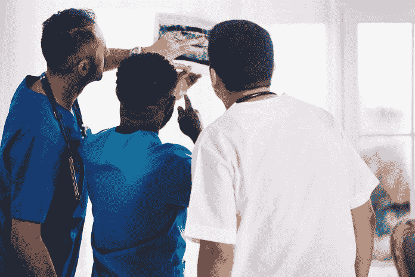

# 面对不断变化的技术发展，竞争激烈的医疗保健领域

> 原文：<https://medium.datadriveninvestor.com/the-competitive-healthcare-landscape-in-the-face-of-veering-technological-upswings-acf8fbdedc85?source=collection_archive---------10----------------------->

#Healthcare

# 这需要敏捷的业务度量

商业格局正在继续变化。千禧一代的态度正在演变成一种更加消费主义的态度。技术进步是永恒的，21 世纪的市场行为和公共关系也是如此。这一趋势正在无缝地影响着每一个行业，包括医生执业和整个医疗保健。但是没有多少医生完全接受这种转变。似乎存在一个不断扩大的市场适应真空，这刺痛了医疗体系。

# 21 世纪的市场趋势

直到不久前，贸易还是相当简单的杂务。商业需求比供给、产品和服务结构更重要。世代是这些商业交易最核心的支持者。

然而，最近，高产量已经成为一个简单的任务，使得市场领域挤满了大量的同等产品和服务。面对有限的小巷，垄断的供求，以及明确定义的客户[接触-](https://experienceinvestigators.com/customer-touchpoint/) 点，商业废话已经增长到不成比例。对于任何遭遇，它使客户和企业能够更有效地交换信息、提供服务或处理交易。

# 历史视角

在过去，阶级认同和伟大的创意给公司带来了最大的价值。当他们的第一栋[大楼](https://www.datadriveninvestor.com/glossary/block/)建成时，组织层级是固定的，基于筒仓的。

传统的商业模式、产品和活动的生命周期处于光谱的两端:漫长而艰辛的或垂直的。系统安排通过与客户团队一起启动、计划、创建和推出大规模活动来反映这一过程。传统的方法是有争议的，但却是一种富有成效的协作和实现最终目标的方式。

但是，今天，这种做事方式经常被认为是另一个需要克服的障碍。其中一些变化可能与社交媒体渠道、搜索引擎容量、在线视频、数百万网页和[电子商务](https://www.datadriveninvestor.com/glossary/e-commerce/)的扩张有关。似乎电视本身已经将孤立的静态顾客路径转化为动态体验，将一条单一信息分割成数百万个[数据点](https://whatis.techtarget.com/definition/data-point)。

# 什么在改变？

在当代领域，数据被分解成数百或数千个独立信息或孤立事实的离散单元。从统计学或逻辑意义上来说，一个数据点通常来源于一个主要以数字或图形表示的测量或研究。

事实上，普通客户已经转变为可能的媒体来源，形成了高度分散的格局。

今天，产品、服务和品种比以往任何时候都更能体现它们的前景或文化倾向；以及消费者是如何区分和评判它们的。

除此之外，我们看到[产品生命周期](https://www.investopedia.com/terms/p/product-life-cycle.asp)的缩短，这是非常动态的。后者一直存在于汽车等历史传统行业。因此，汽车行业已经完全从七年一次的旧模式转变为每年一次的车型更新，尤其是随着 4G 技术的更新。

Photo by [Luca Bravo](https://unsplash.com/@lucabravo?utm_source=medium&utm_medium=referral) on [Unsplash](https://unsplash.com?utm_source=medium&utm_medium=referral)

# 产业发展必须与市场和品牌流动性同步

不断扩展的[数据科学](https://www.datadriveninvestor.com/glossary/data-science/)和[数据挖掘](https://www.datadriveninvestor.com/glossary/data-mining/)；营销人员和品牌专家正变得比以往任何时候都更像是现代赞助的守门人。因此，那些掌握营销和品牌的实体不仅会生存下来，还会繁荣发展。然而，并非所有行业都成功完成了这一转变，尽管大多数行业都在快速掌握数据分割和分析的艺术。

# 商业模式的改革

当前时代的商业模式支持从有形产品到服务和订阅安排的转变。后一种模式支持任何设备，以及被纳入整个产品福利的组件。最新的政策适用于所有行业，包括医疗保健、计算机和汽车行业。

与此同时，为了保持他们服务的最大价值，我们正在见证一场组织变革。通过这种方式，公司将大量关键业务(如数据分析、内容创作或设计)掌握在自己手中。

最新的趋势是在前系统期间主要外包的策略。尽管如此，由于在[数据科学](https://www.datadriveninvestor.com/glossary/data-science/)、[机器学习](https://www.datadriveninvestor.com/glossary/machine-learning/)和[数据挖掘](https://www.datadriveninvestor.com/glossary/data-mining/)技术方面取得的进步，企业正急切地调整其战略，以遏制市场动态。后者反过来要求实体重新思考他们向客户提供的价值。

与此同时，与之相伴的商业系统必须学会重组他们的专业技能。

# 组织结构调整和人才保留

在吸引和留住最优秀的人才的同时控制成本，对重组的系统要求越来越高。在新的议会中，最大的透明度是必须的。

当代系统必须支持和维护一个安全协作、自动化和智能策略的环境。现代系统应该能够在合适的时间戳合作者，让他们在任何时间任何地点做出贡献。这种安排需要现代软件解决方案支持的组织结构调整。

# 对现代商业趋势的新见解

对市场趋势的洞察和传统市场研究的转变需要得到认可。事实上，它已经让位于实时受众测试、第一方数据分析和建模。为了对主流市场建立令人信服的洞察力，每种业务模式都需要数据管理和分析的支持。它还必须采用新的流程来测试新的想法和接近市场。

# 市场趋势和现代转变

众所周知，营销和品牌的意义至关重要。与过去主要通过自上而下的大规模活动强调营销策略的模式相反，今天的品牌和营销正变得个性化。他们不再总是关注信息、价值观和重要目标，而是将这些细分为多个关注点的微型活动。然而，为了有效地执行，它需要敏捷的项目实施和快速完成，最好是在内部或通过战略合作伙伴关系推出。

敏捷项目管理技术必须适应高效灵活的团队，主要关注稳健的推广。流程的表达必须尊重反馈的持续流入。因此，最基本的是，敏捷团队利用开发周期中较短的阶段，一次只覆盖几个更新，而不是试图在几个修改中解决每个问题。同样地，协作环境应该不断地发布稳定的、提升的质量改进水平。

品牌和营销专家认为，将资金投入大创意、内容或媒体不会解决现代挑战。技术的巧妙运用使当前的公司和营销策略基于清晰的愿景、战术设计、遵循可能的以人为本的实施策略而与众不同。

医生还必须尝试计算实现上述高层次要求所需的可操作步骤。

# 医学实践抵制或不能适应这种模式

今天的医疗保健系统也处于混乱之中。就像描述的一般商业计划一样，医疗保健也在经历转变。但是，医疗保健的转变并不一定遵循其他部门所观察到的类似路径。后者部分是由于误解和修辞倾向，因为医疗保健不是一门生意。这也是医学界对信息技术普遍的不信任。

另一个威胁医学界的挑战是[医生在面对](https://medium.com/datadriveninvestor/healthcare-technology-rush-the-major-factor-behind-the-disconnect-between-physicians-and-their-d599683b55f0)[邻近产业部门](https://medium.com/datadriveninvestor/transformers-a-metaphorical-analysis-of-the-modern-day-corporatism-d2ad19ef768)压倒性接管健康产业时的消极态度。一方面，医生不愿意在科技行业占据一席之地，医疗保健领域由数据驱动的多行业占据导致了真空，由错误的人引入了错误的解决方案。

医疗保健行业的发展正变得个性化。但是，不幸的是，定义个性化的数据点并不是基于敏捷的医患互动。相反，科技行业正在以一种敏捷的实现方式接管医疗保健，这种实现方式对其他业务部门来说更具技术性和定制性。

# 四点在医学实践中的应用

# 商业模式

传统上，医疗实践要么随意管理，要么外包。医生在历史上长期依赖于保险行业在流程中规定的规则和琐碎的例外。

总的来说，主要的营销活动是通过专业推荐和口头宣传进行的。更现代一代人也试图将他们的公关活动外包出去。随着数据科学、机器学习和数据挖掘技术的进步，医疗保健行业不可避免地要重塑以适应新的商业模式。

公司急切地将他们的战略方法转向抑制市场动态。然而，在这方面，医疗界落后于其他行业。医生的实践，因此需要重新审视价值观；重新评估对客户的承诺。与此同时，他们需要重组专业知识。因为公司，包括保险公司，都在拼命寻找病人和医生的数据。

Photo by [National Cancer Institute](https://unsplash.com/@nci?utm_source=medium&utm_medium=referral) on [Unsplash](https://unsplash.com?utm_source=medium&utm_medium=referral)

企业还利用非医疗实体开发的算法来创造千篇一律的药物，以补充其商业垄断。

我们有现成的技术、策略和资源来创建一个合适的敏捷环境。因此，我们可以促进医疗保健中所有利益相关者的透明度、积极参与、设计和互操作性。这是商业流动性实践模式的医疗保健版本，致力于增强个人权能。它包含了责任感和独立思考。利用低成本的交付模式和合理实用的个性化医疗计划是至关重要的。

# 结构

在吸引和留住最佳人才的同时控制成本，增加系统对结构的需求，这在医疗实践中并不陌生。尽管如此，在现代体系的范围内，最终的透明度对那些精通医疗政策的人来说是另一个挑战。如果 Iff 可以使用正确的技术和协作环境，那么当今的系统可以支持和维护智能环境。它应该在适当的时候激励所有的利益相关者，使他们能够从任何地方无缝地做出贡献。因此，组织结构必须补充由医生拥有和验证的现代分散软件解决方案。

# 见识

当前的政策转变实现了市场趋势和传统市场研究模式的转变。因此，它正被实时患者研究、反馈和知情决策能力所取代。

千禧一代对健康和医疗保健的态度，以及他们对社交媒体、谷歌医生和整体技术的过度依赖，是为患者在互联网上搜索和分享的内容增加额外价值的现实。

最新的事件是科技行业急于利用患者留下的信息足迹的主要因素。

这就是为什么病人、医生以及医学界必须收回他们神圣的财产。他们最终需要关注他们的环境，以建立对主流市场的强大洞察力。它需要精确数据分析的支持，根据领域专家的说法，这些数据分析是“有效的”,并支持透明的流程来测试主导市场中的新概念。

# 营销和公共关系

公共关系和市场营销是合法医疗实践的重要方面。它涉及使用以客户为中心和基于科学的策略来创建、传达和提供健康信息和干预措施，以保护和促进不同人群的健康。

今天，随着品牌和营销的实践变得个性化，医学实践也是如此。

高层次的价值观和宏大的目标不再足以维持高质量的医疗服务。今天的......的药比以往任何时候都更加个性化。医疗保健服务效益的驱动因素被认为是患者主观感知、医生客观评估以及通过战略伙伴关系灵活实施互动的产物。这个过程基本上应该尊重反馈的持续流入，而不是试图通过几次修改来解决每个问题。医疗保健领域的品牌和营销应该利用基于清晰愿景的技术，并辅之以以人为本的拼版。

# 技术是医疗实践模式的驱动力

我们必须开始意识到技术是新商业模式的主要驱动力，包括医疗领域的商业模式。技术进步促进了稳健、动态和透明的业务结构。创新技术增强了信息共享、实时直观的理解、目标定位以及高质量个性化内容的生产。

在现代意义上，传达的备忘录和技术应用的最终结果将品牌描述为更好的产品、范围、服务或有生产力的员工。

拥抱技术是有效控制商标声誉的最有效方式。创造力是基础，尤其是在医疗系统方面。

创造力的力量是一个确切的事实，因为它积极影响医疗服务的价值。但随着个性化商业计划的发展，随着其他任务的兴起，它的相关性已经被冲淡了。因此，创造力正被应用于解决商业问题；相对于崩溃到透明的交流。

通过拥抱个人自由和促进高效、透明、协作、敏捷的实践环境而不是交流专家，现代工具可以为每个患者培养丰富的价值。

*原载于 2020 年 3 月 28 日 https://www.datadriveninvestor.com***。**

* [## 冠状病毒；惊慌失措；字里行间的 z

### 全球频繁大流行年表——围绕冠状病毒的话题:更准确地说，新冠肺炎几乎已经占领了…

www.linkedin.com](https://www.linkedin.com/pulse/coronavirus-a-panic-z-between-lines-adam-tabriz-m-d-/)*