# Git 的完整开发者指南

> 原文：<https://medium.datadriveninvestor.com/the-complete-developers-guide-to-git-6a23125996e1?source=collection_archive---------3----------------------->

## 深入了解对开发人员来说最流行的版本控制技术之一…


Image source and credits: SDTimes

你是新手开发者吗？你最近开始使用 Git 了吗？本文面向所有想开始使用 Git 的新手开发人员和仍然觉得 Git 复杂和令人困惑的有经验的开发人员。

> 好吧，如果你从头到尾看完这篇文章，你可以在 10 分钟内学会 Git！！

Git 是 Linus Torvalds 为 Linux 内核开发设计开发的分布式修订控制和源代码管理系统。它帮助软件开发人员一起工作，并维护他们工作的完整历史。

[](https://medium.com/datadriveninvestor/stack-overflow-analyzed-data-from-60-000-software-developers-hours-they-work-languages-they-476ac6ca0197) [## Stack Overflow 分析了来自 60，000 多名软件开发人员的数据，包括他们的工作时间、语言…

### 以下是他们的发现…

medium.com](https://medium.com/datadriveninvestor/stack-overflow-analyzed-data-from-60-000-software-developers-hours-they-work-languages-they-476ac6ca0197) [](https://medium.com/datadriveninvestor/hacker-earth-surveyed-16000-developers-from-76-countries-heres-what-i-found-dbd5d7c422b0) [## 黑客地球调查了来自 76 个国家的 16000 名开发者——以下是我的发现

### 惊人的洞察力…

medium.com](https://medium.com/datadriveninvestor/hacker-earth-surveyed-16000-developers-from-76-countries-heres-what-i-found-dbd5d7c422b0) [](https://medium.com/datadriveninvestor/hacker-rank-analyzed-data-from-100k-developers-and-hiring-managers-here-is-what-i-found-a374b98e937e) [## Hacker Rank 分析了来自 10 万多名开发人员和招聘经理的数据——以下是我的发现

### 来自 100，000 多名开发人员和招聘经理的出色分析结果

medium.com](https://medium.com/datadriveninvestor/hacker-rank-analyzed-data-from-100k-developers-and-hiring-managers-here-is-what-i-found-a374b98e937e) 

# 其他一些最好的系列—

> [**三十天的机器学习 Ops**](https://medium.com/coders-mojo/day-1-of-30-days-of-machine-learning-ops-7c299e4b09be?sk=4ab48350a5c359fc157109e48b1d738f)
> 
> [**30 天自然语言处理(NLP)系列**](https://medium.com/coders-mojo/quick-recap-30-days-of-natural-language-processing-nlp-with-projects-series-ceb674e3c09b?sk=ca09b27b3d5867f23ab4dc367b6c0c32)
> 
> [**30 天数据工程与项目系列**](https://medium.com/coders-mojo/day-1-of-30-days-of-data-engineering-894822fcb128?sk=76ba558bfe2d9f85cbe741e505295531)
> 
> [**数据科学与机器学习研究(论文)简体**](https://medium.com/coders-mojo/day-1-data-science-and-ml-research-papers-simplified-a68b00a3b1c4?sk=56136229ff738bd734f19d2b6953f78c) ******
> 
> [**60 天数据科学与 ML 系列带项目**](https://medium.com/coders-mojo/day-1-day-60-quick-recap-of-60-days-of-data-science-and-ml-6fc021643d1?sk=4e75e043b7630a9f963562ebac94e129)
> 
> [**100 天:你的数据科学与机器学习学位系列与项目**](https://medium.com/coders-mojo/100-days-your-data-science-and-ml-degree-part-3-c621ecfdf711?sk=1a8c7b0c204d73432d56b7d1a3a26474)
> 
> [**你应该知道的 23 个数据科学技巧**](https://ai.plainenglish.io/23-data-science-techniques-you-should-know-61bc2c9d1b3a?sk=1680c36193eb22198974c9008d62a33c)
> 
> [**科技面试系列—编码问题精选清单**](https://medium.com/coders-mojo/mega-post-tech-interview-the-only-list-of-questions-you-need-to-practice-ee349ea197bb?sk=fac3614684daff4b50a70c0a71e4d528)
> 
> [**完成系统设计与最热门问题系列**](https://medium.com/coders-mojo/system-design-made-easy-quick-recap-of-complete-system-design-34af7e3aedfb?sk=bdd6a19edc1f3ce4a5064923f5b68721)
> 
> [**完成数据可视化及预处理系列与项目**](https://medium.com/coders-mojo/complete-data-preprocessing-and-data-visualization-with-projects-mega-compilation-part-2-41584ef0920e?sk=842390da51689b8d43148c3980570db0)
> 
> [**完整的 Python 系列与项目**](https://medium.com/coders-mojo/complete-python-and-projects-mega-compilation-7ec8f7adfe71?sk=ee0ecf43f23c6dd44dd35d984b3e5df4)
> 
> [**完成高级 Python 系列与项目**](https://medium.com/coders-mojo/complete-advanced-python-with-projects-mega-compilation-part-6-729c1826032b?sk=7faffe20f8039fa57099f7a372b6d665)
> 
> [**Kaggle 最会教你的笔记本**](https://medium.com/coders-mojo/my-list-of-kaggle-best-notebooks-topic-wise-data-science-and-machine-learning-part-2-84772863e9ae?sk=5ed02e419854a6c11add3ddc1e52947f)
> 
> [**Git 开发者指南**](/the-complete-developers-guide-to-git-6a23125996e1?sk=e30479bbe713930ea93018e1a46d9185)
> 
> [**打赏 Github Repos**](https://medium.com/coders-mojo/6-exceptional-github-repos-for-all-developers-part-1-21e8fa04e150?sk=9140b249af6fe73d45717185fad48962) **—第一部分**
> 
> [**打赏 Github Repos**](https://medium.com/coders-mojo/6-exceptional-github-repos-for-all-developers-part-2-3eec9a68c31c?sk=8e31d0eb7eb1d2d0bbbcecaa66bd4e7e) **—第二部**
> 
> [**所有数据科学和机器学习资源**](/best-resources-for-data-science-and-machine-learning-full-list-5ceb9a2791bf?sk=cf85b2cef95560c58509877a794577ff)
> 
> [**210 机器学习项目**](/210-machine-learning-projects-with-source-code-that-you-can-build-today-721b035649e0?sk=da5f593572a0261a6314afad99a0356c)

## 科技时事通讯—

> 如果你感兴趣，你可以加入我的时事通讯，通过它我向超过 30，000 名读者发送技术面试技巧，技术，模式，黑客——软件开发，ML，数据科学，创业公司和技术项目。可以订阅 **Tech Brew :**

[](https://naina0405.substack.com/) [## 点火器

### 数据科学，人工智能，人工智能和更多…点击阅读由 Naina Chaturvedi 撰写的 Ignito，子堆栈出版物。推出 7 个月…

naina0405.substack.com](https://naina0405.substack.com/) 

## Github —

[](https://github.com/Coder-World04) [## 编码器-world 04-概述

### 此时您不能执行该操作。您已使用另一个标签页或窗口登录。您已在另一个选项卡中注销，或者…

github.com](https://github.com/Coder-World04) 

Git 的优势:

1.  **它是免费的—** Git 是在 GPL 的开源许可下发布的。它是开源的，这意味着你可以下载它的源代码，还可以根据你的要求/需要建议/实现修改。
2.  **备份和安全性—** 客户端上的数据镜像存储库，因此在发生崩溃或磁盘损坏的情况下，丢失数据的可能性几乎为零。因为 Git 是用 C 编写的，所以它避免了运行时开销，并且在客户端压缩和存储数据时非常快速有效。Git 使用安全散列函数 SHA1 来命名和识别其数据库中的对象。每一次提交都是校验和，因此不可能意外地或恶意地更改文件、目录、日期、标签、版本和提交消息等。Git 维护源代码的完整性。
3.  **离线和在线—** Git 允许用户在线和离线工作。即使在线，提交操作也是可能的。
4.  **更容易的分支和合并—** 集中式版本控制系统使用廉价拷贝技术。您可以随时创建新分支，因为创建、删除和合并分支只需几秒钟。它通过持续的集成和开发提高了团队的生产力。
5.  **更广泛的接受度—** 由于其普遍接受的可用性、功能性、安全性、灵活性和性能标准，Git 是全球开发人员的首选。

> 众所周知，通过支持大型和小型项目的非线性开发工作流，它具有更好的灵活性，并且非常兼容 HTTP、FTP、rsync 等协议来发布存储库。

# 强烈推荐您必须学习的数据科学和机器学习课程(带证书)—

> [**完成数据科学家**](https://imp.i115008.net/c/2345654/788805/11298?prodsku=nd025&u=https%3A%2F%2Fwww.udacity.com%2Fcourse%2Fdata-scientist-nanodegree--nd025&intsrc=PUI2_5678)
> 
> [**完成数据分析师**](https://imp.i115008.net/c/2345654/788805/11298?prodsku=nd002&u=https%3A%2F%2Fwww.udacity.com%2Fcourse%2Fdata-analyst-nanodegree--nd002&intsrc=PUI2_5678)
> 
> [**完成数据工程**](https://imp.i115008.net/c/2345654/788805/11298?prodsku=nd027&u=https%3A%2F%2Fwww.udacity.com%2Fcourse%2Fdata-engineer-nanodegree--nd027&intsrc=PUI2_5678)
> 
> [**完全机器学习工程师**](https://imp.i115008.net/c/2345654/788805/11298?prodsku=nd009t&u=https%3A%2F%2Fwww.udacity.com%2Fcourse%2Fmachine-learning-engineer-nanodegree--nd009t&intsrc=PUI2_5678)
> 
> [**完成深度学习**](https://imp.i115008.net/c/2345654/788805/11298?prodsku=nd101&u=https%3A%2F%2Fwww.udacity.com%2Fcourse%2Fdeep-learning-nanodegree--nd101&intsrc=PUI2_5678)
> 
> [**完成自然语言处理**](https://imp.i115008.net/c/2345654/788805/11298?prodsku=nd892&u=https%3A%2F%2Fwww.udacity.com%2Fcourse%2Fnatural-language-processing-nanodegree--nd892&intsrc=PUI2_5678)
> 
> [**完全自动驾驶汽车工程师**](https://imp.i115008.net/c/2345654/788805/11298?prodsku=nd0013&u=https%3A%2F%2Fwww.udacity.com%2Fcourse%2Fself-driving-car-engineer-nanodegree--nd0013&intsrc=PUI2_5678)

git(工作流)的三种状态是:

1.  **已提交**

从临时区域获取文件，并永久存储到 git 中的快照。

**2。修改后的**

它从工作目录中获取文件(可以修改/不修改)。

**3。分阶段**

将快照添加到临时区域。

[](https://naina0412.medium.com/slashdata-surveyed-more-than-17000-developers-in-159-countries-heres-what-the-analysis-says-d25484a42051) [## SlashData 调查了 159 个国家的 17000 多名开发人员，分析结果如下…

### 惊人的洞察力…

naina0412.medium.com](https://naina0412.medium.com/slashdata-surveyed-more-than-17000-developers-in-159-countries-heres-what-the-analysis-says-d25484a42051) 

# 安装和设置 Git

我们需要做的第一件事是使用以下命令安装 Git

```
$ sudo apt install git-all
```

检查你电脑上的 Git 版本——

```
$ git --version
```

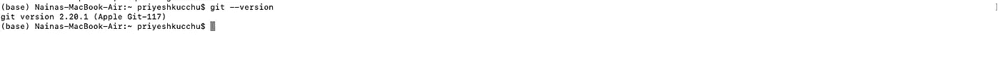

Git Version

登录你的 GitHub 账户，复制你的用户名和邮箱。您可以在本地机器上使用保存您的用户名—

```
$ git config --global user.name "write your username"
```

这将设置用户名。为了设置您的电子邮件地址，请使用以下命令—

```
$ git config --global user.email "Write your email address"
```

一旦成功完成，您就完成了安装和设置。

*附加功能:你也可以使用下面的命令设置 Git 的颜色—*

```
$ git config --global color.ui true
```


这有助于命令行输出的彩色化

> 您准备好从终端开始使用 Git 了吗？马上启动你的终端！

[](https://naina0412.medium.com/10-silicon-valley-liners-puns-that-are-so-funny-apt-relatable-to-the-tech-world-a2ee797f7949) [## 10 个“硅谷”的俏皮话/双关语是如此有趣、贴切且与技术世界相关

### 虽然听起来很搞笑…

naina0412.medium.com](https://naina0412.medium.com/10-silicon-valley-liners-puns-that-are-so-funny-apt-relatable-to-the-tech-world-a2ee797f7949) 

# 在项目目录中初始化 Git

创建一个项目目录(如果您还没有创建任何目录)，只需进入您的终端，在您的项目目录中运行如下命令

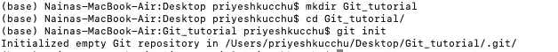

然后使用以下命令初始化 Git

```
$ git init
```

一旦完成，现在您的项目目录中就有了一个名为`.git`的隐藏子目录，其中包含了所有必需的存储库文件。

[](https://medium.com/datadriveninvestor/coding-sins-hilarious-developer-confessions-f55eb342454e) [## 编码原罪:令人捧腹的开发者自白

### “白板”是如何被嘲笑的

medium.com](https://medium.com/datadriveninvestor/coding-sins-hilarious-developer-confessions-f55eb342454e) [](https://medium.com/python-in-plain-english/python-iterators-generators-and-decorators-made-easy-659cae26054f) [## Python 迭代器、生成器和装饰器变得简单

### 快速实施指南

medium.com](https://medium.com/python-in-plain-english/python-iterators-generators-and-decorators-made-easy-659cae26054f) [](https://medium.com/ai-in-plain-english/23-data-science-techniques-you-should-know-61bc2c9d1b3a) [## 你应该知道的 23 种数据科学技术！

### 使用这些技巧来节省你的宝贵时间

medium.com](https://medium.com/ai-in-plain-english/23-data-science-techniques-you-should-know-61bc2c9d1b3a) 

# 添加文件并提交更改

选择您想要附加到 git 项目的文件，并使用下面的命令添加文件—

```
$ git add <file name>
```

默认情况下，此命令不会添加被忽略的文件。

为了添加多个文件—

1.  添加当前目录中的所有文件

```
$ git add -A
```

2.添加当前目录中的所有文件更改

```
$ git add .
```

3.选择要添加到文件中的更改

```
$ git add -p
```

然后使用以下命令，通过提交消息提交所有更改—

```
$ git commit -m "<write a commit message>"
```

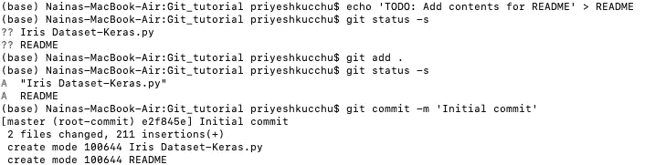

# 推动变革

如果您对更改感到满意，您可以使用以下命令推送所有更改—

```
$ git push
```

如果您想查看提交细节，那么使用命令—

```
$ git log
```

它会给出提交对象的结果、修改作者的名字、时间戳和修改。

在推送之前，如果您想查看更改，请使用以下命令—

```
$ git show <object>
```

成功推送操作后，其他开发人员可以看到您的更改。

[](https://medium.com/datadriveninvestor/advanced-python-made-easy-part-4-a4996ba9fe19) [## 高级 Python 变得简单—第 4 部分

### 使用这些技巧和技术…

medium.com](https://medium.com/datadriveninvestor/advanced-python-made-easy-part-4-a4996ba9fe19) [](https://medium.com/datadriveninvestor/programming-humor-part-2-f92cf5a26f2b) [## 编程幽默第 2 部分

### 继续笑，因为太搞笑了…

medium.com](https://medium.com/datadriveninvestor/programming-humor-part-2-f92cf5a26f2b) 

# 远程备份存储库

您可以在 GitHub 帐户上远程保存和备份您的项目。为此，请前往 github.com 的[创建一个存储库。](https://github.com/)

[](https://www.datadriveninvestor.com/2020/09/11/machine-ecology/) [## 机器生态|数据驱动的投资者

### 气候变化，伴随着森林砍伐、冰川融化、物种大灭绝和碳排放，是人类面临的最大问题

www.datadriveninvestor.com](https://www.datadriveninvestor.com/2020/09/11/machine-ecology/) 

然后使用下面的命令将其添加为本地 git 项目的“存储库名称”—

```
$ git remote add repository-name [https://github.com/*username*/*repo-name*.git](https://github.com/user/repo.git)
```

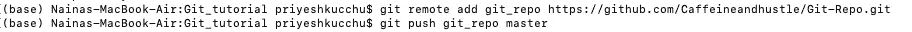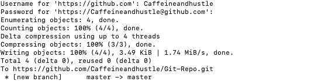

一旦更改被推送，您可以看到我的远程存储库已被更新—

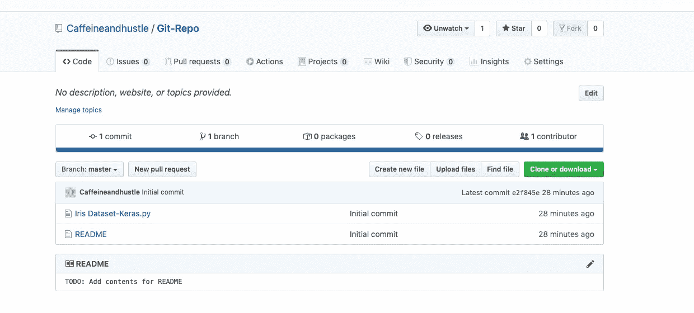

# 状态检查

要检查工作树状态、文件详细信息，请使用命令—

```
$ git status --long
```

— long 用于以长格式显示输出。


如果你想检查你的备份数据和本地数据的状态，这个命令非常有用。

# 克隆

使用 clone，您可以创建远程存储库的实例。为此，请使用克隆命令—

```
$ git clone gituser@git.server.com:project.git
```

# 分支

分支是一个非常重要的部分，它允许创建另一条开发线。您所做的所有提交都是在您签出到的当前分支上完成的。

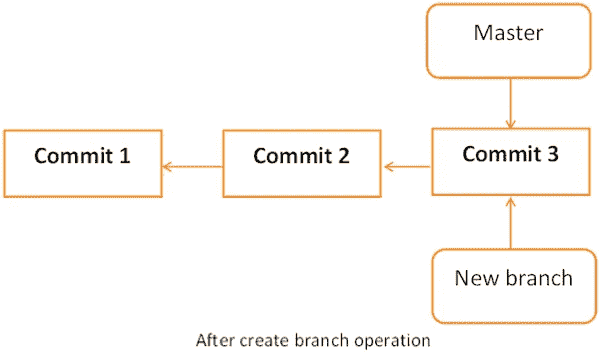

Image source and credits: Pinterest

使用`git status`查看这是哪个分支。

如果您想创建一个新的分支，使用命令—

`$ git branch [branch name]`

使用命令切换分支—

`$ git checkout [branch name]`

为了合并分支并将指定分支的历史记录合并到当前分支中，使用命令—

`$ git merge [branch]`

要重命名分支，请使用命令—

```
$ git branch -m new_branch temp_branch
```

删除指定的分支

`$ git branch -d [branch-name]`

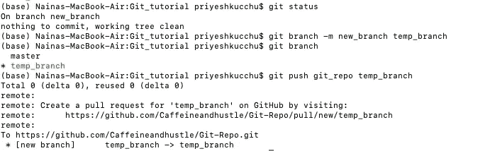

您可以如上所示使用

```
$ git push git_repo temp_branch
```

最后，你可以在你的 GitHub 上看到成功推送的新分支，如下图截图所示—

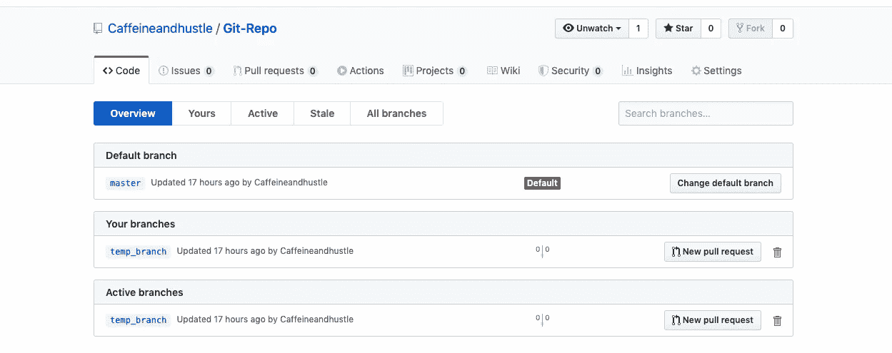

# 同步更改

如果你想在 GitHub 账户上同步你的本地存储库和远程存储库，你可以通过下面的命令很容易的做到——

如果您想从远程跟踪分支下载所有历史，您可以使用—

`$ git fetch`

为了将远程跟踪分支合并到当前的本地分支中，您可以使用 merge 命令—

`$ git merge`

要将所有本地分支提交上传到 GitHub，请使用

`$ git push`

为了用来自 GitHub 上相应远程分支的新提交来更新您当前的本地工作分支，使用 pull 命令——

`$ git pull`

它是 git fetch 和 git pull 的组合。

# 犯罪

要创建包含索引当前内容和描述更改的日志消息的新提交，请使用命令—

`$ git commit -m "commit message"`

新提交是 HEAD 的直接子级，通常是当前分支的尖端。

如果您想添加文件并提交，则使用—

```
git commit file -m 'write commit message'
```

如果你想改变你最近的提交信息，那么—

```
git commit --amend 'write new commit message'
```

# 重做提交

您可以删除您的错误，并通过使用以下命令重置提交来创建新的替换历史——

`$ git reset [commit]`

如果您想在之前运行 commit 后撤消所有提交，并且只在本地保留更改，请使用 reset hard 命令，如下所示

`$ git reset --hard [commit]`

为了切换到最近一次提交之前的代码版本，请使用命令—

```
git reset HEAD^ —"file-name"
```

# 电子邮件

您可以通过电子邮件发送一组补丁。补丁可以指定为文件、目录等，也可以指定为修订列表。Git 通过您的 SMTP 服务器发送电子邮件，因此您需要使用——来配置服务器参数

```
$ git config --global sendemail.smtpencryption tls
$ git config --global sendemail.smtpserver "write server name here"
$ git config --global sendemail.smtpuser "write your email address"
$ git config --global sendemail.smtpserverport 587
$ git config --global sendemail.smtppass "write password here"
```

发送当前分支中的最后一次提交—

```
$ git send-email -1
```

发送一些其他的提交—

```
$ git send-email -1 <write commit reference>
```

为了发送多个补丁，例如，当前分支中的最后 20 个提交—

```
$ git send-email -20 --cover-letter --annotate
```

# 磨尖

它允许您为存储库中的特定版本指定有意义的名称。

```
$ git tag -a 'Release_1_0' -m 'Write Tagging message' HEAD
```

一旦完成，然后推动—

```
$ git push repository_name tag Release_1_0
```

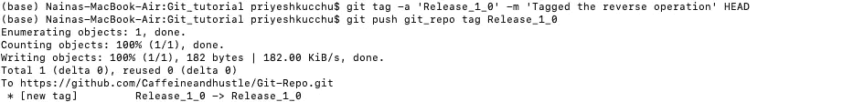

一旦完成，你就可以在你的 GitHub 账户上看到它了——

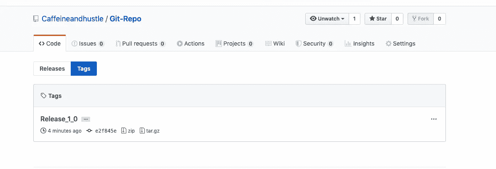

# 隐藏

当您想要记录工作目录和索引的当前状态，但是想要回到一个干净的工作目录时，可以使用 git stash 命令，因为它会获取您修改过的跟踪文件，暂存更改，并将它们保存在一个未完成的更改堆栈中，您可以重新应用这些更改。

```
$ git stash
```

该命令保存您的本地修改并恢复工作目录以匹配 HEAD commit。

当您想要查看隐藏的更改列表时，使用命令—

```
$ git stash list
```

可以使用命令检查修改或隐藏的更改——

`$ git stash show`

可以使用命令恢复修改或隐藏的更改

`$ git stash apply`

为了从堆栈中删除更改并将它们放在当前工作目录中，使用命令—

```
$ git stash pop
```

# 谴责

这用于调试，是 Git 非常好的跟踪命令。为了显示最后修改文件每一行的版本和作者姓名，请使用以下命令—

```
$ git blame "file-name"
```

# 搜索

如果您想要在工作树中的跟踪文件、索引文件中注册的 blob 或给定树对象中的 blob 中搜索指定的模式，您可以使用 git grep 命令来完成。

```
git grep ‘searching string’
```

为了在某个上下文中搜索字符串的一部分，可以使用以下命令

```
git grep -C <number of lines> 'searching string'
```

# 查看更改

如果您想检查您的更改，可以使用 diff 命令。它显示了工作树和索引或树之间的变化，索引和树之间的变化，两棵树之间的变化，等等。

```
$ git diff
```

# 跟踪引入问题/错误的版本

如果您的代码中有一个问题或错误，并且想知道它是什么，它是如何以及何时被引入的，那么使用命令—

```
$ git bisect
```

有了这个，你可以回到每一个提交，直到你找到引入问题的那个。

# 文档帮助

如果您对某个命令感到困惑，或者想了解更多，您可以使用以下命令获取文档——

```
$ git help "write command name"
```

*来源:所有截图都是我的。*

*学分到:*

[](https://github.com/) [## 一起打造更好的软件

### GitHub 汇集了世界上最大的开发人员社区来发现、共享和构建更好的软件。来自…

github.com](https://github.com/) 

# 所有完整的系统设计系列零件—

> [***1。系统设计基础知识***](https://medium.com/coders-mojo/complete-system-design-series-part-1-45bf9c8654bc)
> 
> [***2。水平和垂直缩放***](https://medium.com/coders-mojo/complete-system-design-series-part-2-922f45f2faaf)
> 
> [***3。负载均衡和消息队列***](https://medium.com/coders-mojo/part-3-complete-system-design-series-e1362baa8a4c)
> 
> [***4。高层次设计和低层次设计、一致散列、单片和微服务架构***](https://medium.com/coders-mojo/part-4-complete-system-design-series-138bc9fbcfc0)
> 
> [***5。缓存、索引、代理***](https://medium.com/coders-mojo/part-5-complete-system-design-series-4b9b04f23608)
> 
> [***6。网络、浏览器如何工作、内容网络交付(CDN)***](https://medium.com/coders-mojo/part-6-complete-system-design-series-59a2d8bbf1ed)
> 
> [***7。数据库分片、CAP 定理、数据库模式设计***](https://medium.com/coders-mojo/part-7-complete-system-design-series-1bef528923d6)
> 
> [***8。并发、API、组件+ OOP +抽象***](https://medium.com/coders-mojo/part-8-complete-system-design-series-57bc88433c8e)
> 
> [***9。***](https://medium.com/coders-mojo/part-9-complete-system-design-series-df975c85ec51) 业绩估算与规划
> 
> **10*。*** [***地图减少，图案和微服务***](https://medium.com/coders-mojo/part-10-complete-system-design-series-523b4dd978bf?sk=741f92929c8639a2e4cf218521e8cc4a)
> 
> **11*。***[***SQL vs NoSQL 和云***](https://naina0412.medium.com/part-11-complete-system-design-series-9c8efbc0237a?sk=5bddf2adc78ea4947ae88ab21c94af1c)
> 
> [***12。最受欢迎的系统设计问题***](https://medium.com/coders-mojo/most-popular-system-design-questions-mega-compilation-45218129fe26)

# Github —

 [## Complete-System-Design/readme . MD at main Coder-world 04/Complete-System-Design

### 这个存储库包含了精通系统设计主题所需的一切，您应该了解系统…

github.com](https://github.com/Coder-World04/Complete-System-Design/blob/main/README.md) 

# 想看程序员幽默？

[](https://medium.com/datadriveninvestor/programming-humor-part-2-f92cf5a26f2b) [## 编程幽默第 2 部分

### 继续笑，因为太搞笑了…

medium.com](https://medium.com/datadriveninvestor/programming-humor-part-2-f92cf5a26f2b) [](https://medium.com/datadriveninvestor/the-most-hilarious-code-comments-ever-bae3cb1030b5) [## 史上最搞笑的代码注释

### 程序员幽默:是的，实际上是程序员写的！

medium.com](https://medium.com/datadriveninvestor/the-most-hilarious-code-comments-ever-bae3cb1030b5) [](https://medium.com/datadriveninvestor/coding-sins-hilarious-developer-confessions-f55eb342454e) [## 编码原罪:令人捧腹的开发者自白

### “白板”是如何被嘲笑的

medium.com](https://medium.com/datadriveninvestor/coding-sins-hilarious-developer-confessions-f55eb342454e) [](https://medium.com/datadriveninvestor/10-witty-programming-jokes-that-will-make-you-go-rofl-a53fbfb91943) [## 10 个让你着迷的诙谐编程笑话

### 这些太搞笑了…

medium.com](https://medium.com/datadriveninvestor/10-witty-programming-jokes-that-will-make-you-go-rofl-a53fbfb91943) 

# 推荐文章-

[](https://medium.com/python-in-plain-english/python-iterators-generators-and-decorators-made-easy-659cae26054f) [## Python 迭代器、生成器和装饰器变得简单

### 快速实施指南

medium.com](https://medium.com/python-in-plain-english/python-iterators-generators-and-decorators-made-easy-659cae26054f) [](https://medium.com/ai-in-plain-english/23-data-science-techniques-you-should-know-61bc2c9d1b3a) [## 你应该知道的 23 种数据科学技术！

### 使用这些技巧来节省你的宝贵时间

medium.com](https://medium.com/ai-in-plain-english/23-data-science-techniques-you-should-know-61bc2c9d1b3a) [](https://medium.com/datadriveninvestor/coding-sins-hilarious-developer-confessions-f55eb342454e) [## 编码原罪:令人捧腹的开发者自白

### “白板”是如何被嘲笑的

medium.com](https://medium.com/datadriveninvestor/coding-sins-hilarious-developer-confessions-f55eb342454e) [](https://medium.com/datadriveninvestor/5-cool-advanced-pandas-techniques-for-data-scientists-c5a59ae0625d) [## 面向数据科学家的 5 项酷炫先进熊猫技术

### 使用这些技巧…

medium.com](https://medium.com/datadriveninvestor/5-cool-advanced-pandas-techniques-for-data-scientists-c5a59ae0625d) [](https://medium.com/datadriveninvestor/stack-overflow-analyzed-data-from-60-000-software-developers-hours-they-work-languages-they-476ac6ca0197) [## Stack Overflow 分析了来自 60，000 多名软件开发人员的数据，包括他们的工作时间、语言…

### 以下是他们的发现…

medium.com](https://medium.com/datadriveninvestor/stack-overflow-analyzed-data-from-60-000-software-developers-hours-they-work-languages-they-476ac6ca0197) [](https://medium.com/datadriveninvestor/advanced-python-made-easy-part-4-a4996ba9fe19) [## 高级 Python 变得简单—第 4 部分

### 使用这些技巧和技术…

medium.com](https://medium.com/datadriveninvestor/advanced-python-made-easy-part-4-a4996ba9fe19) [](https://medium.com/datadriveninvestor/advanced-python-made-easy-part-1-ce1e2f17431e) [## 高级 Python 变得简单—第 1 部分

### 使用这些技巧和技术…

medium.com](https://medium.com/datadriveninvestor/advanced-python-made-easy-part-1-ce1e2f17431e) 

如果你喜欢这篇文章，请分享给你的朋友和同事！

***感谢阅读。继续编码！***

**访问专家视图—** [**订阅 DDI 英特尔**](https://datadriveninvestor.com/ddi-intel)