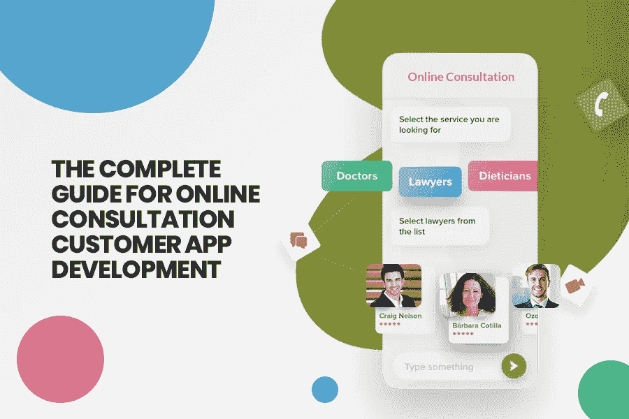

# 在线咨询客户应用程序开发完整指南

> 原文：<https://medium.datadriveninvestor.com/the-complete-guide-for-online-consultation-customer-app-development-874f347786b2?source=collection_archive---------20----------------------->

这个博客就从“如果”开始吧。

如果你在谷歌上搜索一个咨询 app 会怎么样？

你会发现的结果将是围绕管理咨询应用或医疗咨询应用。或许这就是你正在寻找的，或许你正在寻找如何开发一个咨询客户应用程序。

为了便于参考，让我们概述一个咨询应用程序。

咨询移动应用是一个平台，人们可以轻松地提出他们的疑问和关注，并由专家回答他们。例如，“Quora”可以被认为类似于一个咨询移动应用程序，但它更像一个讨论平台。

不管你的业务是什么性质，高效和有效的沟通是你的业务不可扩展增长的关键。

咨询的热潮从未消退。不考虑商业领域，从金融到教练到医生咨询，都可以看到在线营销的兴起。随着在线影响力和按需应用可用性的激增，推动咨询业务的可能性正在迅速显现。

虽然迪拜 的 [**移动应用程序开发公司开发的大多数商务咨询应用程序或软件都配备了典型的功能，如约会安排、提醒和日历。**](https://www.xicom.ae/services/mobile-app-development/)

不管你是否同意，目前，传统咨询应用的日子已经成为过去。安排预约和准备面对面咨询的权利已经没有了。现在，人们寻求即时解决方案和按需服务。

# 为什么典型的咨询应用程序不像按需定制的不可避免的原因

让我们用一个例子来理解。

你是专业的营养师和健身顾问。大多数情况下，您的客户会亲自到您的办公室拜访您，但您无法覆盖不同地理区域的客户。

虽然，你使用第三方集成预订软件，因为你的大多数客户更喜欢在线咨询，以摆脱运输费用和旅行时间到你的办公室。

您的第三方咨询应用程序提供预约、会议提醒和预约。

但这就够了吗？

不要！

现在，您希望借助一家值得信赖且经验丰富的 [**移动应用程序开发公司**](https://www.xicom.ae/services/mobile-app-development/) 来提升您的咨询业务，为您的客户省去与您联系的运输费用和麻烦。

因此，最重要的是，你需要与迪拜最好的应用程序开发人员一起建立一个定制的咨询应用程序，它具有以下列出的功能。

*   会议功能，以涵盖相关和有价值的客户在同一时间。
*   语音通话功能，最大限度地降低您的客户的网络费用。
*   与客户无缝共享文件、文档、图像和视频以供参考以及其他相关报告的选项。
*   全天候可用性功能来解决问题。
*   应用程序中的视频通话功能可以轻松连接客户端。
*   让你的应用程序兼容两个著名的操作系统平台——Android 和 iOS。
*   整合在线研讨会期间有用的实时屏幕共享选项。

因此，从以上几点来看，很明显，仍然坚持流行的咨询应用程序对您的企业来说不是正确的决定。如果你的应用程序没有必要的功能，它就不能完美地为咨询应用程序的用户提供直接的交流。

因此，为了确保这些功能证明是顾问和客户的福音，让我们展示一下它是如何为市场上众多的咨询软件工作的。

在我们总结应用内交流功能如何为在线咨询应用创造奇迹之前，让我们先来看看与在线咨询应用相关的领域。

# 在线咨询应用的领先领域

尽管有许多行业都有提供咨询服务的肥沃土壤，但我发现了最有前途的一个。

图像源

各种咨询应用的应用内通信功能是如何工作的

我们开始吧！

## 学习和教育顾问应用程序

“教育顾问应用程序的成功取决于有效的项目咨询以及导师和学习者之间的互动”

提供实时学习体验是大多数教育顾问 app 努力的目标。而且，为了让这更轻松和舒适，与潜在客户的直接沟通是至关重要的因素。

所以，让我们从学习和教育咨询应用程序通过集成实时通信媒介带来的好处开始。

通过实时聊天选项为学生创造与员工和导师互动的机会，该选项可以立即解决任何类型的疑问。

使用您的应用程序走向全球，通过视频和语音通话联系全球各地的学生。这将使协商过程更加高效和有效。

借助咨询软件轻松分享您的笔记、培训课程是提升您的培训咨询应用业务的关键。

那么，你准备好下一个教育咨询 app 了吗？

并且，想要吸引重要的客户群吗？

以下是您的学习和教育应用程序的重要功能，是促进学生和教师之间更好协作的必备功能。
学生和教师之间的实时互动会议

通过包含实时互动流的教育咨询应用程序，为学生安排互动的实时会议。它将使虚拟学习体验成为学生直接在设备上享受流媒体课堂的新现实。

## 虚拟双向通信

在您的应用程序中嵌入视频会议功能，允许教师同时与 100 名学生进行直播，同时在教育咨询应用程序中接收学生的反馈。

## 一对一的学习体验

尽管在迪拜、美国或世界各地选择最好的移动应用程序开发是必要的，但在你的应用程序中提供一个“个性化的利基”才是它的独特之处。

因此，通过你的应用程序从家里或机构向你的学生提供类似课堂学习的体验是它的唯一性。通过一对一的视频通话和提问环节，这有助于学生理解和学习，而不是“死记硬背”。

## 分享和学习

选择在线教育应用程序，让您的培训师和专业人员更安全地共享学习材料、作业和报告。此外，这一功能有助于轻松学习，使学习变得有趣，而不是单调的死记硬背。

## 医患咨询应用

一切都始于触摸按钮。

还有什么比让病人有机会坐在沙发上咨询医生更好的呢？嗯，所有的功劳都归于阿联酋迪拜的技术和应用程序开发公司，他们敦促建立这样的医患咨询应用程序。

为了将 USB(直到更好的东西)添加到典型的按需医生咨询应用程序中，咨询应用程序开发公司可以包括实时功能，如一对一聊天、语音和视频通话以及文件共享，以最大限度地提高患者和医生之间的互动性。

## 医患咨询应用程序带来的好处

除了安排预约，咨询应用还增加了面对面互动和群聊的机会，从而最大限度地留住用户。

该应用程序能够在通话后立即与患者分享处方，从而改善治疗过程。

通过医生和患者之间的视频聊天选项消除旅行成本，增加软件的可信度并立即获得解决方案。

咨询应用程序中基于 VoIP 的语音通话功能提供了一种便于携带的解决方案。

如果你已经准备好创建一个医生-患者咨询，这里有一些功能可以包含在应用程序中，以提高患者的参与度

## 即时解决方案

现在进行实时治疗可以让你的病人在他们的地方就能得到即时的治疗帮助。将您的应用程序与实时聊天功能相集成，允许医生和内科医生立即帮助患者，而不会延误治疗。

## 面对面的医患咨询

与患者的无缝沟通让患者感到满意，提高了治疗效率。通过嵌入视频通话功能，它增加了应用程序的用户保留率，并为患者与医生进行面对面互动创造了便利。

## 问答调查

为患者和医疗专业人员组织不限数量的跨地理区域的问答会议，以收集健康相关问题的信息。不可否认，民意测验有助于完成调查和收集数据。

## 病史追踪

任何医学治疗的核心目的是跟踪其进展。通过共享病史、x 光片和报告，在应用程序中收集医疗数据并向患者提供治疗进展是一项重要功能。

因此，不要对这个功能视而不见，尤其是你的医疗咨询应用。

## HIPAA 合规性是必要的

医疗应用程序必须符合 HIPAA 标准。这为患者提供了一种轻松的方式来分享 x 光片、处方和医疗报告，以便进一步治疗。

这是你的

## 个人理财咨询 App

你知道吗！

“财务咨询中不恰当的咨询往往会导致一个组织不起作用”。

正确的财务建议通常有助于任何组织的发展，无论其性质和规模如何。大多数与管理税收、资金、收入和投资渠道数据相关的金融服务是一个必要的过程，必须亲自解释，但不是一直解释。

管理大量客户的财务顾问有时会让人望而生畏。然而，需要一些可靠的工具以一种没有麻烦的方式将它传达给客户。

因此，让我们来阐述一下用户通过实时直观工具获得的好处

事实证明，这对于金融顾问来说是一个福音，他们可以通过语音和视频电话从自己的办公桌上管理多个客户。

它可以在财务咨询应用程序中安全可靠地共享投资回报率、税收和投资等有见地的数据。

现在，是用你自己的咨询 App 加速的时候了！
如前所述，应用内聊天选项如何革新众多垂直商业领域和跨领域的典型咨询应用。尽管如此，仍有很多行业被排除在在线咨询应用的在线聊天选项之外。

您的财务咨询应用程序的决定性功能，可提高客户保留率并获得全球客户

## 及时账单提醒

通过定制的通知向您的客户发送账单、税收的实时通知至关重要。因此，在你的应用程序中创建吸引人而又引人入胜的通知，让你的客户能够立即联系到合适的资源。

## 通过视频通话打招呼

你想让你的应用成为人群中的一员吗？

当然不是，对吧？

那为什么让你的财务咨询应用程序只计算客户的 EMI 或税收支出呢？请你的合作伙伴应用程序开发公司集成视频通话功能，与客户建立虚拟联系，并向他们解释金融建议，而不只是建议他们这样做。

## 准备好即时协作和讨论

24*7 的可用性使您的客户可以随时随地通过设备与您联系，这只是一个触摸的问题。它使您的客户端能够通过安全的消息传递以定制的方式进行交互。

最后一句话……拥有自己的咨询应用程序，无论是医患咨询、学习和教育咨询还是金融领域的住宿，都需要完成多样化的任务流。

这一旅程并非没有挑战。而且，你确实需要一个超级英雄来管理他们。

在这里，西科姆前来救援。他们的专家在迪拜 、印度和美国为 [**应用程序开发提供最好的细分服务，帮助您保持领先地位并超越您的咨询业务。**](http://Mobile%20App%20Development%20Companies%20in%20Dubai)

准备好使用合适的在线咨询应用程序来推动您的在线咨询业务了吗？

如果有，抓住你的免费项目估算！

否则，给我们留言，我们的团队将帮助您开发、启动和维护您的在线咨询应用程序。

*原载于 2020 年 8 月 19 日*[*https://www . xicom . AE*](https://www.xicom.ae/blog/the-complete-guide-for-online-consultation-customer-app-development/)*。*