# Scikit 中预处理的完整指南

> 原文：<https://medium.datadriveninvestor.com/the-complete-guide-to-preprocessing-in-scikit-learn-with-code-1bceed4befb6?source=collection_archive---------3----------------------->

scikit 学习中所有预处理功能的实用指南


Photo by [Christin Hume](https://unsplash.com/@christinhumephoto?utm_source=medium&utm_medium=referral) on [Unsplash](https://unsplash.com?utm_source=medium&utm_medium=referral)

本指南的目的是解释 scikit-learn 提供的主要预处理功能。

> Scikit-learn 是一个开源的机器学习库，支持监督和非监督学习。它还提供了用于模型拟合、数据预处理、模型选择和评估的各种工具，以及许多其他实用工具。

Scikit-learn 构建在 NumPy、SciPy 和 matplotlib 库之上。这是一个简单而有效的预测数据分析工具。

# 装置

我建议下载最新的官方版本，它将为您提供 scikit-learn 的稳定版本。

```
pip install -U scikit-learn
```

为了检查您的安装，您可以使用

```
python -m pip show scikit-learn
```

这将显示 scikit-learn 的版本和安装位置

# 预处理

sklearn.preprocessing 包提供了各种功能，帮助将原始特征转换为更适合机器学习模型的表示形式。

以下是我们将在博客中关注的主要功能列表:

*   标准化
*   正常化
*   编码分类特征
*   [数]离散化
*   缺失值的插补
*   生成多项式要素
*   定制变压器

# 标准化

标准化重新调整数据，使其平均值为 0，标准差为 1。当输入数据集的特征在它们的范围之间有很大的差异时，标准化就出现了。

[](https://www.datadriveninvestor.com/2020/02/19/five-data-science-and-machine-learning-trends-that-will-define-job-prospects-in-2020/) [## 将定义 2020 年就业前景的五大数据科学和机器学习趋势|数据驱动…

### 数据科学和 ML 是 2019 年最受关注的趋势之一，毫无疑问，它们将继续发展…

www.datadriveninvestor.com](https://www.datadriveninvestor.com/2020/02/19/five-data-science-and-machine-learning-trends-that-will-define-job-prospects-in-2020/) 

用一个例子来说明这一点:假设我们有一个二维数据集，它有两个特征——以米为单位的身高和以千克为单位的体重。该图将始终具有在高度上占主导地位的权重特征。因此，为了防止这一问题，解决方案是使用标准化将要素转换为可比较的比例。

函数 *scale* 提供了一种快速标准化的方法

```
from sklearn import preprocessing
import numpy as np
```

以米为单位的身高数组:[ 1，1.5，1.2 ]
以公斤为单位的体重数组:[ 72。, 81., 75.]

```
x = np.array([[ 1., 72.],
            [ 1.5,  81.],
             [1.2, 75.]])
x_scaled = preprocessing.scale(x)
x_scaled
```

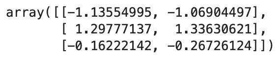

*预处理*模块还提供了一个实用程序类 **StandardScalar** ，它实现了 *Transformer* API 来计算训练集的均值和标准差，以便以后能够在测试集上重新应用相同的变换。

为了解释这一点，我们使用相同的年龄和身高数组

```
from sklearn.preprocessing import StandardScaler
sc = StandardScaler()x_sc = sc.fit_transform(x)
x_sc
```

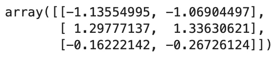

我们得到相同的标准化输出。现在，如果我们需要取出原始数组，我们使用 *inverse_transform* 函数

```
sc.inverse_transform(x_sc)
```

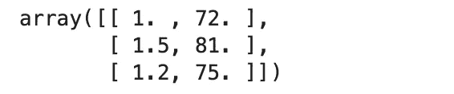

我们把原来的数组恢复成了原来的值。

**注:**逻辑回归和基于树的算法，如决策树、随机森林和梯度推进，对变量的大小不敏感。因此在拟合这种模型之前不需要标准化。

另一种标准化是将特征缩放到给定的最小值和最大值之间，通常在 0 和 1 之间，或者将每个特征的最大绝对值缩放到单位大小。这可以通过使用 **MinMaxScaler 来实现。**

用我们的年龄和身高例子来说明这一点:

```
from sklearn.preprocessing import MinMaxScaler
msc = MinMaxScaler(feature_range=(0,5))
x_sc = msc.fit_transform(x)
x_sc
```

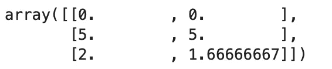

【MinMaxScaler 函数中的 feature_range 参数为我们的缩放功能提供了最小值和最大值。

# 正常化

标准化是将单个样本缩放至单位标准的过程。这是一种经常作为机器学习的数据准备的一部分而应用的技术。规范化的目标是将数据集中数值列的值更改为使用通用的比例，而不会扭曲值范围的差异或丢失信息。

normalize 函数提供了一种在单个类似数组的数据集上执行此操作的快速简便的方法，可以使用 L1 或 L2 规范:

```
from sklearn.preprocessing import Normalizer
nm = Normalizer()
x_sc = nm.fit_transform(x)
x_sc
```


什么时候标准化数据集的特征？

> 建议采用标准化，因为基于标准化数据建立的模型会给出更好的结果(预测)。当要素数据无法归一化或无法使其遵循高斯分布时，请使用归一化。

# 编码分类特征

通常特征并不总是连续的，它们在文本类型中表现为分类的。

例如:一个人所属的国家【印度，美国】
性别【男，女】

这些特征可以被编码成整数供机器处理。

OneHotEncoder 帮助我们将分类变量转换为可用于 scikit-learn 估计器的特征。它将每个具有 n_categories 可能值的分类特征转换为 n_categories 二元特征，其中一个为 1，所有其他为 0。

让我们定义我们的文本 2D 数组

```
x = [['Basketball','Male','USA'],['Football','Female','UK']]
```

OneHotEncoder 将其转换为 K 之一的形式

```
from sklearn.preprocessing import OneHotEncoder
enc = OneHotEncoder()
enc.fit_transform(x).toarray()
```


我们可以进一步了解每个特性的赋值

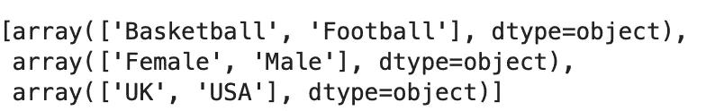

因为我们的数据集中有 6 个值。对于['篮球'，'男性'，'美国']，它们出现在 0，3 和 5 索引处

因此，它将“1”分配给该位置— [1，0，0，1，0，1]

# [数]离散化

有时有必要将连续值的列表转换成箱。这是通过 *KBinsDiscretizer 实现的。*默认情况下，输出被一键编码成稀疏矩阵，这可通过编码参数进行配置。

```
X = np.array([[ -3., 5., 15 ],
              [  0., 6., 14 ],
              [  6., 3., 11 ]])
est = preprocessing.KBinsDiscretizer(n_bins=[3, 2, 2], encode='ordinal')
est.fit_transform(X)
```

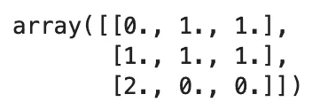

离散化类似于为连续数据构建直方图。KBinsDiscretizer 实现不同的宁滨策略，可以使用策略参数进行选择。

# 缺失值的插补

在现实世界的数据集中，我们经常会发现许多缺失值。这可能是由各种原因造成的-人为错误、传感器故障或不同的数据类型问题。人们喜欢的基本策略是丢弃所有包含缺失值的行。但这降低了数据质量，我们可能会丢失重要信息。因此，我们需要找到合适的策略来处理它们，并估算缺失的值。

SimpleImputer 类提供了输入缺失值的基本策略。缺失值可以用提供的常数值进行估算，或者使用缺失值所在的每一列的统计数据进行估算。该类还允许不同的缺失值编码。

```
import numpy as np
from sklearn.impute import SimpleImputer
imp = SimpleImputer(missing_values=np.nan, strategy='mean')X = [[np.nan, 2], [6, np.nan], [7, 6]]
imp.fit_transform(X)
```

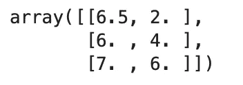

我们在 SimpleImputer 类中实现了“mean”策略。因此，缺少的值将通过列值来替换。

平均:6.5 分

因此 np.nan 将被 6.5 取代

[np.nan，6，7] → [6.5，6，7]

简单估算器还支持“最频繁”策略，用列中出现次数最多的值替换缺失值

```
df = pd.DataFrame([["a", "x"],
                   [np.nan, "y"],
                   ["a", np.nan],
                   ["b", "y"]], dtype="category")imp = SimpleImputer(strategy="most_frequent")
imp.fit_transform(df)
```

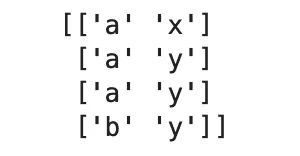

# 生成多项式要素

大多数情况下，在进行预处理时，最好增加数据的复杂性。这可以通过使用*多项式特征*函数生成多项式特征来实现

为了举例说明这一点，让我们创建一个数组

```
import numpy as np
from sklearn.preprocessing import PolynomialFeatures
X = np.arange(6).reshape(3, 2)
X
```

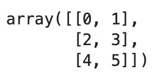

```
poly = PolynomialFeatures(2)
poly.fit_transform(X)
```

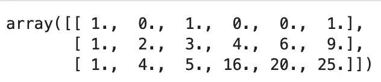

是时候分析这里到底发生了什么。

X 的特征已经从(X1，X2)变换到(1，X1，X2，X1，X1X2，X2)

所以第一列→ [1，1，1]

第二列→ X1 → [0，2，4]

第三列→ X2 → [1，3，5]

第四列→ X1 → [0，4，16]

第五列→ X1X2 → [0，6，20]

第六列→ X2 → [1，9，25]

# 定制变压器

通常，我们希望通过对所有值执行某种函数来将数据转换成适当的值。这可以通过传递所需的函数，使用*函数 Transformer* 函数来实现。

让我们用代码来看看这个

```
from sklearn.preprocessing import FunctionTransformer
transformer = FunctionTransformer(np.log1p, validate=True)
X = np.array([[0, 4], [6, 10]])
transformer.transform(X)
```

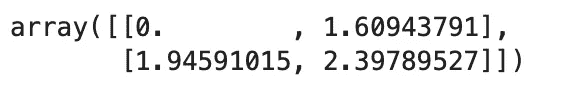

转换后的数组包含原始数组中所有值的日志。


Photo by [Matt Botsford](https://unsplash.com/@mattbotsford?utm_source=medium&utm_medium=referral) on [Unsplash](https://unsplash.com?utm_source=medium&utm_medium=referral)

我们最后介绍了 Scikit-learn 库中所有重要的预处理函数及其在 python 中的实现。

希望你喜欢！