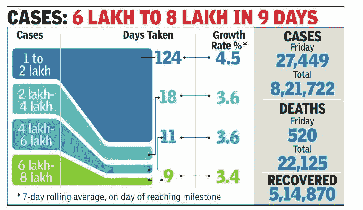
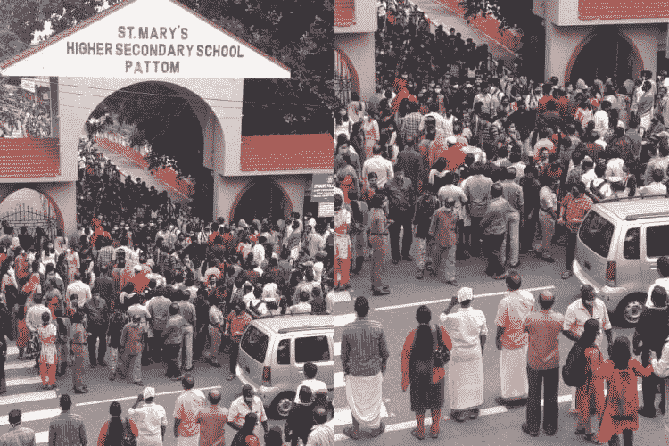
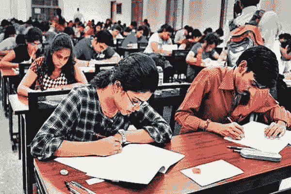
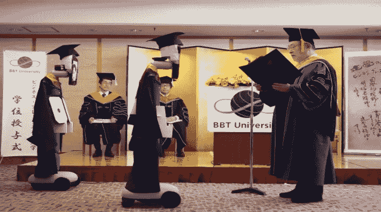
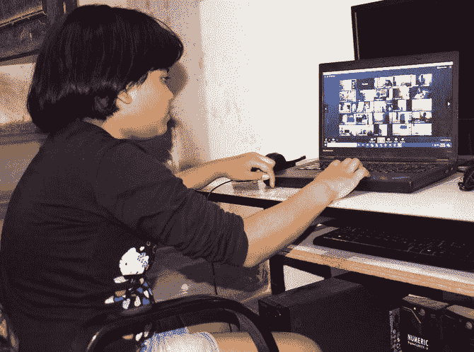
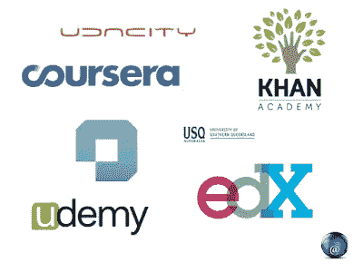

# 疫情混乱的教育系统

> 原文：<https://medium.datadriveninvestor.com/the-confused-education-system-in-the-pandemic-8c8d52763298?source=collection_archive---------6----------------------->

## 考试与不考试是房间里的新大象。#意见

在印度报道的新冠肺炎疫情病例中，本周已经超过了 100 万例。学生要求取消考试的呼声在各种社交媒体上引起了关注。现在，我们将从学生和学校的角度来讨论这个问题的各个方面。学生生活中的不确定性让他们坐立不安。这篇文章不像你在社交媒体上看到的那样，不是咆哮，而是纯粹基于事实的分析。

Credit- The Times of India

[**联邦拨款委员会(UGC)**早些时候，5 月下旬至 6 月**指示全国大学最后一个学期的考试要么推迟，要么可以在 7 月进行，采取必要措施。本月晚些时候，在 covid 案例激增后，UGC 对最后一年的考试进行了澄清，称这应该不会失败。UGC 已经公布了一个暂定的时间，即九月。UGC 的这一决定在不同的邦引起了愤怒，尤其是德里、马哈拉施特拉邦、西孟加拉邦、旁遮普邦、奥里萨邦等。大学教育资助委员会进一步声称，如果各州单方面取消考试，它可以采取行动，而且它的指令对它具有约束力。**](https://www.newindianexpress.com/nation/2020/apr/25/hold-exams-in-july-begin-academic-sessions-in-universities-from-september-ugc-panel-2135278.html)

> **现在，UGC 声称 180 所大学已经进行了测试，其中 200 多所将在未来几个月进行测试。我们得到的信息是，其他大学将很快做出回应。**

**而另一方面，中间学期的情况并不严重，而其他许多人则建议完全取消考试，根据内部分数晋升。但是即将到来的学期的课程问题是一个尚未解决的重要问题。 [**HRD 部长**建议教育机构继续关闭到 8 月 15 日](https://www.ndtv.com/india-news/plan-to-reopen-schools-after-august-15-say-human-resource-development-hrd-ministry-sources-2242576)**。喀拉拉邦政府。表示只有在 Onam. **全印度技术教育委员会**[**【AICTE】**修改了学术文化称 8 月 15 日开始上课后才会开课。](https://timesofindia.indiatimes.com/home/education/news/aicte-revised-calendar-released-first-counselling-up-to-august-15/articleshow/75569821.cms)鉴于目前的情况，即使是 8 月 15 日也可能不是理想的时间。****

********

****Credits-SuccessCDS****

> ****我所在的 KTU 大学在一份通知中说，该校将在 7 月份对上学期学生进行期末考试，后来由于学生人数增加以及抗议活动，考试被无限期推迟。****
> 
> ****政府。尽管担心通过接触以及社区传播增加病例，喀拉拉邦的一名官员仍然坚持在 7 月 16 日进行 KEAM 考试。****

********

****Credits- The News Minute****

> ****喀拉拉邦政府后来因实施 KEAM 而遭到大规模攻击。[在同一时期，社交距离成为一个神话，特别是在特里凡得琅，通过联系人报告了 200 多个病例](http://dhunt.in/aihwz?s=a&uu=0x212b96e6dc8dcaff&ss=wsp)，并且也处于三级封锁之下。[我们还知道，超过 60%的报告患者没有表现出任何症状或只是无症状。](https://www.newindianexpress.com/states/kerala/2020/jul/16/60-covid-infected-persons-in-kerala-are-asymptomatic-2170340.html)****

****喀拉拉邦的许多其他大学在封锁前已经计划了考试，并在 6 月份举行了考试，未宣布的大学尚未举行考试。ICSE 表示，它将很快效仿 CBSE 的做法。德里大学和 Cusat 表示，他们将进行开卷考试。根据最新消息，JEE 和 NEET 考试将于 9 月举行。****

> ******我们在这里看到的最大挑战是，我们仍然不知道情况何时会正常到足以进行体检，不确定性仍然隐约可见。******

********

****Credits Digital Learning****

## ******学生为什么要写试卷？******

****好了，请不要预判这种说我要不惜任何代价举行考试的说法。****

****这里有几个理由说明为什么编写考试将是必要的。****

******学生关注-******

*   *******这是关于未来的-*** 是的，一个学生的未来取决于他/她的毕业证书，所以对于考试的竞争看起来是必要的。****

*   *********高等教育-*** 许多国外大学没有取消考试，而是采用了在线模式。所以，当你需要申请更高的学习时，最好是完成你的学期。******
*   *******电晕哪儿也不去-*** 正如**世卫组织**所说，新冠肺炎至少要在这里呆两年。你打算在家坐那么久吗？如果你有工作，显然每个人都必须在办公室。所以很明显，你不能因为疫情而停止你的生活。除非到 2021 年底甚至更久，否则别指望有疫苗。****
*   *******内部*** *-* 大部分大学都在用内部考试成绩代替期末成绩。所以当你已经给了内部，比如说 50 分，这将决定你的其他 100 分，你完全处于劣势，因为你不会写好你的内部，因为这是大学生活应该被看到的。你之前没有被告知你需要好好学习内在，因为你的考试会被取消。所以要明白你还是可以把你的 100 分打得更好的。毕竟最后一个学期只有 4 门课。****
*   ******竞争激烈的考试很多学生会去参加 PSC、UPSC、GATE、NET 等考试，对于他们来说，尽早参加考试可以帮助他们专注于准备。******

********管理/学院/大学关注-********

*   *********招生-*** 正常进度下的院校到现在应该已经为即将到来的批次完成了许多录取手续，但现在却陷入了停滞。至少他们可以结束分发批次的工作。******
*   *********消除不确定性-*** 它将消除学院手续、官方作品等的不确定性。******
*   *******大学规定- 与学校不同的是，根据规定，许多大学不能在没有考试的情况下给所有学生完全的晋升机会。这不仅会影响未来的大学，还会影响学生。*******
*   **********大学问题-*** 我们所知道的 KTU，是相当新的。对于他们来说，不进行考试将相当于一个巨大的失败，因为这是他们第二批通过考试，自 2015 年开始以来，他们一直面临着多种批评，涉及教学大纲、考试、评估、一年后的政策以及现在结束的 sem 考试。KTU 现在正试图利用这一点挽回面子。*******
*   *********学年-*** 下一学年的计划、时间表等取决于大学或学院能多早完成前一年的工作，现在已经延迟了 3 个月。这真的会影响以后的批次。******
*   *********以往成功-*** 喀拉拉邦在 5 月下旬完成了 SSLC 和 Plus 2 考试。此外，喀拉拉大学也完成了最后学期的考试。所有这些成功肯定会提高政府举办考试的士气和信心。政府可能希望通过举办考试来创造一种模式。******

****** [## 大数据给教育行业带来的 5 大变化|数据驱动的投资者

### 如果利用得当，大数据将对教育行业产生巨大影响。它可以提供众多新的…

www.datadriveninvestor.com](https://www.datadriveninvestor.com/2020/02/18/5-changes-to-the-education-sector-caused-by-big-data/) 

## 为什么不进行考试？

咨询对方也是非常重要的，这是改变游戏规则的。

*   ***健康关注-*** 我们现在将看到一种前所未有的不同的会众。在考场上的两个小时，比如说每人一个小时的旅行时间，对学生和监考人员来说都是至关重要的。学生家里确实有父母、老人等。即使每个班级有一名学生被感染，整个班级、监考老师、他们各自的家庭都将被隔离，必须绘制路线图并追踪接触者。这不是一个容易的过程。
*   ***操行难度-*** 各大高校纷纷推出操行考试，不错不错，但仍有顾虑未得到解决。每间教室的学生人数会减少，所以对监考老师的要求会增加，所以后勤问题会存在。即使在考试中心变更期间，该大学也没有明确说明一个中心将有多少学生。**中心变化不会促使学生选择市区的高校，使得 covid19 扩散的风险更高吗？**
*   ***交通问题*** *-* 许多住在远离城市的内地的学生会发现很难通勤到考试中心。虽然大学校车将被分配，但它们是否会遵循社会距离规范仍是一个问题。许多大学仍然没有大学巴士设施。即便如此，学生们还是被告知要保留他们的路线图，记录他们在参加考试时所走过的路。宿舍被指示保持关闭，这意味着学生将不得不每天出行。
*   ***心理健康-****3 个月后来到大学，参加大学考试，需要很大的勇气和良好的心理健康。大多数学生现在都在诅咒大学，他们中的许多人甚至没有做好准备来参加考试。此外，他们对 covid19 疫情的焦虑、他们的社会背景、他们家中的情况等甚至没有被考虑在内。*
*   ****未准备好-*** 大多数学院在联系班的 6 个模块中最多选修了 3-4 个模块，而部分模块可能尚未完成，内部考试在网上进行，大多数学生都没有准备好。他们没怎么学习，这就是学生不想考试的原因。*
*   **隔离区&热点-* 这些区域据说与其他区域隔离，即禁止人们在隔离区内外活动。那么，在什么意义上，我们可以举行物理考试，让学生出去写试卷呢？*
*   *被隔离的学生&被感染的 - **他们将如何被安置在这里？健康风险呢？他们不是处于劣势吗？***

## ***考试有哪些可能的解决方法？***

1.  ****报废考试-*** 看起来是现在最现实的解决方案。**ICSE CBSE，**多个州委员会取消了他们剩余的考试。但问题是，如果没有这样的评估方法，学生将根据什么参数获得晋升或证书？许多学生和家长声称这将使情况对许多学生不公平。*

3.  ******半在线考试-*** 这些考试都是在线进行的，试卷将在网上发布，评估也将在网上进行。但是，学生必须将答案写在纸上，然后扫描并上传。***
4.  ******无限期推迟考试-*** 现在已经有多少大学这么做了。但是你怎么能无限期地推迟某事呢？你需要一个期限，否则就取消。至少 UGC 给了一个日期让大家计划。***
5.  ******由学院自己进行内部评估的考试-*** 代替大学进行考试和评估，学院自己可以进行考试和评估。***
6.  ******到目前为止的内部考试-*** 在教育机构关闭之前进行的所有考试都将被视为期末成绩，以前学期的成绩也可能被视为期末成绩。***

***第二点和第三点可能会很棒，但对于农村地区的人或那些甚至买不起智能手机、电脑或互联网连接的人来说，这将是一个很大的劣势。印度是一个互联网普及率参差不齐的国家。大多数印度人目前无法连接互联网。即使我们说印度是数据传输速率最便宜的国家之一，设备和配件都很昂贵。还有一些地区我们甚至没有电力连接和互联网连接。第一点已经被许多品种尝试过，我们得到一个想法，中级考试的考试将被取消，包括 IITs 和 NITs。***

******我们是否还应该进行考试？*我会把这个问题留给你来回答。*****

> ***我们是一个混乱系统的一部分，甚至运行这个系统的人都不知道如何去做。我们被抓住并被囚禁。***

## ***高校和学生问题***

*****费用** -目前许多学院和学校正在开展在线课程或不上课，但大多数学校不准备降低费用，即使没有电力、实验室设备、公共汽车、食堂等基础设施的费用。事实仍然是，教师需要得到他们应得的工资。此外，我们需要理解，政府学院/学校的教师也被视为雇员，对许多人来说，出勤率是必须的。***

***由于疫情，公司不接受实习生。***

## *****其他国家/大学的例子*****

***全球各地的一些大学注重全面接触和实践学习，而不仅仅是书本知识。对于这样的机构，已经进行了在线考试。因为这是一篇基于应用的论文，抄袭和剽窃的机会不复存在。美国许多大学已经在网上举行了毕业典礼。在哈佛和麻省理工学院等大学的强烈反对下，美国收回了要求学生离开美国的决定，如果他们有在线课程，并且不需要亲自到场。***

******

***Virtual Graduation in Japan with Robots. Credits- The Indian Express***

## *****系统的前进方向*****

***随着许多国家失业率居高不下，学生们可能会寻找其他职业选择。大多数人可能喜欢高等教育和政府工作。甚至求职者也会寻找技能发展这样的选项来增强他们的就业能力和适应能力。电子商务现在看来是年轻人感兴趣的一个极好的领域。***

***对应试教育的关注需要改变。疫情就是一个很好的例子，说明了系统本身是如何陷入困境而无法自拔的。SRM 大学首次取消了入学考试，并将根据第 12 次性病成绩进行录取。喀拉拉邦政府已将新冠肺炎法规延长一年，即到 2021 年 7 月。这肯定会影响学校、学院、大学等。这将包括你至少在一年内仍然必须继续在线课程/现有的限制。***

> ***从上课不用手机到电话教学，这确实是一个积极的转变。***

******

***Credits- USA news and World Report***

## *****广播类*****

***各邦已经开始对学校学生进行广播，像喀拉拉邦政府的 [**胜利者**](https://thewire.in/education/kerala-covid-19-education) **和 TN 政府的**[**Kalvi Tholaikatch**](https://www.firstpost.com/india/k-palaniswami-launches-kalvi-tholaikatchi-tamil-nadu-govt-run-channel-for-class-10-12-students-8600301.html)**I**。CBSE 正试图利用像脸书和 Youtube 这样的平台做同样的事情。只有当更多的学生有相同的东西要学时，这才有可能。这在大学是不可能的，因为那里有不同的分支和专业。***

******

***Credits- India Today Youtube***

## *****在线课程*****

***在线课程让课程变得更加个性化，并试图带来一种类似课堂的体验。 [CBSE 宣布将与脸书合作开展基于增强现实的学习。](https://www.onmanorama.com/news/campus-reporter/2020/07/06/cbse-facebook-courses-on-digital-safety-augmented-reality.html) **Zoom、MS Teams 和 Google Meet** 同样是最受青睐的平台。全国各地的学校和大学都采取了相应的措施。虽然这些机构中的大多数无法明确回答将对那些没有足够特权的人做些什么。我们有社会工作者、非政府组织等作为慈善机构向许多学生提供电话和标签。这本身并不能解决眼前的问题。网络课程因缺乏吸引力而受到批评。***

******

***Credits- Arab News***

## *****自我学习*****

***与其称之为自学，不如称之为自定进度学习。在这里，学生可以选择自己的方式来学习他们想要的东西。它可以来自在线资源、youtube、电子书等。自从一级防范禁闭以来，对在线课程的需求激增。像 Coursera、Edx、Internshala、Udemy 等平台正经历着高流量和大量需求。这些平台大多寻求基于技能和实践的培训，以增强你对该主题的实践知识。***

******

***Credits- Javarevisited***

***考试是否会举行应该会使学生的生活停滞不前。每个学生都会在大学里度过一生的一段时间，比如说 3-6 年。不管有没有课，每个人都有责任向前迈进，以竞争的精神接受一切。考试来来去去，你所知道的，你所拥有的经验和成就，仍然是你最大的财富。********* 

> ******大学可能是封闭的，但它不应该停止你的学习。******

*******PS-此处表达的所有观点均为个人观点。*******

********另外，请阅读 KTU CSE 第二年的提示和我的主要出版物********

****** [## 知识杂志

### 贾伊拉姆·R·帕布的个人博客。更多内容请关注简介。此外，请务必遵循上的出版物

medium.com](https://medium.com/journal-of-knowledge) 

.

.

.

如果你喜欢我的博客，想寻找有用的内容，请继续关注我。另外，我已经启动了一个 [***电报频道***](https://t.me/jokjrp) ***，里面将包含我所有文章的记录。随意订阅频道，推荐他们*** *。*

***你可以在评论区留下你的反馈，或者在社交媒体上联系我-***

***对于我的旧帖子，请向下滚动我的个人资料页面。谢谢大家！感谢你一直支持我。***

**访问专家视图—** [**订阅 DDI 英特尔**](https://datadriveninvestor.com/ddi-intel)******