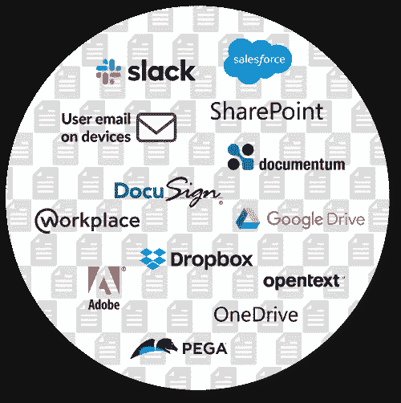
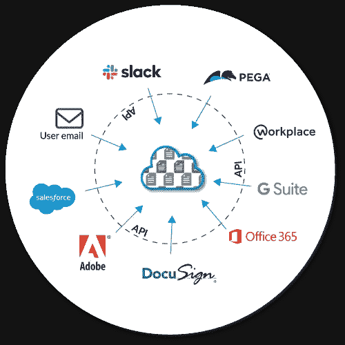

# 内容管理和安全悖论—企业的内容融合

> 原文：<https://medium.datadriveninvestor.com/the-content-management-security-paradox-content-convergence-for-the-enterprise-dffdf006650f?source=collection_archive---------22----------------------->

唐纳德·r·哈蒙斯和亚历克西斯·帕纳吉迪斯

*未来的企业将需要同时采用实现人类协作和企业安全目标的策略。*

**2021 年 1 月 4 日**

当内容无处不在时，它本身就不安全，价值也更低。没有方向的内容管理、协作和安全方法不再可行，它限制了创新，坦率地说，这是一个安全威胁。工作的未来取决于这样一种观点，即内容及其固有数据与企业的产品、市场细分、知识产权甚至人力资本的未来具有同等价值。

让我们进一步探讨这个问题。当我们说“…无处不在”时，我们指的是对企业内容及其所在位置的非战略性方法。对于传统组织和快速发展的新公司来说，内容可能已经在非战略性环境中找到了归宿，这种方法直接将该组织或机构置于风险之中。当内容存在于本地硬盘、传统归档存储阵列、自带应用程序以及从营销平台到 CRM 等众多企业应用程序中时，内容无处不在，但其固有价值却丝毫未被挖掘或至少被最小化。采用这种方法，包括最普遍的 IT 应用程序和跨平台的内容—电子邮件和电子邮件附件—这是一种灾难性的内容管理方法。

> 没有方向的内容管理、协作和安全方法不再可行，它限制了创新，坦率地说，这是一个安全威胁。

随着企业越来越重视数字体验，内容及其固有数据将成为未来企业和机构的战略和竞争优势。为了推动这一点，创新者应该将内容及其有价值的数据视为既有**协作参与** *又有**记录**的*。通过从协作/参与的角度以及从记录系统的角度来看待企业内容，企业领导者可以开始立足于(a)它应该存在于何处，以及(b)它应该在何时、何地以及为什么被公开。

表面上看，满足于“无处不在”的生活听起来不错。然而，当我们采取这种方法时，我们使它贬值了。让我们以营销资产为例，营销资产驻留在营销团队的本地。它可能保存在营销共享文件夹或本地营销团队的硬盘上，甚至可能保存在笔记本电脑上——这对于需要访问它的小型营销团队来说是可行的。然而，它不容易合作，版本必须管理，与外部机构共享它成为一个挑战。该资产可能是知识产权安全威胁。使用电子邮件附件有其固有的文件大小和安全威胁限制。如果无法访问该资产，它对工程、销售或营销人员之外的领导团队来说就没有任何价值，营销人员可以直接从访问该资产中受益。如果我们对内容采取这种孤立的方法，并将其推广到典型的跨国企业或机构的各种业务部门和员工，问题会进一步复杂化。

Multitude of technologies, each a silo, duplicating data across the organization's IT landscape

建设未来的工作是复杂的。我们知道它将是数字化的、高度协作的、以速度为导向的、由人工智能和机器学习增强的、以安全为中心的，并且当我们聚集企业的集体“知识”以扩大业务、代理和/或社会影响机会时，客户洞察将是关键的竞争和创新优势。

所有这一切的矛盾之处在于，为了确保内容及其有价值的见解在正确的时间暴露给正确的人，我们需要一个以内容为中心的架构，既作为记录系统，又作为参与系统，为更广泛的应用生态系统提供动力。换句话说，内容需要聚合到一个单一的系统中，同时服务于一系列参与和体验应用。通过这样做，组织可以在遵守安全和保留策略约束的同时，实现内容访问无处不在的目标。

Applications (systems of engagement) interacting with content from a single, secure source (system of record).

通过将企业范围内的内容聚合到统一的基于云的内容管理平台中，我们不仅提高了通过应用程序的 API 连接边界生态系统公开相同内容的能力，还提高了我们的协作能力，或许更重要的是，我们使自己更加安全，能够抵御网络安全漏洞。与其让内容无处不在，不如我们利用云内容管理平台将其聚合，然后在需要时向合适的团队成员、应用程序和设备公开这些内容及其有价值的数据。通过以这种方式集中内容，我们实际上扩展了它，使其价值无处不在——而资产却并非如此。

当内容无处不在而没有策略时，我们就降低了它的价值。通过包含以电子邮件为中心的企业动态内容的企业内容管理战略，企业不仅可以控制其企业内容和数据，还可以降低开销、简化工作流程、推动 AI-ML 成果、通过协作提高人力潜能，并在本质上变得更加安全。当电子邮件内容被添加到这种策略中时，企业就能够利用这种平台扩大投资回报。一旦完成，内容的潜在影响将无处不在——正如我们所希望的那样！