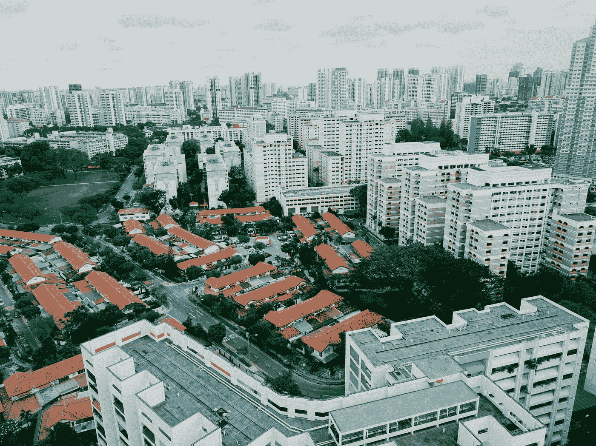

# 当今技术的控制问题

> 原文：<https://medium.datadriveninvestor.com/the-controlling-issue-with-technology-today-18ec6598f7db?source=collection_archive---------29----------------------->

## 开放的空间抹去了曾经从未跨越的障碍

Photo by [chuttersnap](https://unsplash.com/@chuttersnap?utm_source=medium&utm_medium=referral) on [Unsplash](https://unsplash.com?utm_source=medium&utm_medium=referral)

当五月花号抵达普利茅斯时，人们对更光明的未来抱有希望。一个允许人民自由的世界。宗教自由、言论自由和一个更美好的时代。

我们今天拥有的是一个基于技术的社会。当然，向前迈进仍然是我们所有人所设想的未来，但是我们要付出什么代价呢？

我最近正在读一本名为《第二次美国革命》的书，作者是技术暴政和数字暴君，虽然我只读到第四页，但我已经理解了作者想要表达的意思。

> “该是我们问一些尖锐问题的时候了:我们愿意用什么来换取我们的隐私，或者在公共场合说出自己想法的权利？”~第二次美国革命

作者已经把我们回避的问题写了出来。我们愿意交换什么？为什么呢？

当我们浏览整个社交媒体时，我们可以看到我们社会中其他人背后的透明性。一大堆规范莫名其妙地被推进了一个概念，即每个人都必须遵守这些规范。但是这个极限已经被推了很多次，没有人完全明白什么是对的，什么是错的。

 [## 幸福的算法？数据驱动的投资者

### 从一开始，我们就认为技术正在使我们的生活变得更好、更快、更容易和更实用。社交媒体…

www.datadriveninvestor.com](https://www.datadriveninvestor.com/2019/03/08/an-algorithm-for-happiness/) 

短信已经取代了面对面的交谈，脸书已经变成了肮脏的洗衣房，Twitter 已经成为政治观点的代言人，Instagram 已经成为被摄像头捕捉到的淘气行为的代言人。没有什么是私人的，然而我们抱怨我们的私人生活被嘲笑。

我们已经真正地了解了我们今天的状态，以及谁喜欢或评论了它。我们嘲笑别人表达他们的观点，并试图让他们承认我们自己的观点，因为我们觉得他们是唯一重要的人。

宣扬言论自由的理念。但是持有不同意见的人会被那些认为这是他们的方式或道路的人抛弃。没有完全理解言论自由是每个人的，而不仅仅是那些觉得自己是唯一正确的人。

新闻贴满了互联网，有些是真的，有些是假的，意在引起骚动。我们渴望坏消息，我们想看到世界上正在发生的坏事，这是一个可悲的事实。这就像一部现实生活中的小说发生在我们身边，我们感激它没有发生在我们身上。

相比之下，这种快乐让我们的生活看起来更好。直到同样的事情发生在我们身上。一次盗窃，一次事故，一次死亡，不管是什么我们都要掩盖真相。我们躲避它，在真实和虚幻之间设置一道屏障。

我们是如何让互联网这一惊人的技术进步控制我们的生活的？我们如此依赖它，以至于我们发现自己*需要*在我们的新闻订阅上查看最新消息，而不是想要，我们需要它来满足我们黯淡的生活。

互联网只是大局中的一小部分。当你看着我们随身携带的设备时，很难不看到我们的隐私被直接带出门外。

> 互联网只是大局中的一小部分。

智能手机、智能电视、智能汽车，甚至是家家户户必备的蓝牙音箱。这些设备配有机载计算机。有些人会说这些设备在你说话的时候偷偷录下你的声音。

我有过一些例子，我在家里和我丈夫讨论了一些事情，当我第二次去脸书的时候，有一个关于我们讨论的事情的广告。我从来没有谷歌过它，我们只是在客厅看智能电视时谈论过它。那么脸书怎么知道我会有兴趣看这个广告呢？

当你试图说你没有被这些特殊的设备记录时，这是一个很难的论点。有大量的证据表明，在我们自己的家里、车里或任何地方，我们很有可能并不孤独。

毫无疑问，我们的信息是如何传播的，最终会落入那些可以窃取你的身份甚至存款的人手中。一个人可以保护自己的方式只有这么多，即不容易被猜到的强密码，警惕人们的电话，当陌生人在电话中问问题时，永远不要说“是”。

你说“是”这个词的录音可以用来窃取你的生活。当声音明明是你的，只不过是你对其他事情说好的录音时，你怎么能争辩呢？这发生在我的一个朋友身上，有人能够从银行获取她的信息。

我们的隐私在当今科技和下一个进步的社会里，缺少了自己的隐私。我们已经屈服于依赖设备来满足日常需求的生活。为了满足我们对信息的渴望，我们只需点击几个按钮，信息就在我们的指尖。

回答我们愿意交易什么这个问题很容易。我们会交换一切。