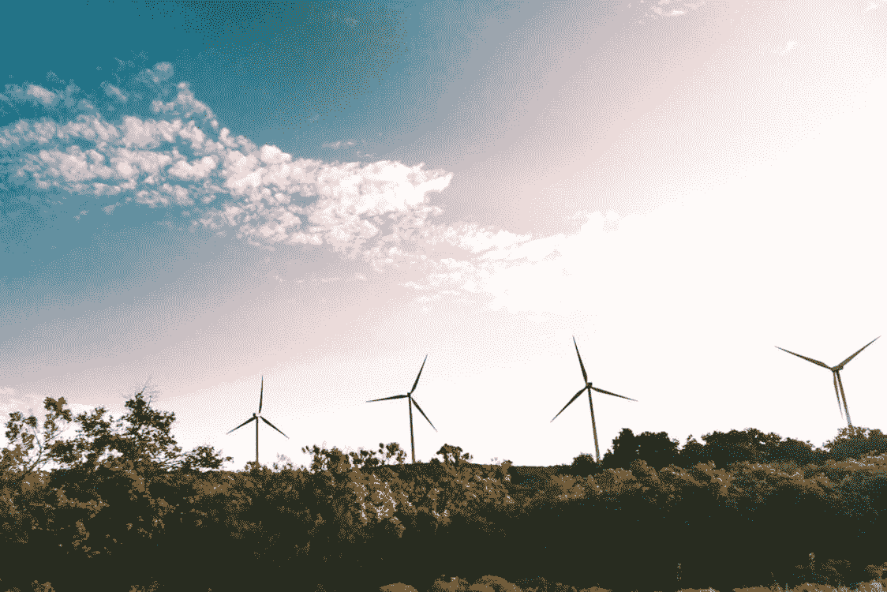
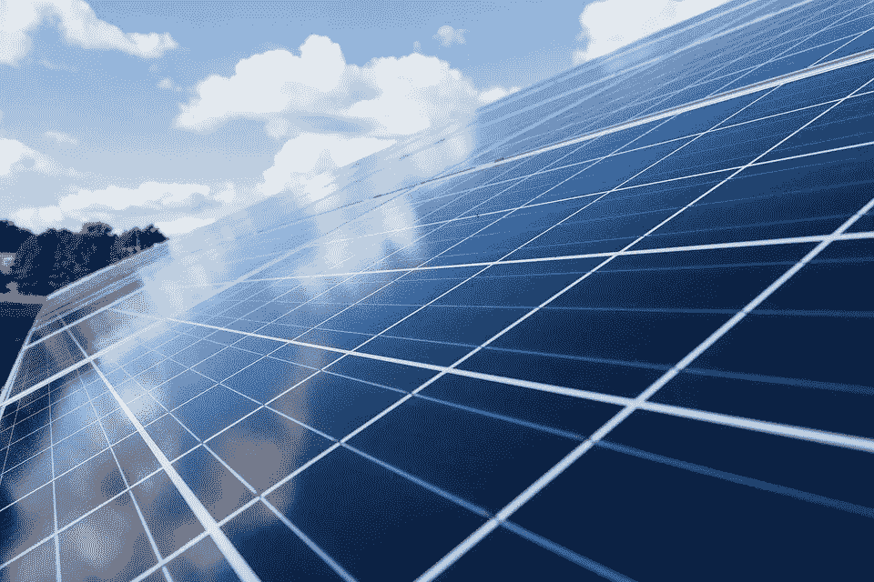
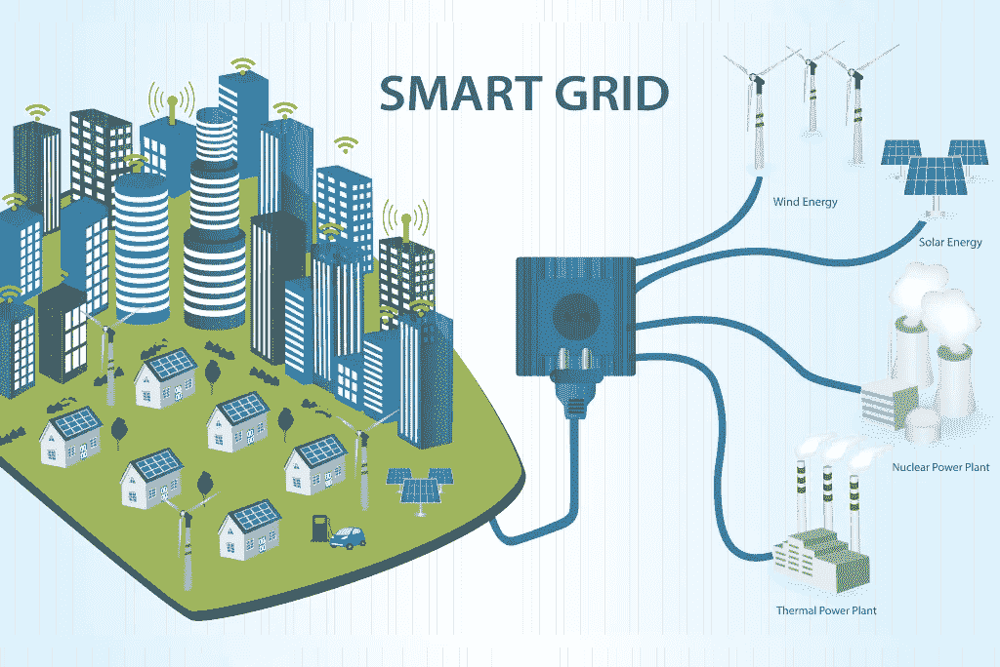
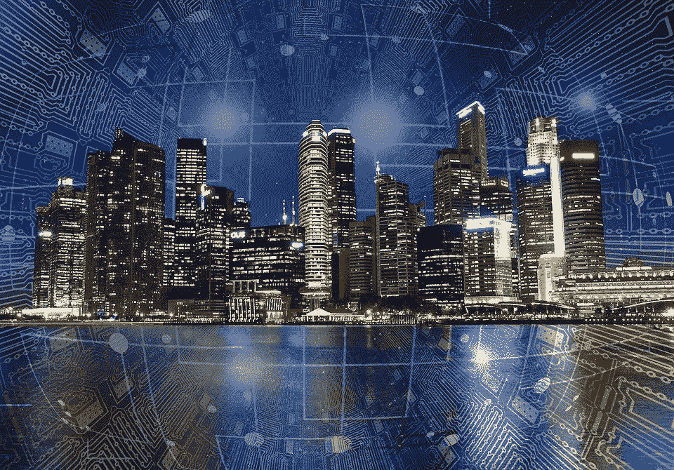

# 人工智能与能源的融合

> 原文：<https://medium.datadriveninvestor.com/the-convergence-of-ai-energy-ddf6cb2da615?source=collection_archive---------8----------------------->

一个可再生能源的爱情故事

大约三年前，比尔·盖茨写了一封[致 2017 届毕业班的公开信](https://www.gatesnotes.com/About-Bill-Gates/Dear-Class-of-2017)，这封信在今天仍然很有意义。他为那些希望对世界产生重大影响的人提供了建议，以及他们应该考虑的三个领域:人工智能、能源和生物科学。

> **一个是人工智能。我们才刚刚开始探索它将使人们的生活更加富有成效和创造性的所有方式。**
> 
> **第二个是能源**，因为让能源变得清洁、负担得起、可靠，对于抗击贫困和气候变化至关重要。第三是生物科学，它有机会帮助人们活得更长、更健康。"

大多数人都会同意，人工智能和能源(尤其是可再生能源)是当今最重要的两个领域。这两者都是决定未来的重要因素。它们各自都有影响力，尤其是在串联使用时。

 [## 将定义 2020 年就业前景的五大数据科学和机器学习趋势|数据驱动…

### 数据科学和 ML 是 2019 年最受关注的趋势之一，毫无疑问，它们将继续发展…

www.datadriveninvestor.com](https://www.datadriveninvestor.com/2020/02/19/five-data-science-and-machine-learning-trends-that-will-define-job-prospects-in-2020/) 

这两者的融合真的让我很兴奋，特别是因为我正在学习数据科学，并且在可再生能源行业有经验。

那么，两者在哪里相遇？**电网管理，**通过可再生能源预测和智能电网的方式。

# 可再生能源预测

机器学习正被用于预测天气、可再生能源生产和电力需求。像太阳能和风能这样的可再生能源变化多端。这给电网和电网管理带来了重大风险。如果电网的供应和需求不完全同步，系统就会出现故障。这些对公用事业公司和消费者来说都是昂贵的。

能够预测在给定的时间内预计会有多少风能和太阳能意味着供需可以精确匹配。历史数据集以及从风力或太阳能电池板收集的数据被用来训练机器学习算法，以有效地预测天气和电力变化。IBM 的沃森、[谷歌的 DeepMind](https://www.theagilityeffect.com/en/article/ai-can-mitigate-the-unpredictability-of-renewable-energy-sources/) 和 [Xcel Energy](https://digital.hbs.edu/platform-rctom/submission/xcel-energy-utilizing-machine-learning-to-efficiently-and-reliably-incorporate-renewable-energy-into-the-u-s-energy-grid/) 都创造了机器学习算法来预测天气和可再生能源产量。

> “如果我们使用基于机器学习的方法将单个模型预测结合起来，就可以实现显著的准确性提高。”— [IBM 沃森](https://researcher.watson.ibm.com/researcher/view_group_subpage.php?id=6572)

# 智能电网

Graphic credit: IEEE

**智能电网**是将人工智能和大数据的力量相结合的电网，旨在创建一个*数字*电网，促进消费者和公用事业公司之间的双向沟通。

随着可再生能源的使用和发电占据重要位置，迫切需要一种能够充分管理和适应这种能源多样化的电力系统。可再生能源是美国增长最快的能源来源，从 2000 年到 2018 年增长了 100%。

随着越来越多的私人用户和私人公司生产和使用可再生能源，我们的旧系统有所不足。现在，私人用户产生的电能超过了他们的需求，多余的电能被送回电网。

也有需求超过供应的情况(可能在暴风雨的日子)，需要激活和利用备用化石燃料来源。这就是智能电网发挥作用的地方——利用人工智能有效地管理能源的供应和需求。

人工智能将被用于自动收集和处理大量数据，以便及时做出如何最佳分配能源资源的决定。[智能电网](https://www.smartgrid.gov/the_smart_grid/smart_grid.html)将“将能源行业带入一个可靠性、可用性和效率的新时代，这将有助于我们的经济和环境健康。”

**智能电网的好处:**

*   电力的有效传输
*   停电后更快恢复供电
*   降低公用事业的运营和管理成本，最终降低客户的能源成本
*   减少高峰需求，这也有助于降低消费者面临的电费
*   增加大规模可再生能源系统的整合
*   提高安全性

## 总结想法

当与智能电网配合使用时，提高可再生能源发电和使用的预测能力将从根本上改变我们所知的能源行业。

当然，在前进的道路上将会有挑战需要应对，包括对自动化电网的网络攻击威胁，这也是必须解决的问题。我很高兴看到机器学习在塑造可再生能源行业方面继续发挥的作用，我的数据科学研究也受到了迄今为止取得的所有进展的启发。