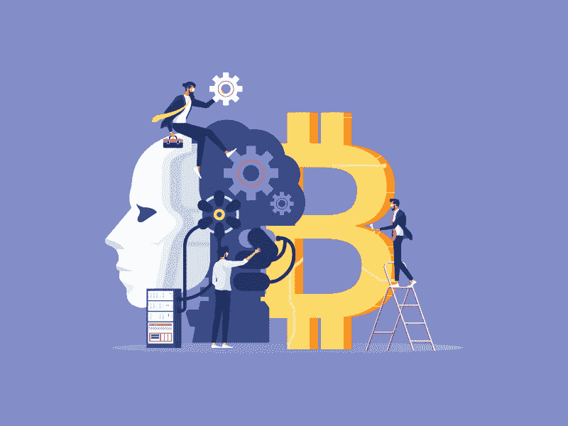

# 区块链和人工智能的融合

> 原文：<https://medium.datadriveninvestor.com/the-convergence-of-blockchain-and-artificial-intelligence-1ac075da396d?source=collection_archive---------8----------------------->

区块链和人工智能结合在一起，已经发展成为一种突破性的技术，正在催化每个行业的创新步伐。毫无疑问，区块链和人工智能正在一起大步前进，并在技术范式中留下了足迹。

你可能会在医疗保健、教育、金融、金融科技、执法和制造等几乎每个领域见证这对强大组合的后果。金融机构正在实施基于人工智能和区块链的解决方案来运行业务流程，并最大限度地节省成本和提高回报。

德勤 2019 年的全球区块链调查报告称，**57%的**组织见证了**成本节约**作为参与区块链网络联盟的主要好处之一。

本文希望展示人工智能和区块链交汇处实现的潜力，并讨论该联盟的标准定义、挑战和好处，以及该领域一些令人兴奋的参与者。

 [## 一名大学生使用语言生成人工智能工具创建了一个病毒式博客帖子|数据驱动…

### 作为作家，我们喜欢告诉自己，我们处在一个无法自动化的职业中，至少短期内不会。但是…

www.datadriveninvestor.com](https://www.datadriveninvestor.com/2020/09/15/a-college-student-used-a-language-generating-ai-tool-to-create-a-viral-blog-post/) 

> **安全支付网络**

历史悠久的传统银行机构面临许多挑战，如支付网络受损、交易处理延迟、交易成本高，这使得整个交易耗时且麻烦。

区块链技术提供了一个**无边界支付网络**，其去中心化的解决方案有助于以更快的速度实现无摩擦支付。然而，一些安全问题限制了许多银行家将这种技术集成到银行领域中。诈骗者和欺诈者发现入侵网络很有挑战性，因为它需要一组**公钥和私钥**来运行交易。

但是，通过利用人工智能的力量进入你的区块链账户，主人可以很容易地**追踪到失窃**，如果有人参与的话。通过集成人工智能的行为分析和生物识别技术，您可以消除支付网络中的安全敏感性。

> **金融活动的受控自动化**

为了控制金融活动的自动化，区块链和人工智能联合起来促进自动化过程。通过将区块链驱动的智能合同与人工智能相结合，你可以**验证智能合同**并轻松预测可能的漏洞和盗窃(如果有的话)。它确保了完全安全、透明和高效的金融交易，进而用自动化流程取代了计算限制。

# **结合这两种突破性技术的主要好处是什么？**

这两种技术的结合以及它们在现实和商业世界中的应用证明了它们是天生的一对。

**看看将区块链与人工智能应用结合使用的一些优势。**

> **区块链让 AI 安全**

通过实现区块链技术，你可以解码 AI 做出的决定，这些决定有时很难理解。区块链可以有效地评估大量独立于其他变量的变量，这将有助于您确定它试图完成的相关任务。

区块链通过记录决策过程来跟踪、解释和理解人工智能决策，这些决策有助于获得可能的洞察力，并为公众带来透明度。

与人类不同，计算机系统没有自己的大脑；相反，他们被指示执行任务。随着人工智能的出现，机器学习驱动的挖掘算法让我们的生活变得更加舒适。

> **AI 和区块链配合得很好**

由于加密技术，保存在区块链块中的数据是高度安全的。我们可以将高度敏感的个人数据存储在这些区块中，因为区块链的数据库以加密的方式保存这些信息。现在，你可能想知道人工智能如何证明是与区块链技术的良好配对。

为了保证数据的安全，人工智能已经有了很多优势。主要优势是，借助人工智能，我们能够处理加密状态下的数据，这反过来可以减少安全风险事件。

例如，亚马逊和网飞这样的电子商务公司结合使用这两种技术，因为人工智能可以处理加密数据。亚马逊和网飞使用的**推荐引擎**就是人工智能的例子之一。你可以[在印度雇佣人工智能开发人员](https://www.pixelcrayons.com/hire-ai-developer) &利用这项惊人的技术。

> **AI 增强区块链安全**

区块链有时对黑客攻击有抵抗力，它下面的几个层和应用程序不是很安全。通过集成人工智能与区块链，你可以确保一个安全的应用考虑到固定的系统结构。

> 人工智能有助于更有效地对付区块链

计算机发现在没有显式编程方法的情况下执行任务很有挑战性。它需要大量的处理能力来处理区块链的数据，因为区块链具有加密的特性。让我们以加密货币为例，**比特币**。

为了挖掘比特币区块链上的区块，使用了哈希算法，该算法采用了**“蛮力”**方法。该算法实际上尝试了每种字符组合，直到找到可用于验证交易的字符组合。

在人工智能的帮助下，可以更轻松、更智能地处理这一过程。人工智能和人工智能驱动的挖掘算法得到了更多的训练数据，这使得它比人类更快。你也可以在印度雇佣软件开发人员，他们可以为你开发基于人工智能的区块链应用程序。

> **医疗行业的 AI 和区块链**

虽然电子医疗记录是医疗保健中渴望数据的人工智能应用的训练数据金矿，但必须为预测算法将处理的数据的完整性和质量提供保证。

区块链与人工智能相结合，可以通过保证完整性、登记同意、提供影响护理的决策来源来帮助**个性化精准医疗**。

# **区块链和人工智能一言以蔽之**

这两种前沿技术结合在一起，在许多领域带来了许多进步。随着精通技术的世界的到来，人工智能通过允许机器代表人类工作，使人类的生活变得更加轻松。

区块链可以存储高度敏感的数据，当智能地与人工智能配对时，可以给我们的生活带来很大的变化。很明显，区块链和人工智能都是单独建立的技术，当它们结合在一起时，有可能变得更具革命性。在未来的日子里，我们期望这两项先锋技术能够超越我们的预期，增强技术能力。

虽然人工智能和区块链仍然是活跃的研究领域，但还有更多的东西可以预见。如果你也想在你的任何应用中集成区块链和人工智能，那么就从印度最好的区块链开发公司雇佣开发人员。

**进入专家视角—** [**订阅 DDI 英特尔**](https://datadriveninvestor.com/ddi-intel)