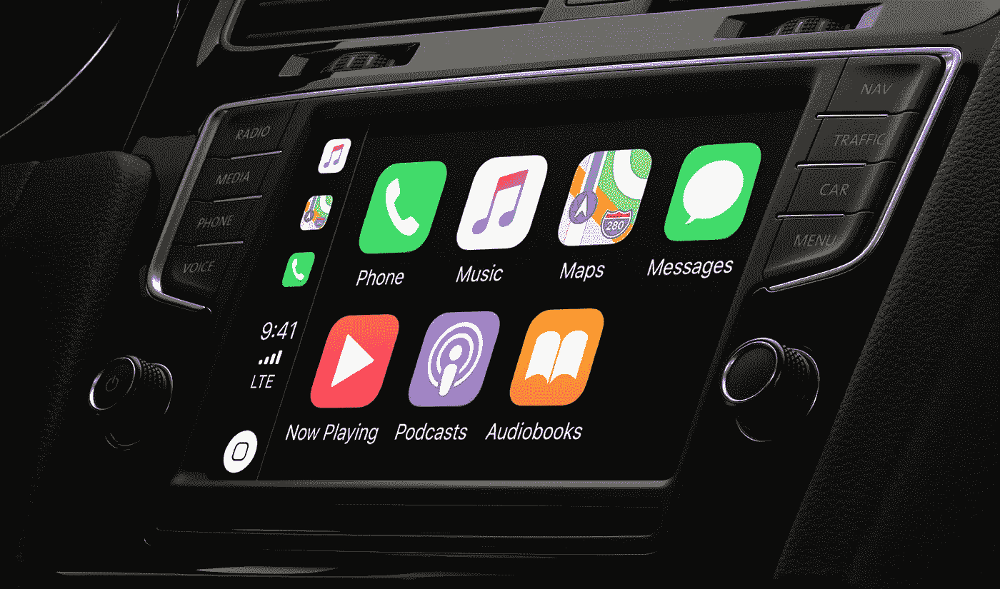

# 移动设备和移动性的融合

> 原文：<https://medium.datadriveninvestor.com/the-convergence-of-mobile-and-mobility-c078820ec7e9?source=collection_archive---------16----------------------->

手机并不总是智能的。一旦这种情况发生改变，它们就成了我们日常生活中的固定装置。受这些事件的启发，并努力适应对汽车购买者偏好的间接影响，汽车制造商已经走上了一条道路，以实现 21 世纪最卓越的发展。

**受移动设备影响的硬件、软件和 UX/用户界面**

2007 年，苹果重新定义了移动性，并通过发布首款 iPhone 颠覆了手机市场。此后，触摸屏显示器、计算能力、传感器、用户界面(UI)和用户体验(UX)设计以及内容成为移动电话的关键价值驱动因素。多年来，这就是为什么智能手机制造商一直专注于发布内置传感器数量和/或质量更高、计算能力更强、触摸屏分辨率更高、移动应用越来越多以及用户两极分化的标志性 UI/UX 设计的手机。

**Apple CarPlay:** a software application that revamps in-vehicle infotainment for iPhone users. Image by Apple.

鉴于移动转型，汽车开始配备越来越多的内置传感器和计算能力，以便消费者可以利用先进的驾驶辅助系统——这些系统现在为成熟的自动驾驶平台铺平了道路。车载信息娱乐系统开始从模拟显示器向高分辨率触摸屏转变。这些触摸屏产品开始融入受手机启发的用户界面/UX 设计和应用程序市场，其中一些是专门为汽车开发的，另一些则共享手机版本。事实上，汽车制造商开始接受移动趋势，以彻底改变乘客体验。

**移动影响的连接**

Photo by [Anastasia Dulgier](https://unsplash.com/@dulgier?utm_source=medium&utm_medium=referral) on [Unsplash](https://unsplash.com?utm_source=medium&utm_medium=referral)

蜂窝网络提供了移动用户在广阔的地理范围内保持联系所需的覆盖范围。一代又一代，蜂窝网络为我们不断增长的互联设备提供了更快的速度、更高的可靠性、更高的带宽和更低的延迟。智能手机制造商使他们的最新产品与蜂窝网络的最新标准兼容，以确保他们最大限度地提高他们为 Wi-Fi 以外的用户提供的价值。

 [## 认知计算——一套被广泛认为是……

### 作为它的用户，我们已经习惯了科技。这些天几乎没有什么是司空见惯的…

www.datadriveninvestor.com](https://www.datadriveninvestor.com/2020/02/19/cognitive-computing-a-skill-set-widely-considered-to-be-the-most-vital-manifestation-of-artificial-intelligence/) 

为了实现车辆到一切(V2X)的连接，汽车制造商加入了在其产品中安装最新一代蜂窝网络芯片组的智能手机制造商的行列。V2X 连接将使车辆能够与车载连接设备(如乘客的移动设备)和车外连接设备(如行人智能手表、交通基础设施上的传感器和为机器学习定制的远程数据中心)进行无线通信。反过来，我们的目标是利用这些先进的网络功能实现自动驾驶汽车，实时优化全市交通状况，实现超高质量的媒体流等。

**比赛刚刚开始**

智能手机市场继续发展，并为汽车技术领域的客户偏好提供信息。可折叠显示屏、手势识别界面、新操作系统和 5G 只是移动领域将会或已经对汽车世界产生影响的一小部分新发展。汽车制造商必须跟上步伐，利用对当今移动用户的洞察来预测未来汽车购买者的需求。他们将不得不永久脱离其垂直整合的价值链，拥抱一个水平结构的生态系统——在这个生态系统中，移动和汽车玩家可以合作开发所需的技术，以实现让移动变得越来越智能的承诺，因为移动变得越来越智能。