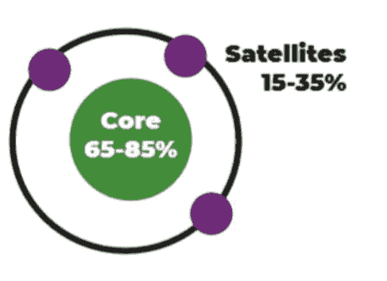
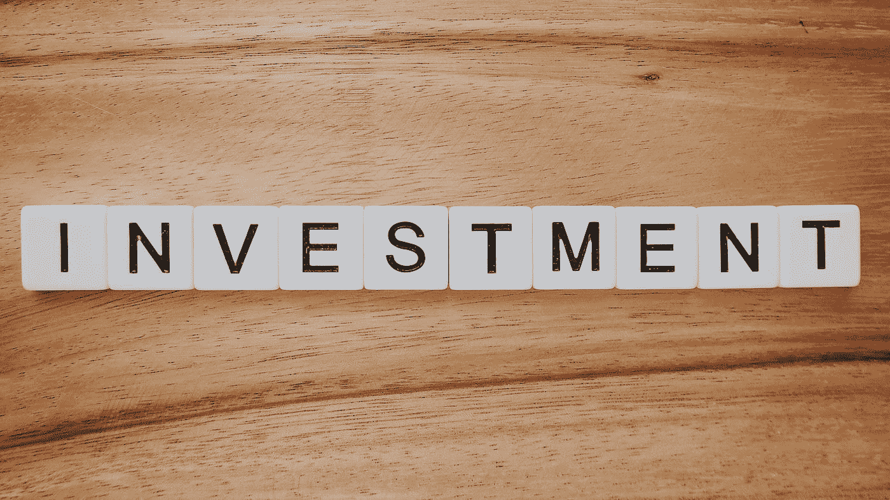

# 核心卫星投资方式

> 原文：<https://medium.datadriveninvestor.com/the-core-satellite-way-of-investing-e894ec93623f?source=collection_archive---------4----------------------->

对于普通的家庭投资者来说，这是一种理想的投资方式

Taken from Canstar.com.au

核心卫星投资是一种投资类型，你的主要目标是创建一个股票或基金的投资组合，以便它有助于最小化成本、纳税义务和波动性，同时在不损害回报的情况下做到这一切。事实上，它的目标是跑赢基础广泛的市场指数。

投资组合的核心基本上决定了被动基金的投资，被动基金通常只跟踪主要的市场指数，如美国的标准普尔 500 指数。投资组合的附属部分由积极管理的基金组成，旨在利用投资组合经理的专业知识战胜市场，创造更高的回报率(或 [**【阿尔法】**](https://www.m1finance.com/articles-1/alpha/) )。

普通家庭投资者的理想结构或组成应该是核心投资(占整个投资组合估值的 65%-85%)和附属投资(占整个投资组合估值的 15%-35%)的混合。

 [## 这么说一家大型风投基金正在投资你的初创公司？4 实际考虑|数据驱动的投资者

### 首先，恭喜你。融资总是需要努力的，一个大的风险投资基金当然是一个大的…

www.datadriveninvestor.com](https://www.datadriveninvestor.com/2020/08/09/so-a-big-vc-fund-is-investing-in-your-startup-4-practical-considerations/) 

# 什么是核心投资或附属投资？

核心投资或附属投资没有固定的规则。这取决于个人的目标、需求、环境和他们的情况，因此，投资组合中某个人的核心投资可能是其他人的附属投资，反之亦然。

> ***用一个例子解释清楚这一点，考虑 2 个人。让我们称他们为 X 和 y。考虑到 X 通过投资寻求高回报和增长，他们会将大部分(核心)投资组合投资于股票等高风险资产。他们会将投资组合中的一小部分投资于固定收益基金或黄金(卫星)。另一方面，y 的防御性更强，对他们来说，他们的核心配置将是债券和固定利率基金，而不是他们投资组合中的股票部分。***

你的投资组合的核心应该在很大程度上保持不变，只有当投资组合内部需要重新平衡时，或者投资者的目标和目的发生变化时，才应该采取行动。理想情况下，投资组合的核心应该通过指数基金或交易所交易基金(ETF)实现高度多元化，从而降低整体市场风险并显著降低成本。

在你的卫星投资组合中，同样基于你的需求和目标，你可以投资新兴市场股票、[**一个经济周期内的主题和行业基金**](https://www.paytmmoney.com/blog/sectoral-thematic-funds/) ，加密货币等风险资产，甚至是初创企业投资——所有这些都旨在超越通过核心投资策略实现的平均回报。

Photo by [Precondo CA](https://unsplash.com/@precondo?utm_source=medium&utm_medium=referral) on [Unsplash](https://unsplash.com?utm_source=medium&utm_medium=referral)

# 如果这种方法不像最初想的那样有效呢？

要明确的是，仅仅因为你有一个核心卫星投资组合，就不能保证有更好的表现。如果你选择了表现不佳的股票，或者只是在错误的时间买入，那么卫星部分和它的基础部分可能会降低投资组合的整体价值。因此，观察和跟踪卫星组件的表现并在必要时重新平衡投资组合是一个好主意。

在你的方法中要有耐心和纪律性。不要让你的情绪导致你做出不理智的决定。记住，在你的投资组合中没有情绪的空间。我们应该理性地采取行动，并运用现有的最佳金融知识。如果你需要额外的指导，或者觉得太难处理，就去找一个财务顾问。

主动管理是一项艰苦的工作，需要你的时间和持续的投入，正因如此，主动管理者因其在该领域的专业知识而获得高薪。

Photo by [Tim Mossholder](https://unsplash.com/@timmossholder?utm_source=medium&utm_medium=referral) on [Unsplash](https://unsplash.com?utm_source=medium&utm_medium=referral)

# 如何建立自己的核心卫星投资组合？

核心部分已经讨论得差不多了。投资于基础广泛的市场跟踪指数基金，这些基金模仿基础基金，并提供与基础基金类似的回报。

但是对于卫星方法，我想问自己以下问题

1.  **投资这项资产时，我想达到什么目标？**
2.  **该行业或资产类别的未来前景如何？**
3.  **什么是风险回报比，我对此感到满意吗？**
4.  **涉及哪些成本，收益是否大于风险和成本？**
5.  为了获得额外的回报，我可能会失去全部投资。我对此感到舒服吗？

这些问题的答案将引导你自己决定在卫星投资组合中放入什么。

# 如果卫星的表现远远超过投资组合的核心怎么办？

这是一个非常好的位置。你在从你的卫星投资组合中寻求额外的回报，你已经得到了。真的干得好！

但是，有些步骤你可以采取，也必须考虑。你不一定要采取这些步骤，但知道这些也无妨。所以现在开始:

你可以重新平衡卫星，从你的投资组合中剔除所有表现不佳的人。您可以根据预先计划的资金分配百分比重新平衡您的核心和附属投资组合。如果你感到舒适并寻求产生额外的阿尔法，你可以额外增加你在卫星途径中的分配。或者你可以让投资组合保持原样，什么也不做。

核心卫星投资法具备创建良好投资组合的所有要素，能够满足你所有的投资需求。每个季度至少检查一次你的投资组合，看看进展如何，并在必要时做出调整。让投资组合的核心自行增长，同时密切关注卫星。

如果你没有时间或者根本不想参与管理你的投资组合，那也没关系。记住，**拥有一个 100%被动的投资组合并没有错。**

> ***然而，在我看来，我相信核心卫星方法提供了最好的一切，比平均水平更好的性能和有限的波动性，同时保持整体成本较低。因此，设计你自己的核心卫星投资组合，并获得回报。***

## 访问专家视图— [订阅 DDI 英特尔](https://datadriveninvestor.com/ddi-intel)